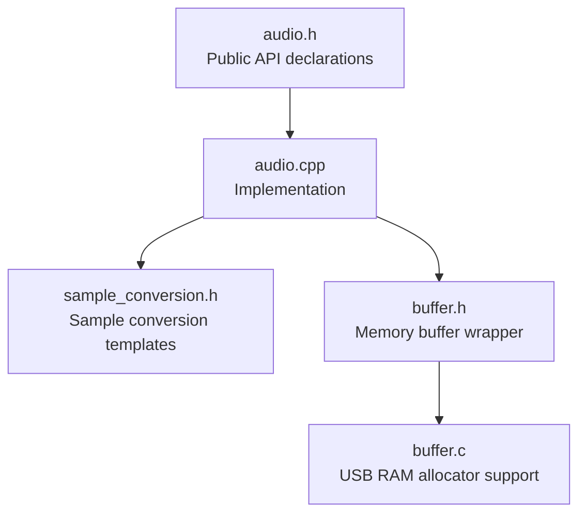
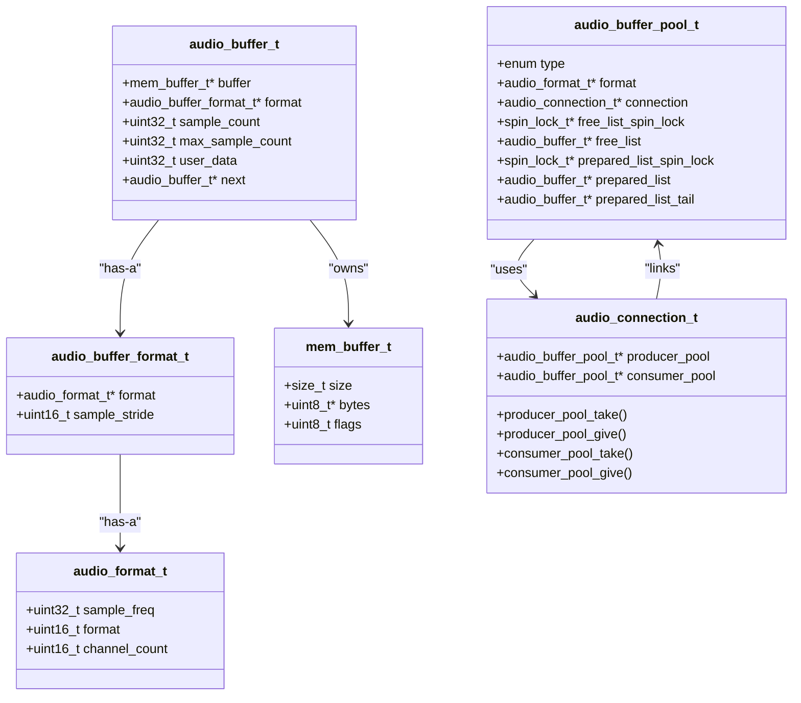
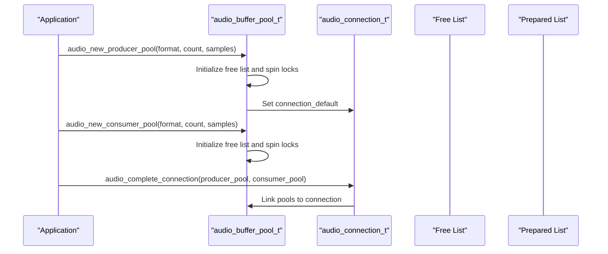
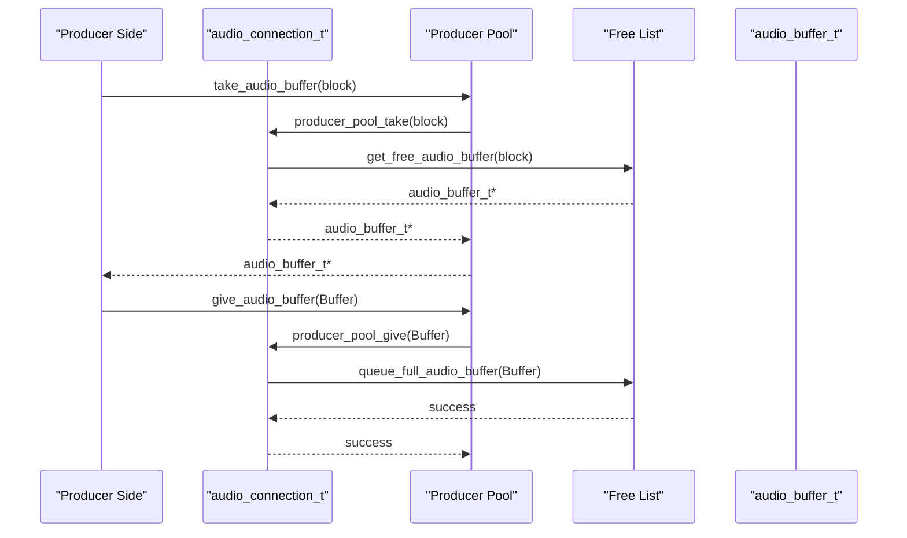
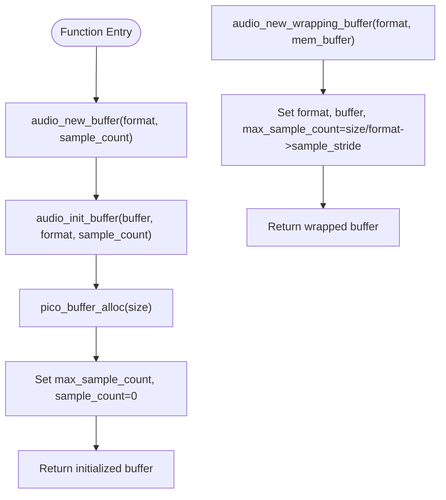
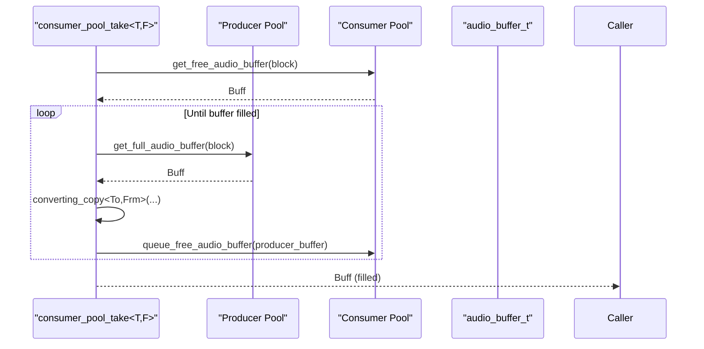
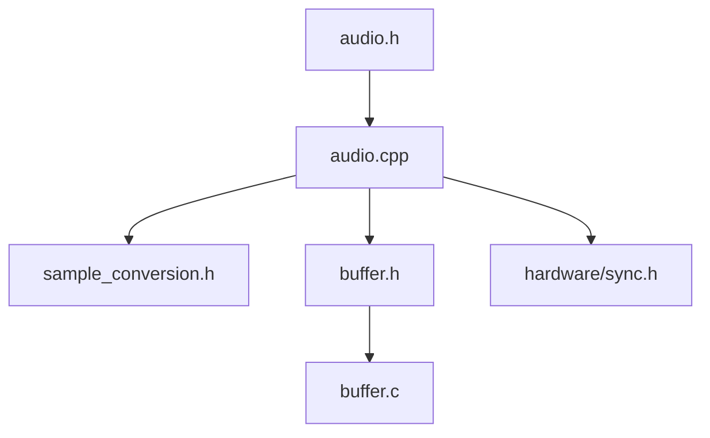

# Buffer Management API

<cite>
**Referenced Files in This Document**
- [audio.h](file://audio/audio.h)
- [audio.cpp](file://audio/audio.cpp)
- [buffer.h](file://audio/buffer.h)
- [buffer.c](file://audio/buffer.c)
- [sample_conversion.h](file://audio/sample_conversion.h)
- [audio.cpp (Example)](file://Examples/Oscillators/src/audio/audio.cpp)
- [audio.cpp (SimpleOscillators)](file://Examples/SimpleOscillators/src/audio/audio.cpp)
- [audio.cpp (TwoChannelOscillator)](file://Examples/TwoChannelOscillator/src/audio/audio.cpp)
- [audio.cpp (SuperSaw)](file://Examples/SuperSaw/src/audio/audio.cpp)
</cite>

## Table of Contents
1. [Introduction](#introduction)
2. [Project Structure](#project-structure)
3. [Core Components](#core-components)
4. [Architecture Overview](#architecture-overview)
5. [Detailed Component Analysis](#detailed-component-analysis)
6. [Dependency Analysis](#dependency-analysis)
7. [Performance Considerations](#performance-considerations)
8. [Troubleshooting Guide](#troubleshooting-guide)
9. [Conclusion](#conclusion)

## Introduction
This document provides comprehensive API documentation for audio buffer management in Pico-DSP-Garden. It focuses on buffer pool creation, buffer acquisition/release, buffer initialization, and the data structures that define audio formats and buffers. The documentation covers thread safety, memory management patterns, and performance characteristics, along with practical usage scenarios derived from the example projects.

## Project Structure
The audio buffer management functionality is primarily implemented in the audio module, with supporting buffer allocation utilities and sample conversion helpers.

**Diagram sources**
- [audio.h:106-225](file://audio/audio.h#L106-L225)
- [audio.cpp:143-201](file://audio/audio.cpp#L143-L201)
- [sample_conversion.h:16-289](file://audio/sample_conversion.h#L16-L289)
- [buffer.h:34-103](file://audio/buffer.h#L34-L103)
- [buffer.c:15-24](file://audio/buffer.c#L15-L24)

**Section sources**
- [audio.h:106-225](file://audio/audio.h#L106-L225)
- [audio.cpp:143-201](file://audio/audio.cpp#L143-L201)

## Core Components
This section documents the primary buffer management APIs and data structures.

### Buffer Pool Creation Functions
- `audio_new_producer_pool()`: Creates a producer-side buffer pool with a specified format, buffer count, and per-buffer sample capacity.
- `audio_new_consumer_pool()`: Creates a consumer-side buffer pool with the same parameters as the producer pool.

Both functions allocate and initialize a pool of audio buffers, set up spin locks for thread-safe access to free and prepared lists, and establish default connections for buffer transfer.

Parameters:
- `format`: Pointer to an initialized audio buffer format structure.
- `buffer_count`: Number of buffers in the pool.
- `buffer_sample_count`: Maximum number of samples each buffer can hold.

Return value:
- Pointer to a newly allocated and initialized `audio_buffer_pool_t`.

Usage pattern:
- Initialize an `audio_buffer_format_t` with desired audio format, sample frequency, and channel count.
- Call either `audio_new_producer_pool()` or `audio_new_consumer_pool()` to create the pool.
- Complete the connection using `audio_complete_connection()` to link producer and consumer pools.

**Section sources**
- [audio.h:106-126](file://audio/audio.h#L106-L126)
- [audio.cpp:189-201](file://audio/audio.cpp#L189-L201)

### Buffer Acquisition and Release Functions
- `take_audio_buffer()`: Retrieves a buffer from the appropriate pool (producer or consumer) based on the pool type. Supports blocking behavior.
- `give_audio_buffer()`: Returns a buffer to the appropriate pool. Resets user data before returning.
- `release_audio_buffer()`: Convenience function that resets the buffer's sample count to zero and returns it to the pool.
- `get_free_audio_buffer()`: Internal function to retrieve a buffer from the free list under a spin lock. Supports blocking.
- `queue_free_audio_buffer()`: Internal function to enqueue a buffer back onto the free list under a spin lock. Signals waiting threads.
- `get_full_audio_buffer()`: Internal function to retrieve a buffer from the prepared list under a spin lock. Supports blocking.
- `queue_full_audio_buffer()`: Internal function to enqueue a buffer onto the prepared list under a spin lock. Signals waiting threads.

Thread safety:
- Free list and prepared list operations are protected by dedicated spin locks.
- Blocking operations use `__wfe()` and `__sev()` to efficiently wait for and notify buffer availability.

**Section sources**
- [audio.h:162-178](file://audio/audio.h#L162-L178)
- [audio.h:210-225](file://audio/audio.h#L210-L225)
- [audio.cpp:78-118](file://audio/audio.cpp#L78-L118)
- [audio.cpp:213-228](file://audio/audio.cpp#L213-L228)

### Buffer Initialization Functions
- `audio_new_buffer()`: Allocates and initializes a single audio buffer with a given format and sample capacity.
- `audio_init_buffer()`: Initializes an existing `audio_buffer_t` with a format and sample capacity. Allocates underlying memory using the platform buffer allocator.
- `audio_new_wrapping_buffer()`: Wraps an existing memory buffer (`mem_buffer_t`) into an audio buffer, inferring capacity from buffer size and format stride.

Memory management:
- Uses `pico_buffer_alloc()` to allocate memory for buffer payloads.
- Wrapping buffers reuse existing memory without additional allocation.

**Section sources**
- [audio.h:135-154](file://audio/audio.h#L135-L154)
- [audio.cpp:143-154](file://audio/audio.cpp#L143-L154)
- [audio.cpp:176-187](file://audio/audio.cpp#L176-L187)

### Buffer Format Structures
- `audio_format_t`: Defines the audio format including sample frequency, format identifier, and channel count.
- `audio_buffer_format_t`: Associates an `audio_format_t` with a sample stride, representing the byte width per sample frame.
- `audio_buffer_t`: Represents a single audio buffer with pointers to the underlying memory, format, current and maximum sample counts, user data, and a next pointer for linked list management.

Relationships:
- `audio_buffer_format_t` embeds a pointer to `audio_format_t` and adds a `sample_stride`.
- `audio_buffer_t` holds a pointer to `mem_buffer_t` and tracks current usage and capacity.
- `audio_buffer_pool_t` manages a collection of `audio_buffer_t` instances and maintains free and prepared lists.

**Section sources**
- [audio.h:47-72](file://audio/audio.h#L47-L72)
- [audio.h:76-89](file://audio/audio.h#L76-L89)

## Architecture Overview
The buffer management system uses a producer-consumer model with synchronized buffer pools. Each pool maintains two linked lists: a free list for available buffers and a prepared list for buffers ready for the other side.

**Diagram sources**
- [audio.h:47-104](file://audio/audio.h#L47-L104)
- [audio.cpp:156-174](file://audio/audio.cpp#L156-L174)

## Detailed Component Analysis

### Producer and Consumer Pool Lifecycle
Producer and consumer pools are created via dedicated functions and share the same underlying buffer pool infrastructure. The key difference lies in their role within the connection.

**Diagram sources**
- [audio.cpp:189-211](file://audio/audio.cpp#L189-L211)
- [audio.h:203-205](file://audio/audio.h#L203-L205)

**Section sources**
- [audio.cpp:189-211](file://audio/audio.cpp#L189-L211)
- [audio.h:203-205](file://audio/audio.h#L203-L205)

### Buffer Acquisition and Release Flow
The take/give functions route operations through the connection's pool-specific handlers, enabling flexible buffering strategies.

**Diagram sources**
- [audio.cpp:213-228](file://audio/audio.cpp#L213-L228)
- [audio.cpp:78-118](file://audio/audio.cpp#L78-L118)

**Section sources**
- [audio.cpp:213-228](file://audio/audio.cpp#L213-L228)
- [audio.cpp:78-118](file://audio/audio.cpp#L78-L118)

### Buffer Initialization and Memory Allocation
Initialization functions handle memory allocation and metadata setup for buffers.

**Diagram sources**
- [audio.cpp:143-154](file://audio/audio.cpp#L143-L154)
- [audio.cpp:176-187](file://audio/audio.cpp#L176-L187)

**Section sources**
- [audio.cpp:143-154](file://audio/audio.cpp#L143-L154)
- [audio.cpp:176-187](file://audio/audio.cpp#L176-L187)

### Sample Conversion Integration
The sample conversion layer integrates with buffer pools to handle format conversions during buffer transfers.

**Diagram sources**
- [sample_conversion.h:209-248](file://audio/sample_conversion.h#L209-L248)

**Section sources**
- [sample_conversion.h:209-248](file://audio/sample_conversion.h#L209-L248)

## Dependency Analysis
The buffer management API depends on platform-specific synchronization primitives and memory allocation utilities.

**Diagram sources**
- [audio.h:11-13](file://audio/audio.h#L11-L13)
- [audio.cpp:8-10](file://audio/audio.cpp#L8-L10)
- [buffer.h:12-12](file://audio/buffer.h#L12-L12)
- [buffer.c:10-10](file://audio/buffer.c#L10-L10)

**Section sources**
- [audio.h:11-13](file://audio/audio.h#L11-L13)
- [audio.cpp:8-10](file://audio/audio.cpp#L8-L10)
- [buffer.h:12-12](file://audio/buffer.h#L12-L12)
- [buffer.c:10-10](file://audio/buffer.c#L10-L10)

## Performance Considerations
- Spin locks protect free and prepared lists, minimizing overhead compared to mutexes in real-time contexts.
- Blocking operations use `__wfe()` and `__sev()` to efficiently wait for and signal buffer availability, reducing CPU usage during contention.
- Buffer pools pre-allocate all buffers during initialization, avoiding runtime allocation overhead in the audio callback.
- Sample conversion is performed in-place using template specializations for efficient copying and conversion.

## Troubleshooting Guide
Common issues and resolutions:
- Buffer starvation: Ensure adequate buffer count and sample capacity for your workload. Monitor free and prepared list sizes.
- Deadlocks: Verify that every acquired buffer is returned via `give_audio_buffer()` or `release_audio_buffer()`.
- Incorrect format: Confirm that `audio_buffer_format_t` matches the actual data layout and that `sample_stride` is computed correctly.
- Memory exhaustion: Check that `pico_buffer_alloc()` succeeds and that wrapping buffers do not exceed their allocated size.

**Section sources**
- [audio.cpp:78-118](file://audio/audio.cpp#L78-L118)
- [audio.cpp:143-154](file://audio/audio.cpp#L143-L154)

## Conclusion
The Pico-DSP-Garden buffer management API provides a robust, thread-safe mechanism for producer-consumer audio buffer handling. Its design emphasizes low-latency operation through spin locks and efficient blocking primitives, while offering flexible buffer initialization and format conversion capabilities. Proper usage of the provided functions ensures reliable audio processing in real-time environments.