# Connection Management API

<cite>
**Referenced Files in This Document**
- [audio.h](file://audio/audio.h)
- [audio.cpp](file://audio/audio.cpp)
- [sample_conversion.h](file://audio/sample_conversion.h)
- [buffer.h](file://audio/buffer.h)
- [buffer.c](file://audio/buffer.c)
- [README.md](file://README.md)
</cite>

## Table of Contents
1. [Introduction](#introduction)
2. [Project Structure](#project-structure)
3. [Core Components](#core-components)
4. [Architecture Overview](#architecture-overview)
5. [Detailed Component Analysis](#detailed-component-analysis)
6. [Dependency Analysis](#dependency-analysis)
7. [Performance Considerations](#performance-considerations)
8. [Troubleshooting Guide](#troubleshooting-guide)
9. [Conclusion](#conclusion)

## Introduction
This document provides comprehensive API documentation for audio connection management in Pico-DSP-Garden. It focuses on the audio_connection_t structure and its role in connecting producer and consumer audio pools, covering connection establishment, specialized connection types, format conversion connections, lifecycle management, and error handling. The goal is to enable developers to set up various audio routing scenarios and format conversions with confidence.

## Project Structure
The audio connection management system resides primarily in the audio/ directory, with supporting buffer management and sample conversion utilities. The key files include:
- audio/audio.h: Public API declarations for audio connections, buffer pools, and format conversion helpers
- audio/audio.cpp: Implementation of buffer pool operations, default connection handlers, and connection establishment
- audio/sample_conversion.h: Template-based sample conversion and specialized connection types
- audio/buffer.h and audio/buffer.c: Memory buffer allocation and wrapper structures

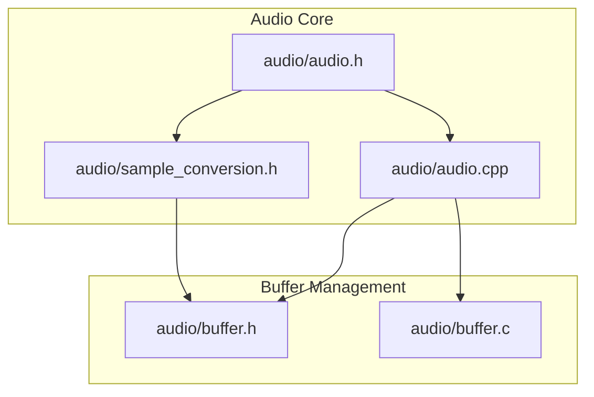

**Diagram sources**
- [audio.h:1-311](file://audio/audio.h#L1-L311)
- [audio.cpp:1-257](file://audio/audio.cpp#L1-L257)
- [sample_conversion.h:1-289](file://audio/sample_conversion.h#L1-L289)
- [buffer.h:1-103](file://audio/buffer.h#L1-L103)
- [buffer.c:1-24](file://audio/buffer.c#L1-L24)

**Section sources**
- [README.md:1-101](file://README.md#L1-L101)
- [audio.h:1-311](file://audio/audio.h#L1-L311)

## Core Components
This section documents the fundamental data structures and functions that form the audio connection management API.

### Audio Formats and Buffers
The system defines standardized audio formats and buffers:
- audio_format_t: Describes sample frequency, format, and channel count
- audio_buffer_format_t: Associates an audio format with sample stride
- audio_buffer_t: Wraps a memory buffer with format, sample counts, and linked-list pointer

These structures enable consistent handling of different audio formats (PCM S8, S16, U8, U16) and channel configurations (mono/stereo).

**Section sources**
- [audio.h:47-72](file://audio/audio.h#L47-L72)

### Audio Buffer Pool
The audio_buffer_pool_t structure manages collections of audio buffers for producers and consumers:
- type: Indicates whether the pool is a producer or consumer
- format: Audio format associated with the pool
- connection: Pointer to the active audio_connection_t
- free_list/prepared_list: Linked lists of available and processed buffers
- spin_lock_t: Synchronization primitives for thread-safe operations

Buffer pools provide the foundation for connection management by maintaining ordered queues of audio buffers.

**Section sources**
- [audio.h:76-89](file://audio/audio.h#L76-L89)

### Audio Connection
The audio_connection_t structure defines the interface for connecting producer and consumer pools:
- producer_pool_take: Retrieves a free buffer from the producer pool
- producer_pool_give: Returns a processed buffer to the producer pool
- consumer_pool_take: Retrieves a full buffer from the consumer pool
- consumer_pool_give: Returns a free buffer to the consumer pool
- producer_pool/consumer_pool: Pointers to the connected pools

Connections encapsulate the transfer semantics between pools, enabling flexible routing and format conversion.

**Section sources**
- [audio.h:93-104](file://audio/audio.h#L93-L104)

### Default Connection Handlers
The system provides default implementations for standard producer-consumer transfers:
- producer_pool_give_buffer_default: Queues a buffer to the producer's prepared list
- producer_pool_take_buffer_default: Retrieves a buffer from the producer's free list
- consumer_pool_give_buffer_default: Queues a buffer to the consumer's free list
- consumer_pool_take_buffer_default: Retrieves a buffer from the consumer's prepared list

These handlers implement FIFO-style buffer management with spin-lock synchronization.

**Section sources**
- [audio.cpp:120-134](file://audio/audio.cpp#L120-L134)

### Connection Establishment
The audio_complete_connection function binds two pools to a connection:
- Validates that the first pool is a producer and the second is a consumer
- Sets the connection pointers for both pools
- Establishes the bidirectional relationship

This function is the primary mechanism for creating audio routes between processing stages.

**Section sources**
- [audio.cpp:203-211](file://audio/audio.cpp#L203-L211)
- [audio.h:204-205](file://audio/audio.h#L204-L205)

## Architecture Overview
The audio connection system follows a producer-consumer pattern with explicit connection management:

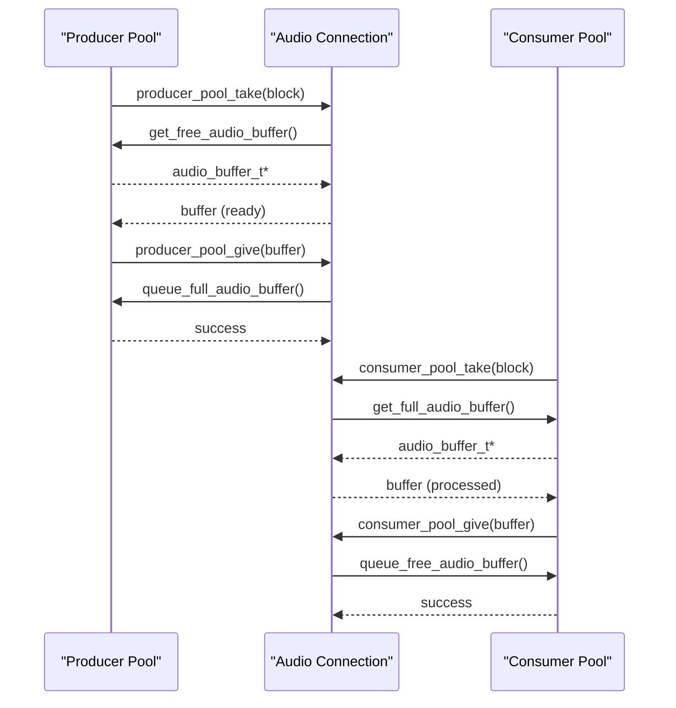

**Diagram sources**
- [audio.cpp:213-228](file://audio/audio.cpp#L213-L228)
- [audio.cpp:78-118](file://audio/audio.cpp#L78-L118)

## Detailed Component Analysis

### Buffer Pool Operations
Buffer pool operations provide thread-safe access to audio buffers using spin locks and event signaling:

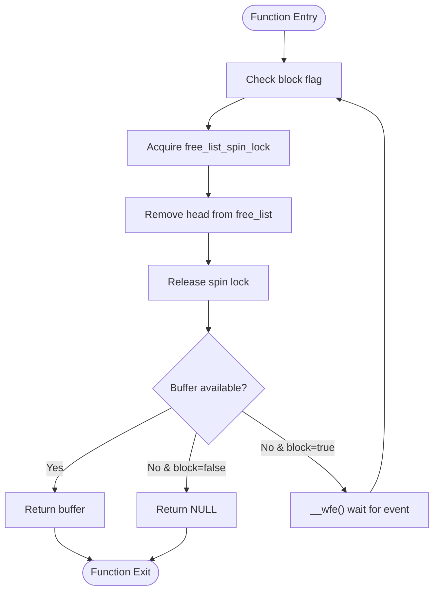

**Diagram sources**
- [audio.cpp:78-89](file://audio/audio.cpp#L78-L89)

Key operations include:
- get_free_audio_buffer: Retrieves buffers from the producer pool's free list
- queue_free_audio_buffer: Returns buffers to the consumer pool's free list
- get_full_audio_buffer: Retrieves buffers from the consumer pool's prepared list
- queue_full_audio_buffer: Returns buffers to the producer pool's prepared list

**Section sources**
- [audio.cpp:78-118](file://audio/audio.cpp#L78-L118)

### Default Connection Handler Implementation
The default connection handlers delegate to buffer pool operations:

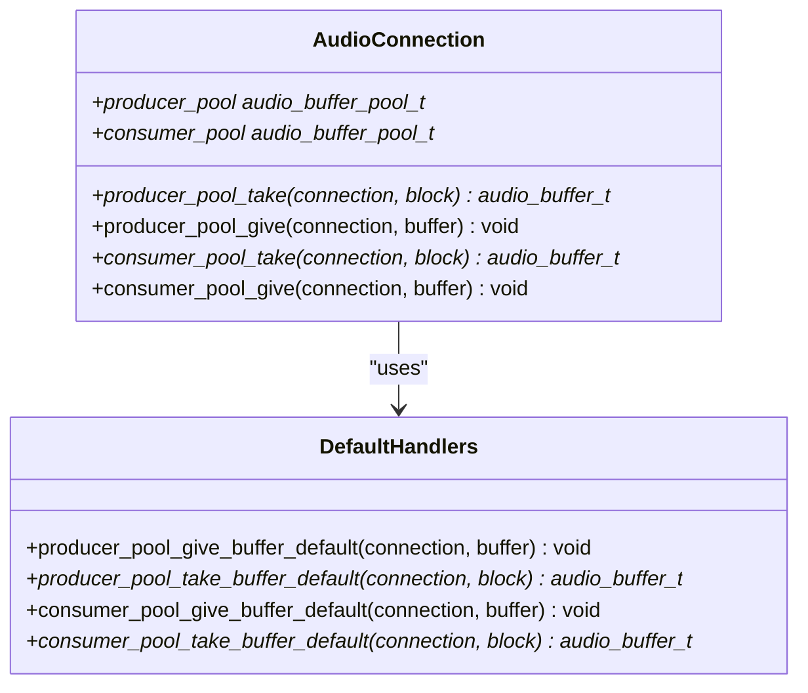

**Diagram sources**
- [audio.h:93-104](file://audio/audio.h#L93-L104)
- [audio.cpp:120-134](file://audio/audio.cpp#L120-L134)

**Section sources**
- [audio.cpp:120-141](file://audio/audio.cpp#L120-L141)

### Specialized Connection Types

#### Buffer Copying on Consumer Take
The buffer_copying_on_consumer_take_connection enables format conversion during buffer retrieval:

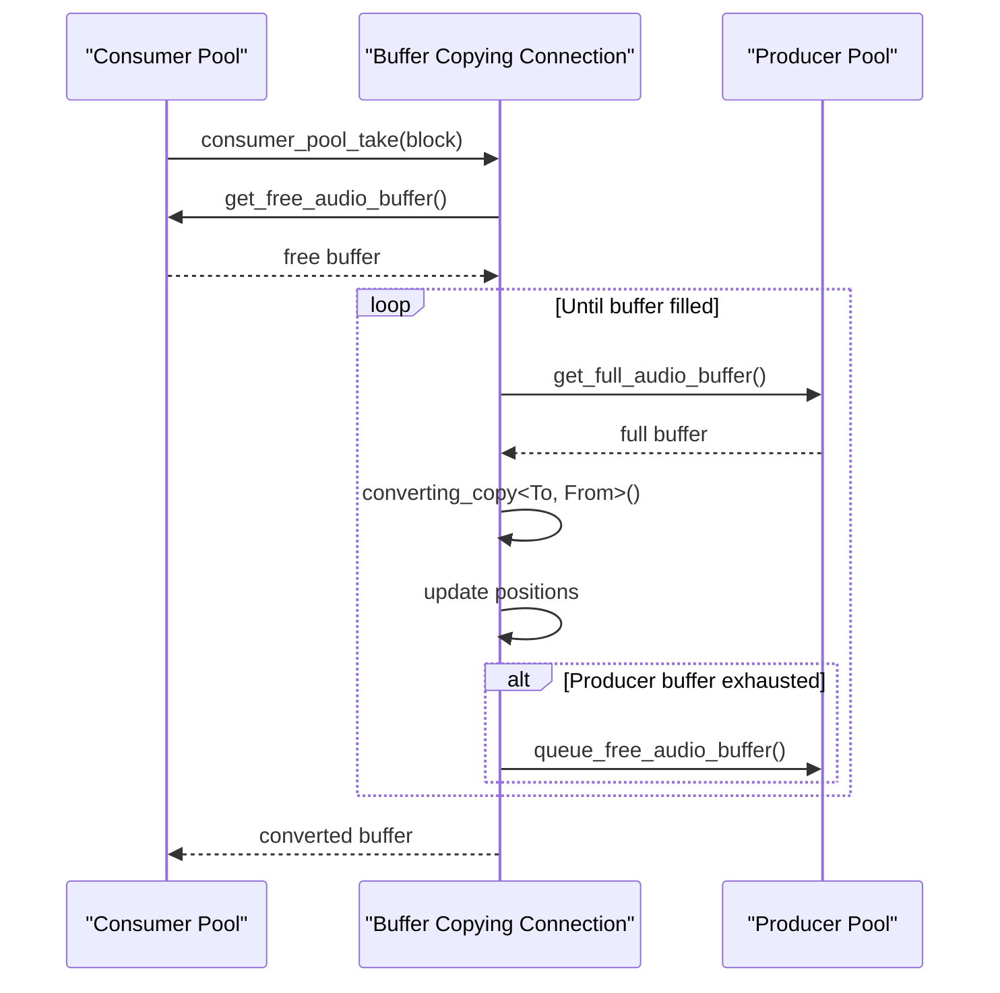

**Diagram sources**
- [sample_conversion.h:209-248](file://audio/sample_conversion.h#L209-L248)

Key characteristics:
- Converts between different sample formats and channel configurations
- Maintains position tracking for partial buffer processing
- Blocks until sufficient data is available for the consumer buffer

**Section sources**
- [sample_conversion.h:209-248](file://audio/sample_conversion.h#L209-L248)

#### Producer Pool Blocking Give
The producer_pool_blocking_give_connection ensures complete delivery to consumer buffers:

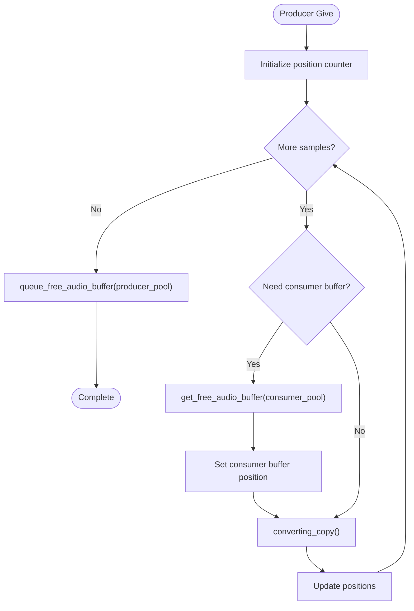

**Diagram sources**
- [sample_conversion.h:250-286](file://audio/sample_conversion.h#L250-L286)

Key characteristics:
- Ensures all produced samples are delivered to consumer buffers
- Manages consumer buffer boundaries during copying
- Supports format conversion during delivery

**Section sources**
- [sample_conversion.h:250-286](file://audio/sample_conversion.h#L250-L286)

### Format Conversion Connections

#### Mono-to-Mono Consumer Take
Provides S16-to-S16 conversion for mono audio streams:

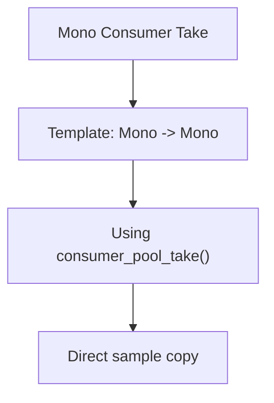

**Diagram sources**
- [audio.cpp:231-233](file://audio/audio.cpp#L231-L233)

**Section sources**
- [audio.cpp:231-233](file://audio/audio.cpp#L231-L233)

#### Stereo-to-Stereo Consumer Take
Handles S16-to-S16 conversion for stereo streams:

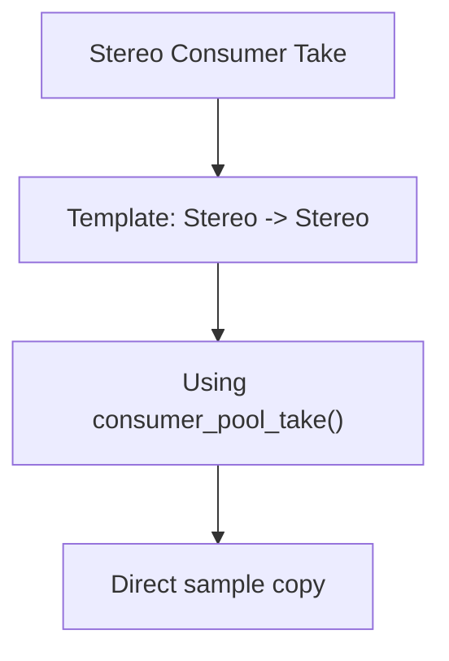

**Diagram sources**
- [audio.cpp:236-238](file://audio/audio.cpp#L236-L238)

**Section sources**
- [audio.cpp:236-238](file://audio/audio.cpp#L236-L238)

#### Mono-to-Stereo Consumer Take
Converts mono to stereo with identical left/right channels:

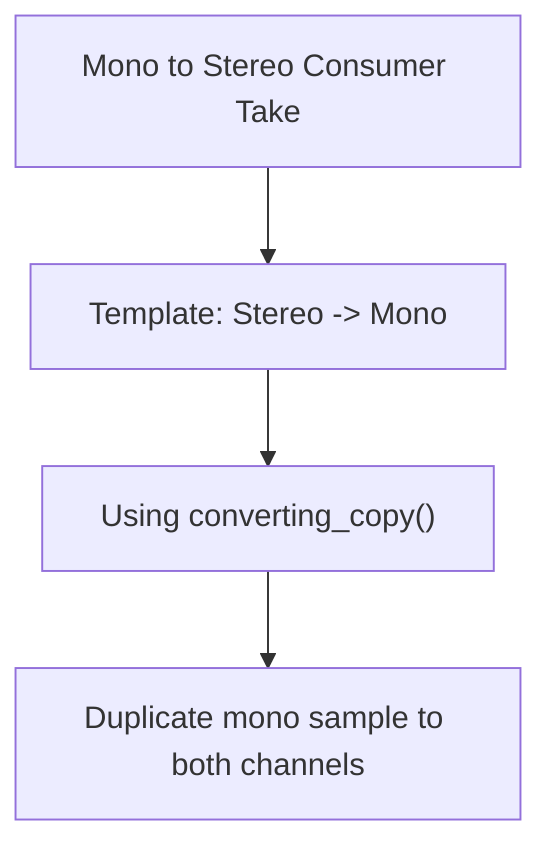

**Diagram sources**
- [audio.cpp:241-243](file://audio/audio.cpp#L241-L243)

**Section sources**
- [audio.cpp:241-243](file://audio/audio.cpp#L241-L243)

#### S8-to-Mono Consumer Take
Performs S8-to-S16 conversion for mono streams:

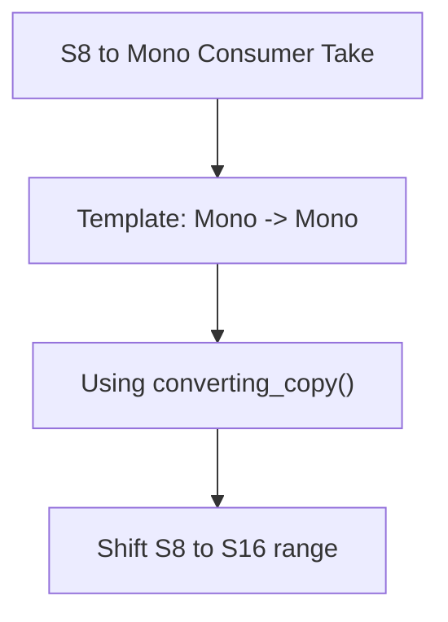

**Diagram sources**
- [audio.cpp:245-247](file://audio/audio.cpp#L245-L247)

**Section sources**
- [audio.cpp:245-247](file://audio/audio.cpp#L245-L247)

#### S8-to-Stereo Consumer Take
Converts S8 mono to stereo with channel duplication:

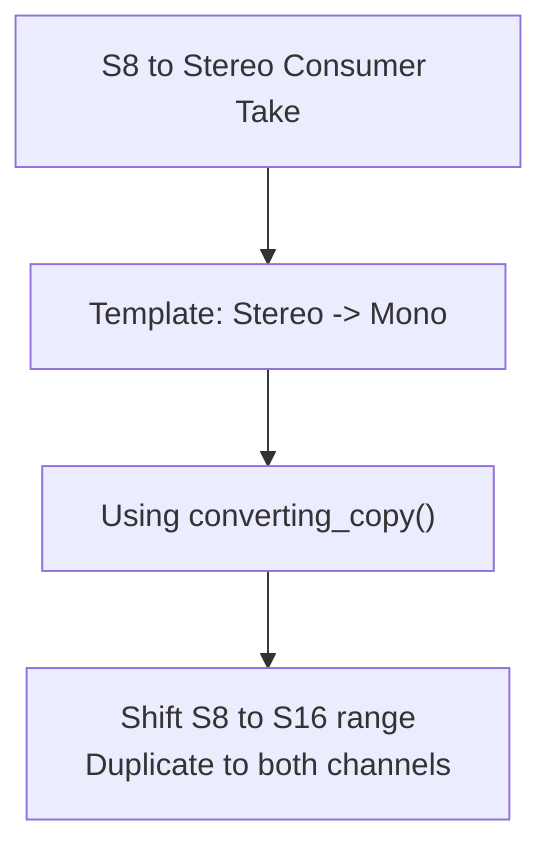

**Diagram sources**
- [audio.cpp:249-251](file://audio/audio.cpp#L249-L251)

**Section sources**
- [audio.cpp:249-251](file://audio/audio.cpp#L249-L251)

#### Stereo Producer Give
Blocking delivery with stereo format preservation:

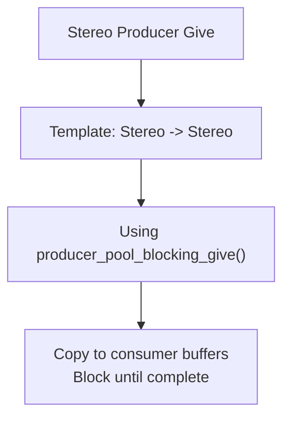

**Diagram sources**
- [audio.cpp:253-255](file://audio/audio.cpp#L253-L255)

**Section sources**
- [audio.cpp:253-255](file://audio/audio.cpp#L253-L255)

### Connection Lifecycle Management
The connection lifecycle encompasses creation, establishment, usage, and cleanup:

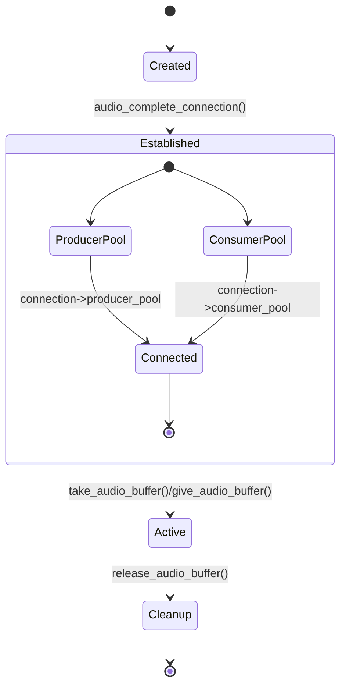

**Diagram sources**
- [audio.cpp:203-211](file://audio/audio.cpp#L203-L211)
- [audio.cpp:213-228](file://audio/audio.cpp#L213-L228)

Lifecycle steps:
1. Create producer and consumer pools with audio_new_producer_pool() and audio_new_consumer_pool()
2. Establish connection with audio_complete_connection()
3. Use take_audio_buffer() and give_audio_buffer() for buffer transfer
4. Release buffers with release_audio_buffer() to return to free lists

**Section sources**
- [audio.cpp:189-201](file://audio/audio.cpp#L189-L201)
- [audio.cpp:203-228](file://audio/audio.cpp#L203-L228)
- [audio.h:175-178](file://audio/audio.h#L175-L178)

### Error Handling
The system employs several error handling mechanisms:
- Assertions for buffer state validation
- Block/non-block operation modes
- Event-driven synchronization (__wfe/__sev)
- Position tracking for partial buffer processing

Common error conditions include:
- Invalid connection types (producer vs consumer)
- Buffer exhaustion during blocking operations
- Format mismatches between producer and consumer pools
- Memory allocation failures for buffer creation

**Section sources**
- [audio.cpp:205-206](file://audio/audio.cpp#L205-L206)
- [audio.cpp:82-87](file://audio/audio.cpp#L82-L87)
- [audio.cpp:102-109](file://audio/audio.cpp#L102-L109)

## Dependency Analysis
The audio connection system has clear dependency relationships:

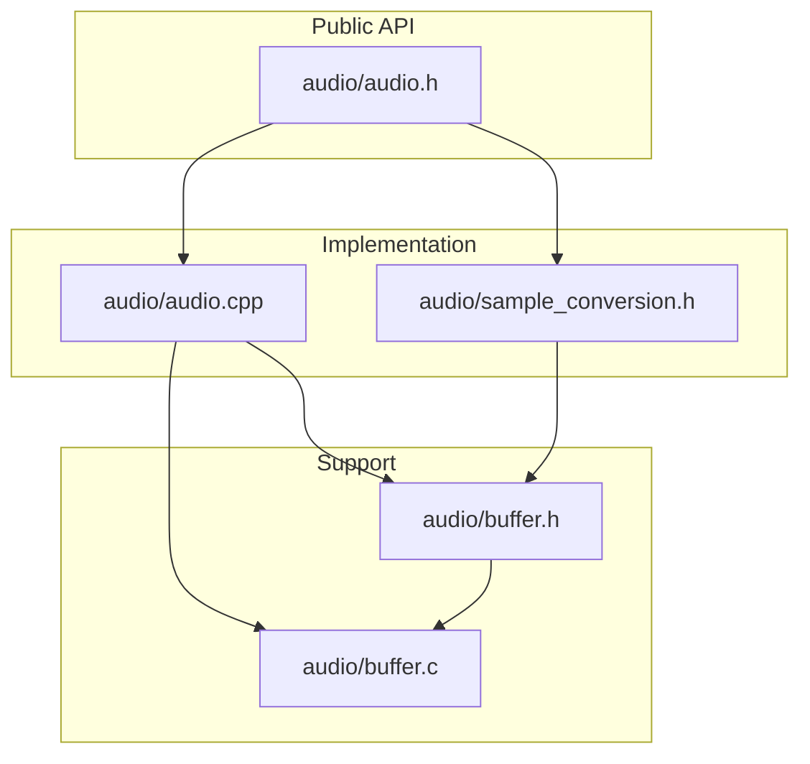

**Diagram sources**
- [audio.h:11-14](file://audio/audio.h#L11-L14)
- [audio.cpp:9-10](file://audio/audio.cpp#L9-L10)
- [sample_conversion.h:13-14](file://audio/sample_conversion.h#L13-L14)

Key dependencies:
- audio/audio.h depends on hardware synchronization primitives
- audio/audio.cpp depends on buffer.h and sample_conversion.h
- sample_conversion.h depends on audio.h and buffer.h
- buffer.h provides memory management utilities

**Section sources**
- [audio.h:11-14](file://audio/audio.h#L11-L14)
- [audio.cpp:9-10](file://audio/audio.cpp#L9-L10)
- [sample_conversion.h:13-14](file://audio/sample_conversion.h#L13-L14)

## Performance Considerations
The audio connection system is designed for real-time performance with the following considerations:

### Synchronization Strategy
- Spin locks minimize context switching overhead
- Event signaling (__wfe/__sev) reduces CPU busy-waiting
- Atomic list operations ensure thread safety without mutex overhead

### Memory Management
- Pre-allocated buffer pools eliminate runtime allocation overhead
- Direct memory buffer wrapping supports zero-copy scenarios
- Efficient list manipulation avoids fragmentation

### Format Conversion Efficiency
- Template-based conversion minimizes runtime branching
- Optimized copy routines for same-format transfers
- Minimal intermediate buffering during conversions

## Troubleshooting Guide
Common issues and solutions when working with audio connections:

### Connection Setup Issues
- **Problem**: audio_complete_connection fails assertions
  - **Cause**: Wrong pool types or uninitialized pools
  - **Solution**: Verify producer pool is ac_producer and consumer pool is ac_consumer

### Buffer Management Problems
- **Problem**: Deadlocks during blocking operations
  - **Cause**: Missing give_audio_buffer() calls
  - **Solution**: Ensure every taken buffer is returned via give_audio_buffer()

### Format Conversion Errors
- **Problem**: Incorrect audio quality or channel configuration
  - **Cause**: Mismatched format specifications
  - **Solution**: Verify sample formats and channel counts match connection templates

### Memory Allocation Failures
- **Problem**: Buffer creation returns NULL
  - **Cause**: Insufficient memory or invalid parameters
  - **Solution**: Reduce buffer counts or sample counts, verify format specifications

**Section sources**
- [audio.cpp:205-206](file://audio/audio.cpp#L205-L206)
- [audio.cpp:149-154](file://audio/audio.cpp#L149-L154)

## Conclusion
The Pico-DSP-Garden audio connection management system provides a robust, efficient framework for audio routing and format conversion. Its producer-consumer model, combined with specialized connection types and comprehensive format support, enables flexible audio processing pipelines. The system's emphasis on real-time performance, thread safety, and extensibility makes it suitable for complex embedded audio applications.

Key strengths include:
- Clear separation of concerns between buffer pools and connections
- Comprehensive format conversion support through template specialization
- Efficient synchronization mechanisms for real-time operation
- Flexible connection types for different routing scenarios

The documented APIs and patterns provide a solid foundation for building sophisticated audio processing chains in embedded environments.