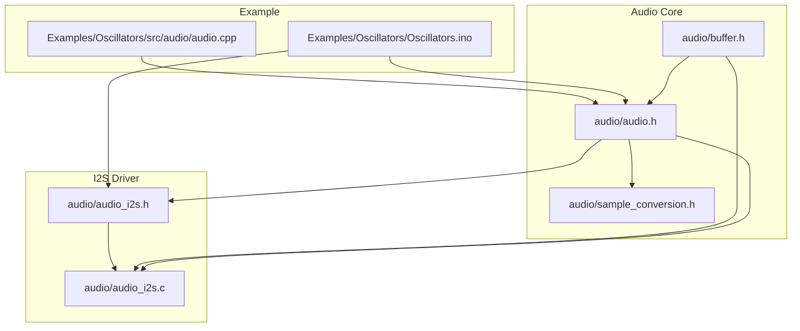
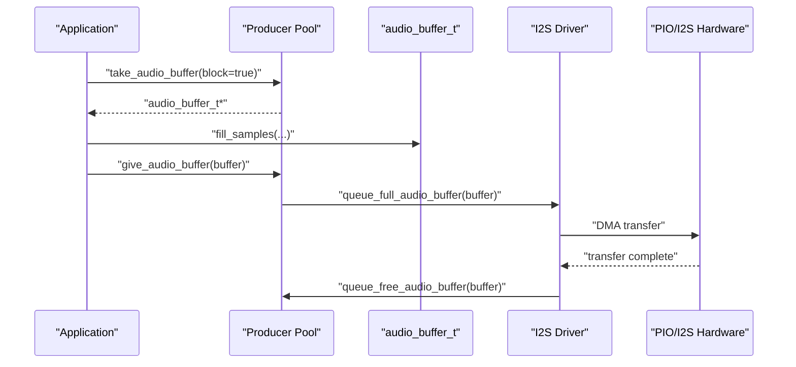
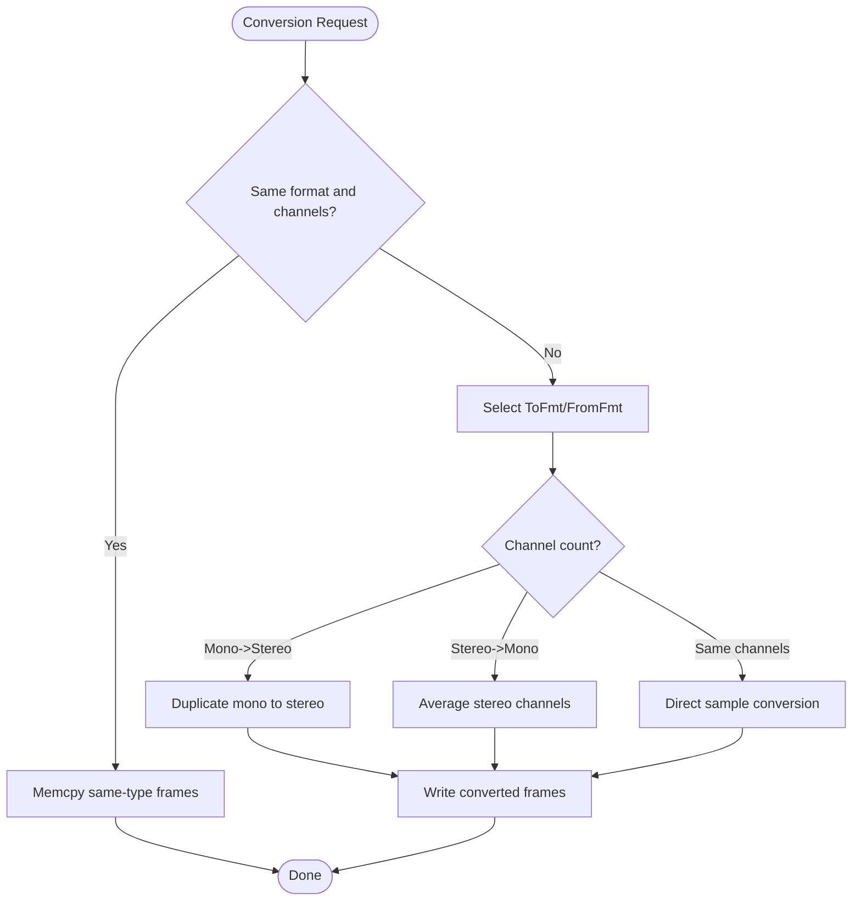
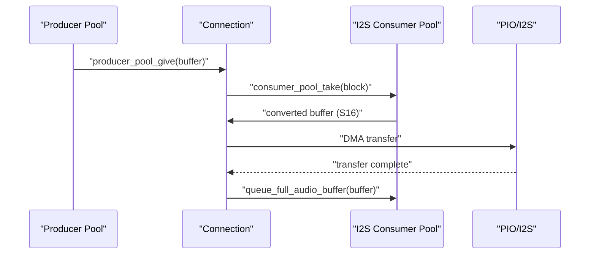
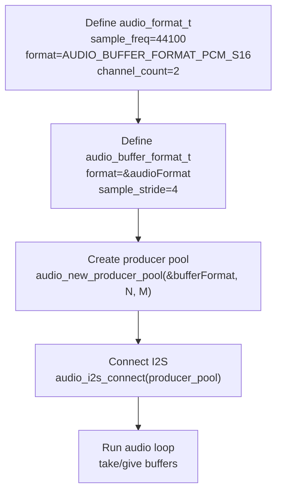
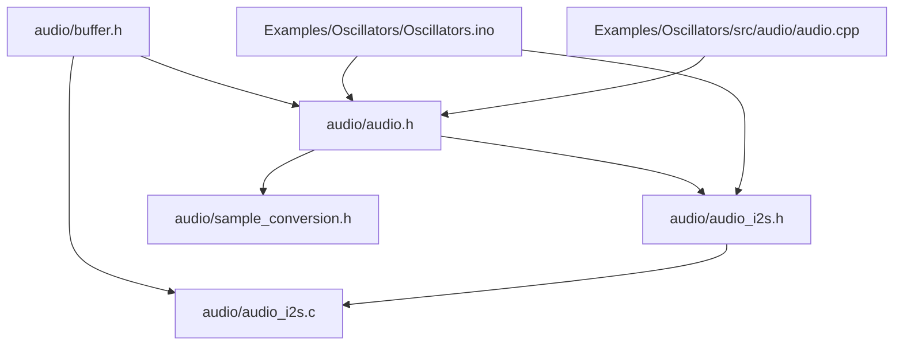

# Format Definitions API

<cite>
**Referenced Files in This Document**
- [audio.h](file://audio/audio.h)
- [buffer.h](file://audio/buffer.h)
- [sample_conversion.h](file://audio/sample_conversion.h)
- [audio.cpp](file://Examples/Oscillators/src/audio/audio.cpp)
- [audio_i2s.h](file://audio/audio_i2s.h)
- [audio_i2s.c](file://audio/audio_i2s.c)
- [Oscillators.ino](file://Examples/Oscillators/Oscillators.ino)
</cite>

## Table of Contents
1. [Introduction](#introduction)
2. [Project Structure](#project-structure)
3. [Core Components](#core-components)
4. [Architecture Overview](#architecture-overview)
5. [Detailed Component Analysis](#detailed-component-analysis)
6. [Dependency Analysis](#dependency-analysis)
7. [Performance Considerations](#performance-considerations)
8. [Troubleshooting Guide](#troubleshooting-guide)
9. [Conclusion](#conclusion)

## Introduction
This document provides comprehensive API documentation for audio format definitions and related structures in Pico-DSP-Garden. It focuses on:
- Audio format enumeration values and their corresponding bit depths and data types
- The audio_format_t structure fields and constraints
- The audio_buffer_format_t structure for buffer-specific format configurations
- The audio_buffer_t structure containing buffer metadata and user data fields
- Format conversion utilities and compatibility matrices
- Practical examples of format selection for different audio quality and hardware requirements
- Validation, error handling, and best practices for format configuration

## Project Structure
The audio subsystem is organized into core headers and example usage:
- Core audio definitions and APIs: audio/audio.h
- Buffer management utilities: audio/buffer.h
- Sample conversion templates and utilities: audio/sample_conversion.h
- I2S audio driver and configuration: audio/audio_i2s.h, audio/audio_i2s.c
- Example usage demonstrating format configuration and buffer pools: Examples/Oscillators/Oscillators.ino and Examples/Oscillators/src/audio/audio.cpp

**Diagram sources**
- [audio.h:1-311](file://audio/audio.h#L1-L311)
- [buffer.h:1-103](file://audio/buffer.h#L1-L103)
- [sample_conversion.h:1-289](file://audio/sample_conversion.h#L1-L289)
- [audio_i2s.h:1-184](file://audio/audio_i2s.h#L1-L184)
- [audio_i2s.c:1-398](file://audio/audio_i2s.c#L1-L398)
- [Oscillators.ino:1-168](file://Examples/Oscillators/Oscillators.ino#L1-L168)
- [audio.cpp:1-257](file://Examples/Oscillators/src/audio/audio.cpp#L1-L257)

**Section sources**
- [audio.h:1-311](file://audio/audio.h#L1-L311)
- [audio_i2s.h:1-184](file://audio/audio_i2s.h#L1-L184)
- [Oscillators.ino:1-168](file://Examples/Oscillators/Oscillators.ino#L1-L168)

## Core Components
This section documents the primary audio format and buffer structures used across the system.

- Audio format enumerations
  - AUDIO_BUFFER_FORMAT_PCM_S16: signed 16-bit PCM
  - AUDIO_BUFFER_FORMAT_PCM_S8: signed 8-bit PCM
  - AUDIO_BUFFER_FORMAT_PCM_U16: unsigned 16-bit PCM
  - AUDIO_BUFFER_FORMAT_PCM_U8: unsigned 8-bit PCM

- audio_format_t structure
  - Fields:
    - sample_freq: sampling frequency in Hz
    - format: audio format identifier (enumeration above)
    - channel_count: number of channels (1 for mono, 2 for stereo)
  - Constraints:
    - sample_freq must be a positive integer representing Hz
    - format must be one of the defined PCM format enumerations
    - channel_count must be 1 or 2 for typical I2S output

- audio_buffer_format_t structure
  - Fields:
    - format: pointer to audio_format_t describing the audio format
    - sample_stride: stride in bytes between consecutive samples (frame size)
  - Notes:
    - sample_stride depends on format and channel_count
    - For S16 stereo, sample_stride is typically 4 bytes (2 channels × 2 bytes)
    - For S8 stereo, sample_stride is typically 2 bytes (2 channels × 1 byte)

- audio_buffer_t structure
  - Fields:
    - buffer: pointer to mem_buffer_t containing raw audio data
    - format: pointer to audio_buffer_format_t describing the buffer’s format
    - sample_count: number of samples currently in the buffer
    - max_sample_count: maximum capacity of the buffer in samples
    - user_data: caller-managed field valid while the buffer is owned
    - next: internal linked-list pointer for buffer pooling
  - Usage:
    - sample_count is set by producers and consumed by consumers
    - max_sample_count defines allocation size in frames

- mem_buffer_t structure (buffer management)
  - Fields:
    - size: total size in bytes
    - bytes: pointer to the underlying memory buffer
    - flags: buffer flags (implementation-dependent)
  - Behavior:
    - Supports allocation and wrapping of memory regions
    - Used by audio buffer initialization routines

**Section sources**
- [audio.h:42-72](file://audio/audio.h#L42-L72)
- [buffer.h:34-46](file://audio/buffer.h#L34-L46)
- [audio.cpp:149-154](file://Examples/Oscillators/src/audio/audio.cpp#L149-L154)

## Architecture Overview
The audio pipeline integrates format definitions, buffer management, and I2S output. The example demonstrates a producer-consumer model where:
- Producers allocate and fill audio buffers according to a configured audio_format_t
- Consumers receive buffers and optionally convert formats for I2S output
- I2S driver enforces format compatibility and manages DMA transfers

**Diagram sources**
- [audio.h:106-178](file://audio/audio.h#L106-L178)
- [audio_i2s.c:194-248](file://audio/audio_i2s.c#L194-L248)
- [Oscillators.ino:152-160](file://Examples/Oscillators/Oscillators.ino#L152-L160)

## Detailed Component Analysis

### Audio Format Enumeration Values
- AUDIO_BUFFER_FORMAT_PCM_S16: signed 16-bit PCM
- AUDIO_BUFFER_FORMAT_PCM_S8: signed 8-bit PCM
- AUDIO_BUFFER_FORMAT_PCM_U16: unsigned 16-bit PCM
- AUDIO_BUFFER_FORMAT_PCM_U8: unsigned 8-bit PCM

These enumerations are used to configure audio_format_t and audio_buffer_format_t. They define the underlying data type and signedness for PCM samples.

**Section sources**
- [audio.h:42-45](file://audio/audio.h#L42-L45)

### audio_format_t Structure
- Purpose: describes the audio format at the stream level
- Fields:
  - sample_freq: sampling rate in Hz
  - format: one of the PCM format enumerations
  - channel_count: number of channels (1 or 2)
- Typical usage:
  - Define a global audio_format_t for the entire pipeline
  - Pass it to audio_new_producer_pool to create producer pools
  - Ensure consumer pools align with producer format for I2S output

Constraints and validation:
- sample_freq must be a positive integer
- format must match one of the defined enumerations
- channel_count must be 1 or 2 for I2S output

**Section sources**
- [audio.h:49-53](file://audio/audio.h#L49-L53)
- [Oscillators.ino:126-129](file://Examples/Oscillators/Oscillators.ino#L126-L129)

### audio_buffer_format_t Structure
- Purpose: describes buffer-level format and memory layout
- Fields:
  - format: pointer to audio_format_t
  - sample_stride: frame size in bytes (channels × bytes-per-sample)
- Calculation:
  - For S16 stereo: stride = 4 bytes
  - For S8 stereo: stride = 2 bytes
  - For S16 mono: stride = 2 bytes
  - For S8 mono: stride = 1 byte

**Section sources**
- [audio.h:57-60](file://audio/audio.h#L57-L60)
- [Oscillators.ino:130-132](file://Examples/Oscillators/Oscillators.ino#L130-L132)

### audio_buffer_t Structure
- Purpose: encapsulates a memory buffer and its metadata
- Fields:
  - buffer: mem_buffer_t pointer
  - format: audio_buffer_format_t pointer
  - sample_count: number of samples written
  - max_sample_count: buffer capacity in samples
  - user_data: caller-managed storage
  - next: internal list pointer
- Lifecycle:
  - Created via audio_new_buffer or audio_new_wrapping_buffer
  - Initialized with audio_init_buffer
  - Owned by producer/consumer pools during processing

**Section sources**
- [audio.h:64-72](file://audio/audio.h#L64-L72)
- [audio.cpp:143-154](file://Examples/Oscillators/src/audio/audio.cpp#L143-L154)

### Buffer Management Utilities
- audio_new_buffer and audio_new_wrapping_buffer:
  - Allocate and initialize audio buffers with given format and capacity
- audio_init_buffer:
  - Initializes an existing audio_buffer_t with a format and sample count
- Producer/Consumer pools:
  - audio_new_producer_pool and audio_new_consumer_pool:
    - Create pools with a specified number of buffers and sample capacity
  - get_free_audio_buffer and get_full_audio_buffer:
    - Thread-safe acquisition of buffers from free/prepared lists
  - queue_free_audio_buffer and queue_full_audio_buffer:
    - Return buffers to their respective lists

**Section sources**
- [audio.h:106-178](file://audio/audio.h#L106-L178)
- [audio.cpp:143-201](file://Examples/Oscillators/src/audio/audio.cpp#L143-L201)
- [audio.cpp:78-118](file://Examples/Oscillators/src/audio/audio.cpp#L78-L118)

### Format Conversion Utilities and Compatibility Matrix
The sample conversion module provides compile-time templates for efficient conversions between PCM formats and channel layouts. It supports:
- Conversions between S8, S16, U8, and U16
- Mono-to-Mono, Mono-to-Stereo, and Stereo-to-Stereo conversions
- Optimized copying for same-format frames and interleaved stereo

Key capabilities:
- Template-based converters compute per-sample transformations
- MultiChannelFmt enables channel-count abstraction
- converting_copy optimizes same-type copies via memcpy
- Consumer-side conversion pulls from producer buffers and writes to consumer buffers

Compatibility matrix (selected):
- S16 to S16: no-op
- S8 to S16: sign-extend and adjust bias
- U8 to S16: shift and bias adjustment
- U16 to S16: XOR with 0x8000
- S8 to U8: XOR with 0x80
- U8 to U16: shift left 8 bits
- Mono to Stereo: duplicate sample across channels
- Stereo to Mono: average channels

**Diagram sources**
- [sample_conversion.h:155-206](file://audio/sample_conversion.h#L155-L206)
- [sample_conversion.h:163-180](file://audio/sample_conversion.h#L163-L180)

**Section sources**
- [sample_conversion.h:16-154](file://audio/sample_conversion.h#L16-L154)
- [sample_conversion.h:155-206](file://audio/sample_conversion.h#L155-L206)
- [sample_conversion.h:208-286](file://audio/sample_conversion.h#L208-L286)

### I2S Integration and Format Constraints
The I2S driver enforces format compatibility and manages DMA transfers:
- audio_i2s_connect requires producer format to be AUDIO_BUFFER_FORMAT_PCM_S16
- Consumer format is configured to match the producer’s sample frequency and channel count
- For S16 stereo, sample_stride is 4 bytes; for S8 mono, stride is 1 byte and conversion occurs on take

**Diagram sources**
- [audio_i2s.c:194-248](file://audio/audio_i2s.c#L194-L248)
- [audio_i2s.c:263-312](file://audio/audio_i2s.c#L263-L312)

**Section sources**
- [audio_i2s.c:203-214](file://audio/audio_i2s.c#L203-L214)
- [audio_i2s.c:267-278](file://audio/audio_i2s.c#L267-L278)

### Example: Format Selection and Configuration
The example demonstrates selecting S16 stereo format for I2S output:
- audio_format_t sets sample_freq, format, and channel_count
- audio_buffer_format_t sets format pointer and sample_stride
- Producer pool is created with the buffer format
- I2S setup connects the producer pool and enforces S16 format

**Diagram sources**
- [Oscillators.ino:126-139](file://Examples/Oscillators/Oscillators.ino#L126-L139)

**Section sources**
- [Oscillators.ino:126-139](file://Examples/Oscillators/Oscillators.ino#L126-L139)

## Dependency Analysis
The following diagram shows key dependencies among audio components:

**Diagram sources**
- [audio.h:1-311](file://audio/audio.h#L1-L311)
- [audio_i2s.h:1-184](file://audio/audio_i2s.h#L1-L184)
- [audio_i2s.c:1-398](file://audio/audio_i2s.c#L1-L398)
- [Oscillators.ino:1-168](file://Examples/Oscillators/Oscillators.ino#L1-L168)
- [audio.cpp:1-257](file://Examples/Oscillators/src/audio/audio.cpp#L1-L257)

**Section sources**
- [audio.h:1-311](file://audio/audio.h#L1-L311)
- [audio_i2s.h:1-184](file://audio/audio_i2s.h#L1-L184)
- [audio_i2s.c:1-398](file://audio/audio_i2s.c#L1-L398)
- [Oscillators.ino:1-168](file://Examples/Oscillators/Oscillators.ino#L1-L168)

## Performance Considerations
- Choose appropriate sample_stride to minimize memory overhead and maximize throughput
- Prefer same-format copies (memcpy) for identical channel and bit-depth configurations
- Use stereo stride calculations that match hardware DMA sizes (e.g., 4 bytes for S16 stereo)
- Ensure sample_count equals max_sample_count for full buffers to avoid partial transfers
- Limit conversion operations to necessary transitions (e.g., S8 to S16) to reduce CPU load

[No sources needed since this section provides general guidance]

## Troubleshooting Guide
Common issues and resolutions:
- Format mismatch errors:
  - Symptom: I2S connection fails or panics
  - Cause: Producer format not set to AUDIO_BUFFER_FORMAT_PCM_S16
  - Resolution: Ensure producer pool format matches S16 and channel count
- Incorrect sample_stride:
  - Symptom: DMA transfer errors or distorted audio
  - Cause: sample_stride does not match channels × bytes-per-sample
  - Resolution: Recalculate stride based on selected format and channel count
- Buffer ownership violations:
  - Symptom: Assertion failures when releasing buffers
  - Cause: Modifying buffer fields outside of producer/consumer lifecycle
  - Resolution: Use take_audio_buffer and give_audio_buffer consistently
- Channel conversion pitfalls:
  - Symptom: Clipping or unexpected volume changes
  - Cause: Improper scaling during S8/S16 conversions
  - Resolution: Apply correct bias adjustments and scaling factors

Validation tips:
- Verify audio_format_t fields before creating pools
- Confirm sample_stride alignment with buffer capacity
- Assert buffer sample_count equals max_sample_count for full buffers

**Section sources**
- [audio_i2s.c:203-214](file://audio/audio_i2s.c#L203-L214)
- [audio_i2s.c:267-278](file://audio/audio_i2s.c#L267-L278)
- [audio.cpp:78-118](file://Examples/Oscillators/src/audio/audio.cpp#L78-L118)

## Conclusion
Pico-DSP-Garden’s audio format API provides a robust foundation for configuring PCM audio streams, managing buffers, and integrating with I2S output. By carefully selecting format enumerations, computing sample_stride correctly, and leveraging the provided conversion utilities, developers can achieve high-quality audio with predictable performance. Adhering to the lifecycle of buffers and validating format compatibility ensures reliable operation across diverse hardware configurations.