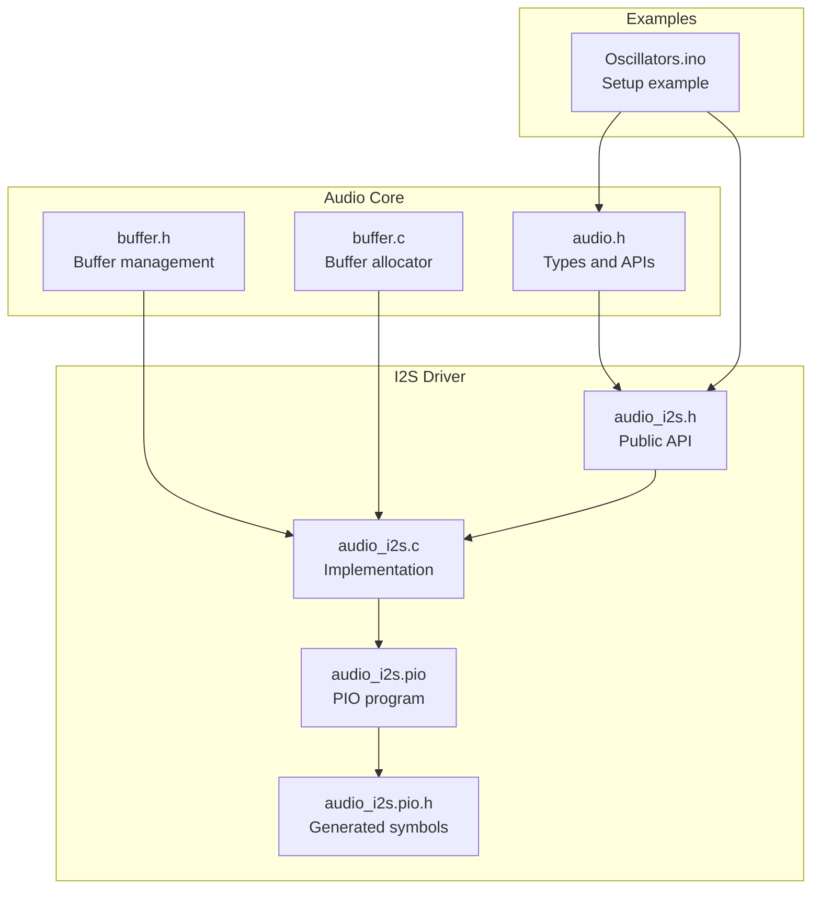
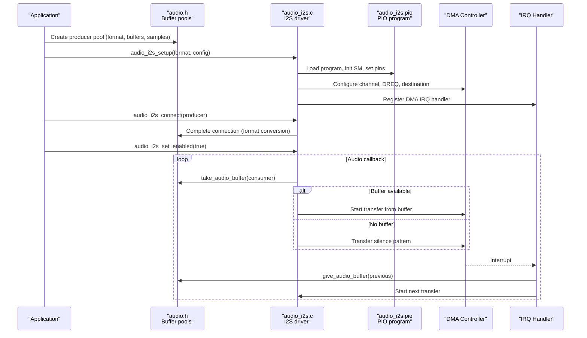
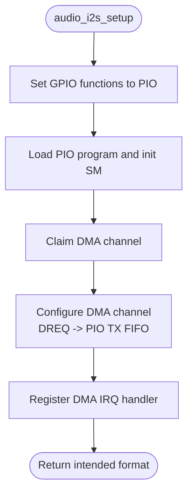
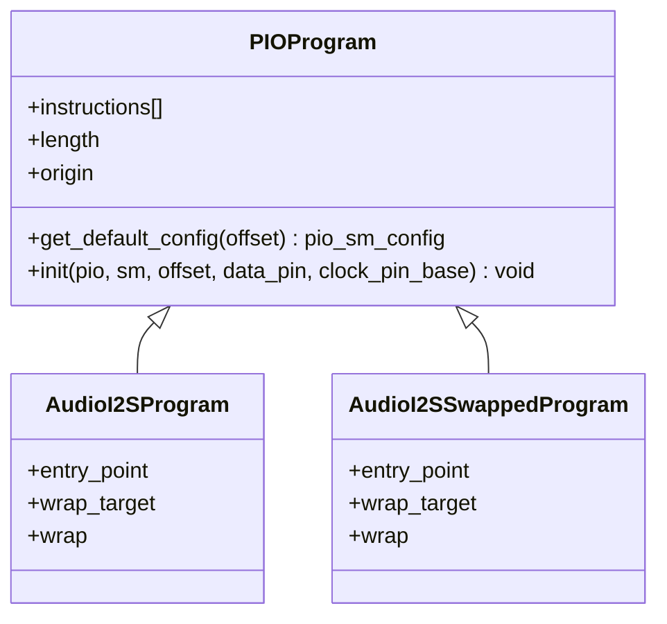
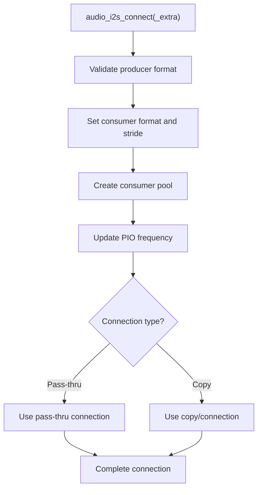
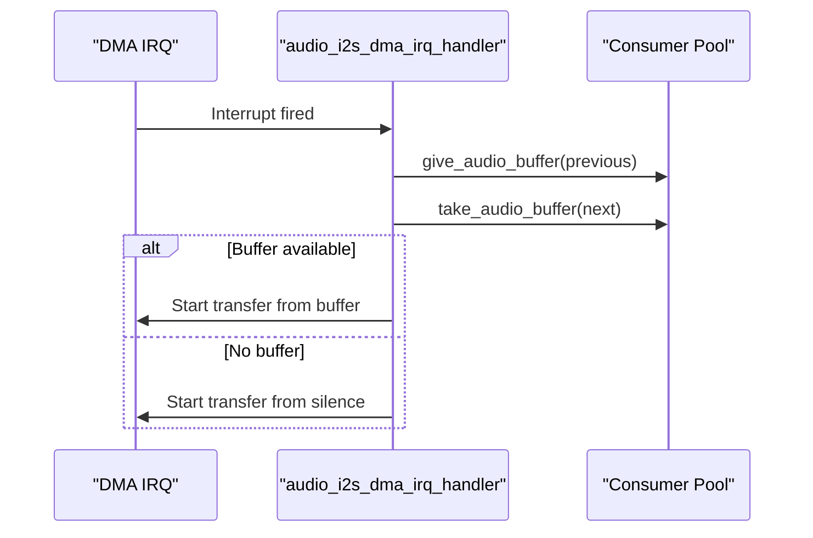
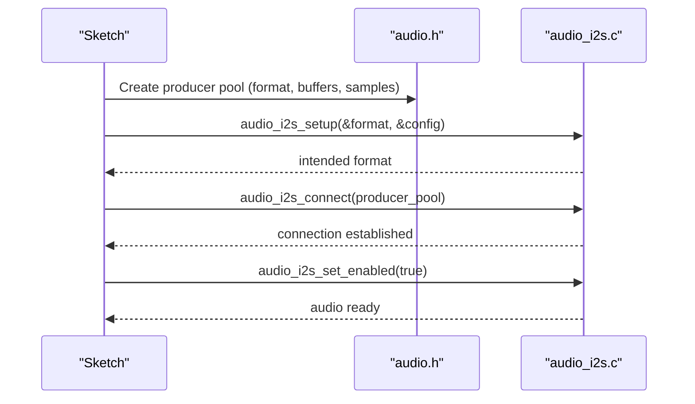
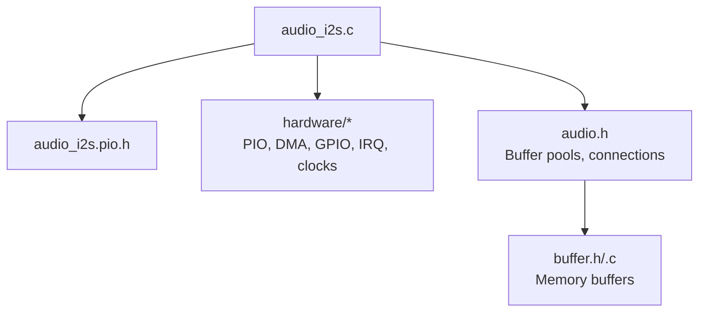

# I2S Configuration API

<cite>
**Referenced Files in This Document**
- [audio_i2s.h](file://audio/audio_i2s.h)
- [audio_i2s.c](file://audio/audio_i2s.c)
- [audio_i2s.pio](file://audio/audio_i2s.pio)
- [audio_i2s.pio.h](file://audio/audio_i2s.pio.h)
- [audio.h](file://audio/audio.h)
- [buffer.h](file://audio/buffer.h)
- [buffer.c](file://audio/buffer.c)
- [Oscillators.ino](file://Examples/Oscillators/Oscillators.ino)
- [README.md](file://README.md)
</cite>

## Table of Contents
1. [Introduction](#introduction)
2. [Project Structure](#project-structure)
3. [Core Components](#core-components)
4. [Architecture Overview](#architecture-overview)
5. [Detailed Component Analysis](#detailed-component-analysis)
6. [Dependency Analysis](#dependency-analysis)
7. [Performance Considerations](#performance-considerations)
8. [Troubleshooting Guide](#troubleshooting-guide)
9. [Conclusion](#conclusion)
10. [Appendices](#appendices)

## Introduction
This document provides comprehensive API documentation for I2S audio configuration and setup functions in Pico-DSP-Garden. It covers I2S initialization procedures, pin configuration requirements, PIO state machine setup, audio output configuration, sample rate settings, buffer sizing, interrupt handling, and DMA streaming. It also documents the pio_audio_channel_config_t structure for PIO-based audio channel configuration, hardware-specific configuration for RP2040/RP2350 variants, and practical examples for complete I2S setup sequences. Guidance on error handling, performance optimization, and troubleshooting common hardware wiring issues and timing constraints is included.

## Project Structure
The I2S subsystem resides under the audio/ directory and integrates with the broader audio framework. The key files are:
- audio/audio_i2s.h: Public API declarations for I2S setup and connection
- audio/audio_i2s.c: Implementation of I2S setup, DMA streaming, interrupts, and runtime control
- audio/audio_i2s.pio: PIO program implementing I2S bitstream generation
- audio/audio_i2s.pio.h: Generated header exposing PIO program symbols and initialization helpers
- audio/audio.h: Core audio types, buffer pools, and connection abstractions
- audio/buffer.h and audio/buffer.c: Memory buffer management utilities
- Examples/Oscillators/Oscillators.ino: Practical example of I2S setup and usage

**Diagram sources**
- [audio_i2s.h:114-176](file://audio/audio_i2s.h#L114-L176)
- [audio_i2s.c:49-100](file://audio/audio_i2s.c#L49-L100)
- [audio_i2s.pio:28-62](file://audio/audio_i2s.pio#L28-L62)
- [audio_i2s.pio.h:35-101](file://audio/audio_i2s.pio.h#L35-L101)
- [audio.h:47-303](file://audio/audio.h#L47-L303)
- [buffer.h:34-103](file://audio/buffer.h#L34-L103)
- [buffer.c:9-24](file://audio/buffer.c#L9-L24)
- [Oscillators.ino:98-119](file://Examples/Oscillators/Oscillators.ino#L98-L119)

**Section sources**
- [README.md:30-37](file://README.md#L30-L37)
- [audio_i2s.h:114-176](file://audio/audio_i2s.h#L114-L176)
- [audio_i2s.c:49-100](file://audio/audio_i2s.c#L49-L100)
- [audio_i2s.pio:28-62](file://audio/audio_i2s.pio#L28-L62)
- [audio_i2s.pio.h:35-101](file://audio/audio_i2s.pio.h#L35-L101)
- [audio.h:47-303](file://audio/audio.h#L47-L303)
- [buffer.h:34-103](file://audio/buffer.h#L34-L103)
- [buffer.c:9-24](file://audio/buffer.c#L9-L24)
- [Oscillators.ino:98-119](file://Examples/Oscillators/Oscillators.ino#L98-L119)

## Core Components
- I2S Setup API: Initializes GPIO pins, claims PIO state machine, loads PIO program, configures DMA channel, and registers DMA interrupt handler.
- I2S Connection API: Connects a producer audio buffer pool to the I2S consumer, handling format conversion and buffering strategies.
- PIO Program: Implements I2S bitstream generation with configurable side-set pins for LRCLK/BCLK ordering.
- DMA Streaming: Drives PIO TX FIFO from audio buffers, with interrupt-driven refill and silence fallback.
- Runtime Control: Enables/disables I2S output and dynamically updates sample rate via PIO clock divider.

Key public functions and types:
- audio_i2s_config_t: Pin and resource configuration for I2S setup
- audio_i2s_setup(): Performs hardware initialization and DMA configuration
- audio_i2s_connect()/audio_i2s_connect_extra(): Establishes audio pipeline to I2S
- audio_i2s_set_enabled(): Starts/stops audio output
- pio_audio_channel_config_t: Channel configuration for PIO-based audio

**Section sources**
- [audio_i2s.h:114-176](file://audio/audio_i2s.h#L114-L176)
- [audio.h:299-303](file://audio/audio.h#L299-L303)
- [audio_i2s.c:49-100](file://audio/audio_i2s.c#L49-L100)
- [audio_i2s.c:194-248](file://audio/audio_i2s.c#L194-L248)
- [audio_i2s.c:372-397](file://audio/audio_i2s.c#L372-L397)

## Architecture Overview
The I2S audio pipeline integrates the producer/consumer buffer model with PIO-generated I2S timing and DMA-driven data transfer.

**Diagram sources**
- [audio_i2s.c:49-100](file://audio/audio_i2s.c#L49-L100)
- [audio_i2s.c:194-248](file://audio/audio_i2s.c#L194-L248)
- [audio_i2s.c:314-368](file://audio/audio_i2s.c#L314-L368)
- [audio.h:106-126](file://audio/audio.h#L106-L126)

## Detailed Component Analysis

### I2S Initialization and Configuration
- Pin configuration: Data pin and two clock pins are set to PIO function. GPIO base selection is handled for boards with extended GPIO numbering.
- PIO program loading: Selects either standard or swapped LRCLK/BCLK order program based on configuration flag.
- State machine initialization: Sets output pins, sideset pins, FIFO join, and executes program entry point.
- DMA channel configuration: Claims channel, sets DREQ to PIO TX FIFO, configures transfer size, and prepares for manual triggers.
- Interrupt setup: Registers shared DMA IRQ handler and enables channel interrupt.

**Diagram sources**
- [audio_i2s.c:51-99](file://audio/audio_i2s.c#L51-L99)
- [audio_i2s.pio.h:85-101](file://audio/audio_i2s.pio.h#L85-L101)

**Section sources**
- [audio_i2s.c:51-99](file://audio/audio_i2s.c#L51-L99)
- [audio_i2s.pio.h:85-101](file://audio/audio_i2s.pio.h#L85-L101)

### PIO State Machine and Bitstream Generation
- Program variants: Standard and swapped LRCLK/BCLK side-set orders are provided.
- Side-set pins: Two side-set pins control LRCLK and BCLK signals.
- FIFO join: TX FIFO is joined to SM output to stream 16-bit or 32-bit samples depending on mono/stereo mode.
- Shift configuration: Left-justified output with autopull enabled for continuous streaming.

**Diagram sources**
- [audio_i2s.pio.h:35-83](file://audio/audio_i2s.pio.h#L35-L83)
- [audio_i2s.pio:28-62](file://audio/audio_i2s.pio#L28-L62)

**Section sources**
- [audio_i2s.pio:28-62](file://audio/audio_i2s.pio#L28-L62)
- [audio_i2s.pio.h:35-83](file://audio/audio_i2s.pio.h#L35-L83)

### Audio Output Configuration and Buffer Management
- Consumer format: Consumer accepts S16 PCM with configurable channel count and stride.
- Dynamic frequency adjustment: Updates PIO SM clock divider when producer format changes.
- Buffering strategies: Pass-through or copying connections depending on buffer count and channel configuration.
- Silence fallback: When no audio buffer is available, transfers a silence pattern to keep PIO fed.

**Diagram sources**
- [audio_i2s.c:198-247](file://audio/audio_i2s.c#L198-L247)
- [audio.h:106-126](file://audio/audio.h#L106-L126)

**Section sources**
- [audio_i2s.c:198-247](file://audio/audio_i2s.c#L198-L247)
- [audio.h:106-126](file://audio/audio.h#L106-L126)

### DMA Streaming and Interrupt Handling
- Transfer initiation: On each interrupt, the driver takes the next audio buffer from the consumer pool and starts a DMA transfer.
- Increment control: Read increment is enabled for buffer data and disabled for silence pattern.
- Buffer lifecycle: Previous buffer is returned to the consumer pool upon completion; silence pattern is used when no buffer is available.
- Runtime enable/disable: Disables DMA IRQ and frees any in-flight buffer when disabled.

**Diagram sources**
- [audio_i2s.c:349-368](file://audio/audio_i2s.c#L349-L368)
- [audio_i2s.c:314-346](file://audio/audio_i2s.c#L314-L346)

**Section sources**
- [audio_i2s.c:349-368](file://audio/audio_i2s.c#L349-L368)
- [audio_i2s.c:314-346](file://audio/audio_i2s.c#L314-L346)

### pio_audio_channel_config_t Structure
The pio_audio_channel_config_t structure defines the hardware resources for a PIO-based audio channel:
- base_pin: Base pin for data and clock signals
- dma_channel: DMA channel index
- pio_sm: PIO state machine index

This structure is used to configure I2S channels consistently across the system.

**Section sources**
- [audio.h:299-303](file://audio/audio.h#L299-L303)

### Hardware-Specific Configuration for RP2040/RP2350
- PIO base pin selection: GPIO base is adjusted for boards with extended GPIO numbering.
- PIO function selection: Uses compile-time macros to select the correct PIO function for the target variant.
- DMA IRQ selection: Supports selecting DMA IRQ 0 or 1 via configuration macros.
- Clock pin order: Supports both standard and swapped LRCLK/BCLK pin orders.

**Section sources**
- [audio_i2s.c:56-61](file://audio/audio_i2s.c#L56-L61)
- [audio_i2s.c:31-33](file://audio/audio_i2s.c#L31-L33)
- [audio_i2s.h:28-50](file://audio/audio_i2s.h#L28-L50)
- [audio_i2s.h:106-108](file://audio/audio_i2s.h#L106-L108)

### Complete I2S Setup Sequences
Below is a typical setup sequence demonstrated in the examples:

**Diagram sources**
- [Oscillators.ino:98-119](file://Examples/Oscillators/Oscillators.ino#L98-L119)
- [audio_i2s.c:49-100](file://audio/audio_i2s.c#L49-L100)
- [audio_i2s.c:194-248](file://audio/audio_i2s.c#L194-L248)
- [audio_i2s.c:372-397](file://audio/audio_i2s.c#L372-L397)

**Section sources**
- [Oscillators.ino:98-119](file://Examples/Oscillators/Oscillators.ino#L98-L119)

## Dependency Analysis
The I2S driver depends on:
- Hardware abstraction: PIO, DMA, GPIO, IRQ, and clock APIs
- Audio framework: Buffer pools, connection abstractions, and format definitions
- PIO program: Generated symbols and initialization helpers

**Diagram sources**
- [audio_i2s.c:10-16](file://audio/audio_i2s.c#L10-L16)
- [audio_i2s.pio.h:8-10](file://audio/audio_i2s.pio.h#L8-L10)
- [audio.h:11-13](file://audio/audio.h#L11-L13)
- [buffer.h:12-13](file://audio/buffer.h#L12-L13)

**Section sources**
- [audio_i2s.c:10-16](file://audio/audio_i2s.c#L10-L16)
- [audio_i2s.pio.h:8-10](file://audio/audio_i2s.pio.h#L8-L10)
- [audio.h:11-13](file://audio/audio.h#L11-L13)
- [buffer.h:12-13](file://audio/buffer.h#L12-L13)

## Performance Considerations
- Buffer sizing: Tune buffer_count and samples_per_buffer to balance latency and robustness. Smaller buffers reduce latency but increase CPU load; larger buffers improve stability at the cost of latency.
- DMA transfer size: Mono output uses 16-bit transfers; stereo uses 32-bit transfers. Ensure alignment and stride match the selected mode.
- Frequency updates: Dynamic sample rate changes update the PIO clock divider; minimize frequent changes to avoid glitches.
- Interrupt latency: Keep the audio callback minimal; heavy processing should be offloaded to the secondary core.
- PIO base pin selection: For boards with extended GPIO numbering, ensure the PIO GPIO base is configured to avoid conflicts.

[No sources needed since this section provides general guidance]

## Troubleshooting Guide
Common issues and resolutions:
- No audio output:
  - Verify I2S pins are set to PIO function and connected to the DAC.
  - Confirm audio_i2s_set_enabled(true) is called after successful setup and connection.
  - Check that the producer pool is continuously filled and buffers are returned promptly.
- Clicking or glitchy audio:
  - Ensure sufficient buffer_count and appropriate samples_per_buffer.
  - Avoid long-running operations in the audio callback; move heavy tasks to the secondary core.
  - Verify DMA IRQ is enabled and functioning.
- Incorrect channel configuration:
  - For mono-to-stereo conversion, ensure the producer format channel_count is set appropriately.
  - For mono output, confirm the MONO_OUTPUT flag is set as intended.
- Clock pin order mismatch:
  - If the DAC expects BCLK/LRCLK in a different order, enable the swapped clock pins configuration.
- Hardware wiring:
  - Confirm DATA pin, LRCK (frame sync), and BCLK are wired correctly to the DAC.
  - Use appropriate level-shifting and filtering for clean digital audio.

**Section sources**
- [audio_i2s.c:372-397](file://audio/audio_i2s.c#L372-L397)
- [audio_i2s.c:314-346](file://audio/audio_i2s.c#L314-L346)
- [audio_i2s.h:93-98](file://audio/audio_i2s.h#L93-L98)
- [README.md:22-29](file://README.md#L22-L29)

## Conclusion
The I2S subsystem in Pico-DSP-Garden provides a robust, DMA-driven audio pipeline leveraging PIO-generated timing and flexible buffer management. By carefully configuring pins, DMA, and PIO resources, developers can achieve high-quality stereo audio output suitable for real-time synthesis and effects processing. The provided examples demonstrate a complete setup sequence, while the documented APIs and structures offer the flexibility to adapt to various hardware configurations and performance requirements.

[No sources needed since this section summarizes without analyzing specific files]

## Appendices

### API Reference Summary
- audio_i2s_setup(): Initializes I2S hardware and DMA; returns the intended audio format.
- audio_i2s_connect(): Connects a producer pool to the I2S consumer with default buffering.
- audio_i2s_connect_extra(): Advanced connection with explicit buffer count and sample size.
- audio_i2s_set_enabled(): Starts/stops audio output and manages DMA IRQ and PIO SM state.
- audio_i2s_config_t: Holds data_pin, clock_pin_base, dma_channel, and pio_sm.
- pio_audio_channel_config_t: Holds base_pin, dma_channel, and pio_sm for channel configuration.

**Section sources**
- [audio_i2s.h:114-176](file://audio/audio_i2s.h#L114-L176)
- [audio.h:299-303](file://audio/audio.h#L299-L303)