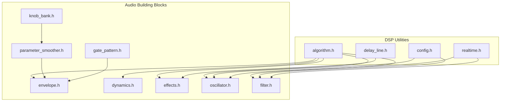
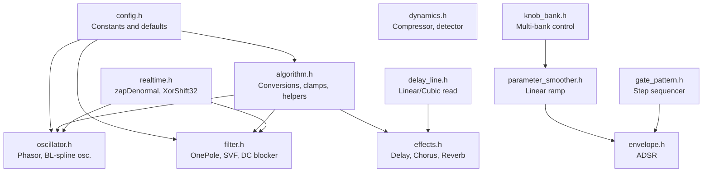
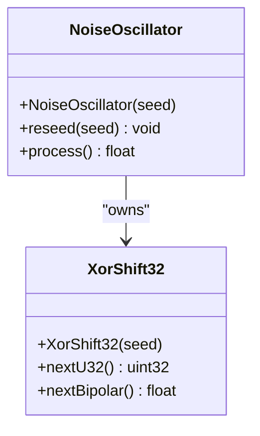
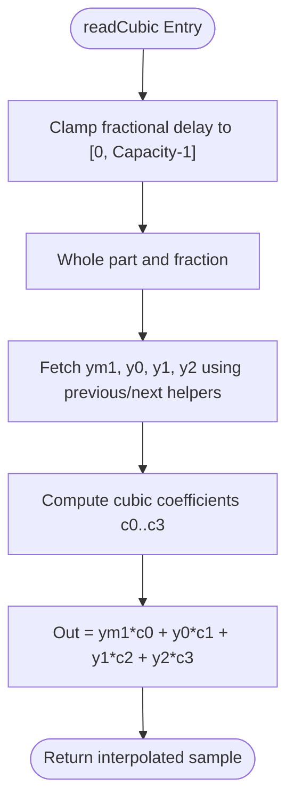
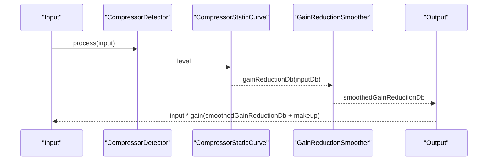
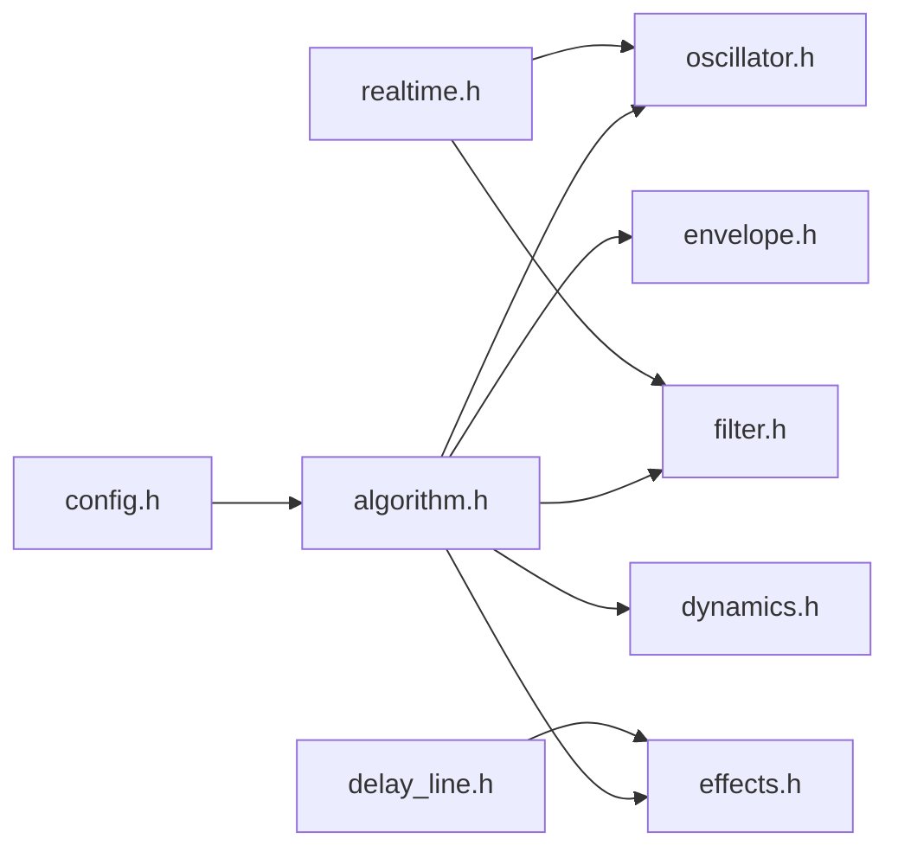

# Algorithm Utilities API

<cite>
**Referenced Files in This Document**
- [algorithm.h](file://dsp/algorithm.h)
- [config.h](file://dsp/config.h)
- [realtime.h](file://dsp/realtime.h)
- [delay_line.h](file://dsp/delay_line.h)
- [envelope.h](file://dsp/envelope.h)
- [dynamics.h](file://dsp/dynamics.h)
- [effects.h](file://dsp/effects.h)
- [oscillator.h](file://dsp/oscillator.h)
- [filter.h](file://dsp/filter.h)
- [parameter_smoother.h](file://dsp/parameter_smoother.h)
- [knob_bank.h](file://dsp/knob_bank.h)
- [gate_pattern.h](file://dsp/gate_pattern.h)
</cite>

## Table of Contents
1. [Introduction](#introduction)
2. [Project Structure](#project-structure)
3. [Core Components](#core-components)
4. [Architecture Overview](#architecture-overview)
5. [Detailed Component Analysis](#detailed-component-analysis)
6. [Dependency Analysis](#dependency-analysis)
7. [Performance Considerations](#performance-considerations)
8. [Troubleshooting Guide](#troubleshooting-guide)
9. [Conclusion](#conclusion)
10. [Appendices](#appendices)

## Introduction
This document describes the Algorithm Utilities API used throughout the Pico-DSP-Garden DSP library. It focuses on numerical precision helpers, mathematical constants and conversions, audio-specific utilities (dB-to-linear, MIDI note to frequency, sample rate validation), bit manipulation utilities, random number generation for noise synthesis, and convenience functions. It also outlines performance characteristics and usage guidance for building robust audio algorithms.

## Project Structure
The Algorithm Utilities API is primarily implemented in the dsp/ directory as header-only utilities and helpers. Key modules include:
- Numerical precision and math helpers
- Constants and conversions
- Real-time cleanup and noise generation
- Delay-line interpolation
- Envelopes, dynamics, and effects
- Oscillators and filters
- Parameter smoothing and control handling

**Diagram sources**
- [algorithm.h:1-85](file://dsp/algorithm.h#L1-L85)
- [config.h:1-22](file://dsp/config.h#L1-L22)
- [realtime.h:1-38](file://dsp/realtime.h#L1-L38)
- [delay_line.h:1-91](file://dsp/delay_line.h#L1-L91)
- [envelope.h:1-131](file://dsp/envelope.h#L1-L131)
- [dynamics.h:1-199](file://dsp/dynamics.h#L1-L199)
- [effects.h:1-250](file://dsp/effects.h#L1-L250)
- [oscillator.h:1-408](file://dsp/oscillator.h#L1-L408)
- [filter.h:1-196](file://dsp/filter.h#L1-L196)
- [parameter_smoother.h:1-64](file://dsp/parameter_smoother.h#L1-L64)
- [knob_bank.h:1-63](file://dsp/knob_bank.h#L1-L63)
- [gate_pattern.h:1-73](file://dsp/gate_pattern.h#L1-L73)

**Section sources**
- [algorithm.h:1-85](file://dsp/algorithm.h#L1-L85)
- [config.h:1-22](file://dsp/config.h#L1-L22)

## Core Components
This section documents the primary algorithmic utilities and their roles in audio DSP.

- Numerical Precision Utilities
  - Denormal number cleanup: zapDenormal(value) replaces very small magnitudes with zero to prevent performance penalties on hosts that do not flush denormals efficiently.
  - One-pole smoothing coefficient computation from time constants in milliseconds.
  - Clamp helpers for control and audio ranges.

- Mathematical Constants and Conversions
  - Pi-related constants: kPi and kTwoPi.
  - dB-to-gain and gain-to-dB conversions with a safe lower bound to avoid log-of-zero.
  - MIDI note to frequency mapping using 12-Tone Equal Temperament.
  - Safe sample rate validation and cutoff clamping with headroom below Nyquist.

- Audio-Specific Helpers
  - Pan law: equal power pan left/right gains computed from normalized pan in [-1, 1].
  - Soft clipper for gentle limiting.
  - Linear interpolation helper for smooth parameter transitions.

- Random Number Generation
  - Deterministic 32-bit PRNG (XorShift32) suitable for noise synthesis and test reproducibility.
  - Bipolar float output generator derived from the PRNG state.

- Convenience Functions
  - Phase wrapping in [0, 1) for oscillators.
  - Clamping helpers for [0, 1] and arbitrary ranges.

Usage examples and parameter constraints are described in the Detailed Component Analysis.

**Section sources**
- [realtime.h:8-11](file://dsp/realtime.h#L8-L11)
- [realtime.h:13-35](file://dsp/realtime.h#L13-L35)
- [algorithm.h:14-26](file://dsp/algorithm.h#L14-L26)
- [algorithm.h:29-37](file://dsp/algorithm.h#L29-L37)
- [algorithm.h:40-43](file://dsp/algorithm.h#L40-L43)
- [algorithm.h:46-48](file://dsp/algorithm.h#L46-L48)
- [algorithm.h:51-60](file://dsp/algorithm.h#L51-L60)
- [algorithm.h:75-82](file://dsp/algorithm.h#L75-L82)
- [config.h:12-15](file://dsp/config.h#L12-L15)

## Architecture Overview
The Algorithm Utilities API underpins higher-level DSP modules. It supplies:
- Constants and conversions to oscillators and filters
- Numerical stability helpers to recursive filters and oscillators
- Interpolation and delay-line read/write primitives for effects
- Control smoothing and parameter handling for interactive systems

**Diagram sources**
- [config.h:12-15](file://dsp/config.h#L12-L15)
- [algorithm.h:14-82](file://dsp/algorithm.h#L14-L82)
- [realtime.h:8-35](file://dsp/realtime.h#L8-L35)
- [delay_line.h:25-64](file://dsp/delay_line.h#L25-L64)
- [oscillator.h:39-394](file://dsp/oscillator.h#L39-L394)
- [filter.h:10-193](file://dsp/filter.h#L10-L193)
- [effects.h:15-247](file://dsp/effects.h#L15-L247)
- [envelope.h:7-128](file://dsp/envelope.h#L7-L128)
- [dynamics.h:9-196](file://dsp/dynamics.h#L9-L196)
- [parameter_smoother.h:10-61](file://dsp/parameter_smoother.h#L10-L61)
- [knob_bank.h:10-60](file://dsp/knob_bank.h#L10-L60)
- [gate_pattern.h:9-70](file://dsp/gate_pattern.h#L9-L70)

## Detailed Component Analysis

### Numerical Precision Utilities
- Function: zapDenormal(value)
  - Purpose: Prevents denormal numbers from causing performance stalls on certain hosts.
  - Behavior: If absolute value is below a small threshold, returns zero; otherwise returns the original value.
  - Typical usage: Apply to filter states and integrators to maintain stable real-time performance.
  - Complexity: O(1).
  - Notes: Used pervasively in oscillators and filters.

- Function: onePoleSmooth(milliseconds, sampleRate)
  - Purpose: Compute a one-pole exponential smoothing coefficient from a time constant in milliseconds.
  - Constraints: milliseconds is clamped to a minimum positive value to avoid invalid coefficients.
  - Complexity: O(1).
  - Typical usage: Dynamics processors, envelope followers, and parameter ramps.

**Section sources**
- [realtime.h:8-11](file://dsp/realtime.h#L8-L11)
- [algorithm.h:64-67](file://dsp/algorithm.h#L64-L67)

### Mathematical Constants and Conversions
- Constants
  - kPi: Pi approximation.
  - kTwoPi: 2*Pi approximation.
  - Defaults: kDefaultSampleRate and kDefaultBlockSize are defined for portability and deterministic block sizes.

- dB-to-Gain and Gain-to-dB
  - dbToGain(db): Converts decibels (amplitude) to linear gain using 20 dB scale.
  - gainToDb(gain): Converts linear gain to decibels with a small floor to avoid log-of-zero.
  - Typical usage: Dynamic processing makeup gain, envelope follower calibration, and UI conversions.

- MIDI Note to Frequency
  - midiNoteToHz(note): Maps MIDI note 69 (A4) to 440 Hz in 12-Tone Equal Temperament.
  - Typical usage: Oscillator tuning, sequencer playback, and pitch modulation.

- Sample Rate Validation and Cutoff Clamping
  - safeSampleRate(sr): Returns a valid sample rate or the default if input is invalid.
  - clampCutoff(cutoff, sr): Clamps cutoff frequency to a safe range below Nyquist with headroom.
  - Typical usage: Filter initialization and runtime updates.

- Phase Wrapping and Interpolation
  - wrap01(value): Keeps phase in [0, 1) without drift accumulation.
  - lerp(a, b, t): Linear interpolation with arbitrary bounds.

- Pan Law
  - equalPowerPanLeft(pan), equalPowerPanRight(pan): Equal-power pan gains for stereo balance.

- Soft Clip
  - softClip(value): Cheap, monotonic soft limiting.

**Section sources**
- [config.h:12-19](file://dsp/config.h#L12-L19)
- [algorithm.h:35-43](file://dsp/algorithm.h#L35-L43)
- [algorithm.h:46-48](file://dsp/algorithm.h#L46-L48)
- [algorithm.h:51-60](file://dsp/algorithm.h#L51-L60)
- [algorithm.h:29-32](file://dsp/algorithm.h#L29-L32)
- [algorithm.h:24-26](file://dsp/algorithm.h#L24-L26)
- [algorithm.h:75-82](file://dsp/algorithm.h#L75-L82)
- [algorithm.h:69-72](file://dsp/algorithm.h#L69-L72)

### Random Number Generation for Noise Synthesis
- Class: XorShift32
  - Constructor: Seed with a 32-bit value; zero seeds are folded to a non-zero default.
  - Methods:
    - nextU32(): Produces next 32-bit state.
    - nextBipolar(): Returns a bipolar float scaled from the signed 32-bit state.
  - Typical usage: Noise oscillator output and reproducible stochastic effects.

- Class: NoiseOscillator
  - Constructor: Accepts an initial seed; maintains an internal XorShift32 RNG.
  - Methods:
    - reseed(seed): Reset RNG state.
    - process(): Returns next bipolar sample.
  - Typical usage: White noise generation for effects and testing.

**Diagram sources**
- [realtime.h:13-35](file://dsp/realtime.h#L13-L35)
- [oscillator.h:396-405](file://dsp/oscillator.h#L396-L405)

**Section sources**
- [realtime.h:13-35](file://dsp/realtime.h#L13-L35)
- [oscillator.h:396-405](file://dsp/oscillator.h#L396-L405)

### Delay-Line Interpolation
- Template: DelayLine<Capacity>
  - Methods:
    - push(value): Writes a new sample at the current write index.
    - read(delaySamples): Reads an integer delay with wrap-around indexing.
    - readLinear(delaySamples): Linear interpolation between adjacent samples.
    - readCubic(delaySamples): Cubic (third-order Lagrange) interpolation for smoother modulation.
  - Constraints:
    - Capacity must be greater than one.
    - Read indices are clamped to [0, Capacity - 1].
  - Typical usage: Chorus, delay effects, and fractional delay modulation.

**Diagram sources**
- [delay_line.h:46-64](file://dsp/delay_line.h#L46-L64)

**Section sources**
- [delay_line.h:9-91](file://dsp/delay_line.h#L9-L91)

### Envelope and Dynamics Utilities
- EnvelopeFollower
  - Computes envelope magnitude with separate attack/release smoothing coefficients derived from time constants.
  - Typical usage: Amplitude detection for compressors and limiter detectors.

- CompressorStaticCurve
  - Implements a static compressor curve with hard knee or quadratic knee behavior around threshold.
  - Typical usage: Determine gain reduction in dB based on input level.

- CompressorDetector
  - Detects RMS-like envelope with configurable attack/release.

- GainReductionSmoother
  - Smooths gain reduction to avoid audible pumping.

- Compressor
  - Orchestrates detector, curve, and smoother to apply dynamic processing with makeup gain.

**Diagram sources**
- [dynamics.h:91-196](file://dsp/dynamics.h#L91-L196)

**Section sources**
- [dynamics.h:9-196](file://dsp/dynamics.h#L9-L196)

### Effects Utilities
- Waveshaper
  - Applies hyperbolic tangent shaping with drive and output gain normalization.

- Delay<TCapacity>
  - Provides delay with feedback, mix, and cubic interpolation for smooth modulation.

- Chorus<TCapacity>
  - Sweeps fractional delay via an LFO to create sweeping timbral modulation.

- CombFilter<TCapacity>, AllpassFilter<TCapacity>
  - Basic Schroeder reverb building blocks.

- SchroederReverb, StereoSchroederReverb
  - Configurable reverberation with damping, comb and allpass stages, and stereo decorrelation.

**Section sources**
- [effects.h:15-247](file://dsp/effects.h#L15-L247)

### Oscillators and Filters
- Phasor
  - Maintains normalized phase accumulator and advances by a sample increment derived from frequency and sample rate.
  - Uses wrap01 and safeSampleRate for stability.

- Sine/Triangle/Saw/PulseOscillator
  - Derived from Phasor with appropriate waveform mappings.

- SecondOrderBSpline* Oscillators
  - Band-limited oscillators using B-spline impulse smearing and leaky integration.
  - Uses zapDenormal to stabilize integrators and clamp increments safely.

- OnePoleLowpass, DcBlocker, BiquadLowpass, StateVariableFilter
  - One-pole and SVF topologies with coefficient updates respecting sample rate and cutoff clamping.

**Section sources**
- [oscillator.h:39-394](file://dsp/oscillator.h#L39-L394)
- [filter.h:10-193](file://dsp/filter.h#L10-L193)

### Parameter Smoothing and Control Handling
- LinearSmoother
  - Performs sample-accurate linear ramps between current and target values with configurable ramp duration in milliseconds.

- KnobBank<NumBanks, NumKnobs>
  - Manages multiple banks of parameter values while sharing physical knobs with pickup detection.

- GatePattern<MaxSteps>
  - Fixed-length step sequencer with bit-mask loading and clocked step advancement.

**Section sources**
- [parameter_smoother.h:10-61](file://dsp/parameter_smoother.h#L10-L61)
- [knob_bank.h:10-60](file://dsp/knob_bank.h#L10-L60)
- [gate_pattern.h:9-70](file://dsp/gate_pattern.h#L9-L70)

## Dependency Analysis
The Algorithm Utilities API exhibits a layered dependency model:
- config.h defines global constants and defaults used by algorithm.h and downstream modules.
- algorithm.h depends on config.h and provides conversions, clamps, and helpers used broadly.
- realtime.h provides zapDenormal and XorShift32 used by oscillators and filters.
- delay_line.h is consumed by effects for interpolation.
- envelope.h, dynamics.h, effects.h, oscillator.h, and filter.h depend on algorithm.h and realtime.h.

**Diagram sources**
- [config.h:12-19](file://dsp/config.h#L12-L19)
- [algorithm.h:14-82](file://dsp/algorithm.h#L14-L82)
- [realtime.h:8-35](file://dsp/realtime.h#L8-L35)
- [delay_line.h:25-64](file://dsp/delay_line.h#L25-L64)
- [oscillator.h:39-394](file://dsp/oscillator.h#L39-L394)
- [filter.h:10-193](file://dsp/filter.h#L10-L193)
- [effects.h:15-247](file://dsp/effects.h#L15-L247)
- [envelope.h:7-128](file://dsp/envelope.h#L7-L128)
- [dynamics.h:9-196](file://dsp/dynamics.h#L9-L196)

**Section sources**
- [algorithm.h:1-85](file://dsp/algorithm.h#L1-L85)
- [realtime.h:1-38](file://dsp/realtime.h#L1-L38)
- [delay_line.h:1-91](file://dsp/delay_line.h#L1-L91)
- [envelope.h:1-131](file://dsp/envelope.h#L1-L131)
- [dynamics.h:1-199](file://dsp/dynamics.h#L1-L199)
- [effects.h:1-250](file://dsp/effects.h#L1-L250)
- [oscillator.h:1-408](file://dsp/oscillator.h#L1-L408)
- [filter.h:1-196](file://dsp/filter.h#L1-L196)
- [parameter_smoother.h:1-64](file://dsp/parameter_smoother.h#L1-L64)
- [knob_bank.h:1-63](file://dsp/knob_bank.h#L1-L63)
- [gate_pattern.h:1-73](file://dsp/gate_pattern.h#L1-L73)

## Performance Considerations
- Denormal avoidance: Always apply zapDenormal to filter states and integrators to prevent host-side performance penalties.
- Interpolation cost: Cubic interpolation is more computationally expensive than linear; use linear for tight loops and cubic for modulation-heavy contexts.
- Block size: Default block sizes are tuned for deterministic real-time performance; avoid excessive branching in audio callbacks.
- Sample rate safety: Use safeSampleRate and clampCutoff to ensure stable filter coefficients and prevent aliasing.
- PRNG determinism: XorShift32 is lightweight and deterministic; suitable for noise synthesis and reproducible tests.
- Parameter smoothing: Use LinearSmoother to avoid zipper noise and clicks during control changes.

[No sources needed since this section provides general guidance]

## Troubleshooting Guide
- Unexpected quiet output or clicks:
  - Verify cutoff clamping and sample rate validation are applied before computing filter coefficients.
  - Ensure integrators and feedback paths are stabilized with zapDenormal.

- Aliasing or harsh harmonics:
  - Prefer band-limited oscillators (SecondOrderBSpline*) over naive phasor-derived ones.
  - Ensure frequency increments are clamped to below half-Nyquist.

- Noisy or unstable noise:
  - Confirm XorShift32 seed is non-zero; zero seeds are folded internally but verify external seeding.

- Parameter jumps or zipper noise:
  - Use LinearSmoother to ramp parameters smoothly.

- Chorus or delay artifacts:
  - Check delay capacity and ensure read indices are within [0, Capacity-1].
  - Use cubic interpolation for smoother modulation; linear for performance.

**Section sources**
- [filter.h:27-30](file://dsp/filter.h#L27-L30)
- [oscillator.h:209-210](file://dsp/oscillator.h#L209-L210)
- [realtime.h:8-11](file://dsp/realtime.h#L8-L11)
- [delay_line.h:25-64](file://dsp/delay_line.h#L25-L64)
- [parameter_smoother.h:30-48](file://dsp/parameter_smoother.h#L30-L48)

## Conclusion
The Algorithm Utilities API provides a cohesive set of numerical precision helpers, mathematical constants, conversions, and convenience functions essential for building reliable, efficient audio DSP. By leveraging zapDenormal, safe sample-rate handling, and interpolation primitives, developers can implement oscillators, filters, envelopes, dynamics, and effects with predictable performance and minimal artifacts.

[No sources needed since this section summarizes without analyzing specific files]

## Appendices

### Function Reference Index
- Numerical Precision
  - zapDenormal(value)
  - onePoleSmooth(milliseconds, sampleRate)

- Constants and Conversions
  - kPi, kTwoPi
  - dbToGain(db), gainToDb(gain)
  - midiNoteToHz(note)
  - safeSampleRate(sr), clampCutoff(cutoff, sr)
  - wrap01(value), lerp(a, b, t)
  - equalPowerPanLeft(pan), equalPowerPanRight(pan)
  - softClip(value)

- Random Numbers
  - XorShift32::nextU32(), XorShift32::nextBipolar()
  - NoiseOscillator::process()

- Interpolation
  - DelayLine::readLinear(delaySamples)
  - DelayLine::readCubic(delaySamples)

- Envelope and Dynamics
  - EnvelopeFollower, CompressorStaticCurve, CompressorDetector, GainReductionSmoother, Compressor

- Smoothing and Control
  - LinearSmoother
  - KnobBank
  - GatePattern

**Section sources**
- [realtime.h:8-35](file://dsp/realtime.h#L8-L35)
- [algorithm.h:14-82](file://dsp/algorithm.h#L14-L82)
- [config.h:12-19](file://dsp/config.h#L12-L19)
- [delay_line.h:25-64](file://dsp/delay_line.h#L25-L64)
- [dynamics.h:9-196](file://dsp/dynamics.h#L9-L196)
- [parameter_smoother.h:10-61](file://dsp/parameter_smoother.h#L10-L61)
- [knob_bank.h:10-60](file://dsp/knob_bank.h#L10-L60)
- [gate_pattern.h:9-70](file://dsp/gate_pattern.h#L9-L70)
- [oscillator.h:396-405](file://dsp/oscillator.h#L396-L405)