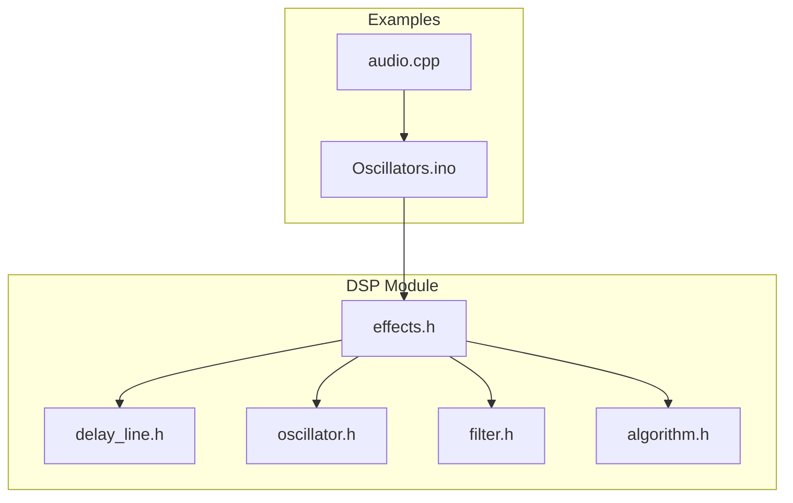
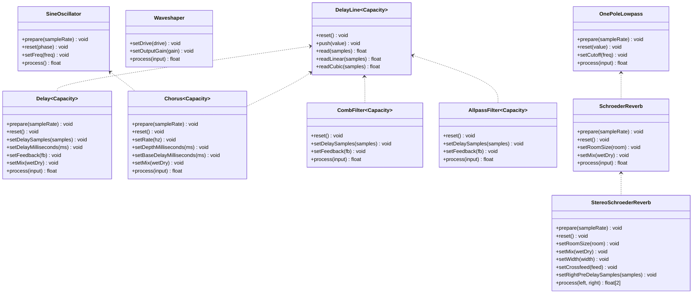
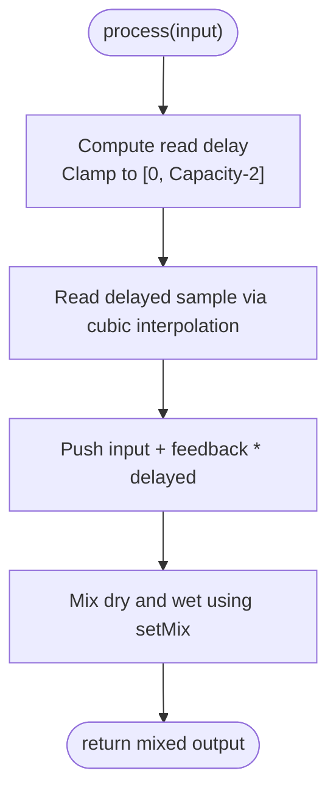
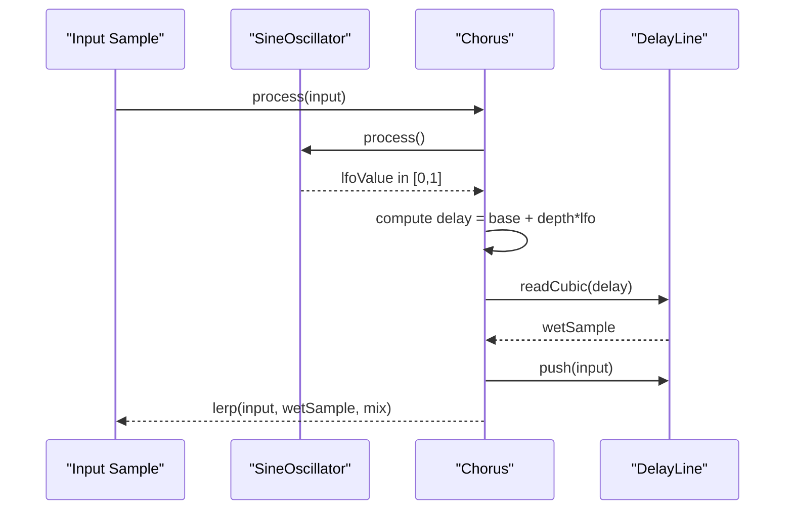
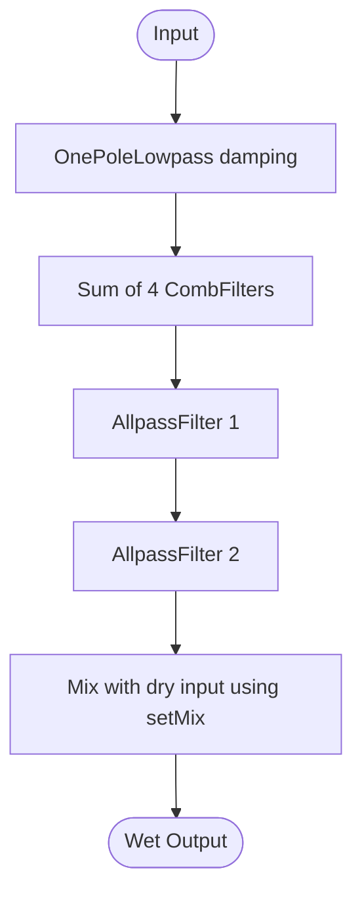
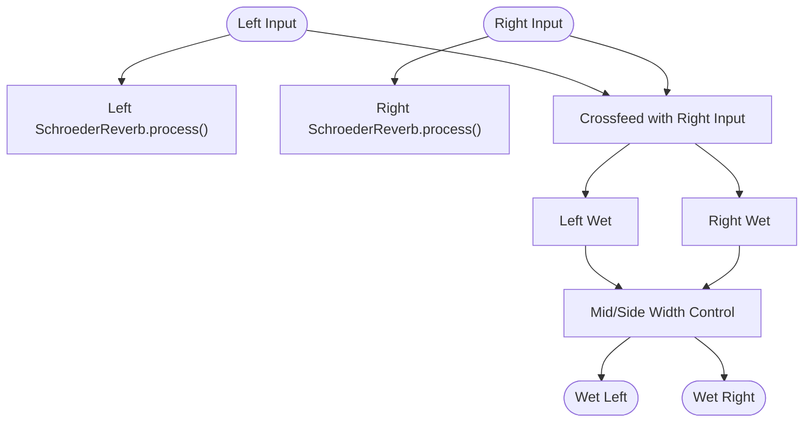
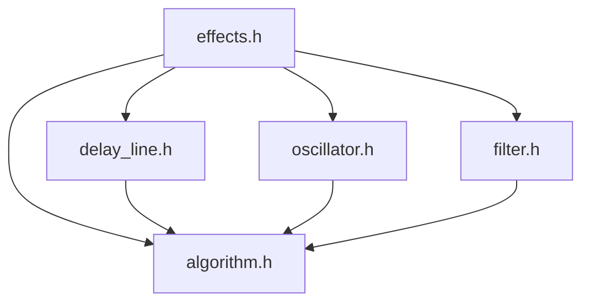

# Effects API

<cite>
**Referenced Files in This Document**
- [effects.h](file://dsp/effects.h)
- [delay_line.h](file://dsp/delay_line.h)
- [oscillator.h](file://dsp/oscillator.h)
- [filter.h](file://dsp/filter.h)
- [algorithm.h](file://dsp/algorithm.h)
- [audio.cpp](file://Examples/Oscillators/src/audio/audio.cpp)
- [Oscillators.ino](file://Examples/Oscillators/Oscillators.ino)
- [README.md](file://README.md)
</cite>

## Table of Contents
1. [Introduction](#introduction)
2. [Project Structure](#project-structure)
3. [Core Components](#core-components)
4. [Architecture Overview](#architecture-overview)
5. [Detailed Component Analysis](#detailed-component-analysis)
6. [Dependency Analysis](#dependency-analysis)
7. [Performance Considerations](#performance-considerations)
8. [Troubleshooting Guide](#troubleshooting-guide)
9. [Conclusion](#conclusion)
10. [Appendices](#appendices)

## Introduction
This document provides comprehensive API documentation for the Pico-DSP-Garden audio effects processors. It focuses on delay effects (fixed-delay lines, variable-rate delays, ping-pong delay configurations), modulation effects (chorus, flanger, vibrato with LFO-based modulation), reverb processors (comb filters, allpass networks, Schroeder reverb topologies), waveshaping and distortion effects, and effect parameter control including wet/dry mix blending, feedback routing, and real-time modulation capabilities. The goal is to enable developers to integrate and configure these effects in real-time audio applications on embedded platforms.

## Project Structure
The effects API is implemented as header-only libraries within the DSP module. Key files include:
- Effects definitions and templates for delay, chorus, comb/allpass filters, and Schroeder reverb
- Delay line implementation with cubic interpolation for fractional delay
- Oscillator primitives used by modulation effects
- Filter primitives used by reverb damping and post-processing
- Utility algorithms for clamping, mixing, and conversions

**Diagram sources**
- [effects.h:1-250](file://dsp/effects.h#L1-L250)
- [delay_line.h:1-91](file://dsp/delay_line.h#L1-L91)
- [oscillator.h:1-408](file://dsp/oscillator.h#L1-L408)
- [filter.h:1-196](file://dsp/filter.h#L1-L196)
- [algorithm.h:1-85](file://dsp/algorithm.h#L1-L85)
- [audio.cpp:1-257](file://Examples/Oscillators/src/audio/audio.cpp#L1-L257)
- [Oscillators.ino:1-168](file://Examples/Oscillators/Oscillators.ino#L1-L168)

**Section sources**
- [README.md:30-37](file://README.md#L30-L37)

## Core Components
This section outlines the primary effect classes and their roles in the audio chain.

- Waveshaper: Applies nonlinear shaping with drive control and output gain normalization.
- Delay: Fixed-delay line with feedback and wet/dry mix.
- Chorus: Rate-controlled LFO sweeping fractional delay for pitch modulation.
- CombFilter: Feedback delay with configurable delay length and feedback amount.
- AllpassFilter: Phase diffusing delay with configurable delay length and feedback amount.
- SchroederReverb: Parallel comb filters feeding serial allpass stages with damping.
- StereoSchroederReverb: Stereo variant with decorrelation via crossfeed and pre-delay.

Key supporting components:
- DelayLine: Circular buffer with integer and cubic interpolation for fractional delay.
- SineOscillator: LFO for modulation.
- OnePoleLowpass: Low-pass damping filter for reverb.

**Section sources**
- [effects.h:15-249](file://dsp/effects.h#L15-L249)
- [delay_line.h:9-91](file://dsp/delay_line.h#L9-L91)
- [oscillator.h:71-81](file://dsp/oscillator.h#L71-L81)
- [filter.h:10-38](file://dsp/filter.h#L10-L38)

## Architecture Overview
The effects are designed as stateful, per-frame processors that operate on single or stereo samples. They rely on:
- DelayLine for all delay-based effects
- SineOscillator for LFO modulation in chorus
- OnePoleLowpass for damping in reverb
- Utility algorithms for clamping, mixing, and conversions

**Diagram sources**
- [effects.h:15-249](file://dsp/effects.h#L15-L249)
- [delay_line.h:9-91](file://dsp/delay_line.h#L9-L91)
- [oscillator.h:71-81](file://dsp/oscillator.h#L71-L81)
- [filter.h:10-38](file://dsp/filter.h#L10-L38)

## Detailed Component Analysis

### Waveshaper
- Purpose: Apply nonlinear distortion with drive control and output gain normalization.
- Key methods:
  - setDrive(drive): Sets drive factor with a minimum threshold.
  - setOutputGain(gain): Sets output gain.
  - process(input): Returns shaped output using a hyperbolic tangent transfer function with normalization by tanh(drive).
- Parameter ranges:
  - Drive: ≥ 0.1 (clamped internally).
  - Output gain: Any real value.
- Notes:
  - Normalization ensures consistent perceived loudness across drive settings.

**Section sources**
- [effects.h:15-29](file://dsp/effects.h#L15-L29)

### Delay (Fixed Delay Line)
- Purpose: Implements a fixed-delay line with optional feedback and wet/dry mix.
- Key methods:
  - prepare(sampleRate): Initializes internal state and validates sample rate.
  - reset(): Clears delay buffer and resets indices.
  - setDelaySamples(samples): Clamps delay in samples to [0, Capacity-2].
  - setDelayMilliseconds(ms): Converts milliseconds to samples using current sample rate.
  - setFeedback(fb): Clamps feedback in [-0.99, 0.99].
  - setMix(wetDry): Clamps mix in [0, 1].
  - process(input): Reads delayed sample with cubic interpolation, applies feedback, mixes with dry input.
- Processing logic:
  - Compensates for the one-sample latency by subtracting 1 from delay when reading.
  - Uses DelayLine::readCubic for smooth fractional delay.
- Complexity:
  - Per-sample O(1) with minimal memory overhead proportional to Capacity.

**Diagram sources**
- [effects.h:32-59](file://dsp/effects.h#L32-L59)
- [delay_line.h:46-64](file://dsp/delay_line.h#L46-L64)

**Section sources**
- [effects.h:32-59](file://dsp/effects.h#L32-L59)
- [delay_line.h:9-91](file://dsp/delay_line.h#L9-L91)

### Chorus (LFO-Based Variable Delay)
- Purpose: Creates chorusing by sweeping fractional delay with an LFO.
- Key methods:
  - prepare(sampleRate): Prepares internal LFO and sample rate.
  - reset(): Resets delay buffer.
  - setRate(hz): Sets LFO rate; updates LFO frequency.
  - setDepthMilliseconds(ms): Converts depth to samples using current sample rate.
  - setBaseDelayMilliseconds(ms): Sets base delay in samples.
  - setMix(wetDry): Clamps mix in [0, 1].
  - process(input): Computes LFO value, sweeps delay, reads wet sample, pushes input.
- Modulation scheme:
  - LFO generates a triangle-like waveform mapped to [0, 1].
  - Delay varies between base and base+depth.
- Complexity:
  - Per-sample O(1) with cubic interpolation cost.

**Diagram sources**
- [effects.h:62-98](file://dsp/effects.h#L62-L98)
- [delay_line.h:46-64](file://dsp/delay_line.h#L46-L64)
- [oscillator.h:71-81](file://dsp/oscillator.h#L71-L81)

**Section sources**
- [effects.h:62-98](file://dsp/effects.h#L62-L98)
- [delay_line.h:9-91](file://dsp/delay_line.h#L9-L91)
- [oscillator.h:71-81](file://dsp/oscillator.h#L71-L81)

### Comb Filter
- Purpose: Basic feedback delay used as a building block for reverb.
- Key methods:
  - reset(): Clears delay buffer.
  - setDelaySamples(samples): Clamps delay to [0, Capacity-1].
  - setFeedback(fb): Clamps feedback in [-0.99, 0.99].
  - process(input): Reads delayed sample, pushes input + feedback*delayed, returns delayed.
- Typical use:
  - Multiple parallel comb filters with different delays and feedbacks.

**Section sources**
- [effects.h:101-118](file://dsp/effects.h#L101-L118)
- [delay_line.h:25-33](file://dsp/delay_line.h#L25-L33)

### Allpass Filter
- Purpose: Diffusion stage that changes phase relationships without altering magnitude response.
- Key methods:
  - reset(): Clears delay buffer.
  - setDelaySamples(samples): Clamps delay to [0, Capacity-1].
  - setFeedback(fb): Clamps feedback in [-0.99, 0.99].
  - process(input): Computes buffer input = input + delayed*fb, pushes buffer input, returns delayed - fb*bufferInput.
- Typical use:
  - Stages in series to diffuse early reflections.

**Section sources**
- [effects.h:121-139](file://dsp/effects.h#L121-L139)
- [delay_line.h:25-33](file://dsp/delay_line.h#L25-L33)

### Schroeder Reverb
- Purpose: Implements a classic parallel comb-filter + serial allpass diffusion topology with damping.
- Key methods:
  - prepare(sampleRate): Prepares damping filter and sample rate.
  - reset(): Resets all comb and allpass filters and damping.
  - setRoomSize(room): Maps room size to feedback gains across four comb filters.
  - setMix(wetDry): Clamps mix in [0, 1].
  - process(input): Applies damping, sums parallel combs, applies serial allpasses, mixes with dry input.
- Configuration:
  - Four comb filters with increasing delays and slightly offset feedbacks.
  - Two allpass filters in series with different capacities.

**Diagram sources**
- [effects.h:141-190](file://dsp/effects.h#L141-L190)
- [filter.h:10-38](file://dsp/filter.h#L10-L38)

**Section sources**
- [effects.h:141-190](file://dsp/effects.h#L141-L190)
- [filter.h:10-38](file://dsp/filter.h#L10-L38)

### Stereo Schroeder Reverb
- Purpose: Stereo extension with decorrelation via crossfeed and a small right pre-delay, plus mid/side width control.
- Key methods:
  - prepare(sampleRate): Prepares left/right reverbs and sets initial mixes to 1.0.
  - reset(): Resets left/right reverbs and right pre-delay.
  - setRoomSize(room): Propagates room size to both sides.
  - setMix(wetDry): Clamps mix in [0, 1].
  - setWidth(width): Clamps width in [0, 2]; controls side spread while preserving mid.
  - setCrossfeed(feed): Clamps crossfeed in [0, 0.7].
  - setRightPreDelaySamples(samples): Clamps to pre-delay capacity.
  - process(left, right): Returns {left, right} wet outputs after mixing and applying width.
- Decorrelation:
  - Crossfeed between left/right inputs.
  - Right pre-delay introduces stereo separation.

**Diagram sources**
- [effects.h:192-247](file://dsp/effects.h#L192-L247)

**Section sources**
- [effects.h:192-247](file://dsp/effects.h#L192-L247)

### DelayLine (Fractional Delay Implementation)
- Purpose: Circular buffer with interpolation for fractional delay.
- Methods:
  - reset(): Zeros buffer and resets write index.
  - push(value): Writes value and advances circular index.
  - read(samples): Integer delay read with wrap-around.
  - readLinear(samples): Linear interpolation between adjacent samples.
  - readCubic(samples): Cubic Lagrange interpolation using four samples.
- Constraints:
  - Capacity must be > 1; delay samples clamped to [0, Capacity-1].

**Section sources**
- [delay_line.h:9-91](file://dsp/delay_line.h#L9-L91)

### Oscillator Primitives (for Modulation)
- SineOscillator: Provides LFO waveform for chorus modulation.
- Methods:
  - prepare(sampleRate), reset(phase), setFreq(freq), process().

**Section sources**
- [oscillator.h:71-81](file://dsp/oscillator.h#L71-L81)

### Filter Primitives (for Damping)
- OnePoleLowpass: Simple low-pass filter with cutoff setting and stable coefficients.
- Methods:
  - prepare(sampleRate), reset(value), setCutoff(freq), process(input).

**Section sources**
- [filter.h:10-38](file://dsp/filter.h#L10-L38)

## Dependency Analysis
Effects depend on shared DSP utilities and oscillators/filters:

**Diagram sources**
- [effects.h:3-7](file://dsp/effects.h#L3-L7)
- [delay_line.h:3](file://dsp/delay_line.h#L3)
- [oscillator.h:3](file://dsp/oscillator.h#L3)
- [filter.h:3](file://dsp/filter.h#L3)
- [algorithm.h:3](file://dsp/algorithm.h#L3)

**Section sources**
- [effects.h:3-7](file://dsp/effects.h#L3-L7)
- [delay_line.h:3](file://dsp/delay_line.h#L3)
- [oscillator.h:3](file://dsp/oscillator.h#L3)
- [filter.h:3](file://dsp/filter.h#L3)
- [algorithm.h:3](file://dsp/algorithm.h#L3)

## Performance Considerations
- Memory footprint:
  - DelayLine capacity determines static memory usage; larger capacities increase RAM usage proportionally.
- Computational cost:
  - DelayLine::readCubic is O(1) with four reads; chorus and delay effects are lightweight.
  - Comb and allpass filters are O(1) per stage; total cost scales with the number of stages.
- Stability:
  - Feedback gains are clamped to [-0.99, 0.99] to prevent instability.
  - Sample rate safety checks ensure stable coefficient computation.
- Real-time constraints:
  - All effects operate per-sample with minimal branching and predictable latency.

[No sources needed since this section provides general guidance]

## Troubleshooting Guide
- Noisy output from Delay or Chorus:
  - Verify feedback is within [-0.99, 0.99] and delay is within [0, Capacity-2].
  - Ensure sample rate is set correctly before processing.
- Muffled or overly bright reverb:
  - Adjust damping cutoff and room size; lower room size reduces feedback and tail length.
- Unnatural stereo width:
  - Reduce width and crossfeed; excessive crossfeed can cause phase cancellation.
- Clicks or pops:
  - Ensure DelayLine is reset at startup and that delay values are clamped appropriately.

**Section sources**
- [effects.h:40-43](file://dsp/effects.h#L40-L43)
- [effects.h:72-75](file://dsp/effects.h#L72-L75)
- [effects.h:104-105](file://dsp/effects.h#L104-L105)
- [effects.h:124-125](file://dsp/effects.h#L124-L125)
- [filter.h:19-25](file://dsp/filter.h#L19-L25)

## Conclusion
Pico-DSP-Garden’s effects API offers a compact, efficient suite of delay, modulation, and reverb processors suitable for real-time embedded audio. The header-only design simplifies integration, while careful parameter clamping and interpolation ensure stability and quality. Developers can combine these building blocks to craft expressive audio effects chains tailored to RP2350-based hardware.

[No sources needed since this section summarizes without analyzing specific files]

## Appendices

### Practical Audio Processing Examples
- Example projects demonstrate real-time audio callbacks and buffer management on RP2350 cores. While they primarily showcase oscillators, the same pattern applies to integrating effects:
  - Prepare effects in setup with sample rate.
  - In the audio callback, process input through effects and write interleaved stereo frames.
  - Manage buffers using the provided audio pool utilities.

**Section sources**
- [Oscillators.ino:122-160](file://Examples/Oscillators/Oscillators.ino#L122-L160)
- [audio.cpp:78-228](file://Examples/Oscillators/src/audio/audio.cpp#L78-L228)