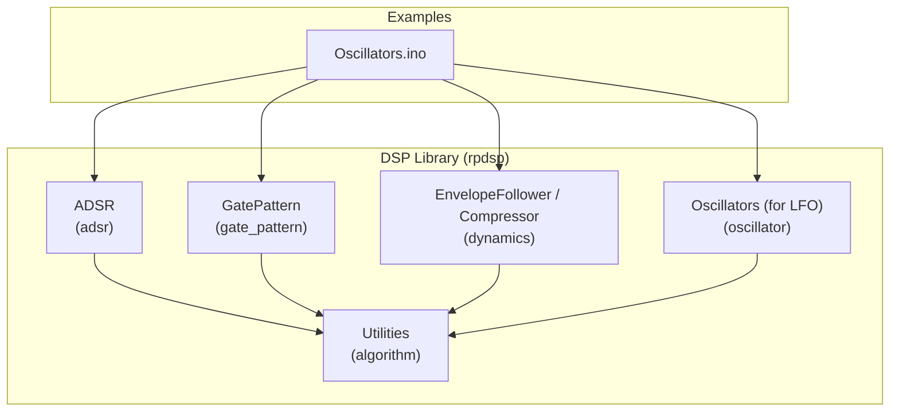
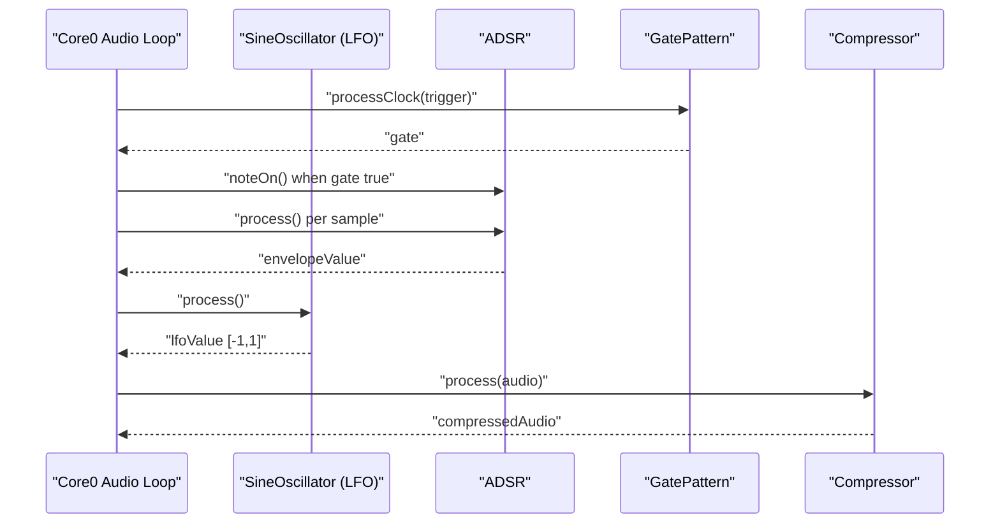
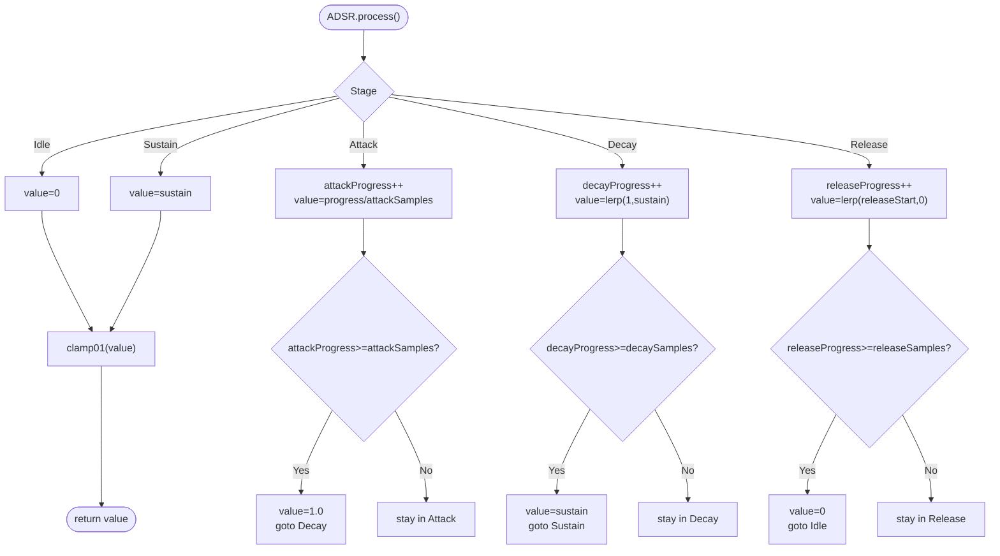
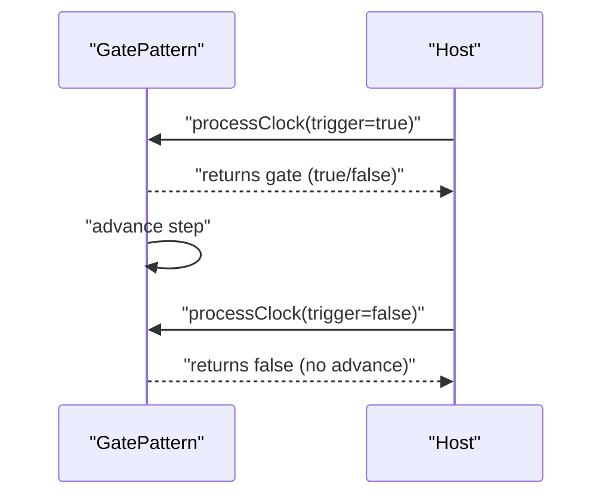
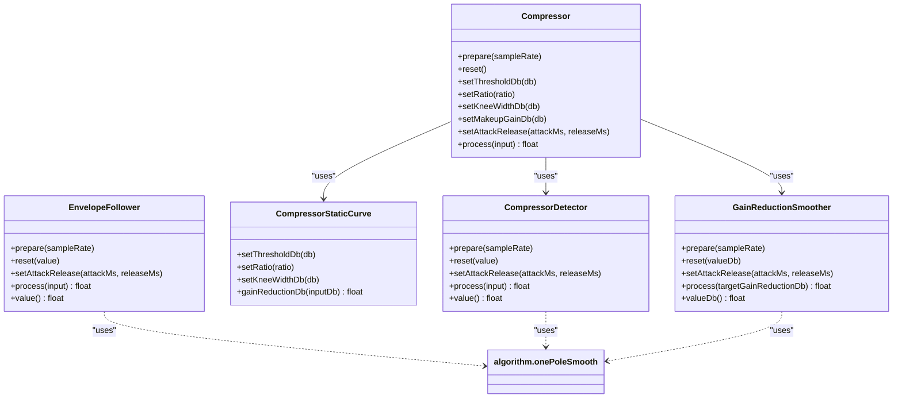
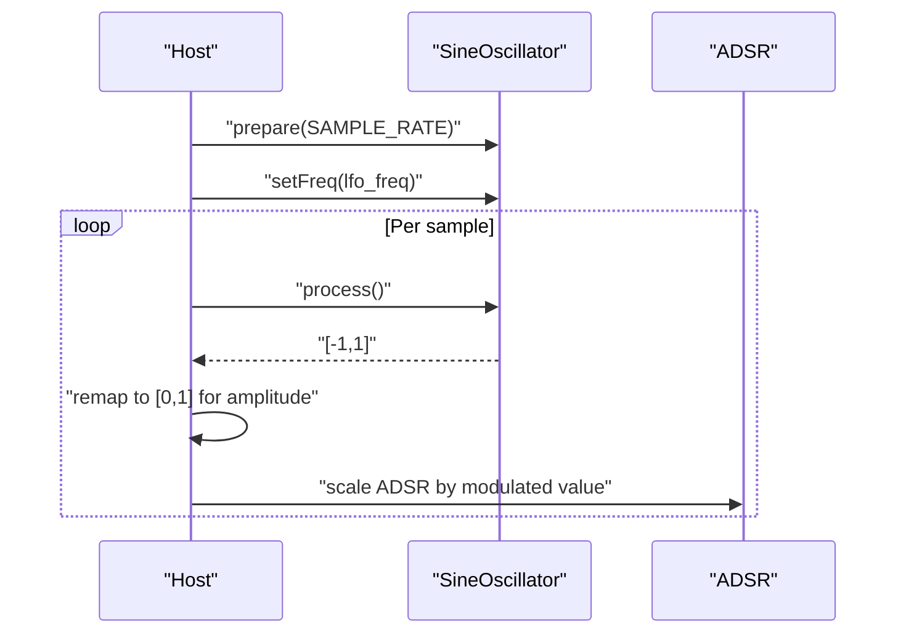
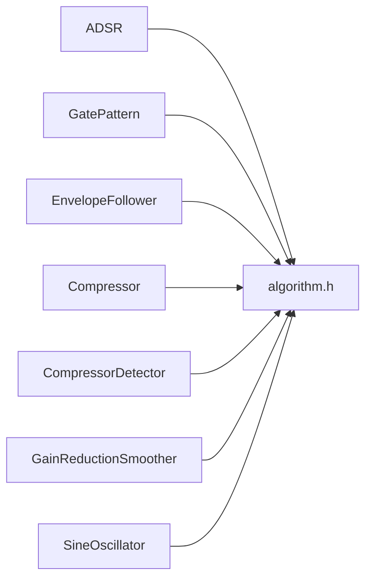

# Envelope API

<cite>
**Referenced Files in This Document**
- [envelope.h](file://dsp/envelope.h)
- [envelope.h](file://Examples/Oscillators/src/dsp/envelope.h)
- [envelope.h](file://Examples/SimpleOscillators/src/dsp/envelope.h)
- [envelope.h](file://Examples/TwoChannelOscillator/src/dsp/envelope.h)
- [gate_pattern.h](file://dsp/gate_pattern.h)
- [gate_pattern.h](file://Examples/Oscillators/src/dsp/gate_pattern.h)
- [dynamics.h](file://dsp/dynamics.h)
- [dynamics.h](file://Examples/Oscillators/src/dsp/dynamics.h)
- [algorithm.h](file://dsp/algorithm.h)
- [algorithm.h](file://Examples/Oscillators/src/dsp/algorithm.h)
- [oscillator.h](file://dsp/oscillator.h)
- [Oscillators.ino](file://Examples/Oscillators/Oscillators.ino)
- [README.md](file://README.md)
</cite>

## Table of Contents
1. [Introduction](#introduction)
2. [Project Structure](#project-structure)
3. [Core Components](#core-components)
4. [Architecture Overview](#architecture-overview)
5. [Detailed Component Analysis](#detailed-component-analysis)
6. [Dependency Analysis](#dependency-analysis)
7. [Performance Considerations](#performance-considerations)
8. [Troubleshooting Guide](#troubleshooting-guide)
9. [Conclusion](#conclusion)
10. [Appendices](#appendices)

## Introduction
This document specifies the envelope and dynamic processing APIs exposed by the Pico-DSP-Garden rpdsp library. It focuses on:
- ADSR envelope generator with configurable time and level parameters
- Gate pattern generator for sequencer-style envelope triggering
- Envelope follower for audio-reactive processing and dynamic range control
- Practical modulation examples using oscillators and LFOs

The goal is to provide interface specifications, parameter ranges, timing calculations, and usage patterns suitable for embedded audio applications on RP2350.

## Project Structure
The envelope-related APIs are header-only and organized under the rpdsp namespace. They are used directly in example projects to demonstrate real-time audio processing and modulation.

**Diagram sources**
- [envelope.h:7-128](file://dsp/envelope.h#L7-L128)
- [gate_pattern.h:10-70](file://dsp/gate_pattern.h#L10-L70)
- [dynamics.h:9-196](file://dsp/dynamics.h#L9-L196)
- [algorithm.h:9-84](file://dsp/algorithm.h#L9-L84)
- [oscillator.h:39-81](file://dsp/oscillator.h#L39-L81)
- [Oscillators.ino:37-82](file://Examples/Oscillators/Oscillators.ino#L37-L82)

**Section sources**
- [README.md:30-37](file://README.md#L30-L37)
- [envelope.h:1-131](file://dsp/envelope.h#L1-L131)
- [gate_pattern.h:1-73](file://dsp/gate_pattern.h#L1-L73)
- [dynamics.h:1-199](file://dsp/dynamics.h#L1-L199)
- [algorithm.h:1-85](file://dsp/algorithm.h#L1-L85)
- [oscillator.h:1-408](file://dsp/oscillator.h#L1-L408)
- [Oscillators.ino:1-168](file://Examples/Oscillators/Oscillators.ino#L1-L168)

## Core Components
- ADSR: Attack, Decay, Sustain, Release envelope generator with integer-sample timing determinism.
- GatePattern: Fixed-size step mask sequencer for trigger/gate patterns.
- EnvelopeFollower: One-pole smoothing envelope follower for RMS-like detection.
- Compressor: Static curve compressor with detector and smoother stages.
- Utilities: Clamping, interpolation, dB conversions, safe sample rate, one-pole smoothing.

**Section sources**
- [envelope.h:7-128](file://dsp/envelope.h#L7-L128)
- [gate_pattern.h:10-70](file://dsp/gate_pattern.h#L10-L70)
- [dynamics.h:9-196](file://dsp/dynamics.h#L9-L196)
- [algorithm.h:14-67](file://dsp/algorithm.h#L14-L67)

## Architecture Overview
The envelope system integrates with oscillators and gate sequencers to drive modulation and dynamic processing. The ADSR drives amplitude or other parameters; GatePattern sequences triggers; EnvelopeFollower detects audio level for compression or gating.

**Diagram sources**
- [Oscillators.ino:60-95](file://Examples/Oscillators/Oscillators.ino#L60-L95)
- [oscillator.h:71-81](file://dsp/oscillator.h#L71-L81)
- [envelope.h:39-95](file://dsp/envelope.h#L39-L95)
- [gate_pattern.h:42-53](file://dsp/gate_pattern.h#L42-L53)
- [dynamics.h:160-188](file://dsp/dynamics.h#L160-L188)

## Detailed Component Analysis

### ADSR Envelope Generator
The ADSR class provides a five-stage envelope with integer-sample counters for deterministic timing across platforms.

Key behaviors:
- Stages: Idle → Attack → Decay → Sustain → Release
- Attack and Decay are linear; Release is linear from current value to zero
- noteOn transitions to Attack; noteOff captures current value to ensure click-free Release
- Timing is computed from seconds-to-samples conversion using the configured sample rate

Interface summary:
- prepare(sampleRate): Set sample rate; fallback to default if invalid
- reset(): Reset to Idle with zero output
- setAttack(seconds), setDecay(seconds), setRelease(seconds): Configure stage durations
- setSustain(level): Set sustain level in [0, 1]
- set(attack, decay, sustain, release): Bulk setter
- noteOn(), noteOff(): Trigger envelope transitions
- process(): Advance stage and return clamped envelope value
- isActive(), stage(), value(): Query state and current value

Timing calculation:
- Samples = max(1, round(seconds × sampleRate))

Parameter ranges and defaults:
- Sample rate: > 1.0f; default 44100.0f
- Attack/Decay/Release seconds: Converted to integer samples; minimum 1 sample
- Sustain level: Clamped to [0, 1]; default 0.7f
- Initial values: Defaults chosen for audible, balanced response

Usage patterns:
- Trigger ADSR via noteOn/noteOff or external gate signals
- Scale output to control amplitude, filter cutoff, or LFO depth
- Chain multiple ADSRs for complex modulations

**Diagram sources**
- [envelope.h:55-95](file://dsp/envelope.h#L55-L95)

**Section sources**
- [envelope.h:7-128](file://dsp/envelope.h#L7-L128)
- [algorithm.h:19-26](file://dsp/algorithm.h#L19-L26)

### Gate Pattern Generator
The GatePattern template provides a fixed-size step sequencer for trigger/gate generation.

Key behaviors:
- reset(length): Clear steps and rewind; length clamped to [1, MaxSteps]
- setLength(length), length(), step(): Manage active length and current step
- setStep(step, enabled), getStep(step): Configure and query individual steps
- loadMask(mask, length): Load a bit mask into steps
- processClock(trigger): On rising trigger edge, return current step’s gate and advance

Parameters:
- MaxSteps: Template parameter; default 32
- Length: Clamped to [1, MaxSteps]
- Step index: [0, MaxSteps)

Typical use:
- Drive ADSR noteOn/noteOff from gate pulses
- Sequence rhythmic or melodic patterns for envelope triggering

**Diagram sources**
- [gate_pattern.h:42-53](file://dsp/gate_pattern.h#L42-L53)

**Section sources**
- [gate_pattern.h:10-70](file://dsp/gate_pattern.h#L10-L70)

### Envelope Follower and Dynamic Processing
EnvelopeFollower provides a one-pole smoothing envelope for audio-reactive control. Compressor composes a detector, a static curve, and a smoother to apply gain reduction.

Key behaviors:
- EnvelopeFollower
  - prepare(sampleRate), reset(value)
  - setAttackRelease(attackMs, releaseMs): Compute one-pole coefficients
  - process(input): Detect absolute value and smooth with separate attack/release
  - value(): Current envelope level
- CompressorStaticCurve
  - setThresholdDb(db), setRatio(ratio), setKneeWidthDb(db)
  - gainReductionDb(inputDb): Compute dB reduction with hard or quadratic knee
- CompressorDetector
  - detect envelope level with one-pole smoothing
- GainReductionSmoother
  - smooth target gain reduction with one-pole smoothing
- Compressor
  - prepare(sampleRate), reset()
  - setThresholdDb(db), setRatio(ratio), setKneeWidthDb(db), setMakeupGainDb(db)
  - setAttackRelease(attackMs, releaseMs)
  - process(input): Apply compression with smoothed gain reduction

Parameter ranges:
- attackMs/releasems: Minimum 0.001f
- thresholdDb: Unbounded; typical around -40..0 dB
- ratio: ≥ 1.0f
- kneeWidthDb: ≥ 0.0f
- makeupGainDb: Unbounded; applied after smoothing

**Diagram sources**
- [dynamics.h:9-196](file://dsp/dynamics.h#L9-L196)
- [algorithm.h:64-67](file://dsp/algorithm.h#L64-L67)

**Section sources**
- [dynamics.h:9-196](file://dsp/dynamics.h#L9-L196)
- [algorithm.h:64-67](file://dsp/algorithm.h#L64-L67)

### LFO Generators for Modulation
While dedicated LFO classes are not present in rpdsp, oscillators can serve as LFOs by operating at low frequencies and remapping outputs for modulation.

Example usage:
- SineOscillator configured as LFO produces a sinusoidal modulation signal in [-1, 1]
- Remap to [0, 1] for amplitude modulation or scale to control filter cutoff
- Multiple LFOs can be distributed across oscillators for chorusing or widening

Practical example references:
- LFO initialization and distribution across oscillators
- Using LFO output to modulate carrier amplitudes

**Diagram sources**
- [oscillator.h:71-81](file://dsp/oscillator.h#L71-L81)
- [Oscillators.ino:42-82](file://Examples/Oscillators/Oscillators.ino#L42-L82)

**Section sources**
- [oscillator.h:71-81](file://dsp/oscillator.h#L71-L81)
- [Oscillators.ino:42-82](file://Examples/Oscillators/Oscillators.ino#L42-L82)

## Dependency Analysis
The envelope and dynamics components rely on shared utilities for numerical operations and safe parameter handling.

**Diagram sources**
- [envelope.h:3-4](file://dsp/envelope.h#L3-L4)
- [gate_pattern.h](file://dsp/gate_pattern.h#L3)
- [dynamics.h](file://dsp/dynamics.h#L3)
- [algorithm.h](file://dsp/algorithm.h#L3)
- [oscillator.h:3-4](file://dsp/oscillator.h#L3-L4)

**Section sources**
- [envelope.h:3-4](file://dsp/envelope.h#L3-L4)
- [gate_pattern.h](file://dsp/gate_pattern.h#L3)
- [dynamics.h](file://dsp/dynamics.h#L3)
- [algorithm.h:3-84](file://dsp/algorithm.h#L3-L84)
- [oscillator.h:3-4](file://dsp/oscillator.h#L3-L4)

## Performance Considerations
- Deterministic timing: ADSR uses integer sample counters to ensure consistent envelope shapes across host and firmware builds.
- One-pole smoothing: Efficient exponential smoothing for envelope detection and compression; tune attack/release to balance responsiveness and musical decay.
- Safe sample rate: Utility functions clamp invalid sample rates to a default to prevent unstable coefficients.
- Clamping and normalization: Helpers ensure control values remain in valid ranges, preventing unexpected behavior.

[No sources needed since this section provides general guidance]

## Troubleshooting Guide
Common issues and remedies:
- Clicks on release: Ensure noteOff is called while in a non-Idle stage; the implementation captures the current value to avoid clicks.
- Zero-length stages: secondsToSamples ensures at least one sample is counted, avoiding division-by-zero scenarios.
- Invalid sample rate: prepare validates and falls back to default sample rate.
- Parameter bounds: Use setters that clamp inputs (e.g., clamp01 for levels, minimum 0.001f for smoothing times).
- Gate sequencing: Verify processClock is called with rising edges; the sequencer returns the current step’s gate before advancing.

**Section sources**
- [envelope.h:46-53](file://dsp/envelope.h#L46-L53)
- [envelope.h:112-115](file://dsp/envelope.h#L112-L115)
- [algorithm.h:51-53](file://dsp/algorithm.h#L51-L53)
- [dynamics.h:18-23](file://dsp/dynamics.h#L18-L23)
- [gate_pattern.h:42-53](file://dsp/gate_pattern.h#L42-L53)

## Conclusion
The rpdsp envelope and dynamic processing APIs provide deterministic, efficient building blocks for real-time modulation and dynamic control. ADSR offers precise timing with configurable levels; GatePattern enables sequencer-style triggering; EnvelopeFollower and Compressor enable audio-reactive processing. Combined with oscillators configured as LFOs, these components form a flexible toolkit for embedded synthesis and audio processing.

[No sources needed since this section summarizes without analyzing specific files]

## Appendices

### API Reference Tables

- ADSR
  - Methods: prepare, reset, setAttack, setDecay, setSustain, setRelease, set, noteOn, noteOff, process, isActive, stage, value
  - Parameters: seconds (attack/decay/release), level (sustain), sampleRate
  - Notes: Integer-sample timing; release is click-free by capturing current value

- GatePattern
  - Methods: reset, setLength, length, step, setStep, getStep, loadMask, processClock, resetStep
  - Parameters: length (1..MaxSteps), step index, mask bits
  - Notes: Returns current step’s gate on rising trigger edge

- EnvelopeFollower
  - Methods: prepare, reset, setAttackRelease, process, value
  - Parameters: attackMs, releaseMs
  - Notes: Separate coefficients for attack and release; value is smoothed absolute input

- CompressorStaticCurve
  - Methods: setThresholdDb, setRatio, setKneeWidthDb, thresholdDb, ratio, kneeWidthDb, gainReductionDb
  - Parameters: db thresholds, ratio ≥ 1, knee width ≥ 0

- CompressorDetector
  - Methods: prepare, reset, setAttackRelease, process, value
  - Parameters: attackMs, releaseMs

- GainReductionSmoother
  - Methods: prepare, reset, setAttackRelease, process, valueDb
  - Parameters: attackMs, releaseMs

- Compressor
  - Methods: prepare, reset, setThresholdDb, setRatio, setKneeWidthDb, setMakeupGainDb, setAttackRelease, process
  - Parameters: db thresholds, ratio ≥ 1, knee width ≥ 0, makeup gain

- Utilities
  - clamp, clamp01, lerp, wrap01, dbToGain, gainToDb, midiNoteToHz, safeSampleRate, clampCutoff, onePoleSmooth, softClip, equalPowerPanLeft, equalPowerPanRight

**Section sources**
- [envelope.h:12-99](file://dsp/envelope.h#L12-L99)
- [gate_pattern.h:14-58](file://dsp/gate_pattern.h#L14-L58)
- [dynamics.h:11-33](file://dsp/dynamics.h#L11-L33)
- [dynamics.h:44-89](file://dsp/dynamics.h#L44-L89)
- [dynamics.h:91-123](file://dsp/dynamics.h#L91-L123)
- [dynamics.h:125-158](file://dsp/dynamics.h#L125-L158)
- [dynamics.h:160-196](file://dsp/dynamics.h#L160-L196)
- [algorithm.h:14-82](file://dsp/algorithm.h#L14-L82)