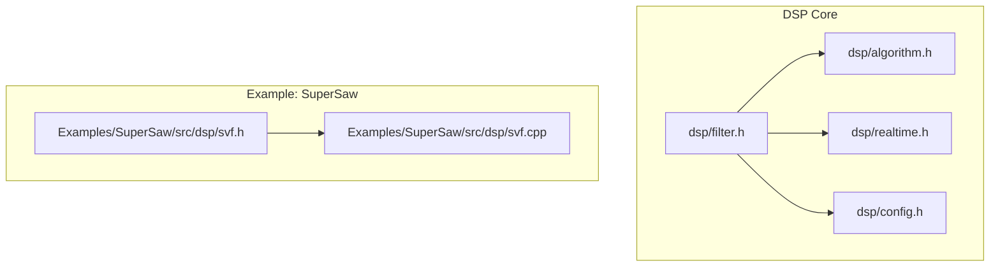
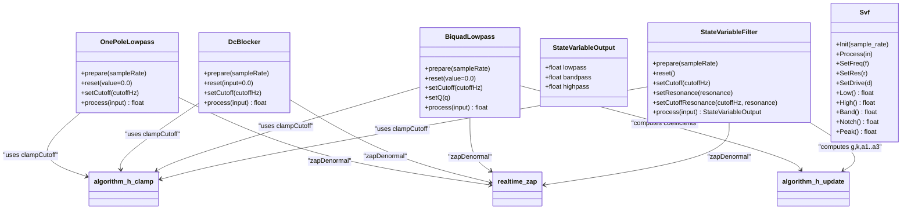
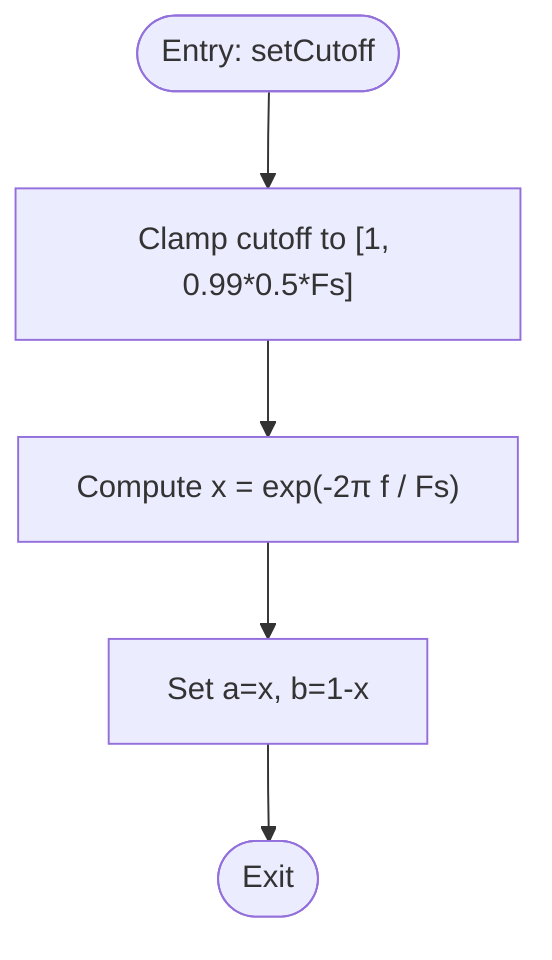
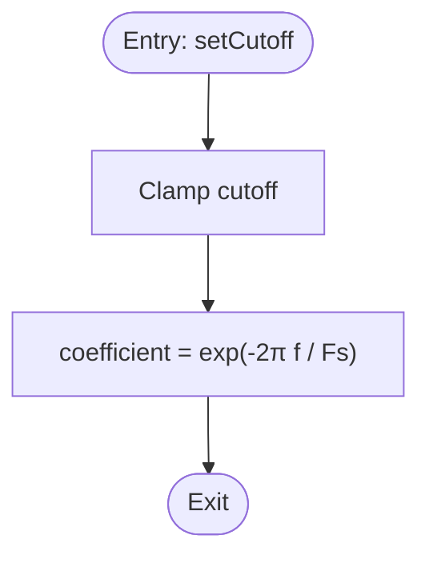
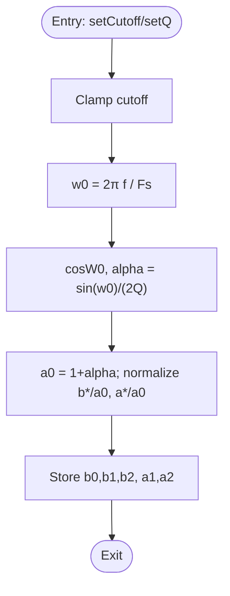
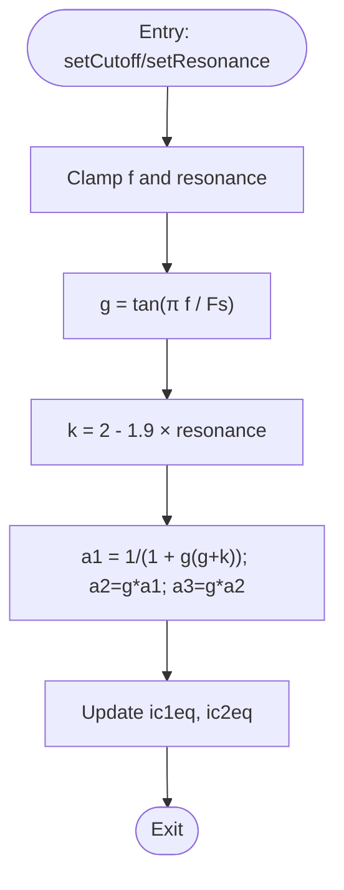
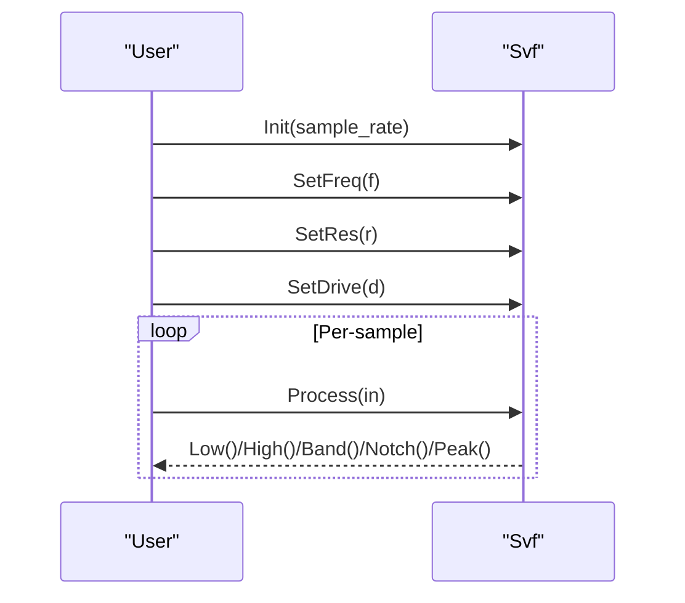
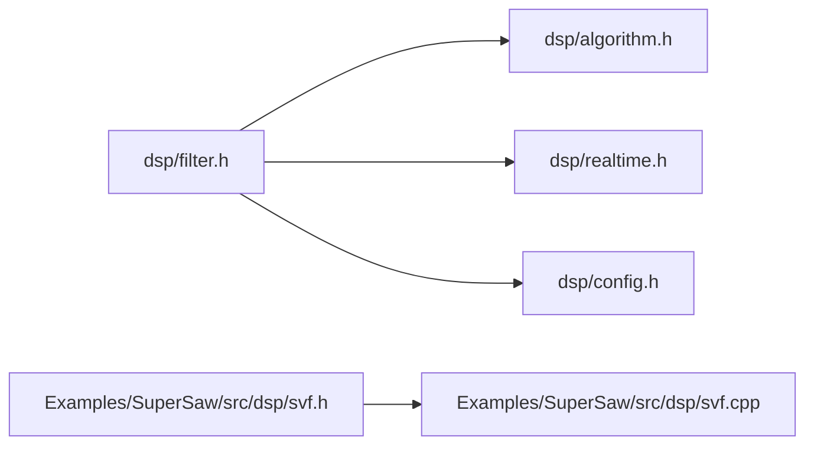

# Filter API

<cite>
**Referenced Files in This Document**
- [filter.h](file://dsp/filter.h)
- [algorithm.h](file://dsp/algorithm.h)
- [realtime.h](file://dsp/realtime.h)
- [config.h](file://dsp/config.h)
- [svf.h](file://Examples/SuperSaw/src/dsp/svf.h)
- [svf.cpp](file://Examples/SuperSaw/src/dsp/svf.cpp)
</cite>

## Table of Contents
1. [Introduction](#introduction)
2. [Project Structure](#project-structure)
3. [Core Components](#core-components)
4. [Architecture Overview](#architecture-overview)
5. [Detailed Component Analysis](#detailed-component-analysis)
6. [Dependency Analysis](#dependency-analysis)
7. [Performance Considerations](#performance-considerations)
8. [Troubleshooting Guide](#troubleshooting-guide)
9. [Conclusion](#conclusion)
10. [Appendices](#appendices)

## Introduction
This document provides comprehensive API documentation for the filter algorithms in Pico-DSP-Garden. It covers:
- One-pole low-pass and DC blocker filters
- Biquad low-pass filter and its coefficient computation
- State-variable filter (SVF) with simultaneous outputs and resonance control
- Supporting utilities for parameter clamping, safe sample-rate handling, and denormal suppression
- A separate SVF variant with multiple outputs (low, high, band, notch, peak) and drive control

The goal is to enable developers to configure, compute coefficients, and apply filters in real-time audio contexts with precise control over parameters and performance.

## Project Structure
The filter implementations are primarily located under the main DSP module and a Super Saw example that includes an alternate SVF variant.

**Diagram sources**
- [filter.h:1-196](file://dsp/filter.h#L1-L196)
- [algorithm.h:1-85](file://dsp/algorithm.h#L1-L85)
- [realtime.h:1-38](file://dsp/realtime.h#L1-L38)
- [config.h:1-22](file://dsp/config.h#L1-L22)
- [svf.h:1-88](file://Examples/SuperSaw/src/dsp/svf.h#L1-L88)
- [svf.cpp:1-87](file://Examples/SuperSaw/src/dsp/svf.cpp#L1-L87)

**Section sources**
- [filter.h:1-196](file://dsp/filter.h#L1-L196)
- [algorithm.h:1-85](file://dsp/algorithm.h#L1-L85)
- [realtime.h:1-38](file://dsp/realtime.h#L1-L38)
- [config.h:1-22](file://dsp/config.h#L1-L22)
- [svf.h:1-88](file://Examples/SuperSaw/src/dsp/svf.h#L1-L88)
- [svf.cpp:1-87](file://Examples/SuperSaw/src/dsp/svf.cpp#L1-L87)

## Core Components
This section summarizes the primary filter classes and their roles.

- One-Pole Lowpass
  - Purpose: Single-pole low-pass filtering with stable cutoff computation across sample rates
  - Key methods: prepare(), reset(), setCutoff(), process()
  - Coefficient calculation: exponential cutoff mapping via exp(-2π f / Fs)

- DC Blocker
  - Purpose: High-pass removal of DC component while preserving bass above a cutoff
  - Key methods: prepare(), reset(), setCutoff(), process()

- Biquad Lowpass
  - Purpose: Second-order low-pass with Q control and transposed direct form II
  - Key methods: prepare(), reset(), setCutoff(), setQ(), process()
  - Coefficient calculation: RBJ cookbook low-pass derived from normalized coefficients

- StateVariableFilter (TPT SVF)
  - Purpose: Simultaneous low-pass, band-pass, and high-pass outputs with resonance
  - Key methods: prepare(), reset(), setCutoff(), setResonance(), setCutoffResonance(), process()
  - Outputs: lowpass, bandpass, highpass (via returned struct)
  - Coefficient calculation: tangent mapping with damping derived from cutoff and resonance

- Alternative SVF (daisysp)
  - Purpose: Multiple outputs (low, high, band, notch, peak) with drive control
  - Key methods: Init(), Process(), SetFreq(), SetRes(), SetDrive(), Low(), High(), Band(), Notch(), Peak()
  - Constraints: frequency clamped to prevent instability; resonance clamped for stability

**Section sources**
- [filter.h:10-38](file://dsp/filter.h#L10-L38)
- [filter.h:40-71](file://dsp/filter.h#L40-L71)
- [filter.h:73-127](file://dsp/filter.h#L73-L127)
- [filter.h:129-193](file://dsp/filter.h#L129-L193)
- [svf.h:26-87](file://Examples/SuperSaw/src/dsp/svf.h#L26-L87)
- [svf.cpp:8-87](file://Examples/SuperSaw/src/dsp/svf.cpp#L8-L87)

## Architecture Overview
The filter classes share common DSP utilities for safe parameter handling and runtime stability.

**Diagram sources**
- [filter.h:10-38](file://dsp/filter.h#L10-L38)
- [filter.h:40-71](file://dsp/filter.h#L40-L71)
- [filter.h:73-127](file://dsp/filter.h#L73-L127)
- [filter.h:129-193](file://dsp/filter.h#L129-L193)
- [algorithm.h:55-60](file://dsp/algorithm.h#L55-L60)
- [algorithm.h:14-16](file://dsp/algorithm.h#L14-L16)
- [realtime.h:8-11](file://dsp/realtime.h#L8-L11)
- [svf.h:26-87](file://Examples/SuperSaw/src/dsp/svf.h#L26-L87)

## Detailed Component Analysis

### One-Pole Lowpass
- Purpose: Simple, stable low-pass filter with exponential coefficient calculation to maintain cutoff stability across sample rates.
- Public interface:
  - prepare(sampleRate): Initialize and validate sample rate
  - reset(value=0.0): Reset internal state
  - setCutoff(cutoffHz): Clamp cutoff to valid range and compute coefficients
  - process(input): Compute filtered output with denormal suppression
- Coefficient calculation:
  - Uses exp(-2π f / Fs) for a and 1 - a for b
- Parameter constraints:
  - Cutoff clamped below Nyquist with headroom
- Typical usage:
  - Apply after DC blocking or as part of envelope shaping

**Diagram sources**
- [filter.h:19-25](file://dsp/filter.h#L19-L25)
- [algorithm.h:55-60](file://dsp/algorithm.h#L55-L60)

**Section sources**
- [filter.h:10-38](file://dsp/filter.h#L10-L38)
- [algorithm.h:55-60](file://dsp/algorithm.h#L55-L60)

### DC Blocker
- Purpose: Remove DC offset while preserving bass above a tunable cutoff.
- Public interface:
  - prepare(sampleRate), reset(input=0.0), setCutoff(cutoffHz), process(input)
- Coefficient calculation:
  - Uses exp(-2π f / Fs) for feedback coefficient
- Notes:
  - Implements a high-pass on the difference between current and previous input

**Diagram sources**
- [filter.h:52-55](file://dsp/filter.h#L52-L55)

**Section sources**
- [filter.h:40-71](file://dsp/filter.h#L40-L71)

### Biquad Lowpass
- Purpose: Second-order low-pass with Q control using transposed direct form II for robust single-sample processing.
- Public interface:
  - prepare(sampleRate), reset(value=0.0), setCutoff(cutoffHz), setQ(q), process(input)
- Coefficient calculation:
  - Computes digital equivalent of RBJ low-pass using normalized coefficients
  - W0 = 2π f / Fs, cosW0, alpha = sin(W0)/(2Q)
  - Normalization by a0 ensures stable recursion
- Parameter constraints:
  - Q clamped to [0.1, 20]
- Notes:
  - Denormal suppression applied in output

**Diagram sources**
- [filter.h:104-115](file://dsp/filter.h#L104-L115)
- [algorithm.h:55-60](file://dsp/algorithm.h#L55-L60)

**Section sources**
- [filter.h:73-127](file://dsp/filter.h#L73-L127)
- [algorithm.h:14-16](file://dsp/algorithm.h#L14-L16)

### StateVariableFilter (TPT SVF)
- Purpose: Simultaneous low-pass, band-pass, and high-pass outputs with resonance control and tolerance for cutoff modulation.
- Public interface:
  - prepare(sampleRate), reset(), setCutoff(cutoffHz), setResonance(resonance), setCutoffResonance(cutoffHz, resonance), process(input)
- Output structure:
  - StateVariableOutput with lowpass, bandpass, highpass fields
- Coefficient calculation:
  - g = tan(π f / Fs)
  - k = 2 - 1.9 × resonance
  - a1 = 1/(1 + g(g + k)), a2 = g a1, a3 = g a2
- Parameter constraints:
  - Resonance clamped to [0, 0.98]
- Notes:
  - Uses TPT-style intermediate variables and denormal suppression

**Diagram sources**
- [filter.h:174-181](file://dsp/filter.h#L174-L181)
- [algorithm.h:55-60](file://dsp/algorithm.h#L55-L60)

**Section sources**
- [filter.h:129-193](file://dsp/filter.h#L129-L193)
- [algorithm.h:55-60](file://dsp/algorithm.h#L55-L60)

### Alternative SVF (daisysp)
- Purpose: Multiple simultaneous outputs (low, high, band, notch, peak) with drive control for harmonic enhancement.
- Public interface:
  - Init(sample_rate), Process(in), SetFreq(f), SetRes(r), SetDrive(d), Low(), High(), Band(), Notch(), Peak()
- Coefficient calculation:
  - Frequency mapping with double-sampled pass-through
  - Damping computed from resonance and frequency
  - Drive influences nonlinear shaping of band term
- Parameter constraints:
  - Frequency clamped to [1e-6, 0.33×sample_rate]
  - Resonance clamped to [0, 1]
- Notes:
  - Double-sampled processing averages two passes for stability

**Diagram sources**
- [svf.h:34-87](file://Examples/SuperSaw/src/dsp/svf.h#L34-L87)
- [svf.cpp:31-56](file://Examples/SuperSaw/src/dsp/svf.cpp#L31-L56)

**Section sources**
- [svf.h:26-87](file://Examples/SuperSaw/src/dsp/svf.h#L26-L87)
- [svf.cpp:8-87](file://Examples/SuperSaw/src/dsp/svf.cpp#L8-L87)

## Dependency Analysis
Filters depend on shared DSP utilities for safety and numerical stability.

**Diagram sources**
- [filter.h:1-196](file://dsp/filter.h#L1-L196)
- [algorithm.h:1-85](file://dsp/algorithm.h#L1-L85)
- [realtime.h:1-38](file://dsp/realtime.h#L1-L38)
- [config.h:1-22](file://dsp/config.h#L1-L22)
- [svf.h:1-88](file://Examples/SuperSaw/src/dsp/svf.h#L1-L88)
- [svf.cpp:1-87](file://Examples/SuperSaw/src/dsp/svf.cpp#L1-L87)

**Section sources**
- [filter.h:1-196](file://dsp/filter.h#L1-L196)
- [algorithm.h:1-85](file://dsp/algorithm.h#L1-L85)
- [realtime.h:1-38](file://dsp/realtime.h#L1-L38)
- [config.h:1-22](file://dsp/config.h#L1-L22)
- [svf.h:1-88](file://Examples/SuperSaw/src/dsp/svf.h#L1-L88)
- [svf.cpp:1-87](file://Examples/SuperSaw/src/dsp/svf.cpp#L1-L87)

## Performance Considerations
- Denormal suppression: All filters apply zapDenormal to avoid costly floating-point denormals during feedback loops.
- Coefficient stability:
  - One-pole uses exact exponential mapping to preserve cutoff across sample rates.
  - Biquad normalizes coefficients by a0 to reduce numerical errors.
  - SVF computes g and k carefully to avoid self-oscillation and maintain stability.
- Real-time constraints:
  - Short default block size supports predictable latency.
  - Clamp helpers ensure parameters remain within safe ranges.

[No sources needed since this section provides general guidance]

## Troubleshooting Guide
- Unexpected filter behavior at very high frequencies:
  - Ensure cutoff is below 0.99×0.5×Fs; clamping prevents aliasing and instability.
- Resonance-induced noise or oscillation:
  - Reduce resonance below 0.98 for TPT SVF; for daisysp variant, keep resonance below 1.0 and adjust drive appropriately.
- DC offset in output:
  - Insert a DC blocker before or after the filter as appropriate; tune cutoff to preserve bass while removing offset.
- Clicks or pops on parameter changes:
  - Smooth parameter changes externally if modulating cutoff or Q in real time; the filter classes themselves do not interpolate internally.

**Section sources**
- [algorithm.h:55-60](file://dsp/algorithm.h#L55-L60)
- [filter.h:152-154](file://dsp/filter.h#L152-L154)
- [svf.cpp:71-79](file://Examples/SuperSaw/src/dsp/svf.cpp#L71-L79)

## Conclusion
Pico-DSP-Garden provides a compact yet robust set of filters suitable for real-time audio applications:
- One-pole low-pass and DC blocker for simple, stable filtering
- Biquad low-pass with Q control for classic shelving and peak shaping
- TPT State Variable Filter for simultaneous outputs and expressive resonance
- An alternative SVF variant offering multiple outputs and drive control

By leveraging the shared utilities for clamping, safe sample-rate handling, and denormal suppression, these filters integrate cleanly into real-time systems with predictable performance and stability.

[No sources needed since this section summarizes without analyzing specific files]

## Appendices

### API Reference Summary

- OnePoleLowpass
  - Methods: prepare(float), reset(float=0.0), setCutoff(float), process(float)
  - Parameters: cutoffHz (clamped), sampleRate validated
  - Notes: Exponential coefficient for cutoff stability

- DcBlocker
  - Methods: prepare(float), reset(float=0.0), setCutoff(float), process(float)
  - Parameters: cutoffHz (clamped), sampleRate validated

- BiquadLowpass
  - Methods: prepare(float), reset(float=0.0), setCutoff(float), setQ(float), process(float)
  - Parameters: cutoffHz (clamped), Q in [0.1, 20], sampleRate validated
  - Coefficients: RBJ low-pass normalized by a0

- StateVariableFilter
  - Methods: prepare(float), reset(), setCutoff(float), setResonance(float), setCutoffResonance(float,float), process(float)
  - Returns: StateVariableOutput {lowpass, bandpass, highpass}
  - Parameters: cutoffHz (clamped), resonance in [0, 0.98], sampleRate validated
  - Coefficients: g, k, a1..a3 derived from cutoff and resonance

- Svf (daisysp)
  - Methods: Init(float), Process(float), SetFreq(float), SetRes(float), SetDrive(float), Low(), High(), Band(), Notch(), Peak()
  - Parameters: f in [1e-6, 0.33×Fs], r in [0, 1], drive scaled internally
  - Stability: Double-sampled processing and damping derived from f and r

**Section sources**
- [filter.h:10-38](file://dsp/filter.h#L10-L38)
- [filter.h:40-71](file://dsp/filter.h#L40-L71)
- [filter.h:73-127](file://dsp/filter.h#L73-L127)
- [filter.h:129-193](file://dsp/filter.h#L129-L193)
- [svf.h:26-87](file://Examples/SuperSaw/src/dsp/svf.h#L26-L87)