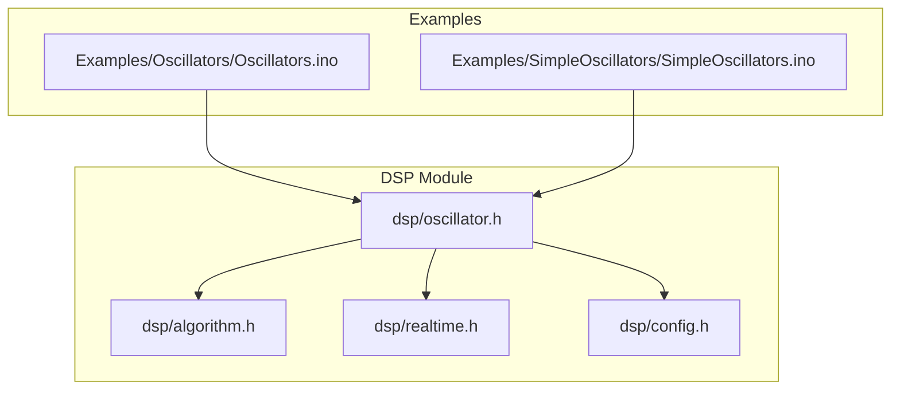
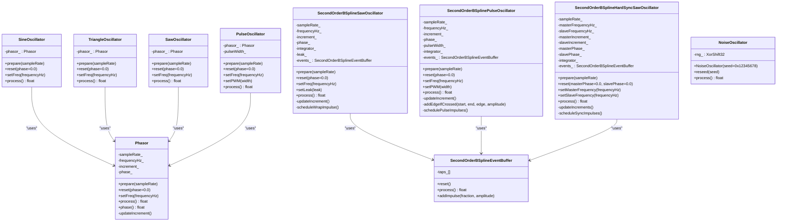
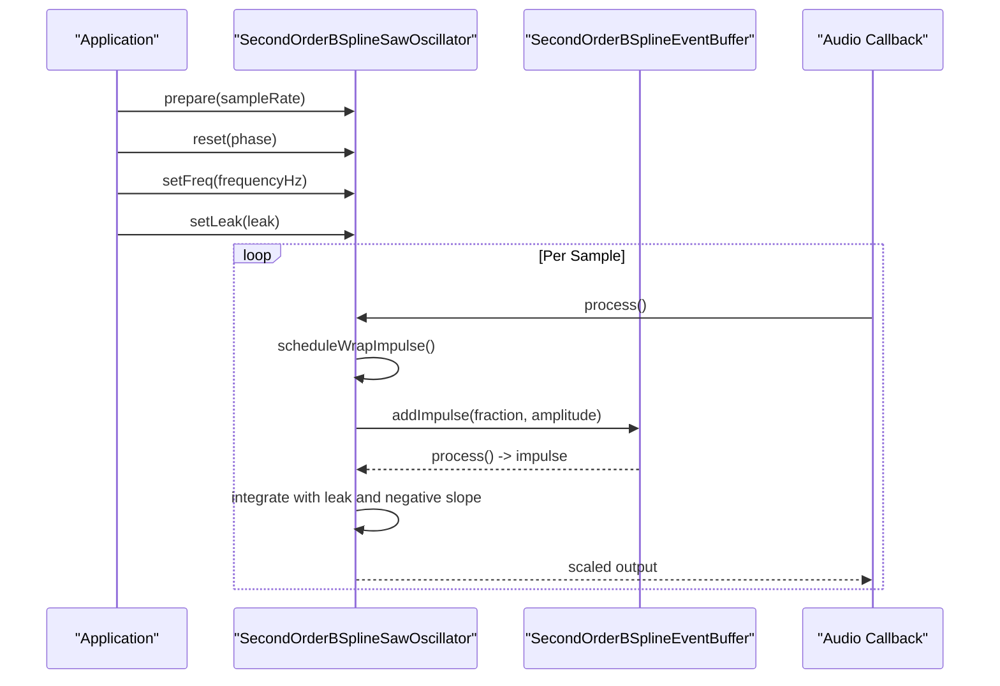
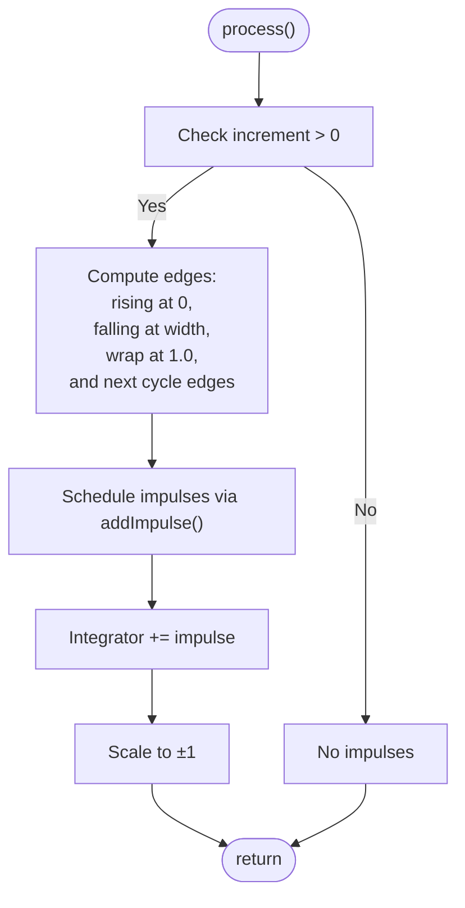
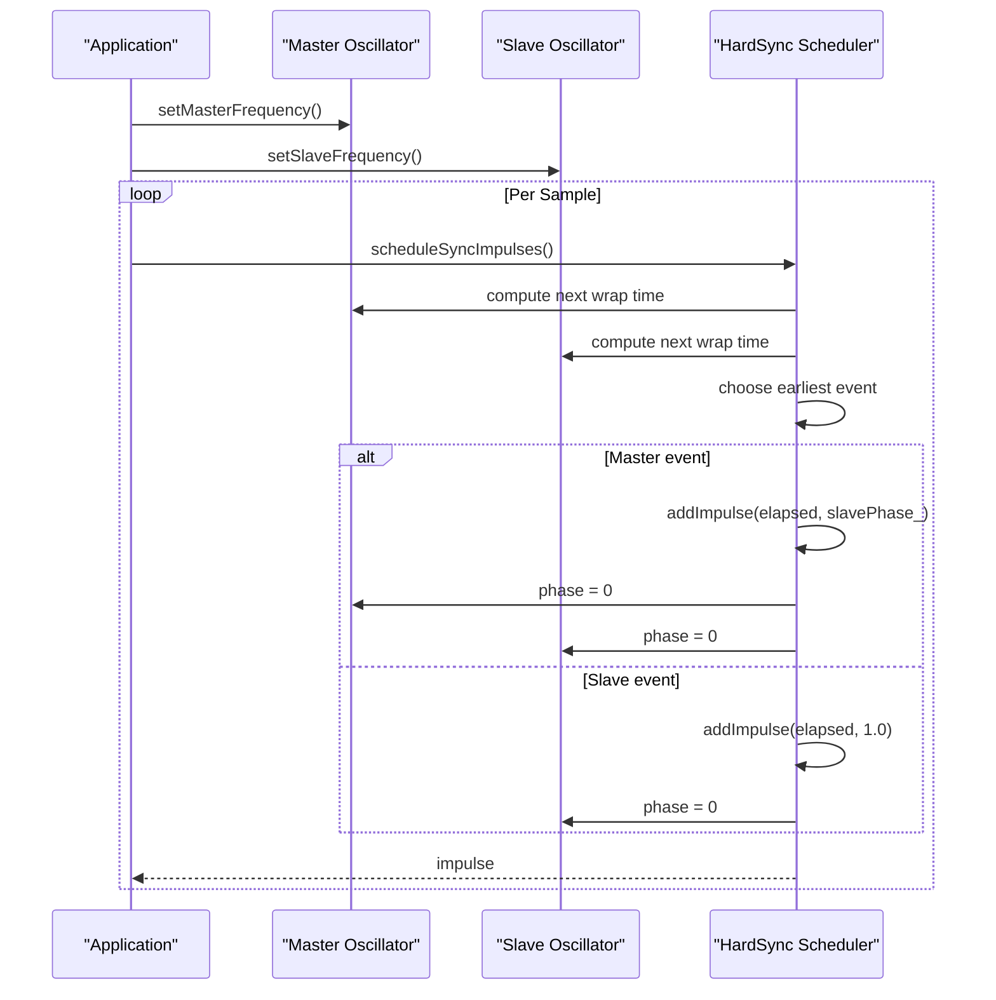
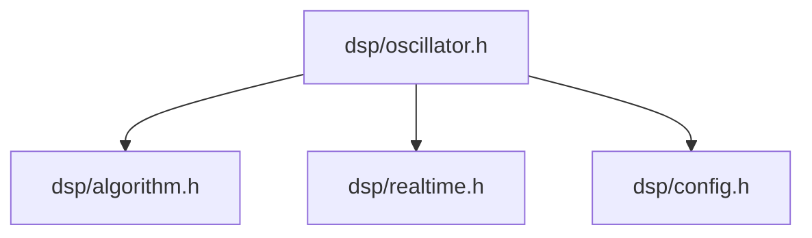

# Oscillator API

<cite>
**Referenced Files in This Document**
- [oscillator.h](file://dsp/oscillator.h)
- [algorithm.h](file://dsp/algorithm.h)
- [realtime.h](file://dsp/realtime.h)
- [config.h](file://dsp/config.h)
- [Oscillators.ino](file://Examples/Oscillators/Oscillators.ino)
- [SimpleOscillators.ino](file://Examples/SimpleOscillators/SimpleOscillators.ino)
</cite>

## Table of Contents
1. [Introduction](#introduction)
2. [Project Structure](#project-structure)
3. [Core Components](#core-components)
4. [Architecture Overview](#architecture-overview)
5. [Detailed Component Analysis](#detailed-component-analysis)
6. [Dependency Analysis](#dependency-analysis)
7. [Performance Considerations](#performance-considerations)
8. [Troubleshooting Guide](#troubleshooting-guide)
9. [Conclusion](#conclusion)

## Introduction
This document provides comprehensive API documentation for the Pico-DSP-Garden oscillator classes. It covers the Phasor base class for phase management, basic waveform oscillators (SineOscillator, TriangleOscillator, SawOscillator, PulseOscillator), advanced band-limited oscillators (SecondOrderBSplineSawOscillator, SecondOrderBSplinePulseOscillator, SecondOrderBSplineHardSyncSawOscillator), and NoiseOscillator. For each oscillator, we document method signatures, parameter ranges, initialization procedures, and practical usage examples drawn from the included Arduino examples.

## Project Structure
The oscillator implementations reside in the main DSP module and are mirrored across example projects. The core oscillator header defines the oscillator classes and supporting utilities, while example sketches demonstrate real-time usage patterns.

**Diagram sources**
- [oscillator.h:1-408](file://dsp/oscillator.h#L1-L408)
- [algorithm.h:1-85](file://dsp/algorithm.h#L1-L85)
- [realtime.h:1-38](file://dsp/realtime.h#L1-L38)
- [config.h:1-22](file://dsp/config.h#L1-L22)
- [Oscillators.ino:1-168](file://Examples/Oscillators/Oscillators.ino#L1-L168)
- [SimpleOscillators.ino:1-216](file://Examples/SimpleOscillators/SimpleOscillators.ino#L1-L216)

**Section sources**
- [oscillator.h:1-408](file://dsp/oscillator.h#L1-L408)
- [Oscillators.ino:1-168](file://Examples/Oscillators/Oscillators.ino#L1-L168)
- [SimpleOscillators.ino:1-216](file://Examples/SimpleOscillators/SimpleOscillators.ino#L1-L216)

## Core Components
This section summarizes the oscillator families and their primary responsibilities.

- Phasor: Shared phase accumulator with frequency control and phase increment calculation.
- Basic Waveform Oscillators: Naive oscillators derived from Phasor with direct waveform mapping.
- Band-Limited B-Spline Oscillators: Anti-aliased oscillators using impulse events smeared by a quadratic B-spline kernel.
- NoiseOscillator: Deterministic pseudo-random bipolar noise generator.

Key shared utilities:
- Clamping and normalization helpers for safe parameter ranges.
- Safe sample rate handling and phase wrapping.
- Denormal suppression for numerical stability.

**Section sources**
- [oscillator.h:39-69](file://dsp/oscillator.h#L39-L69)
- [oscillator.h:71-122](file://dsp/oscillator.h#L71-L122)
- [oscillator.h:124-177](file://dsp/oscillator.h#L124-L177)
- [oscillator.h:182-237](file://dsp/oscillator.h#L182-L237)
- [oscillator.h:242-300](file://dsp/oscillator.h#L242-L300)
- [oscillator.h:309-394](file://dsp/oscillator.h#L309-L394)
- [oscillator.h:396-405](file://dsp/oscillator.h#L396-L405)
- [algorithm.h:14-32](file://dsp/algorithm.h#L14-L32)
- [realtime.h:8-11](file://dsp/realtime.h#L8-L11)

## Architecture Overview
The oscillator architecture separates concerns into:
- Phase management via Phasor.
- Waveform mapping for naive oscillators.
- Event scheduling and anti-aliasing for band-limited oscillators.
- Random noise generation.

**Diagram sources**
- [oscillator.h:39-69](file://dsp/oscillator.h#L39-L69)
- [oscillator.h:71-122](file://dsp/oscillator.h#L71-L122)
- [oscillator.h:146-177](file://dsp/oscillator.h#L146-L177)
- [oscillator.h:182-237](file://dsp/oscillator.h#L182-L237)
- [oscillator.h:242-300](file://dsp/oscillator.h#L242-L300)
- [oscillator.h:309-394](file://dsp/oscillator.h#L309-L394)
- [oscillator.h:396-405](file://dsp/oscillator.h#L396-L405)

## Detailed Component Analysis

### Phasor
Phasor manages a normalized phase accumulator that advances by a phase increment each sample. It ensures consistent phase convention across oscillators by returning the current phase before advancing.

- Methods
  - prepare(sampleRate): Initialize with a valid sample rate.
  - reset(phase=0.0): Reset phase to a normalized value.
  - setFreq(frequencyHz): Set frequency; internally clamped to non-negative values.
  - process(): Return current phase, then advance by increment.
  - phase(): Access current normalized phase.

- Parameter Ranges
  - frequencyHz: [0.0, +∞) mapped to increment ∈ [0.0, 0.49] to respect Nyquist safety.
  - phase: Any float; wrapped to [0.0, 1.0).

- Initialization Procedure
  - Call prepare(sampleRate) before use.
  - Optionally call reset(phase) to set initial phase.
  - Call setFreq(frequencyHz) to set operating frequency.

- Practical Usage Example
  - See [Oscillators.ino:38-47](file://Examples/Oscillators/Oscillators.ino#L38-L47) for initializing multiple oscillators with prepared sample rates and MIDI-derived frequencies.

**Section sources**
- [oscillator.h:39-69](file://dsp/oscillator.h#L39-L69)
- [oscillator.h:41-51](file://dsp/oscillator.h#L41-L51)
- [oscillator.h:53-58](file://dsp/oscillator.h#L53-L58)
- [algorithm.h:29-32](file://dsp/algorithm.h#L29-L32)
- [algorithm.h:14-16](file://dsp/algorithm.h#L14-L16)
- [Oscillators.ino:38-47](file://Examples/Oscillators/Oscillators.ino#L38-L47)

### SineOscillator
A naive sine oscillator built on top of Phasor. It maps the normalized phase to a sine wave using 2π scaling.

- Methods
  - prepare(sampleRate): Delegate to internal Phasor.
  - reset(phase=0.0): Delegate to internal Phasor.
  - setFreq(frequencyHz): Delegate to internal Phasor.
  - process(): Compute sin(2π·phase).

- Parameter Ranges
  - frequencyHz: [0.0, +∞) subject to Phasor’s increment clamping.
  - phase: Any float; normalized by internal Phasor.

- Initialization Procedure
  - prepare(sampleRate) then setFreq(frequencyHz).

- Practical Usage Example
  - See [Oscillators.ino:38-47](file://Examples/Oscillators/Oscillators.ino#L38-L47) for preparing and setting frequencies on arrays of oscillators.

**Section sources**
- [oscillator.h:71-81](file://dsp/oscillator.h#L71-L81)
- [oscillator.h:73-77](file://dsp/oscillator.h#L73-L77)
- [config.h:14-15](file://dsp/config.h#L14-L15)
- [Oscillators.ino:38-47](file://Examples/Oscillators/Oscillators.ino#L38-L47)

### TriangleOscillator
A naive triangle oscillator derived from Phasor. It maps the normalized phase to a triangle waveform.

- Methods
  - prepare(sampleRate): Delegate to internal Phasor.
  - reset(phase=0.0): Delegate to internal Phasor.
  - setFreq(frequencyHz): Delegate to internal Phasor.
  - process(): Compute 1 - 4·|phase - 0.5|.

- Parameter Ranges
  - frequencyHz: [0.0, +∞) subject to Phasor’s increment clamping.
  - phase: Any float; normalized by internal Phasor.

- Initialization Procedure
  - prepare(sampleRate) then setFreq(frequencyHz).

- Practical Usage Example
  - See [Oscillators.ino:38-47](file://Examples/Oscillators/Oscillators.ino#L38-L47) for preparing and setting frequencies on arrays of oscillators.

**Section sources**
- [oscillator.h:83-96](file://dsp/oscillator.h#L83-L96)
- [oscillator.h:85-92](file://dsp/oscillator.h#L85-L92)

### SawOscillator
A naive sawtooth oscillator derived from Phasor. It maps the normalized phase to a saw waveform.

- Methods
  - prepare(sampleRate): Delegate to internal Phasor.
  - reset(phase=0.0): Delegate to internal Phasor.
  - setFreq(frequencyHz): Delegate to internal Phasor.
  - process(): Compute 2·phase - 1.

- Parameter Ranges
  - frequencyHz: [0.0, +∞) subject to Phasor’s increment clamping.
  - phase: Any float; normalized by internal Phasor.

- Initialization Procedure
  - prepare(sampleRate) then setFreq(frequencyHz).

- Practical Usage Example
  - See [Oscillators.ino:38-47](file://Examples/Oscillators/Oscillators.ino#L38-L47) for preparing and setting frequencies on arrays of oscillators.

**Section sources**
- [oscillator.h:98-108](file://dsp/oscillator.h#L98-L108)
- [oscillator.h:100-104](file://dsp/oscillator.h#L100-L104)

### PulseOscillator
A naive square/pulse oscillator derived from Phasor with pulse-width modulation.

- Methods
  - prepare(sampleRate): Delegate to internal Phasor.
  - reset(phase=0.0): Delegate to internal Phasor.
  - setFreq(frequencyHz): Delegate to internal Phasor.
  - setPWM(width): Clamp width to [0.01, 0.99].
  - process(): Compare phase with width; return ±1.

- Parameter Ranges
  - frequencyHz: [0.0, +∞) subject to Phasor’s increment clamping.
  - width: [0.01, 0.99] to avoid DC and prevent aliasing extremes.
  - phase: Any float; normalized by internal Phasor.

- Initialization Procedure
  - prepare(sampleRate) then setFreq(frequencyHz), optionally setPWM(width).

- Practical Usage Example
  - See [Oscillators.ino:38-47](file://Examples/Oscillators/Oscillators.ino#L38-L47) for preparing and setting frequencies on arrays of oscillators.

**Section sources**
- [oscillator.h:110-122](file://dsp/oscillator.h#L110-L122)
- [oscillator.h](file://dsp/oscillator.h#L115)
- [oscillator.h](file://dsp/oscillator.h#L117)

### SecondOrderBSplineSawOscillator
Band-limited sawtooth oscillator using a quadratic B-spline kernel to smear impulses and a leaky integrator to reconstruct the waveform.

- Methods
  - prepare(sampleRate): Initialize sample rate and compute increments.
  - reset(phase=0.0): Reset phase and integrator; clear event buffer.
  - setFreq(frequencyHz): Clamp frequency to [0.0, +∞) and update increment.
  - setLeak(leak): Clamp leak to [0.9, 1.0] to prevent DC drift.
  - process(): Schedule wrap impulse, process event buffer, integrate with leak and negative slope, scale to ±1.

- Parameter Ranges
  - frequencyHz: [0.0, +∞) clamped to ≤ 0.49·sampleRate for stability.
  - leak: [0.9, 1.0]; higher values reduce DC drift.
  - phase: Any float; wrapped to [0.0, 1.0).

- Initialization Procedure
  - prepare(sampleRate), reset(), setFreq(frequencyHz), setLeak(leak).

- Practical Usage Example
  - See [SimpleOscillators.ino:75-78](file://Examples/SimpleOscillators/SimpleOscillators.ino#L75-L78) for preparing and resetting the oscillator, and [SimpleOscillators.ino:93-101](file://Examples/SimpleOscillators/SimpleOscillators.ino#L93-L101) for dynamic frequency updates during audio processing.

**Diagram sources**
- [oscillator.h:182-237](file://dsp/oscillator.h#L182-L237)
- [oscillator.h:203-211](file://dsp/oscillator.h#L203-L211)
- [oscillator.h:216-228](file://dsp/oscillator.h#L216-L228)
- [oscillator.h:146-177](file://dsp/oscillator.h#L146-L177)

**Section sources**
- [oscillator.h:182-237](file://dsp/oscillator.h#L182-L237)
- [oscillator.h:201-201](file://dsp/oscillator.h#L201-L201)
- [oscillator.h](file://dsp/oscillator.h#L214)
- [oscillator.h:216-228](file://dsp/oscillator.h#L216-L228)
- [SimpleOscillators.ino:75-78](file://Examples/SimpleOscillators/SimpleOscillators.ino#L75-L78)
- [SimpleOscillators.ino:93-101](file://Examples/SimpleOscillators/SimpleOscillators.ino#L93-L101)

### SecondOrderBSplinePulseOscillator
Band-limited square/pulse oscillator integrating alternating edge impulses with a quadratic B-spline kernel.

- Methods
  - prepare(sampleRate): Initialize sample rate and compute increments.
  - reset(phase=0.0): Reset phase and integrator; clear event buffer.
  - setFreq(frequencyHz): Clamp frequency to [0.0, +∞) and update increment.
  - setPWM(width): Clamp width to [0.01, 0.99].
  - process(): Schedule pulse impulses across rising/falling edges and wrap, integrate, scale to ±1.

- Parameter Ranges
  - frequencyHz: [0.0, +∞) clamped to ≤ 0.49·sampleRate.
  - width: [0.01, 0.99].
  - phase: Any float; wrapped to [0.0, 1.0).

- Initialization Procedure
  - prepare(sampleRate), reset(), setFreq(frequencyHz), setPWM(width).

- Practical Usage Example
  - See [SimpleOscillators.ino:75-78](file://Examples/SimpleOscillators/SimpleOscillators.ino#L75-L78) for preparing and resetting the oscillator, and [SimpleOscillators.ino:93-101](file://Examples/SimpleOscillators/SimpleOscillators.ino#L93-L101) for dynamic frequency updates during audio processing.

**Diagram sources**
- [oscillator.h:242-300](file://dsp/oscillator.h#L242-L300)
- [oscillator.h:279-291](file://dsp/oscillator.h#L279-L291)
- [oscillator.h:146-177](file://dsp/oscillator.h#L146-L177)

**Section sources**
- [oscillator.h:242-300](file://dsp/oscillator.h#L242-L300)
- [oscillator.h](file://dsp/oscillator.h#L261)
- [oscillator.h:271-277](file://dsp/oscillator.h#L271-L277)
- [oscillator.h:279-291](file://dsp/oscillator.h#L279-L291)

### SecondOrderBSplineHardSyncSawOscillator
Band-limited “hard-synced” saw oscillator with separate master and slave oscillators. The slave resets on either its own wrap or the master’s wrap, depending on timing.

- Methods
  - prepare(sampleRate): Initialize sample rate and compute increments.
  - reset(masterPhase=0.0, slavePhase=0.0): Reset both phases and integrator; clear event buffer.
  - setMasterFrequency(frequencyHz): Clamp and update master increment.
  - setSlaveFrequency(frequencyHz): Clamp and update slave increment.
  - process(): Compute next event times for both oscillators, schedule impulses accordingly, integrate, scale to ±1.

- Parameter Ranges
  - masterFrequencyHz: [0.0, +∞) clamped to ≤ 0.49·sampleRate.
  - slaveFrequencyHz: [0.0, +∞) clamped to ≤ 0.49·sampleRate.
  - phases: Any float; wrapped to [0.0, 1.0).

- Initialization Procedure
  - prepare(sampleRate), reset(), setMasterFrequency(), setSlaveFrequency().

- Practical Usage Example
  - See [SimpleOscillators.ino:75-83](file://Examples/SimpleOscillators/SimpleOscillators.ino#L75-L83) for initial preparation and [SimpleOscillators.ino:93-101](file://Examples/SimpleOscillators/SimpleOscillators.ino#L93-L101) for dynamic updates to both frequencies during audio processing.

**Diagram sources**
- [oscillator.h:309-394](file://dsp/oscillator.h#L309-L394)
- [oscillator.h:348-383](file://dsp/oscillator.h#L348-L383)

**Section sources**
- [oscillator.h:309-394](file://dsp/oscillator.h#L309-L394)
- [oscillator.h:323-331](file://dsp/oscillator.h#L323-L331)
- [oscillator.h:341-344](file://dsp/oscillator.h#L341-L344)
- [oscillator.h:348-383](file://dsp/oscillator.h#L348-L383)
- [SimpleOscillators.ino:75-83](file://Examples/SimpleOscillators/SimpleOscillators.ino#L75-L83)
- [SimpleOscillators.ino:93-101](file://Examples/SimpleOscillators/SimpleOscillators.ino#L93-L101)

### NoiseOscillator
Deterministic pseudo-random noise generator using a 32-bit XorShift PRNG.

- Methods
  - NoiseOscillator(seed=0x12345678): Construct with optional seed.
  - reseed(seed): Change PRNG seed.
  - process(): Return next bipolar sample.

- Parameter Ranges
  - seed: Any unsigned 32-bit integer; zero folded to non-zero.

- Initialization Procedure
  - Construct with desired seed; call reseed(seed) if needed.

- Practical Usage Example
  - See [SimpleOscillators.ino:75-83](file://Examples/SimpleOscillators/SimpleOscillators.ino#L75-L83) for constructing and preparing the oscillator.

**Section sources**
- [oscillator.h:396-405](file://dsp/oscillator.h#L396-L405)
- [realtime.h:13-35](file://dsp/realtime.h#L13-L35)
- [SimpleOscillators.ino:75-83](file://Examples/SimpleOscillators/SimpleOscillators.ino#L75-L83)

## Dependency Analysis
The oscillator classes depend on shared utilities for safe parameter handling, phase wrapping, and numerical stability.

**Diagram sources**
- [oscillator.h:3-7](file://dsp/oscillator.h#L3-L7)
- [algorithm.h:1-85](file://dsp/algorithm.h#L1-L85)
- [realtime.h:1-38](file://dsp/realtime.h#L1-L38)
- [config.h:1-22](file://dsp/config.h#L1-L22)

**Section sources**
- [oscillator.h:3-7](file://dsp/oscillator.h#L3-L7)
- [algorithm.h:14-32](file://dsp/algorithm.h#L14-L32)
- [realtime.h:8-11](file://dsp/realtime.h#L8-L11)
- [config.h:12-15](file://dsp/config.h#L12-L15)

## Performance Considerations
- Band-limited oscillators use impulse events and a 3-sample B-spline kernel; ensure sample rates are valid and increments are clamped to avoid instability.
- Denormal suppression is applied to prevent slow floating-point handling on some hosts.
- Leaky integrators help mitigate DC drift in band-limited oscillators.
- Prefer safe sample rates and avoid excessive modulation rates to maintain stability.

[No sources needed since this section provides general guidance]

## Troubleshooting Guide
- Symptom: Clicks or pops at low frequencies.
  - Cause: Excessive leakage or incorrect phase reset.
  - Fix: Use setLeak() within [0.9, 1.0] and call reset() before changing frequencies.
- Symptom: Distorted or aliased output.
  - Cause: Using naive oscillators (SineOscillator, TriangleOscillator, SawOscillator, PulseOscillator) with high frequencies near Nyquist.
  - Fix: Switch to band-limited oscillators or lower frequencies.
- Symptom: Unstable hard-sync behavior at high ratios.
  - Cause: Excessive master-to-slave frequency ratio causing multiple slave wraps per master sample.
  - Fix: Monitor and limit frequency ratios; the scheduler caps iterations to prevent runaway loops.

**Section sources**
- [oscillator.h:201-201](file://dsp/oscillator.h#L201-L201)
- [oscillator.h](file://dsp/oscillator.h#L214)
- [oscillator.h:341-344](file://dsp/oscillator.h#L341-L344)
- [oscillator.h:355-356](file://dsp/oscillator.h#L355-L356)
- [realtime.h:8-11](file://dsp/realtime.h#L8-L11)

## Conclusion
The Pico-DSP-Garden oscillator suite offers both naive and band-limited waveform generators suitable for real-time audio applications. The Phasor base class centralizes phase management, while the band-limited oscillators employ impulse event scheduling and B-spline kernels to reduce aliasing. The included examples demonstrate practical initialization and runtime usage patterns for real-time synthesis.