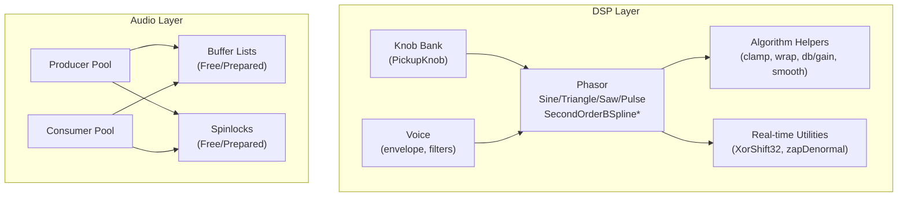
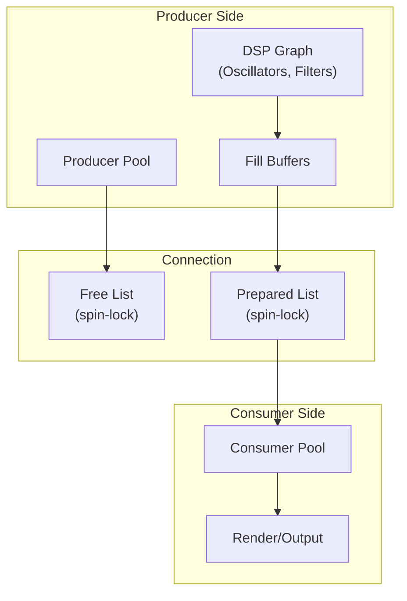
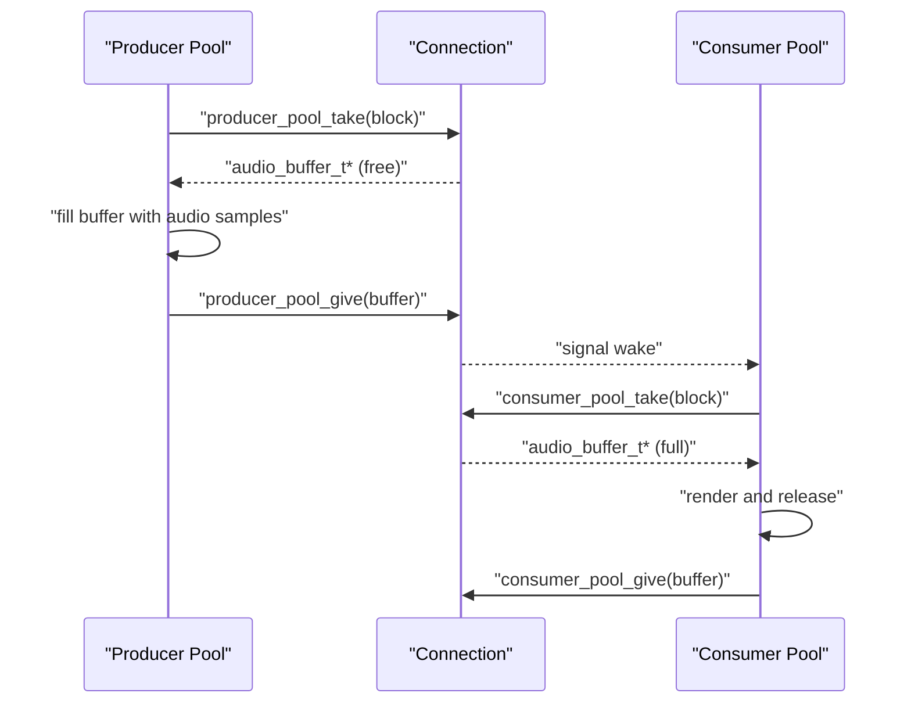
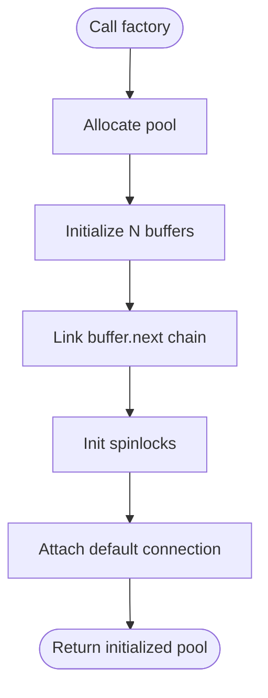
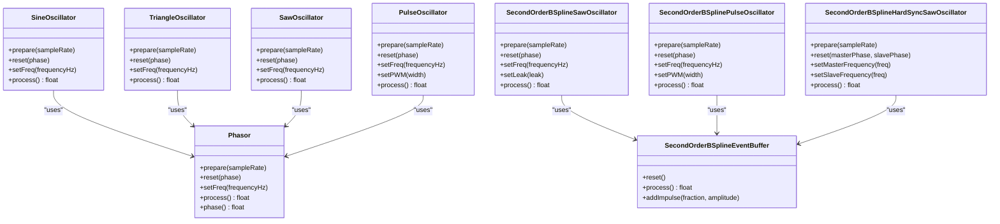
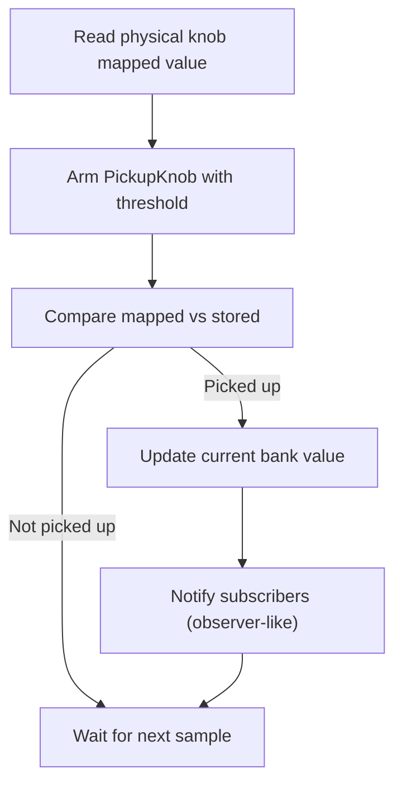
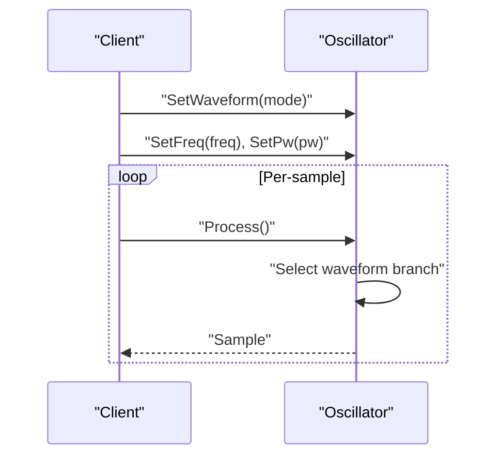
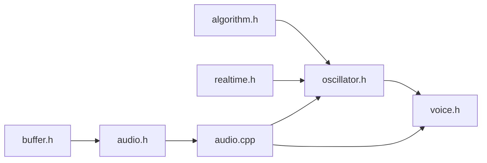

# Design Patterns

<cite>
**Referenced Files in This Document**
- [oscillator.h](file://dsp/oscillator.h)
- [audio.h](file://audio/audio.h)
- [audio.cpp](file://audio/audio.cpp)
- [buffer.h](file://audio/buffer.h)
- [algorithm.h](file://dsp/algorithm.h)
- [realtime.h](file://dsp/realtime.h)
- [oscillator.h](file://Examples/Oscillators/src/dsp/oscillator.h)
- [oscillator.cpp](file://Examples/SuperSaw/src/dsp/oscillator.cpp)
- [dsp.h](file://Examples/SuperSaw/src/dsp/dsp.h)
- [knob_bank.h](file://dsp/knob_bank.h)
- [voice.h](file://Examples/Oscillators/src/dsp/voice.h)
</cite>

## Table of Contents
1. [Introduction](#introduction)
2. [Project Structure](#project-structure)
3. [Core Components](#core-components)
4. [Architecture Overview](#architecture-overview)
5. [Detailed Component Analysis](#detailed-component-analysis)
6. [Dependency Analysis](#dependency-analysis)
7. [Performance Considerations](#performance-considerations)
8. [Troubleshooting Guide](#troubleshooting-guide)
9. [Conclusion](#conclusion)

## Introduction
This document analyzes the design patterns implemented in the Pico-DSP-Garden codebase with a focus on real-time audio processing. It explains how producer-consumer patterns are used for buffer management, how factory-like mechanisms create buffer pools, how strategy-like patterns enable different oscillator behaviors, and how template metaprogramming, RAII, and observer-like mechanisms contribute to modularity, maintainability, and performance. The goal is to help developers understand the rationale behind the choices, trade-offs, and extension points for future enhancements.

## Project Structure
The repository organizes real-time DSP building blocks under a dedicated directory and provides example projects that demonstrate usage. The core areas relevant to this analysis include:
- DSP primitives and oscillators
- Audio buffer pooling and producer/consumer coordination
- Utility helpers for real-time safety and math
- Example projects showcasing oscillator families and voice synthesis

**Section sources**
- [oscillator.h:39-408](file://dsp/oscillator.h#L39-L408)
- [audio.h:76-104](file://audio/audio.h#L76-L104)
- [audio.cpp:156-174](file://audio/audio.cpp#L156-L174)
- [algorithm.h:11-84](file://dsp/algorithm.h#L11-L84)
- [realtime.h:8-35](file://dsp/realtime.h#L8-L35)
- [knob_bank.h:10-60](file://dsp/knob_bank.h#L10-L60)
- [voice.h:153-187](file://Examples/Oscillators/src/dsp/voice.h#L153-L187)

## Core Components
- Oscillators and Waveform Families
  - Naive phasor-based oscillators (Sine, Triangle, Saw, Pulse) and band-limited B-spline oscillators (Saw, Pulse, Hard-synced variants) demonstrate a strategy-like approach to waveform generation. Each oscillator class encapsulates a specific algorithmic approach, enabling runtime selection via a common interface pattern.
  - The Phasor class centralizes phase accumulation and frequency control, ensuring consistent phase semantics across oscillators.

- Producer-Consumer Buffer Management
  - The audio buffer pool exposes distinct producer and consumer roles with separate free/prepared lists and spinlocks. Producers allocate and fill buffers, consumers drain them, and a connection mediates handoffs.

- Factory-like Buffer Pool Creation
  - Functions allocate and initialize buffer pools with configurable counts and sizes, acting as factories for reusable buffer infrastructure.

- Template Metaprogramming and Compile-time Optimizations
  - Templates define fixed-capacity containers (e.g., sequencers, recorder) to avoid dynamic allocation and to keep data structures compact for real-time contexts.

- RAII Resource Management
  - Buffer allocation and wrapping are handled by lightweight RAII wrappers, ensuring proper lifecycle management and reducing risk of leaks in embedded environments.

- Observer-like Parameter Updates
  - The knob bank pattern arms physical controls and updates stored parameter values upon pickup, providing a controlled way to propagate parameter changes without immediate side effects.

**Section sources**
- [oscillator.h:39-408](file://dsp/oscillator.h#L39-L408)
- [audio.h:76-104](file://audio/audio.h#L76-L104)
- [audio.cpp:156-174](file://audio/audio.cpp#L156-L174)
- [algorithm.h:11-84](file://dsp/algorithm.h#L11-L84)
- [realtime.h:8-35](file://dsp/realtime.h#L8-L35)
- [knob_bank.h:10-60](file://dsp/knob_bank.h#L10-L60)

## Architecture Overview
The system separates concerns between DSP computation and audio pipeline orchestration. DSP components (oscillators, envelopes, filters) operate on a common phase/time model and produce samples. The audio subsystem coordinates buffer lifecycles and threading-safe handoffs between producers and consumers.

**Diagram sources**
- [audio.h:76-104](file://audio/audio.h#L76-L104)
- [audio.cpp:78-118](file://audio/audio.cpp#L78-L118)

## Detailed Component Analysis

### Producer-Consumer Pattern for Buffer Management
The audio buffer pool implements a classic producer-consumer model:
- Producer pool maintains a free list of buffers and a prepared list for full buffers.
- Consumer pool maintains a free list of buffers and a prepared list for full buffers.
- Spinlocks protect concurrent access to both free and prepared lists.
- The connection object mediates take/give operations for producers and consumers.

Key behaviors:
- Producers take free buffers, fill them, and give them to the prepared list.
- Consumers take full buffers, render them, and return them to the free list.
- Blocking and non-blocking take operations are supported.

**Diagram sources**
- [audio.h:93-104](file://audio/audio.h#L93-L104)
- [audio.cpp:78-118](file://audio/audio.cpp#L78-L118)
- [audio.cpp:222-228](file://audio/audio.cpp#L222-L228)

**Section sources**
- [audio.h:76-104](file://audio/audio.h#L76-L104)
- [audio.cpp:78-118](file://audio/audio.cpp#L78-L118)
- [audio.cpp:189-211](file://audio/audio.cpp#L189-L211)

### Factory Pattern for Buffer Pool Creation
Buffer pools are created via factory functions that:
- Allocate and initialize the pool structure.
- Pre-link a chain of buffers.
- Initialize spinlocks for thread safety.
- Attach a default connection for take/give behavior.

Benefits:
- Encapsulation of initialization details.
- Consistent configuration across producers and consumers.
- Centralized resource setup and teardown hooks.

**Diagram sources**
- [audio.cpp:156-174](file://audio/audio.cpp#L156-L174)

**Section sources**
- [audio.cpp:156-174](file://audio/audio.cpp#L156-L174)

### Strategy Pattern for Different Oscillator Types
Multiple oscillator families are supported:
- Naive phasor oscillators (Sine, Triangle, Saw, Pulse) share a common Phasor for phase control.
- Band-limited B-spline oscillators (Saw, Pulse, Hard-sync variants) use impulse scheduling and integration for anti-aliasing.

Each oscillator class encapsulates a specific waveform generation strategy, enabling selection at runtime while maintaining a consistent interface.

**Diagram sources**
- [oscillator.h:39-408](file://dsp/oscillator.h#L39-L408)

**Section sources**
- [oscillator.h:39-408](file://dsp/oscillator.h#L39-L408)
- [oscillator.h:39-408](file://Examples/Oscillators/src/dsp/oscillator.h#L39-L408)

### Template Metaprogramming for Compile-time Optimizations
Templates are used to:
- Define fixed-capacity containers (e.g., sequencers, recorder) to avoid heap allocations and to keep memory layout predictable.
- Allow compile-time sizing and iteration bounds, improving cache locality and reducing runtime overhead.

Example usage:
- Sequencer templates with compile-time MaxSteps.
- Recorder templates with compile-time MaxPositions.

Benefits:
- Deterministic memory footprint.
- Reduced dynamic allocation in real-time loops.
- Compiler can optimize loops and accesses.

**Section sources**
- [oscillator.h:12-12](file://dsp/oscillator.h#L12-L12)
- [realtime.h:13-35](file://dsp/realtime.h#L13-L35)

### RAII Resource Management for Automatic Cleanup
RAII is applied to buffer lifecycle:
- Wrappers encapsulate buffer allocation and ownership.
- Initialization routines attach metadata and sample capacity.
- Freeing routines return buffers to the appropriate free list.

Benefits:
- Prevents leaks in long-running audio loops.
- Simplifies error handling and cleanup paths.
- Ensures consistent buffer state transitions.

**Section sources**
- [buffer.h:78-96](file://audio/buffer.h#L78-L96)
- [audio.cpp:143-154](file://audio/audio.cpp#L143-L154)
- [audio.cpp:176-186](file://audio/audio.cpp#L176-L186)

### Observer Pattern for Parameter Updates
The knob bank pattern provides a controlled parameter update mechanism:
- Physical knobs are “armed” to a target value.
- After pickup, stored values in the current bank are updated.
- This decouples parameter changes from immediate DSP updates, preventing audible artifacts and enabling smoother automation.

**Diagram sources**
- [knob_bank.h:34-54](file://dsp/knob_bank.h#L34-L54)

**Section sources**
- [knob_bank.h:10-60](file://dsp/knob_bank.h#L10-L60)

### Additional Strategy Example: DaisySP-style Oscillator Family
The example project demonstrates a strategy-like family of oscillators with selectable waveform modes and polyBLEP anti-aliasing variants. The oscillator’s Process method selects among multiple waveform branches, illustrating a runtime strategy selection.

**Diagram sources**
- [oscillator.h:20-105](file://Examples/Oscillators/src/dsp/oscillator.h#L20-L105)
- [oscillator.cpp:7-59](file://Examples/SuperSaw/src/dsp/oscillator.cpp#L7-L59)

**Section sources**
- [oscillator.h:20-105](file://Examples/Oscillators/src/dsp/oscillator.h#L20-L105)
- [oscillator.cpp:7-59](file://Examples/SuperSaw/src/dsp/oscillator.cpp#L7-L59)
- [dsp.h:157-191](file://Examples/SuperSaw/src/dsp/dsp.h#L157-L191)

## Dependency Analysis
The DSP layer depends on algorithmic helpers and real-time utilities. The audio layer orchestrates buffer pools and connections. The example projects demonstrate higher-level composition (voices, envelopes) built on top of the DSP primitives.

**Diagram sources**
- [algorithm.h:9-84](file://dsp/algorithm.h#L9-L84)
- [realtime.h:6-37](file://dsp/realtime.h#L6-L37)
- [oscillator.h:3-8](file://dsp/oscillator.h#L3-L8)
- [audio.h:12-14](file://audio/audio.h#L12-L14)
- [audio.cpp:1-11](file://audio/audio.cpp#L1-L11)

**Section sources**
- [algorithm.h:9-84](file://dsp/algorithm.h#L9-L84)
- [realtime.h:6-37](file://dsp/realtime.h#L6-L37)
- [oscillator.h:3-8](file://dsp/oscillator.h#L3-L8)
- [audio.h:12-14](file://audio/audio.h#L12-L14)
- [audio.cpp:1-11](file://audio/audio.cpp#L1-L11)

## Performance Considerations
- Minimize dynamic allocation in real-time threads; templates and preallocated pools reduce GC pressure.
- Use spinlocks and lock-free list operations to avoid blocking on audio callbacks.
- Prefer compile-time constants and clamps to keep arithmetic tight and predictable.
- Anti-aliased oscillators trade extra computation for reduced aliasing; choose strategies based on CPU budget and quality targets.
- Denormal suppression and numerical stability helpers prevent performance penalties from denormalized floats.

## Troubleshooting Guide
- Buffer starvation or overflow
  - Verify producer/consumer balance and buffer count. Ensure take/give paths are exercised consistently.
  - Check spinlock usage and blocking behavior.

- Clicks or pops in audio
  - Confirm phase continuity and proper reset sequences in oscillators.
  - Ensure denormal suppression is active and parameter smoothing is applied where needed.

- Parameter jitter or artifacts
  - Use the knob bank pickup mechanism to arm and update parameters smoothly.
  - Apply smoothing filters to control-rate signals.

**Section sources**
- [audio.cpp:78-118](file://audio/audio.cpp#L78-L118)
- [realtime.h:8-11](file://dsp/realtime.h#L8-L11)
- [knob_bank.h:34-54](file://dsp/knob_bank.h#L34-L54)

## Conclusion
Pico-DSP-Garden employs a clear separation of concerns: DSP primitives encapsulate waveform generation and filtering, while the audio subsystem manages buffer lifecycles with a robust producer-consumer model. Factory-like initialization, template-based containers, RAII wrappers, and observer-like parameter updates collectively deliver modularity, safety, and performance for real-time audio. The strategy-like oscillator families and selectable waveform modes offer flexibility without sacrificing determinism. These patterns provide strong foundations for extending the system with new oscillators, effects, and control surfaces while preserving real-time guarantees.