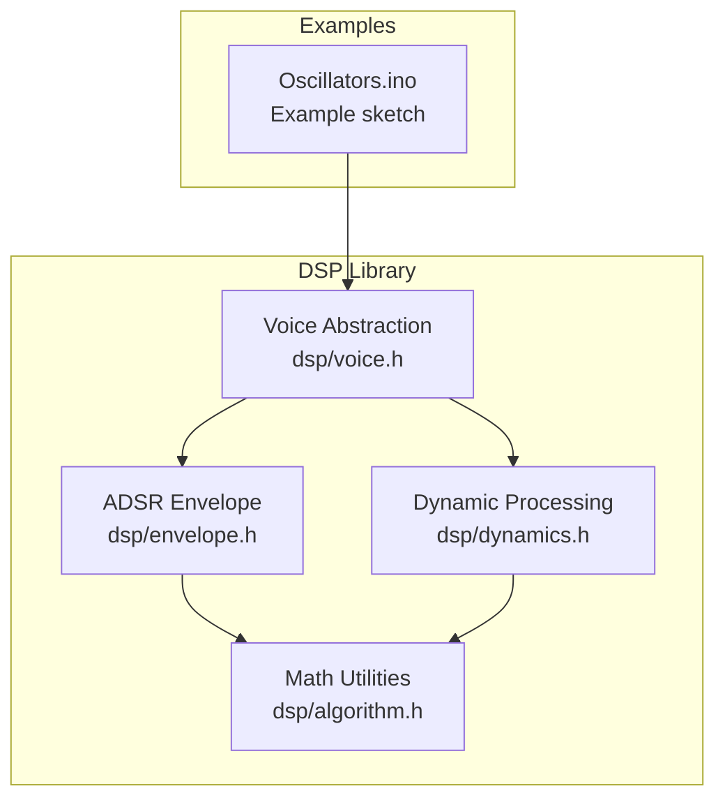
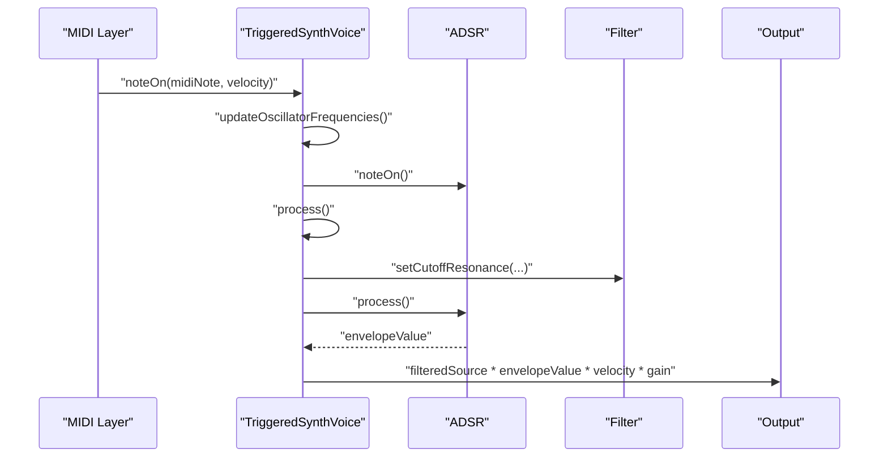
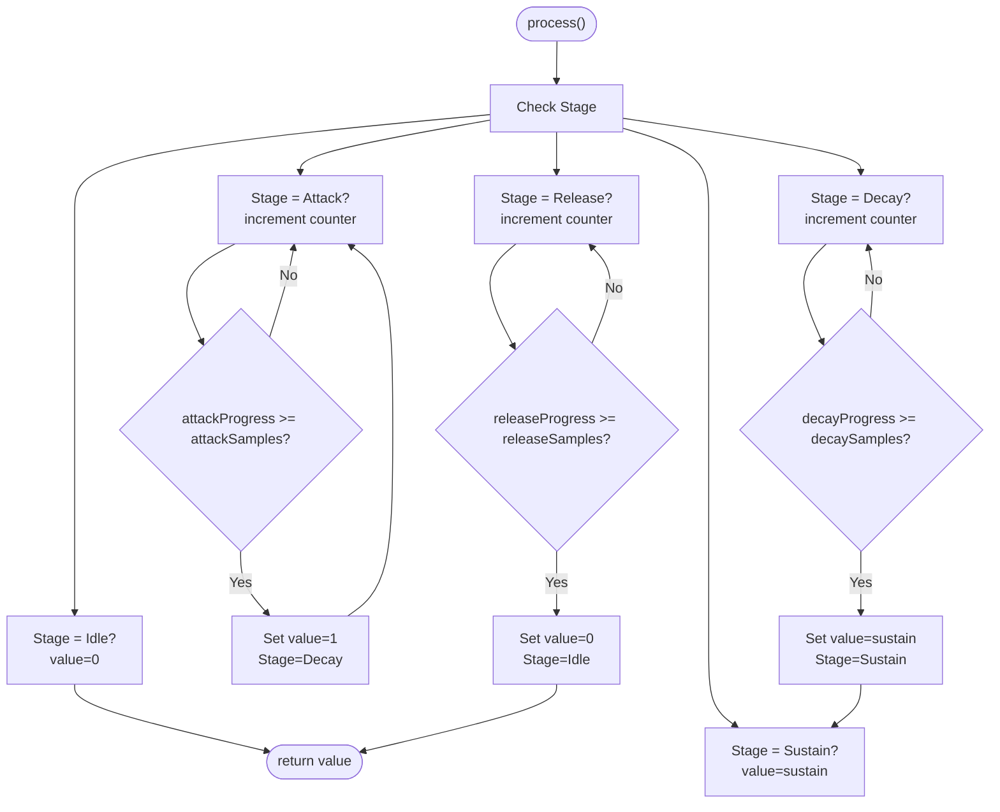
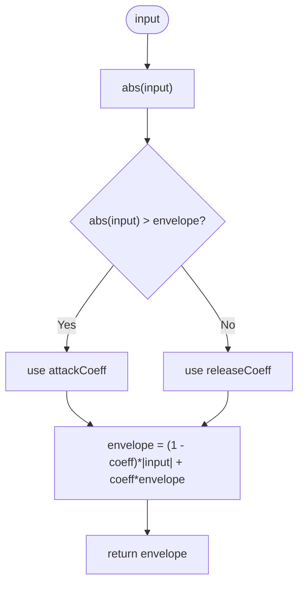
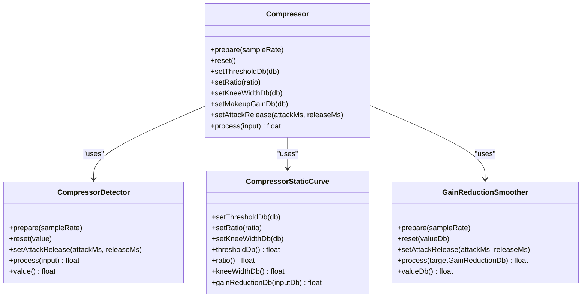
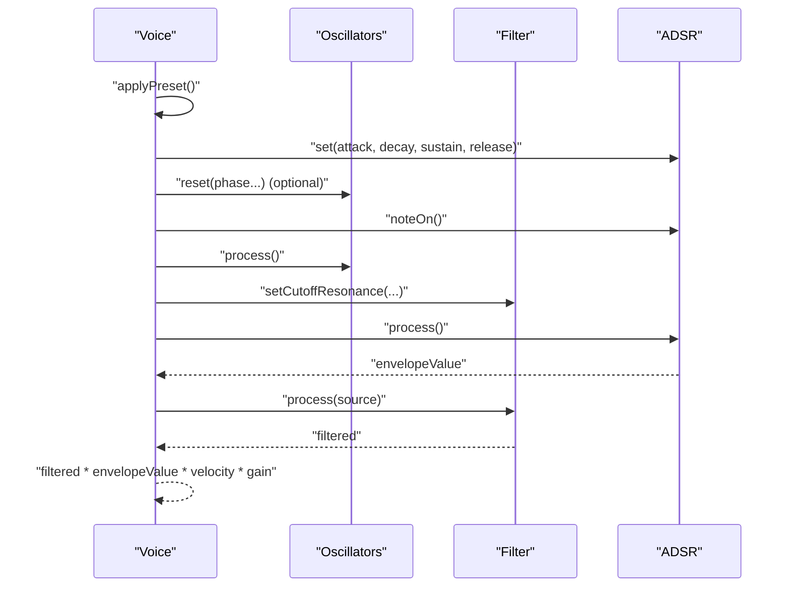
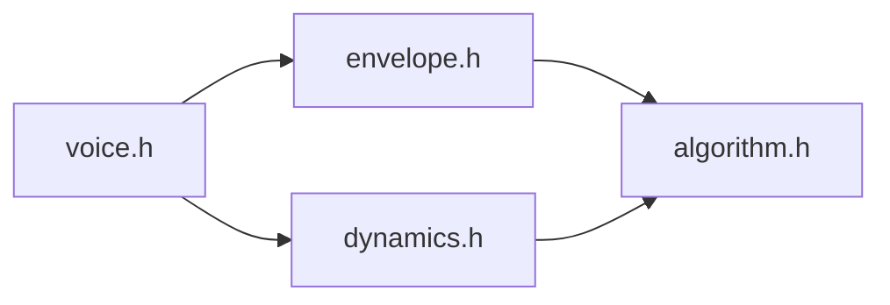

# Envelope Generators

<cite>
**Referenced Files in This Document**
- [envelope.h](file://dsp/envelope.h)
- [dynamics.h](file://dsp/dynamics.h)
- [algorithm.h](file://dsp/algorithm.h)
- [voice.h](file://dsp/voice.h)
- [Oscillators.ino](file://Examples/Oscillators/Oscillators.ino)
- [README.md](file://README.md)
</cite>

## Table of Contents
1. [Introduction](#introduction)
2. [Project Structure](#project-structure)
3. [Core Components](#core-components)
4. [Architecture Overview](#architecture-overview)
5. [Detailed Component Analysis](#detailed-component-analysis)
6. [Dependency Analysis](#dependency-analysis)
7. [Performance Considerations](#performance-considerations)
8. [Troubleshooting Guide](#troubleshooting-guide)
9. [Conclusion](#conclusion)
10. [Appendices](#appendices)

## Introduction
This document explains the envelope generator and dynamic processing algorithms implemented in the Pico-DSP-Garden project. It focuses on:
- The ADSR envelope generator with attack, decay, sustain, and release stages
- Exponential smoothing for envelope follower circuits used in automatic gain control
- Mathematical models for linear segments, exponential smoothing, and logarithmic scaling
- Practical examples demonstrating envelope triggering, MIDI control, and real-time modulation
- Compressor and limiter implementations with threshold detection, compression ratio control, and smoothing
- Parameter automation, envelope scaling, and integration with other DSP algorithms

## Project Structure
The envelope and dynamics modules are header-only libraries under the dsp/ directory, with examples under Examples/. The ADSR envelope resides in envelope.h, dynamic processing (envelope follower, compressor) in dynamics.h, and shared math utilities in algorithm.h. A voice abstraction integrates envelopes into a synthesizer-style voice in voice.h. Example sketches demonstrate usage in real-time audio callbacks.

**Diagram sources**
- [envelope.h:1-131](file://dsp/envelope.h#L1-L131)
- [dynamics.h:1-199](file://dsp/dynamics.h#L1-L199)
- [algorithm.h:1-85](file://dsp/algorithm.h#L1-L85)
- [voice.h:1-200](file://dsp/voice.h#L1-L200)
- [Oscillators.ino:1-168](file://Examples/Oscillators/Oscillators.ino#L1-L168)

**Section sources**
- [README.md:30-37](file://README.md#L30-L37)
- [envelope.h:1-131](file://dsp/envelope.h#L1-L131)
- [dynamics.h:1-199](file://dsp/dynamics.h#L1-L199)
- [algorithm.h:1-85](file://dsp/algorithm.h#L1-L85)
- [voice.h:1-200](file://dsp/voice.h#L1-L200)
- [Oscillators.ino:1-168](file://Examples/Oscillators/Oscillators.ino#L1-L168)

## Core Components
- ADSR Envelope: A sample-accurate, stage-processed envelope generator supporting attack, decay, sustain, and release with integer sample counters for deterministic timing.
- Envelope Follower: A one-pole exponential smoother that tracks signal envelope with separate attack/release time constants.
- Compressor: Threshold detection, static compression curve with hard/knee characteristics, and smoothing of gain reduction to avoid audible pumping.
- Math Utilities: Clamping, linear interpolation, dB conversions, safe sample rate handling, and one-pole smoothing coefficient computation.

Key capabilities:
- Deterministic ADSR timing via second-to-sample conversion
- Real-time envelope triggering and release handling
- Logarithmic scaling for dynamic processing (dB to gain and vice versa)
- Parameter automation-friendly APIs for attack/decay/sustain/release and compressor settings

**Section sources**
- [envelope.h:7-128](file://dsp/envelope.h#L7-L128)
- [dynamics.h:9-196](file://dsp/dynamics.h#L9-L196)
- [algorithm.h:14-67](file://dsp/algorithm.h#L14-L67)

## Architecture Overview
The envelope and dynamics modules integrate with higher-level abstractions such as a triggered voice. The voice applies presets, updates oscillator frequencies, triggers the ADSR envelope, and scales filtered oscillator outputs by the envelope and velocity.

**Diagram sources**
- [voice.h:121-198](file://dsp/voice.h#L121-L198)
- [envelope.h:39-95](file://dsp/envelope.h#L39-L95)

**Section sources**
- [voice.h:55-198](file://dsp/voice.h#L55-L198)
- [envelope.h:7-128](file://dsp/envelope.h#L7-L128)

## Detailed Component Analysis

### ADSR Envelope Implementation
The ADSR envelope is implemented as a finite-state machine with integer sample counters for each stage. It supports:
- Attack: linear ramp from 0 to 1
- Decay: linear interpolation from 1 to sustain level
- Sustain: constant level until release
- Release: linear ramp from current value to 0

Timing is configured in seconds and converted to samples using a sample rate-aware conversion routine. The envelope captures the current value at note-off to ensure smooth release transitions.

**Diagram sources**
- [envelope.h:55-95](file://dsp/envelope.h#L55-L95)

Implementation highlights:
- Sample-accurate stage transitions using integer counters
- Linear interpolation for decay and release segments
- Click-free release by capturing current value at note-off
- Clamp to [0,1] after each step

Practical usage:
- Configure attack/decay/sustain/release durations in seconds
- Call noteOn() on trigger and noteOff() on release
- Poll process() per sample in the audio callback

**Section sources**
- [envelope.h:7-128](file://dsp/envelope.h#L7-L128)

### Envelope Follower (Automatic Gain Control)
The envelope follower computes a smoothed envelope magnitude using a one-pole low-pass characteristic. It uses separate time constants for attack and release to track peaks quickly and decay musically.

**Diagram sources**
- [dynamics.h:25-31](file://dsp/dynamics.h#L25-L31)

Key features:
- Separate attack and release coefficients computed from millisecond time constants
- One-pole smoothing for exponential curves
- Value initialization and reset support

Typical applications:
- RMS-like envelope detection for compressor detection
- Dynamic EQ or filter envelope modulation
- Sidechain ducking and gating

**Section sources**
- [dynamics.h:9-42](file://dsp/dynamics.h#L9-L42)

### Compressor and Limiter Implementations
The compressor combines a detector, a static compression curve, and a smoother for gain reduction:
- Detector: envelope follower that tracks signal level
- Static Curve: hard knee or quadratic knee compression with threshold and ratio
- Smoother: one-pole smoothing of gain reduction to avoid pumping
- Makeup gain: optional post-correction

**Diagram sources**
- [dynamics.h:91-196](file://dsp/dynamics.h#L91-L196)

Processing pipeline:
1. Detector measures envelope magnitude
2. Convert to dB
3. Compute target gain reduction using the static curve
4. Smooth gain reduction with one-pole filter
5. Apply smoothed gain plus makeup gain to input

Parameters:
- Threshold (dB): onset of compression
- Ratio: compression strength
- Knee width (dB): smooth transition around threshold
- Attack/Release (ms): detector and smoother time constants
- Makeup gain (dB): output level correction

Integration tips:
- Use detector attack/Release to match source transients
- Choose knee width for smooth or aggressive compression
- Apply makeup gain to compensate for average attenuation

**Section sources**
- [dynamics.h:44-196](file://dsp/dynamics.h#L44-L196)

### Mathematical Models and Scaling
The library provides essential numeric primitives for envelope and dynamic processing:
- Clamping and normalization helpers
- Linear interpolation
- dB-to-gain and gain-to-dB conversions with a safe lower bound
- One-pole smoothing coefficient derived from time constants
- Safe sample-rate handling

These utilities underpin ADSR timing, envelope follower response, and compressor scaling.

**Section sources**
- [algorithm.h:14-82](file://dsp/algorithm.h#L14-L82)

### Integration with Other DSP Algorithms
The voice abstraction demonstrates how envelopes integrate with oscillators and filters:
- Presets define ADSR durations and sustain levels
- On note-on, oscillators are reset (optional) and the envelope starts
- Filter cutoff responds to velocity, scaling with envelope and velocity
- Final output is filtered source multiplied by envelope, velocity, and gain

**Diagram sources**
- [voice.h:80-198](file://dsp/voice.h#L80-L198)

**Section sources**
- [voice.h:55-198](file://dsp/voice.h#L55-L198)

## Dependency Analysis
The envelope and dynamics modules depend on shared math utilities. The voice composes envelopes and dynamics into a cohesive synthesis path.

**Diagram sources**
- [algorithm.h:1-85](file://dsp/algorithm.h#L1-L85)
- [envelope.h:1-131](file://dsp/envelope.h#L1-L131)
- [dynamics.h:1-199](file://dsp/dynamics.h#L1-L199)
- [voice.h:1-200](file://dsp/voice.h#L1-L200)

**Section sources**
- [algorithm.h:1-85](file://dsp/algorithm.h#L1-L85)
- [envelope.h:1-131](file://dsp/envelope.h#L1-L131)
- [dynamics.h:1-199](file://dsp/dynamics.h#L1-L199)
- [voice.h:1-200](file://dsp/voice.h#L1-L200)

## Performance Considerations
- Integer sample counters in ADSR ensure deterministic timing across platforms and reduce floating-point overhead.
- One-pole smoothing uses inexpensive exponential updates; tune attack/Release to balance responsiveness and stability.
- Clamp inputs and intermediate values to prevent numerical issues and limit computational cost.
- Use dB arithmetic for compressor stages to maintain perceptual linearity and avoid expensive trigonometric operations.
- Avoid excessive parameter updates per sample; batch or smooth control changes to minimize transient artifacts.

## Troubleshooting Guide
Common issues and remedies:
- Clicks on release: Ensure noteOff() is called when releasing notes; the envelope captures the current value to prevent discontinuities.
- Noisy or unstable envelopes: Verify sample rate preparation and clamp parameters; confirm time constants are reasonable.
- Compressor pumping: Increase smoother attack/Release or widen knee; adjust makeup gain to compensate for perceived level changes.
- Muffled or overly bright output: Tune filter cutoff and resonance; consider velocity scaling for cutoff.
- Parameter automation artifacts: Smooth control changes and clamp values to valid ranges.

**Section sources**
- [envelope.h:46-53](file://dsp/envelope.h#L46-L53)
- [dynamics.h:125-158](file://dsp/dynamics.h#L125-L158)
- [algorithm.h:14-21](file://dsp/algorithm.h#L14-L21)

## Conclusion
The Pico-DSP-Garden provides robust, header-only implementations of ADSR envelopes and dynamic processing primitives. The ADSR offers deterministic, stage-processed envelopes suitable for synthesis; the envelope follower enables AGC and sidechaining; and the compressor delivers flexible, smooth compression with configurable thresholds, ratios, and knees. Together with shared math utilities and a voice abstraction, these components form a modular foundation for real-time audio synthesis and processing.

## Appendices

### Practical Examples and Workflows
- Envelope triggering and MIDI control: The voice abstraction exposes noteOn/noteOff methods and integrates ADSR with oscillators and filters. See the voice note handling and processing flow.
- Real-time modulation: Use the envelope follower to detect signal magnitude and modulate filter cutoff or compressor threshold in real time.
- Parameter automation: Expose ADSR and compressor parameters as controllable knobs; smooth changes to avoid clicks and artifacts.

**Section sources**
- [voice.h:121-198](file://dsp/voice.h#L121-L198)
- [Oscillators.ino:60-95](file://Examples/Oscillators/Oscillators.ino#L60-L95)