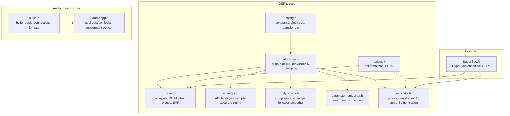
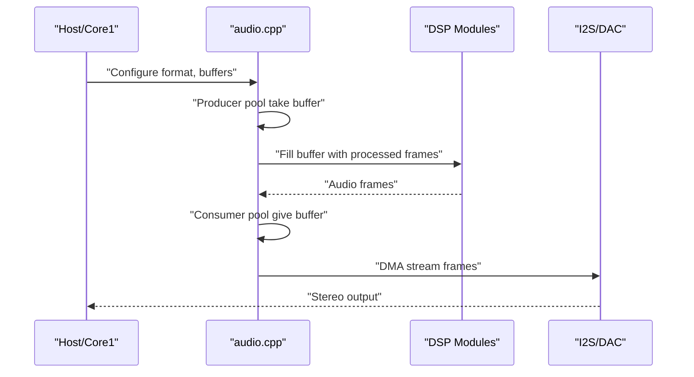
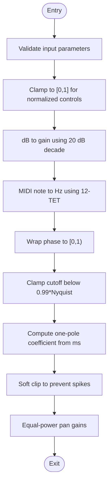
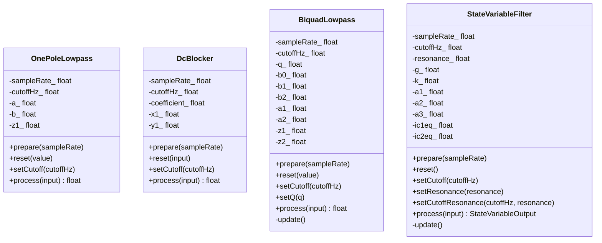
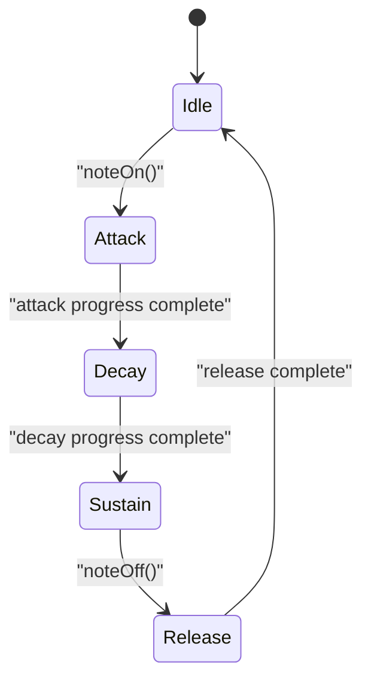
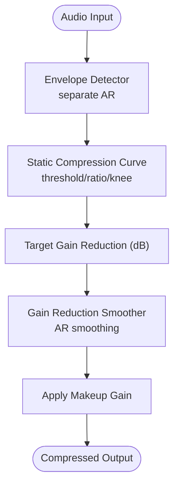
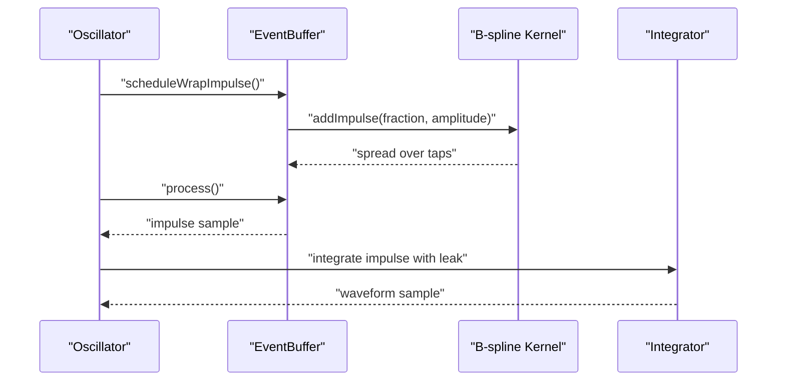
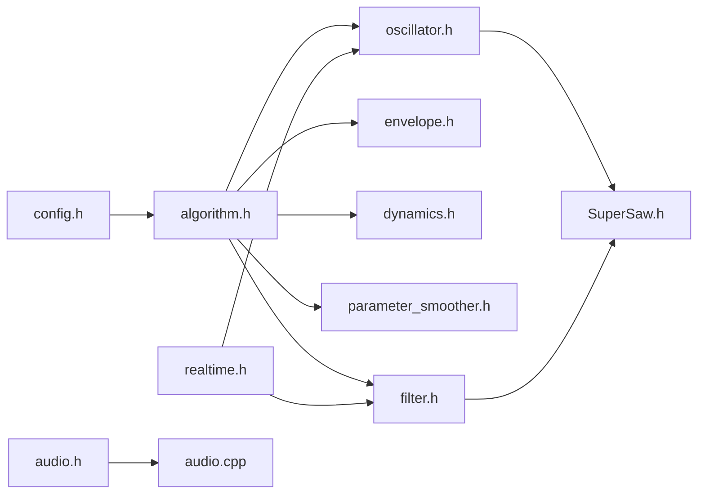

# Mathematical Foundations

<cite>
**Referenced Files in This Document**
- [README.md](file://README.md)
- [config.h](file://dsp/config.h)
- [algorithm.h](file://dsp/algorithm.h)
- [realtime.h](file://dsp/realtime.h)
- [filter.h](file://dsp/filter.h)
- [envelope.h](file://dsp/envelope.h)
- [dynamics.h](file://dsp/dynamics.h)
- [parameter_smoother.h](file://dsp/parameter_smoother.h)
- [oscillator.h](file://dsp/oscillator.h)
- [audio.h](file://audio/audio.h)
- [audio.cpp](file://audio/audio.cpp)
- [SuperSaw.h](file://Examples/SuperSaw/src/dsp/SuperSaw.h)
</cite>

## Table of Contents
1. [Introduction](#introduction)
2. [Project Structure](#project-structure)
3. [Core Components](#core-components)
4. [Architecture Overview](#architecture-overview)
5. [Detailed Component Analysis](#detailed-component-analysis)
6. [Dependency Analysis](#dependency-analysis)
7. [Performance Considerations](#performance-considerations)
8. [Troubleshooting Guide](#troubleshooting-guide)
9. [Conclusion](#conclusion)
10. [Appendices](#appendices)

## Introduction
This document explains the mathematical and computational foundations of the DSP library, focusing on numerical precision handling, denormal number elimination, mathematical constants, real-time constraints, and optimization techniques. It also documents the configuration system for sample rates and block sizes, and highlights template-free design patterns that enable compile-time optimization and code reuse. Where applicable, derivations and stability considerations are provided, along with guidance for benchmarking and tuning.

## Project Structure
The DSP library is organized into modular header-only components under the dsp/ directory, with supporting audio infrastructure in audio/. Example projects demonstrate usage and advanced synthesis.

**Diagram sources**
- [config.h:1-22](file://dsp/config.h#L1-L22)
- [algorithm.h:1-85](file://dsp/algorithm.h#L1-L85)
- [realtime.h:1-38](file://dsp/realtime.h#L1-L38)
- [filter.h:1-196](file://dsp/filter.h#L1-L196)
- [envelope.h:1-131](file://dsp/envelope.h#L1-L131)
- [dynamics.h:1-199](file://dsp/dynamics.h#L1-L199)
- [parameter_smoother.h:1-64](file://dsp/parameter_smoother.h#L1-L64)
- [oscillator.h:1-408](file://dsp/oscillator.h#L1-L408)
- [audio.h:1-311](file://audio/audio.h#L1-L311)
- [audio.cpp:1-257](file://audio/audio.cpp#L1-L257)
- [SuperSaw.h:1-210](file://Examples/SuperSaw/src/dsp/SuperSaw.h#L1-L210)

**Section sources**
- [README.md:1-101](file://README.md#L1-L101)
- [config.h:1-22](file://dsp/config.h#L1-L22)

## Core Components
- Constants and configuration
  - Default sample rate and block size define the real-time budget.
  - Mathematical constants π and 2π are provided for trigonometric computations.
  - Compile-time assertion enforces common block sizes for predictability.
- Numerical helpers
  - Clamping, linear interpolation, phase wrapping, dB-to-gain conversion, MIDI note to Hz mapping, safe sample rate fallback, cutoff clamping below Nyquist, one-pole smoothing coefficient computation, soft limiting, and equal-power panning.
- Real-time utilities
  - Denormal number elimination to prevent slow CPU handling on hosts.
  - Deterministic PRNG for noise sources.

**Section sources**
- [config.h:9-22](file://dsp/config.h#L9-L22)
- [algorithm.h:13-82](file://dsp/algorithm.h#L13-L82)
- [realtime.h:8-35](file://dsp/realtime.h#L8-L35)

## Architecture Overview
The DSP pipeline integrates configuration, numerical helpers, and real-time utilities with specialized modules for oscillators, filters, envelopes, dynamics, and parameter smoothing. Audio infrastructure provides buffer pooling and producer/consumer synchronization for real-time operation.

**Diagram sources**
- [audio.h:76-89](file://audio/audio.h#L76-L89)
- [audio.cpp:78-118](file://audio/audio.cpp#L78-L118)
- [audio.cpp:203-228](file://audio/audio.cpp#L203-L228)

## Detailed Component Analysis

### Configuration and Constants
- Purpose: Establish baseline real-time constraints and mathematical constants.
- Key behaviors:
  - Default sample rate and block size.
  - Compile-time enforced block sizes (16, 32, 64) for predictable scheduling.
  - π and 2π constants for phase and frequency computations.

**Section sources**
- [config.h:11-22](file://dsp/config.h#L11-L22)

### Numerical Helpers and Conversions
- Clamping and normalization ensure control signals remain within valid ranges.
- Phase wrapping prevents drift accumulation in oscillators.
- dB/gain conversions use a finite floor to avoid log(0).
- Safe sample rate fallback ensures robustness during initialization.
- Cutoff clamping preserves stability near Nyquist.
- One-pole smoothing computes exponential smoothing coefficients from time constants.
- Soft clip provides gentle limiting without hard clipping.
- Equal-power panning maintains perceived loudness balance.

**Diagram sources**
- [algorithm.h:13-82](file://dsp/algorithm.h#L13-L82)

**Section sources**
- [algorithm.h:13-82](file://dsp/algorithm.h#L13-L82)

### Denormal Number Elimination
- Problem: Very small floating-point values can trigger slow handling on some hosts.
- Solution: Replace tiny values with zero before feedback or state updates.
- Usage: Applied in filter and oscillator state updates to maintain consistent performance.

**Section sources**
- [realtime.h:8-11](file://dsp/realtime.h#L8-L11)
- [filter.h:28](file://dsp/filter.h#L28)
- [filter.h:59](file://dsp/filter.h#L59)
- [filter.h:100](file://dsp/filter.h#L100)
- [oscillator.h:209](file://dsp/oscillator.h#L209)
- [oscillator.h:266](file://dsp/oscillator.h#L266)
- [oscillator.h:336](file://dsp/oscillator.h#L336)

### Filters: Stability and Coefficient Derivations
- One-Pole Lowpass
  - Coefficients derived from exponential decay to preserve cutoff stability across sample rates.
  - State update form: y[n] = b*x[n] + a*y[n-1]; a = exp(-2π f_c / f_s), b = 1 - a.
- DC Blocker
  - High-pass difference term with feedback coefficient for bass preservation.
  - Uses the same exponential coefficient as the one-pole lowpass.
- Biquad Lowpass (RBJ Cookbook)
  - Normalized coefficients computed from digital equivalent of analog prototype.
  - Transposed Direct Form II for numerical robustness in per-sample processing.
- State Variable Filter (TPT)
  - Two-integrator topology with tangent parametrization for cutoff and resonance.
  - Uses g = tan(π f_c / f_s) and damping k tuned to avoid instability.

**Diagram sources**
- [filter.h:10-193](file://dsp/filter.h#L10-L193)

**Section sources**
- [filter.h:10-193](file://dsp/filter.h#L10-L193)

### Envelope Generator (ADSR)
- Integer sample counters ensure deterministic stage transitions across platforms.
- Attack/Decay/Sustain/Release durations are converted to samples using the configured sample rate.
- Release captures the current value to avoid clicks when releasing mid-envelope.

**Diagram sources**
- [envelope.h:7-98](file://dsp/envelope.h#L7-L98)

**Section sources**
- [envelope.h:7-128](file://dsp/envelope.h#L7-L128)

### Dynamics: Compressor and Smoothing
- Detector and smoother use one-pole exponential smoothing with separate attack/release coefficients.
- Static curve implements hard knee or quadratic knee compression with configurable threshold, ratio, and knee width.
- Makeup gain compensates for average attenuation.

**Diagram sources**
- [dynamics.h:91-196](file://dsp/dynamics.h#L91-L196)

**Section sources**
- [dynamics.h:9-199](file://dsp/dynamics.h#L9-L199)

### Parameter Smoothing
- Linear smoother provides sample-accurate ramps with configurable duration in milliseconds.
- Prevents discontinuities when targets change mid-ramp.

**Section sources**
- [parameter_smoother.h:10-64](file://dsp/parameter_smoother.h#L10-L64)

### Oscillators and Band-Limited Generation
- Phasor-based oscillators compute phase increments from frequency and sample rate, returning phase for waveform lookup.
- Trigonometric oscillators derive sine/triangle/saw/pulse from the phasor.
- Band-limited B-spline generation:
  - Impulse events are smeared using a quadratic B-spline kernel across three taps.
  - Integrator reconstructs waveforms; leaky integration suppresses DC drift.
  - Hard sync schedules impulses at master resets scaled by slave phase height.

**Diagram sources**
- [oscillator.h:146-237](file://dsp/oscillator.h#L146-L237)
- [oscillator.h:242-300](file://dsp/oscillator.h#L242-L300)
- [oscillator.h:309-394](file://dsp/oscillator.h#L309-L394)

**Section sources**
- [oscillator.h:39-408](file://dsp/oscillator.h#L39-L408)

### Example: HyperSaw Ensemble
- Seven sawtooth oscillators with non-linear detuning and a mix control that blends center and side components.
- A pitch-tracked high-pass filter shapes the spectrum.

**Section sources**
- [SuperSaw.h:26-210](file://Examples/SuperSaw/src/dsp/SuperSaw.h#L26-L210)

## Dependency Analysis
- DSP modules depend on config.h for constants and algorithm.h for numerical helpers.
- Real-time utilities (denormal zap and PRNG) are used across filters and oscillators.
- Audio infrastructure provides buffer pools and synchronization primitives for real-time operation.

**Diagram sources**
- [config.h:1-22](file://dsp/config.h#L1-L22)
- [algorithm.h:1-85](file://dsp/algorithm.h#L1-L85)
- [realtime.h:1-38](file://dsp/realtime.h#L1-L38)
- [filter.h:1-196](file://dsp/filter.h#L1-L196)
- [envelope.h:1-131](file://dsp/envelope.h#L1-L131)
- [dynamics.h:1-199](file://dsp/dynamics.h#L1-L199)
- [parameter_smoother.h:1-64](file://dsp/parameter_smoother.h#L1-L64)
- [oscillator.h:1-408](file://dsp/oscillator.h#L1-L408)
- [audio.h:1-311](file://audio/audio.h#L1-L311)
- [audio.cpp:1-257](file://audio/audio.cpp#L1-L257)
- [SuperSaw.h:1-210](file://Examples/SuperSaw/src/dsp/SuperSaw.h#L1-L210)

**Section sources**
- [audio.h:76-89](file://audio/audio.h#L76-L89)
- [audio.cpp:78-118](file://audio/audio.cpp#L78-L118)

## Performance Considerations
- Floating-point precision
  - Use single-precision arithmetic consistently for real-time loops.
  - Avoid unnecessary conversions between float and integer types in tight loops.
- Denormal elimination
  - Apply zapDenormal to feedback terms and integrators to prevent performance stalls on hosts.
- Memory alignment and access
  - Prefer contiguous arrays for state variables and minimal pointer indirection.
  - Keep per-sample operations branchless where possible.
- Block-based processing
  - Process in blocks of 16/32/64 samples to amortize overhead and improve cache locality.
- Exponential smoothing
  - Precompute one-pole coefficients once per parameter change; reuse in the audio loop.
- Band-limited synthesis
  - B-spline impulse smearing trades extra arithmetic for reduced aliasing; tune leak and frequency limits to balance quality and cost.
- Buffer management
  - Producer/consumer pools with spinlocks minimize blocking; ensure adequate buffer counts to avoid underruns.

[No sources needed since this section provides general guidance]

## Troubleshooting Guide
- Clicks or pops on note release
  - Ensure ADSR release captures the current envelope value to avoid discontinuities.
- Unstable filters or oscillators
  - Verify cutoff is clamped below 0.99×Nyquist and that increments are bounded.
- Slow performance on host builds
  - Confirm zapDenormal is applied to feedback paths and integrators.
- Buffer underruns or overrun
  - Increase buffer count or reduce latency; ensure producer/consumer synchronization is intact.

**Section sources**
- [envelope.h:46-53](file://dsp/envelope.h#L46-L53)
- [filter.h:57-60](file://dsp/filter.h#L57-L60)
- [oscillator.h:214](file://dsp/oscillator.h#L214)
- [audio.cpp:78-118](file://audio/audio.cpp#L78-L118)

## Conclusion
The DSP library combines robust numerical primitives, real-time-safe utilities, and well-conditioned filter designs to deliver reliable audio synthesis on embedded platforms. By enforcing predictable block sizes, eliminating denormals, and using efficient smoothing and band-limited generation, the library achieves both quality and performance. The modular design enables straightforward integration into real-time audio callbacks and example projects.

[No sources needed since this section summarizes without analyzing specific files]

## Appendices

### Configuration Reference
- Sample rate
  - Default: 48000 Hz; validated via safeSampleRate.
  - Used to compute cutoffs, smoothing coefficients, and phase increments.
- Block size
  - Defaults to 32; enforced to 16/32/64 for predictability.
- Mathematical constants
  - π and 2π provided for trigonometric computations.

**Section sources**
- [config.h:11-22](file://dsp/config.h#L11-L22)
- [algorithm.h:51-53](file://dsp/algorithm.h#L51-L53)

### Template-Free Design Patterns
- Header-only libraries simplify compilation and enable aggressive inlining.
- Inline functions and constexpr constants allow compile-time evaluation of coefficients and constants.
- Class-based encapsulation of state and preparation steps promotes reuse and modularity.

**Section sources**
- [algorithm.h:1-85](file://dsp/algorithm.h#L1-L85)
- [filter.h:10-193](file://dsp/filter.h#L10-L193)
- [oscillator.h:39-408](file://dsp/oscillator.h#L39-L408)