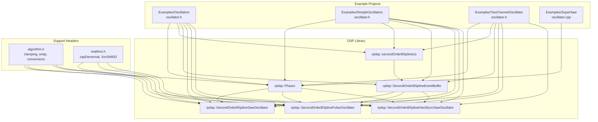
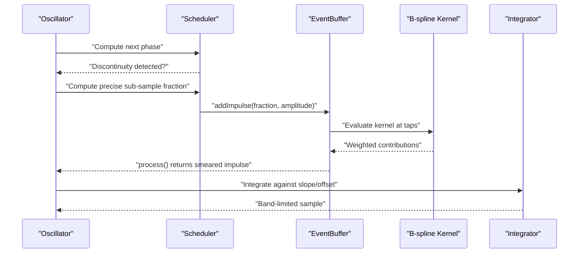
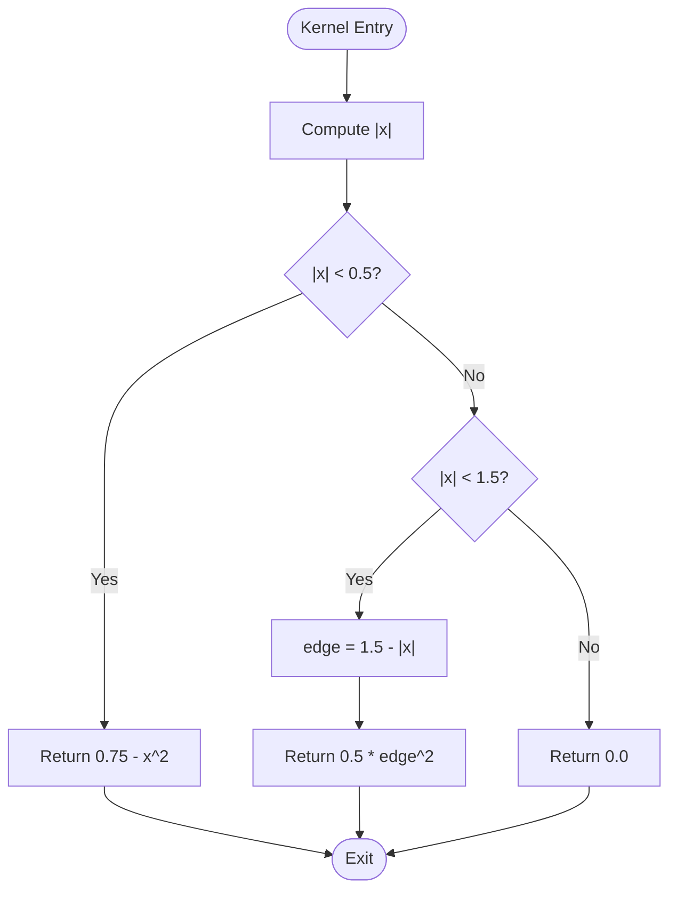
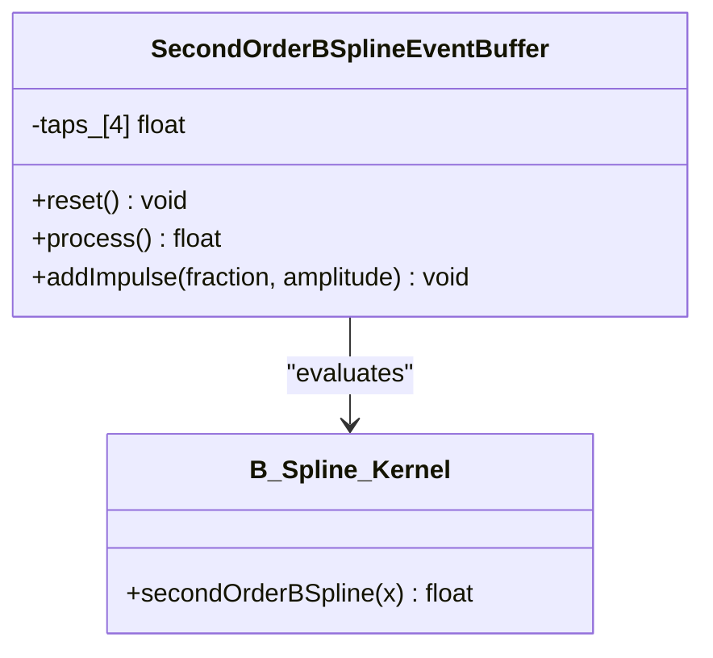
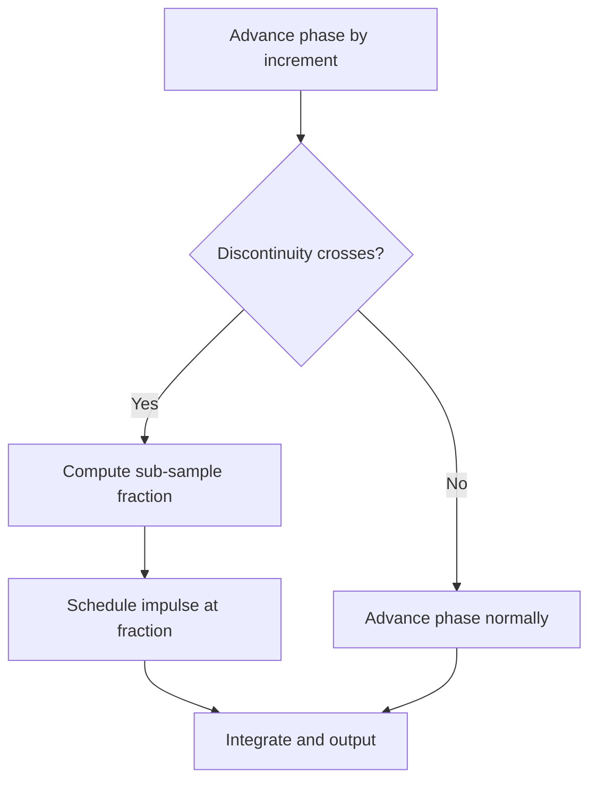
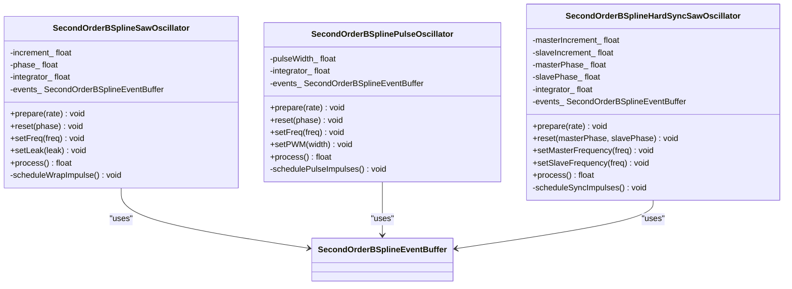
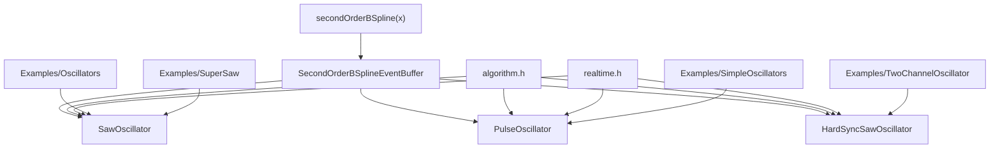

# B-Spline Kernel Theory and Implementation

<cite>
**Referenced Files in This Document**
- [oscillator.h](file://dsp/oscillator.h)
- [oscillator.h](file://Examples/Oscillators/src/dsp/oscillator.h)
- [oscillator.h](file://Examples/SimpleOscillators/src/dsp/oscillator.h)
- [oscillator.h](file://Examples/TwoChannelOscillator/src/dsp/oscillator.h)
- [oscillator.cpp](file://Examples/SuperSaw/src/dsp/oscillator.cpp)
- [algorithm.h](file://dsp/algorithm.h)
- [realtime.h](file://dsp/realtime.h)
- [README.md](file://README.md)
</cite>

## Table of Contents
1. [Introduction](#introduction)
2. [Project Structure](#project-structure)
3. [Core Components](#core-components)
4. [Architecture Overview](#architecture-overview)
5. [Detailed Component Analysis](#detailed-component-analysis)
6. [Dependency Analysis](#dependency-analysis)
7. [Performance Considerations](#performance-considerations)
8. [Troubleshooting Guide](#troubleshooting-guide)
9. [Conclusion](#conclusion)

## Introduction
This document explains the mathematical foundation of B-spline kernel techniques for anti-aliasing in digital audio synthesis. It focuses on how waveforms are treated as integrals of impulses and how the second-order B-spline kernel provides smooth 3-sample support for impulse smearing. The document covers the kernel’s bell-shaped curve, C1 continuity, and superior spectral rolloff compared to linear interpolation. It also details the impulse scheduling algorithm that computes precise sub-sample timing for discontinuities and the smear step that distributes impulse energy across neighboring samples. Practical examples demonstrate how the kernel reduces aliasing artifacts and maintains audio quality at higher frequencies.

## Project Structure
The B-spline anti-aliasing implementation lives in the rpdsp DSP library under the main header file for oscillators. Supporting headers provide numerical utilities and real-time helpers. Example projects illustrate usage patterns and show how the technique integrates with broader synthesis architectures.

**Diagram sources**
- [oscillator.h:39-407](file://dsp/oscillator.h#L39-L407)
- [oscillator.h:39-407](file://Examples/Oscillators/src/dsp/oscillator.h#L39-L407)
- [oscillator.h:39-407](file://Examples/SimpleOscillators/src/dsp/oscillator.h#L39-L407)
- [oscillator.h:39-407](file://Examples/TwoChannelOscillator/src/dsp/oscillator.h#L39-L407)
- [oscillator.cpp:36-83](file://Examples/SuperSaw/src/dsp/oscillator.cpp#L36-L83)
- [algorithm.h:14-67](file://dsp/algorithm.h#L14-L67)
- [realtime.h:8-35](file://dsp/realtime.h#L8-L35)

**Section sources**
- [README.md:30-37](file://README.md#L30-L37)
- [oscillator.h:9-36](file://dsp/oscillator.h#L9-L36)

## Core Components
- B-spline kernel definition: A smooth, bell-shaped function with 3-sample support that spreads a single impulse across neighboring samples to achieve band-limited reconstruction.
- Event buffer: A 3-tap delay line that receives sub-sample impulses and shifts them out one sample per tick, distributing energy across the correct time grid.
- Oscillator family: Specialized oscillators built on top of the kernel and event buffer to reconstruct sawtooth, square/pulse, and hard-synced saw signals without aliasing.

Key implementation references:
- B-spline kernel definition and comments: [secondOrderBSpline:124-139](file://dsp/oscillator.h#L124-L139)
- Event buffer class and smear step: [SecondOrderBSplineEventBuffer:146-177](file://dsp/oscillator.h#L146-L177)
- Saw reconstruction pipeline: [SecondOrderBSplineSawOscillator:182-237](file://dsp/oscillator.h#L182-L237)
- Square/pulse reconstruction: [SecondOrderBSplinePulseOscillator:242-299](file://dsp/oscillator.h#L242-L299)
- Hard-sync saw reconstruction: [SecondOrderBSplineHardSyncSawOscillator:309-394](file://dsp/oscillator.h#L309-L394)

**Section sources**
- [oscillator.h:124-177](file://dsp/oscillator.h#L124-L177)
- [oscillator.h:182-237](file://dsp/oscillator.h#L182-L237)
- [oscillator.h:242-299](file://dsp/oscillator.h#L242-L299)
- [oscillator.h:309-394](file://dsp/oscillator.h#L309-L394)

## Architecture Overview
The anti-aliasing architecture treats waveforms as integrals of impulses. Discontinuities occur at precise sub-sample times; these are captured and smeared across 3 samples using the B-spline kernel. The resulting smeared energy is integrated to reconstruct the band-limited waveform.

**Diagram sources**
- [oscillator.h:216-228](file://dsp/oscillator.h#L216-L228)
- [oscillator.h:164-173](file://dsp/oscillator.h#L164-L173)
- [oscillator.h:203-211](file://dsp/oscillator.h#L203-L211)
- [oscillator.h:263-268](file://dsp/oscillator.h#L263-L268)
- [oscillator.h:333-338](file://dsp/oscillator.h#L333-L338)

## Detailed Component Analysis

### B-spline Kernel Definition and Properties
The second-order B-spline kernel is a smooth, bell-shaped function with compact support. It is defined piecewise and ensures C1 continuity, which leads to faster spectral rolloff than linear interpolation. The kernel is evaluated at positions centered around the current sample to distribute impulse energy across 3 neighboring taps.

Mathematical properties:
- Bell-shaped curve: The kernel is symmetric and non-negative, peaking at the center and tapering to zero at ±1.5 samples.
- Compact support: Non-zero only within a 3-sample window.
- Smoothness: Continuous first derivative (C1), reducing high-frequency artifacts.
- Spectral rolloff: Faster than linear interpolation, improving anti-aliasing performance.

Implementation highlights:
- Piecewise definition with two regions and a central plateau region.
- Centering logic aligns the kernel peak with the nearest tap for precise distribution.

References:
- Kernel definition and comments: [secondOrderBSpline:124-139](file://dsp/oscillator.h#L124-L139)
- Smear step and tap distribution: [addImpulse:164-173](file://dsp/oscillator.h#L164-L173)

**Diagram sources**
- [oscillator.h:124-139](file://dsp/oscillator.h#L124-L139)

**Section sources**
- [oscillator.h:124-139](file://dsp/oscillator.h#L124-L139)

### Event Buffer and Smear Step
The event buffer is a 3-tap delay line plus a spare tap. Each sub-sample impulse is smeared across taps 0..2 using the B-spline kernel. On each sample tick, the buffer shifts taps down and outputs the leading tap’s contribution.

Key steps:
- Center the kernel peak on the correct tap using a half-sample offset.
- Evaluate the kernel at each of the 3 contributing taps.
- Accumulate weighted contributions into the buffer.
- Shift and output the next sample’s worth of smeared energy.

References:
- Event buffer class and methods: [SecondOrderBSplineEventBuffer:146-177](file://dsp/oscillator.h#L146-L177)
- Smear computation: [addImpulse:164-173](file://dsp/oscillator.h#L164-L173)

**Diagram sources**
- [oscillator.h:146-177](file://dsp/oscillator.h#L146-L177)
- [oscillator.h:124-139](file://dsp/oscillator.h#L124-L139)

**Section sources**
- [oscillator.h:146-177](file://dsp/oscillator.h#L146-L177)
- [oscillator.h:164-173](file://dsp/oscillator.h#L164-L173)

### Impulse Scheduling Algorithm
Precise sub-sample timing is computed at discontinuity instants to minimize aliasing. The scheduler determines the exact fractional position within the current sample period and schedules an impulse at that time.

- Saw reconstruction: At each wrap, compute the sub-sample fraction as the time until wrap divided by the increment.
- Square/pulse reconstruction: Detect crossings of rising/falling edges and the wrap boundary; schedule impulses accordingly.
- Hard-sync saw: Track both master and slave increments; when they align, schedule a special impulse sized to the slave’s current ramp height.

References:
- Saw scheduling: [scheduleWrapImpulse:216-228](file://dsp/oscillator.h#L216-L228)
- Square/pulse scheduling: [schedulePulseImpulses:279-291](file://dsp/oscillator.h#L279-L291)
- Hard-sync scheduling: [scheduleSyncImpulses:348-383](file://dsp/oscillator.h#L348-L383)

**Diagram sources**
- [oscillator.h:216-228](file://dsp/oscillator.h#L216-L228)
- [oscillator.h:279-291](file://dsp/oscillator.h#L279-L291)
- [oscillator.h:348-383](file://dsp/oscillator.h#L348-L383)

**Section sources**
- [oscillator.h:216-228](file://dsp/oscillator.h#L216-L228)
- [oscillator.h:279-291](file://dsp/oscillator.h#L279-L291)
- [oscillator.h:348-383](file://dsp/oscillator.h#L348-L383)

### Oscillator Implementations
- SecondOrderBSplineSawOscillator: Reconstructs a sawtooth by integrating a constant negative slope against impulses placed at each wrap. Includes a leaky integrator to prevent DC drift.
- SecondOrderBSplinePulseOscillator: Reconstructs square/pulse by integrating alternating edge impulses; supports PWM by detecting crossings.
- SecondOrderBSplineHardSyncSawOscillator: Implements hard-sync by resetting the slave ramp at master wrap; schedules a corrective impulse sized to the slave’s current height.

References:
- Saw oscillator: [SecondOrderBSplineSawOscillator:182-237](file://dsp/oscillator.h#L182-L237)
- Pulse oscillator: [SecondOrderBSplinePulseOscillator:242-299](file://dsp/oscillator.h#L242-L299)
- Hard-sync oscillator: [SecondOrderBSplineHardSyncSawOscillator:309-394](file://dsp/oscillator.h#L309-L394)

**Diagram sources**
- [oscillator.h:182-237](file://dsp/oscillator.h#L182-L237)
- [oscillator.h:242-299](file://dsp/oscillator.h#L242-L299)
- [oscillator.h:309-394](file://dsp/oscillator.h#L309-L394)

**Section sources**
- [oscillator.h:182-237](file://dsp/oscillator.h#L182-L237)
- [oscillator.h:242-299](file://dsp/oscillator.h#L242-L299)
- [oscillator.h:309-394](file://dsp/oscillator.h#L309-L394)

### Practical Examples and Aliasing Reduction
- Higher frequencies: The smoother kernel and precise sub-sample scheduling reduce high-frequency energy that would otherwise fold into the audible band.
- Square/pulse harmonics: Alternating impulses at edges produce cleaner harmonic content compared to naive square waves, with reduced aliasing at partials near the Nyquist boundary.
- Hard-sync sweeps: The special impulse at reset avoids full-step discontinuities, preserving timbral integrity while maintaining anti-aliasing.

References:
- Kernel comments emphasizing smoothness and rolloff: [secondOrderBSpline:124-139](file://dsp/oscillator.h#L124-L139)
- Example oscillator implementations: [SecondOrderBSplineSawOscillator:182-237](file://dsp/oscillator.h#L182-L237), [SecondOrderBSplinePulseOscillator:242-299](file://dsp/oscillator.h#L242-L299), [SecondOrderBSplineHardSyncSawOscillator:309-394](file://dsp/oscillator.h#L309-L394)

**Section sources**
- [oscillator.h:124-139](file://dsp/oscillator.h#L124-L139)
- [oscillator.h:182-237](file://dsp/oscillator.h#L182-L237)
- [oscillator.h:242-299](file://dsp/oscillator.h#L242-L299)
- [oscillator.h:309-394](file://dsp/oscillator.h#L309-L394)

## Dependency Analysis
The B-spline anti-aliasing pipeline depends on:
- Numerical utilities for clamping, wrapping, and safe sample-rate handling.
- Real-time helpers for denormal suppression and noise generation.
- Example projects that demonstrate integration patterns and complementary techniques (e.g., polyBLEP).

**Diagram sources**
- [oscillator.h:124-177](file://dsp/oscillator.h#L124-L177)
- [oscillator.h:182-237](file://dsp/oscillator.h#L182-L237)
- [oscillator.h:242-299](file://dsp/oscillator.h#L242-L299)
- [oscillator.h:309-394](file://dsp/oscillator.h#L309-L394)
- [algorithm.h:14-67](file://dsp/algorithm.h#L14-L67)
- [realtime.h:8-35](file://dsp/realtime.h#L8-L35)
- [oscillator.cpp:36-83](file://Examples/SuperSaw/src/dsp/oscillator.cpp#L36-L83)

**Section sources**
- [oscillator.h:124-177](file://dsp/oscillator.h#L124-L177)
- [oscillator.h:182-237](file://dsp/oscillator.h#L182-L237)
- [oscillator.h:242-299](file://dsp/oscillator.h#L242-L299)
- [oscillator.h:309-394](file://dsp/oscillator.h#L309-L394)
- [algorithm.h:14-67](file://dsp/algorithm.h#L14-L67)
- [realtime.h:8-35](file://dsp/realtime.h#L8-L35)
- [oscillator.cpp:36-83](file://Examples/SuperSaw/src/dsp/oscillator.cpp#L36-L83)

## Performance Considerations
- Computational cost: Each sample requires a few arithmetic operations per scheduled impulse and a fixed number of kernel evaluations per contributing tap.
- Memory footprint: The event buffer stores a small number of floats per channel; memory usage scales linearly with the number of voices.
- Stability: The leaky integrator prevents DC drift accumulation; zapDenormal helps avoid denormalized floating-point penalties in real-time contexts.
- Practical tips:
  - Clamp frequencies below 0.49×sampleRate to avoid instability.
  - Use the provided clamping utilities for control parameters.
  - Prefer the B-spline approach for waveforms with sharp edges to reduce aliasing artifacts.

[No sources needed since this section provides general guidance]

## Troubleshooting Guide
Common issues and remedies:
- Excessive aliasing at high frequencies:
  - Verify sub-sample fractions are computed precisely at discontinuities.
  - Confirm the kernel is evaluated at the correct tap positions.
- DC drift or low-frequency bias:
  - Ensure the leaky integrator is enabled and tuned appropriately.
  - Apply zapDenormal to suppress denormalized values.
- Incorrect hard-sync behavior:
  - Check the guard condition and elapsed-time logic in the sync scheduler.
  - Validate that the corrective impulse is sized to the slave’s current ramp height.

References:
- Leak and integrator handling: [SecondOrderBSplineSawOscillator:201-211](file://dsp/oscillator.h#L201-L211), [SecondOrderBSplineHardSyncSawOscillator:336-338](file://dsp/oscillator.h#L336-L338)
- Denormal suppression: [zapDenormal:8-11](file://dsp/realtime.h#L8-L11)
- Sync scheduling guard: [scheduleSyncImpulses:354-356](file://dsp/oscillator.h#L354-L356)

**Section sources**
- [oscillator.h:201-211](file://dsp/oscillator.h#L201-L211)
- [oscillator.h:336-338](file://dsp/oscillator.h#L336-L338)
- [realtime.h:8-11](file://dsp/realtime.h#L8-L11)
- [oscillator.h:354-356](file://dsp/oscillator.h#L354-L356)

## Conclusion
The B-spline kernel technique provides a robust, mathematically grounded approach to anti-aliasing in digital synthesis. By treating waveforms as integrals of impulses and precisely scheduling sub-sample discontinuities, followed by smooth smearing across 3 samples, the method achieves superior spectral rolloff and reduced aliasing artifacts. The implementation in this codebase demonstrates clean separation of concerns: a smooth kernel, a dedicated event buffer, and specialized oscillators that integrate scheduling, smearing, and integration into coherent, high-quality audio generators.