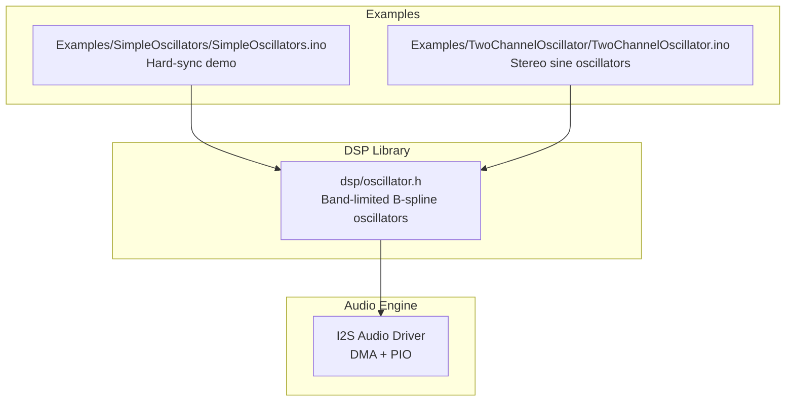
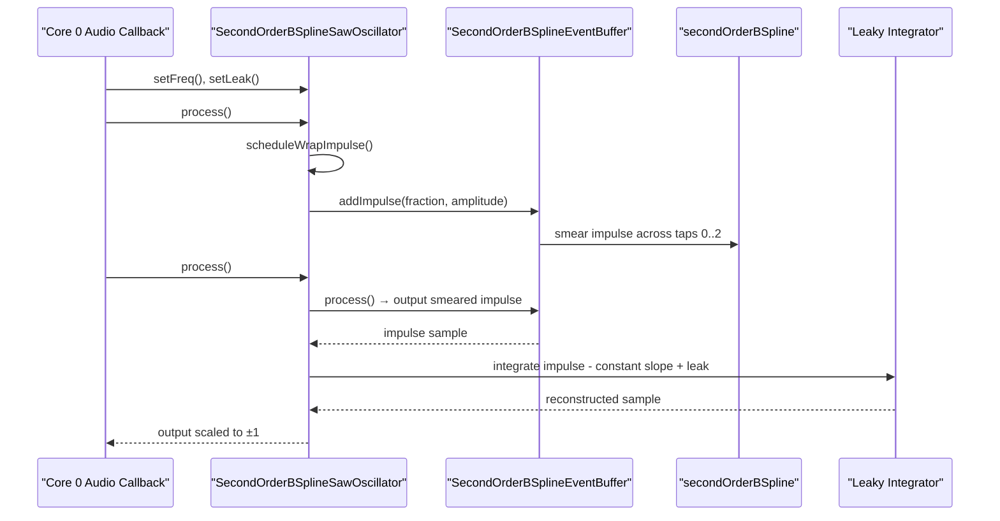
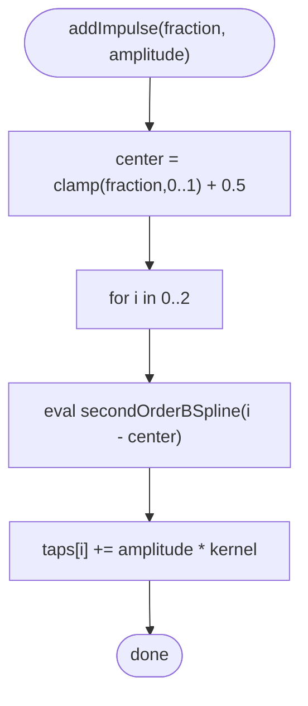
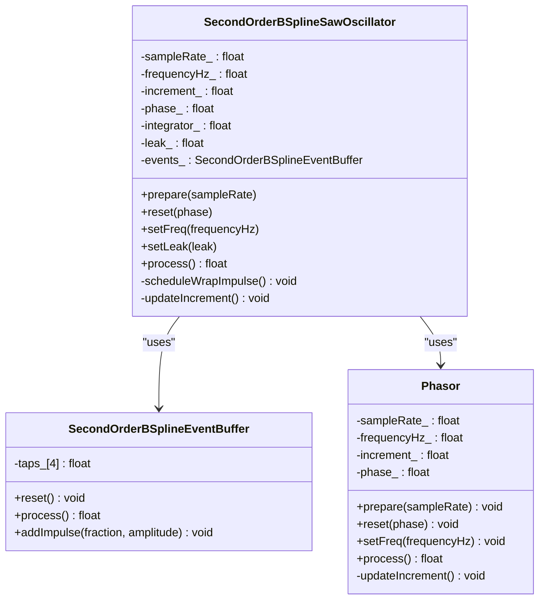
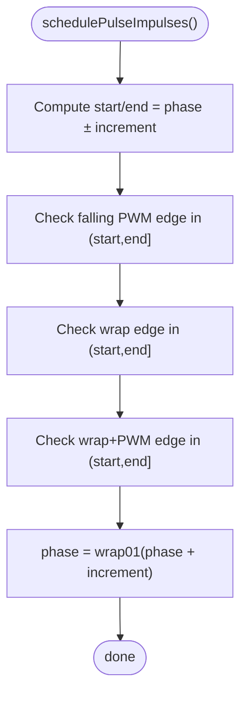
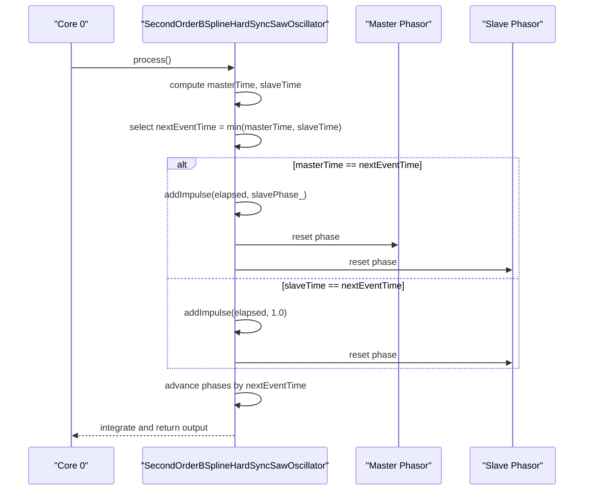
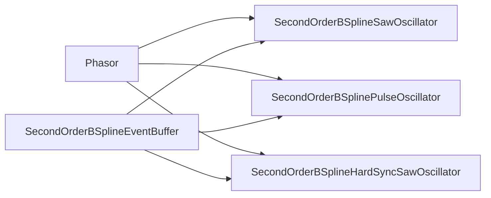

# Band-Limited B-Spline Oscillators

<cite>
**Referenced Files in This Document**
- [oscillator.h](file://dsp/oscillator.h)
- [SimpleOscillators.ino](file://Examples/SimpleOscillators/SimpleOscillators.ino)
- [TwoChannelOscillator.ino](file://Examples/TwoChannelOscillator/TwoChannelOscillator.ino)
- [README.md](file://README.md)
</cite>

## Table of Contents
1. [Introduction](#introduction)
2. [Project Structure](#project-structure)
3. [Core Components](#core-components)
4. [Architecture Overview](#architecture-overview)
5. [Detailed Component Analysis](#detailed-component-analysis)
6. [Dependency Analysis](#dependency-analysis)
7. [Performance Considerations](#performance-considerations)
8. [Troubleshooting Guide](#troubleshooting-guide)
9. [Conclusion](#conclusion)
10. [Appendices](#appendices)

## Introduction
This document explains the advanced band-limited oscillator family built on B-spline kernel techniques. It focuses on the mathematical foundation of treating waveforms as integrals of impulses, the role of the 2nd-order B-spline kernel for anti-aliasing, and the leaky integrator reconstruction process. It documents the three main oscillator types:
- SecondOrderBSplineSawOscillator
- SecondOrderBSplinePulseOscillator
- SecondOrderBSplineHardSyncSawOscillator

It also covers the impulse scheduling algorithm, sub-sample timing precision, aliasing reduction techniques, and practical examples of chaining oscillators, hard-sync setups, and PWM control.

## Project Structure
The core implementation resides in the DSP header-only library under the rpdsp namespace. Example sketches demonstrate real-time usage with dual-core audio processing and I2S output.

**Diagram sources**
- [oscillator.h:1-408](file://dsp/oscillator.h#L1-L408)
- [SimpleOscillators.ino:1-216](file://Examples/SimpleOscillators/SimpleOscillators.ino#L1-L216)
- [TwoChannelOscillator.ino:1-167](file://Examples/TwoChannelOscillator/TwoChannelOscillator.ino#L1-L167)

**Section sources**
- [README.md:30-37](file://README.md#L30-L37)
- [oscillator.h:1-408](file://dsp/oscillator.h#L1-L408)

## Core Components
- Phasor: Shared phase accumulator with a consistent phase convention across oscillators.
- secondOrderBSpline: 2nd-order (quadratic) uniform B-spline kernel with 3-sample support, C1 smoothness, and faster-than-linear spectral roll-off.
- SecondOrderBSplineEventBuffer: 3-tap delay-line performing the “smear” step. Events scheduled at sub-sample times are spread across taps 0..2 by the B-spline kernel; process() shifts taps out one sample per tick.
- SecondOrderBSplineSawOscillator: Treats a sawtooth as an integral of impulses plus a constant negative slope; uses a leaky integrator to reconstruct the waveform.
- SecondOrderBSplinePulseOscillator: Treats a square/pulse as an integral of alternating edge impulses; integrates to ±1 output.
- SecondOrderBSplineHardSyncSawOscillator: A slave saw synchronized to a master; at each master wrap, a corrective impulse sized to the slave’s current ramp height is injected.

Key implementation references:
- [Phasor:39-69](file://dsp/oscillator.h#L39-L69)
- [secondOrderBSpline:124-139](file://dsp/oscillator.h#L124-L139)
- [SecondOrderBSplineEventBuffer:146-177](file://dsp/oscillator.h#L146-L177)
- [SecondOrderBSplineSawOscillator:182-237](file://dsp/oscillator.h#L182-L237)
- [SecondOrderBSplinePulseOscillator:242-300](file://dsp/oscillator.h#L242-L300)
- [SecondOrderBSplineHardSyncSawOscillator:309-394](file://dsp/oscillator.h#L309-L394)

**Section sources**
- [oscillator.h:124-394](file://dsp/oscillator.h#L124-L394)

## Architecture Overview
The B-spline band-limited pipeline:
1. Impulse generation at phase discontinuities (wrap edges, PWM edges, hard-sync resets).
2. Sub-sample precise placement of impulses using fractional phase differences.
3. Smearing via the 2nd-order B-spline kernel across 3 samples.
4. Reconstruction by a leaky integrator to yield band-limited waveforms.

**Diagram sources**
- [oscillator.h:182-237](file://dsp/oscillator.h#L182-L237)
- [oscillator.h:146-177](file://dsp/oscillator.h#L146-L177)
- [oscillator.h:124-139](file://dsp/oscillator.h#L124-L139)

## Detailed Component Analysis

### Mathematical Foundation: Waveforms as Integrals of Impulses
- A sawtooth is modeled as a periodic train of impulses (rising edge) integrated against a constant negative slope. The discontinuity is placed precisely at the sub-sample wrap time to minimize aliasing.
- A square/pulse waveform is modeled as alternating impulses at rising and falling edges; integrating yields ±1 output.
- Hard-sync adds a corrective impulse sized to the slave’s current ramp height each time the master resets the slave.

References:
- [SecondOrderBSplineSawOscillator:182-237](file://dsp/oscillator.h#L182-L237)
- [SecondOrderBSplinePulseOscillator:242-300](file://dsp/oscillator.h#L242-L300)
- [SecondOrderBSplineHardSyncSawOscillator:309-394](file://dsp/oscillator.h#L309-L394)

**Section sources**
- [oscillator.h:182-300](file://dsp/oscillator.h#L182-L300)

### 2nd-Order B-Spline Kernel and Anti-Aliasing
- The 2nd-order B-spline is a smooth, bell-shaped kernel with 3-sample support and C1 continuity. Its spectrum decays faster than linear interpolation, reducing aliasing.
- The kernel is evaluated at positions centered around the correct tap to smear each impulse across taps 0..2.

References:
- [secondOrderBSpline:124-139](file://dsp/oscillator.h#L124-L139)

**Section sources**
- [oscillator.h:124-139](file://dsp/oscillator.h#L124-L139)

### SecondOrderBSplineEventBuffer: Impulse Smearing Across 3 Samples
- Maintains a 4-tap delay line (taps 0..3). On process(), the leading tap is output and the remaining taps are shifted left; the trailing tap is cleared.
- addImpulse(fraction, amplitude) spreads the impulse across taps 0..2 using the B-spline kernel centered at the sub-sample position.

**Diagram sources**
- [oscillator.h:164-173](file://dsp/oscillator.h#L164-L173)

**Section sources**
- [oscillator.h:146-177](file://dsp/oscillator.h#L146-L177)

### SecondOrderBSplineSawOscillator
- Tracks phase with a shared Phasor and schedules a wrap impulse at the exact sub-sample time when phase crosses 1.0.
- Integrates the smeared impulse against a constant negative slope and applies a tiny leak to prevent DC drift.
- Output is scaled to ±1.

**Diagram sources**
- [oscillator.h:182-237](file://dsp/oscillator.h#L182-L237)
- [oscillator.h:146-177](file://dsp/oscillator.h#L146-L177)
- [oscillator.h:39-69](file://dsp/oscillator.h#L39-L69)

**Section sources**
- [oscillator.h:182-237](file://dsp/oscillator.h#L182-L237)

### SecondOrderBSplinePulseOscillator
- Schedules impulses at both the falling PWM edge and the wrap edge during the current increment window. The wrap can expose a next-cycle PWM edge, handled by extending the edge checks.
- Integrates impulses to produce ±1 output.

**Diagram sources**
- [oscillator.h:279-291](file://dsp/oscillator.h#L279-L291)

**Section sources**
- [oscillator.h:242-300](file://dsp/oscillator.h#L242-L300)

### SecondOrderBSplineHardSyncSawOscillator
- Manages two independent phasors: master and slave. At each sample, determines whether a master wrap or a slave wrap occurs first.
- When the master wraps, injects a corrective impulse sized to the slave’s current ramp height; otherwise, a normal wrap impulse is injected.
- Handles multiple slave wraps within one master sample at high sync ratios with a guard loop.

**Diagram sources**
- [oscillator.h:348-383](file://dsp/oscillator.h#L348-L383)

**Section sources**
- [oscillator.h:309-394](file://dsp/oscillator.h#L309-L394)

### Practical Usage Examples

#### Chaining Oscillators
- Multiple oscillators can be instantiated and summed in the audio callback. The SimpleOscillators example demonstrates a hard-sync saw with an LFO modulating the master frequency, while the TwoChannelOscillator example shows independent stereo sine oscillators controlled by ADC inputs.

References:
- [SimpleOscillators.ino:35-111](file://Examples/SimpleOscillators/SimpleOscillators.ino#L35-L111)
- [TwoChannelOscillator.ino:32-82](file://Examples/TwoChannelOscillator/TwoChannelOscillator.ino#L32-L82)

**Section sources**
- [SimpleOscillators.ino:35-111](file://Examples/SimpleOscillators/SimpleOscillators.ino#L35-L111)
- [TwoChannelOscillator.ino:32-82](file://Examples/TwoChannelOscillator/TwoChannelOscillator.ino#L32-L82)

#### Hard-Sync Setup
- Configure a master and slave frequency; the oscillator injects corrective impulses at master wraps sized to the slave’s current ramp height. The example modulates the master frequency with an LFO to sweep the timbre.

References:
- [SecondOrderBSplineHardSyncSawOscillator:309-394](file://dsp/oscillator.h#L309-L394)
- [SimpleOscillators.ino:73-111](file://Examples/SimpleOscillators/SimpleOscillators.ino#L73-L111)

**Section sources**
- [oscillator.h:309-394](file://dsp/oscillator.h#L309-L394)
- [SimpleOscillators.ino:73-111](file://Examples/SimpleOscillators/SimpleOscillators.ino#L73-L111)

#### PWM Control
- The pulse oscillator exposes a setPWM(width) method and schedules impulses at the falling edge and wrap edge. The width parameter is clamped to a safe range to avoid instability.

References:
- [SecondOrderBSplinePulseOscillator:242-300](file://dsp/oscillator.h#L242-L300)
- [TwoChannelOscillator.ino:32-82](file://Examples/TwoChannelOscillator/TwoChannelOscillator.ino#L32-L82)

**Section sources**
- [oscillator.h:242-300](file://dsp/oscillator.h#L242-L300)
- [TwoChannelOscillator.ino:32-82](file://Examples/TwoChannelOscillator/TwoChannelOscillator.ino#L32-L82)

## Dependency Analysis
- SecondOrderBSplineSawOscillator depends on Phasor for phase accumulation and SecondOrderBSplineEventBuffer for impulse smearing.
- SecondOrderBSplinePulseOscillator depends on Phasor and SecondOrderBSplineEventBuffer; it also computes edge crossings across the current increment window.
- SecondOrderBSplineHardSyncSawOscillator depends on two Phasors and SecondOrderBSplineEventBuffer; it coordinates master and slave events with careful sub-sample timing.

**Diagram sources**
- [oscillator.h:39-69](file://dsp/oscillator.h#L39-L69)
- [oscillator.h:146-177](file://dsp/oscillator.h#L146-L177)
- [oscillator.h:182-394](file://dsp/oscillator.h#L182-L394)

**Section sources**
- [oscillator.h:39-394](file://dsp/oscillator.h#L39-L394)

## Performance Considerations
- Sub-sample precision: Accurate computation of the exact wrap time minimizes aliasing by placing discontinuities precisely within the current sample interval.
- Clamping increments: Frequency increments are clamped to below half the Nyquist to prevent folding.
- Leak in integrator: A small leak prevents DC drift accumulation over long renders.
- Event scheduling: The hard-sync variant uses a guard loop to handle multiple slave wraps per master sample at high ratios.

References:
- [SecondOrderBSplineSawOscillator:214-228](file://dsp/oscillator.h#L214-L228)
- [SecondOrderBSplinePulseOscillator:271-291](file://dsp/oscillator.h#L271-L291)
- [SecondOrderBSplineHardSyncSawOscillator:341-383](file://dsp/oscillator.h#L341-L383)

**Section sources**
- [oscillator.h:214-383](file://dsp/oscillator.h#L214-L383)

## Troubleshooting Guide
- No output or weak signal:
  - Verify prepare(sampleRate) is called before setFreq().
  - Ensure process() is invoked in the audio callback.
- Aliasing or harsh harmonics:
  - Confirm sub-sample impulse placement is active (wrap impulses computed with exact fractions).
  - Reduce frequency or increase leak slightly if DC drift appears.
- Hard-sync instability:
  - Check that master and slave frequencies are set appropriately; avoid extremely high ratios without guard loops.
  - Ensure the guard loop conditions are met to prevent infinite loops.

References:
- [SecondOrderBSplineSawOscillator:182-237](file://dsp/oscillator.h#L182-L237)
- [SecondOrderBSplineHardSyncSawOscillator:309-394](file://dsp/oscillator.h#L309-L394)

**Section sources**
- [oscillator.h:182-394](file://dsp/oscillator.h#L182-L394)

## Conclusion
The B-spline band-limited oscillator family achieves high-quality, alias-free waveforms by modeling waveforms as integrals of impulses, precisely placing discontinuities at sub-sample times, smearing impulses with a smooth 2nd-order B-spline kernel, and reconstructing signals with leaky integrators. The provided oscillators—saw, pulse, and hard-sync saw—are efficient, numerically stable, and suitable for real-time synthesis in dual-core environments.

## Appendices

### API Summary
- Phasor
  - Methods: prepare(sampleRate), reset(phase), setFreq(frequencyHz), process(), phase()
- SecondOrderBSplineSawOscillator
  - Methods: prepare(sampleRate), reset(phase), setFreq(frequencyHz), setLeak(leak), process()
- SecondOrderBSplinePulseOscillator
  - Methods: prepare(sampleRate), reset(phase), setFreq(frequencyHz), setPWM(width), process()
- SecondOrderBSplineHardSyncSawOscillator
  - Methods: prepare(sampleRate), reset(masterPhase, slavePhase), setMasterFrequency(freq), setSlaveFrequency(freq), process()

References:
- [oscillator.h:39-394](file://dsp/oscillator.h#L39-L394)