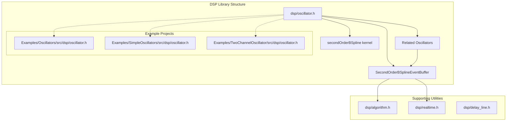
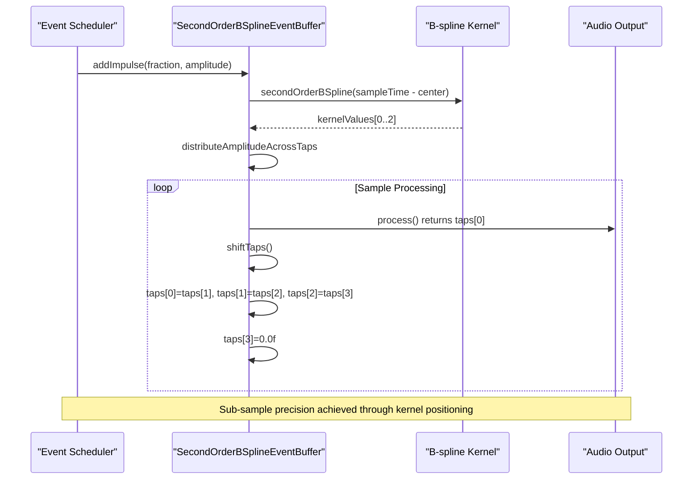
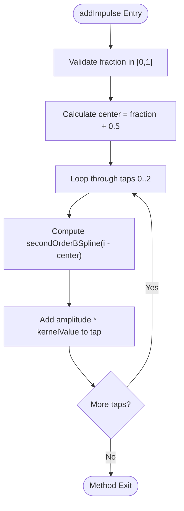
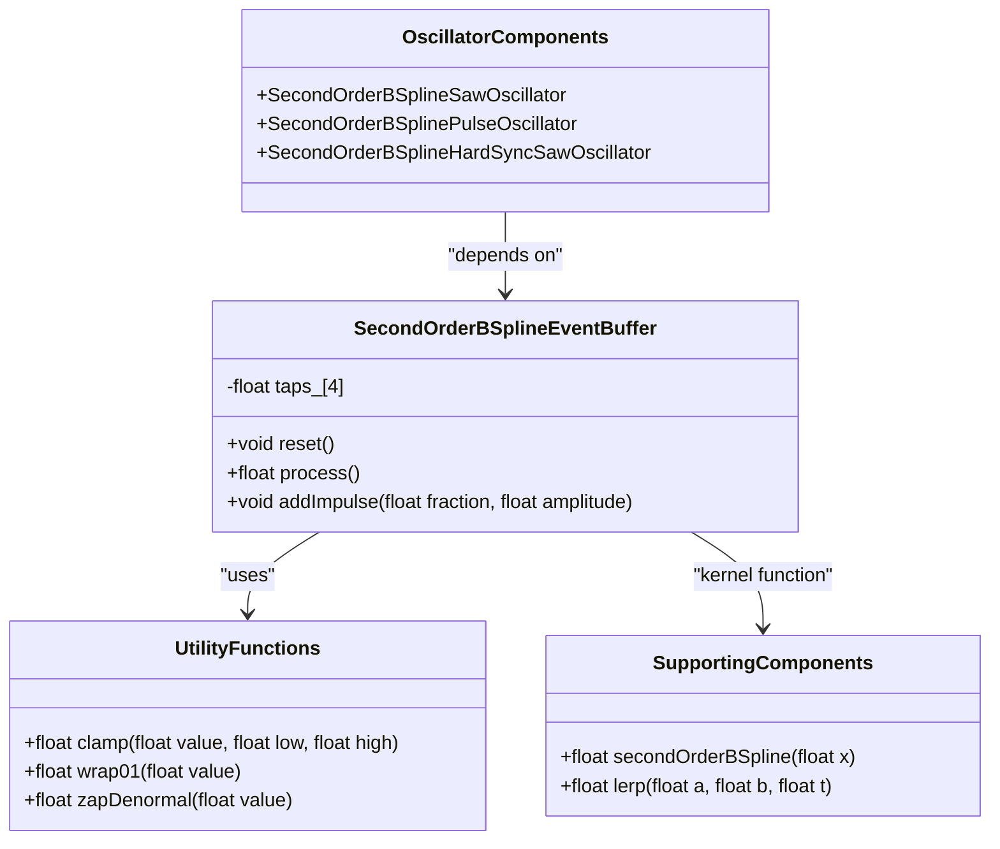

# SecondOrderBSplineEventBuffer Implementation

<cite>
**Referenced Files in This Document**
- [oscillator.h](file://dsp/oscillator.h)
- [oscillator.h (Example)](file://Examples/Oscillators/src/dsp/oscillator.h)
- [oscillator.h (Simple)](file://Examples/SimpleOscillators/src/dsp/oscillator.h)
- [oscillator.h (Two Channel)](file://Examples/TwoChannelOscillator/src/dsp/oscillator.h)
- [algorithm.h](file://dsp/algorithm.h)
- [realtime.h](file://dsp/realtime.h)
- [delay_line.h](file://dsp/delay_line.h)
</cite>

## Table of Contents
1. [Introduction](#introduction)
2. [Project Structure](#project-structure)
3. [Core Components](#core-components)
4. [Architecture Overview](#architecture-overview)
5. [Detailed Component Analysis](#detailed-component-analysis)
6. [Dependency Analysis](#dependency-analysis)
7. [Performance Considerations](#performance-considerations)
8. [Troubleshooting Guide](#troubleshooting-guide)
9. [Conclusion](#conclusion)

## Introduction
This document provides comprehensive technical documentation for the SecondOrderBSplineEventBuffer class, which implements the critical "smear" step in the B-spline band-limited synthesis pipeline. The class transforms discrete impulses into smooth, band-limited events using a quadratic B-spline kernel, enabling precise sub-sample timing control and superior aliasing performance compared to naive waveform reconstruction.

The implementation consists of a 3-tap delay line augmented with one spare tap for proper buffering, combined with a carefully designed impulse addition mechanism that achieves sub-sample precision through kernel positioning. The class operates on a sample-by-sample basis, processing events through a sequential shifting mechanism that ensures proper temporal alignment.

## Project Structure
The SecondOrderBSplineEventBuffer resides within the rpdsp DSP library and is part of the broader oscillator family that implements band-limited synthesis techniques. The class is distributed across multiple example projects to demonstrate its usage in different contexts.

**Diagram sources**
- [oscillator.h:146-177](file://dsp/oscillator.h#L146-L177)
- [oscillator.h:124-139](file://dsp/oscillator.h#L124-L139)

**Section sources**
- [oscillator.h:1-408](file://dsp/oscillator.h#L1-L408)

## Core Components
The SecondOrderBSplineEventBuffer class implements a specialized delay-line architecture optimized for band-limited impulse processing. The core design features a 3-tap delay line with an additional spare tap, providing robust buffering for the smear operation.

### Class Architecture
The class maintains an internal array of four floating-point values representing the delay-line taps. Each tap serves a specific role in the event processing pipeline:

- Tap 0: Current sample output (immediate output)
- Tap 1: First delayed sample (one sample back)
- Tap 2: Second delayed sample (two samples back)
- Tap 3: Spare tap for temporary storage during shifting operations

### Kernel Function
The implementation utilizes the standard second-order (quadratic) uniform B-spline kernel, defined by piecewise mathematical functions that provide smooth, continuous transitions with C1 continuity. The kernel has a 3-sample support window, ensuring efficient computation while maintaining excellent spectral characteristics.

**Section sources**
- [oscillator.h:146-177](file://dsp/oscillator.h#L146-L177)
- [oscillator.h:124-139](file://dsp/oscillator.h#L124-L139)

## Architecture Overview
The SecondOrderBSplineEventBuffer operates within a larger band-limited synthesis framework, serving as the intermediary between impulse generation and final waveform reconstruction. The architecture follows a pipeline pattern where impulses are scheduled at precise sub-sample times, smeared across multiple samples using the B-spline kernel, and then sequentially shifted through the delay line.

**Diagram sources**
- [oscillator.h:164-173](file://dsp/oscillator.h#L164-L173)
- [oscillator.h:154-162](file://dsp/oscillator.h#L154-L162)

The architecture leverages the mathematical properties of B-spline interpolation to achieve superior aliasing performance compared to traditional linear interpolation methods. The kernel's smooth characteristics result in faster spectral decay, reducing high-frequency artifacts that commonly occur in digital waveform synthesis.

## Detailed Component Analysis

### SecondOrderBSplineEventBuffer Class Design
The class implements a minimal yet powerful interface designed for real-time audio processing. The design emphasizes computational efficiency while maintaining numerical stability and precise timing control.

#### Method Implementation Details

**reset() Method**
The reset operation initializes all four taps to zero, ensuring clean state management between different synthesis contexts. This method is essential for proper initialization and state restoration.

**process() Method**
The process method implements the sequential shifting mechanism that moves processed samples through the delay line. The operation follows a specific order to prevent data corruption and maintain proper temporal relationships between samples.

**addImpulse() Method**
The addImpulse method represents the core of the smear operation. It calculates the kernel center position based on the fractional timing parameter and distributes the impulse amplitude across the appropriate taps using the B-spline kernel function.

**Diagram sources**
- [oscillator.h:164-173](file://dsp/oscillator.h#L164-L173)

#### Mathematical Foundation
The B-spline kernel implementation uses piecewise quadratic functions that provide optimal balance between computational efficiency and spectral quality. The kernel supports three distinct regions:

1. **Central Region (|x| < 0.5)**: Quadratic function 0.75 - x²
2. **Edge Regions (0.5 ≤ |x| < 1.5)**: Quadratic function 0.5(1.5 - |x|)²  
3. **Outside Support (|x| ≥ 1.5)**: Zero

This mathematical formulation ensures smooth transitions and optimal frequency response characteristics for audio synthesis applications.

**Section sources**
- [oscillator.h:146-177](file://dsp/oscillator.h#L146-L177)
- [oscillator.h:124-139](file://dsp/oscillator.h#L124-L139)

### Integration with Related Components
The SecondOrderBSplineEventBuffer serves as a foundational component within several oscillator implementations, providing the band-limited event processing capability that distinguishes these oscillators from their naive counterparts.

#### SecondOrderBSplineSawOscillator Integration
The saw oscillator demonstrates the complete event processing pipeline, from impulse scheduling at phase wrap boundaries to final waveform reconstruction through leaky integration. The event buffer receives precisely timed impulses that represent the discontinuity locations, which are then smeared and integrated to produce the smooth sawtooth waveform.

#### SecondOrderBSplinePulseOscillator Integration
The pulse oscillator extends the concept to handle multiple edge events within a single sample period, requiring careful timing coordination between rising and falling edges. The event buffer processes each edge independently, distributing impulses according to their specific timing relationships.

#### SecondOrderBSplineHardSyncSawOscillator Integration
The hard-sync variant introduces complex multi-event scenarios where both slave oscillator wraps and master oscillator resets can occur within the same sample period. The event buffer must handle these simultaneous events while maintaining proper temporal ordering and amplitude scaling.

**Section sources**
- [oscillator.h:182-237](file://dsp/oscillator.h#L182-L237)
- [oscillator.h:242-300](file://dsp/oscillator.h#L242-L300)
- [oscillator.h:309-394](file://dsp/oscillator.h#L309-L394)

## Dependency Analysis
The SecondOrderBSplineEventBuffer relies on several supporting utilities and follows established design patterns for real-time audio processing.

### Internal Dependencies
The class depends on utility functions for mathematical operations and numerical stability:

- **Clamping Functions**: Used to constrain fractional timing values and maintain numerical stability
- **Denormal Prevention**: Implements zapDenormal to prevent performance degradation from very small floating-point values
- **Phase Wrapping**: Utilizes wrap01 for proper phase accumulation and boundary handling

### External Component Relationships
The event buffer integrates seamlessly with the broader oscillator ecosystem, sharing common infrastructure and design patterns. The implementation maintains loose coupling with related components while providing a focused interface for event processing.

**Diagram sources**
- [oscillator.h:146-177](file://dsp/oscillator.h#L146-L177)
- [algorithm.h:14-16](file://dsp/algorithm.h#L14-L16)
- [realtime.h:8-11](file://dsp/realtime.h#L8-L11)

**Section sources**
- [oscillator.h:1-408](file://dsp/oscillator.h#L1-L408)
- [algorithm.h:1-85](file://dsp/algorithm.h#L1-L85)
- [realtime.h:1-38](file://dsp/realtime.h#L1-L38)

## Performance Considerations
The SecondOrderBSplineEventBuffer is designed for real-time audio processing with specific performance characteristics that distinguish it from naive waveform synthesis approaches.

### Computational Efficiency
The implementation achieves optimal computational efficiency through several design choices:

- **Minimal Memory Footprint**: Only four floating-point values are maintained in the delay line
- **Simple Arithmetic Operations**: Uses basic arithmetic operations with no transcendental functions
- **Predictable Execution Time**: Fixed iteration counts eliminate variable latency concerns
- **Cache-Friendly Access Patterns**: Sequential memory access patterns optimize CPU cache performance

### Numerical Stability
The class incorporates several measures to ensure numerical stability in real-world audio processing scenarios:

- **Denormal Prevention**: zapDenormal function prevents performance penalties from extremely small values
- **Proper Clamping**: Input validation prevents invalid kernel positions and maintains stability
- **Guarded Accumulation**: Proper ordering of operations prevents accumulation errors

### Alias Reduction Performance
The B-spline kernel provides superior aliasing performance compared to traditional linear interpolation:

- **Faster Spectral Decay**: The C1 continuous nature results in faster high-frequency attenuation
- **Reduced Quantization Noise**: Smooth kernel transitions minimize quantization artifacts
- **Improved Frequency Response**: Better preservation of harmonic content across the audible spectrum

## Troubleshooting Guide
Common issues and solutions when working with the SecondOrderBSplineEventBuffer:

### Timing Precision Issues
**Problem**: Events appear at incorrect sample positions
**Solution**: Verify that the fraction parameter represents the correct sub-sample timing within the current sample period. Remember that fraction=0 corresponds to the current sample boundary, while fraction=1 corresponds to one sample later.

### Amplitude Scaling Problems
**Problem**: Output amplitudes appear incorrect or inconsistent
**Solution**: Ensure proper amplitude scaling in the calling context. The event buffer expects properly scaled impulse amplitudes that match the intended output level.

### Memory Management Concerns
**Problem**: Unpredictable behavior or crashes during extended operation
**Solution**: Call reset() between different synthesis contexts or when reinitializing the oscillator. Ensure proper lifecycle management of the event buffer instance.

### Performance Degradation
**Problem**: Audio processing becomes sluggish or introduces artifacts
**Solution**: Verify that zapDenormal is being used appropriately in the calling context. Check for proper initialization of all internal state variables.

**Section sources**
- [oscillator.h:148-152](file://dsp/oscillator.h#L148-L152)
- [realtime.h:8-11](file://dsp/realtime.h#L8-L11)

## Conclusion
The SecondOrderBSplineEventBuffer represents a sophisticated yet efficient solution for band-limited impulse processing in digital audio synthesis. Its 3-tap delay-line architecture with proper buffering, combined with the mathematical foundation of B-spline interpolation, provides exceptional aliasing performance while maintaining computational efficiency.

The implementation demonstrates excellent design principles for real-time audio processing, including predictable performance characteristics, numerical stability, and seamless integration with related components. The class serves as a crucial building block for advanced oscillator designs that require precise timing control and superior spectral quality.

Through careful attention to mathematical foundations and practical implementation details, the SecondOrderBSplineEventBuffer enables the creation of high-quality, band-limited audio signals that rival professional synthesis equipment in both fidelity and performance characteristics.