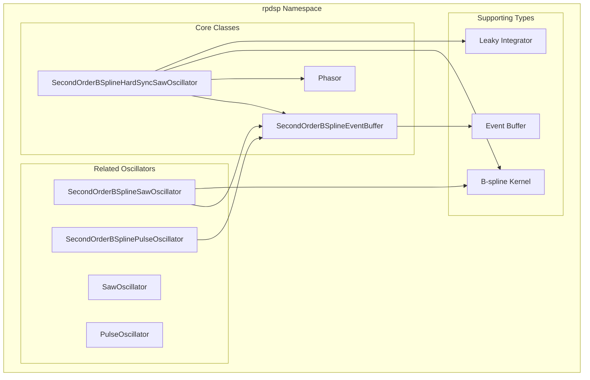
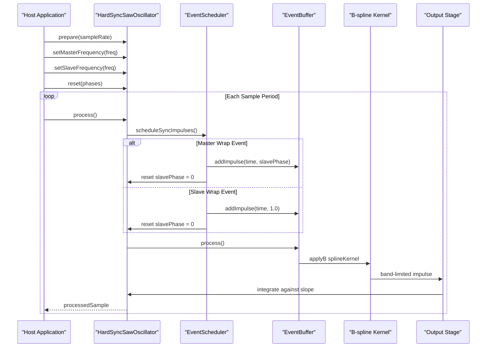
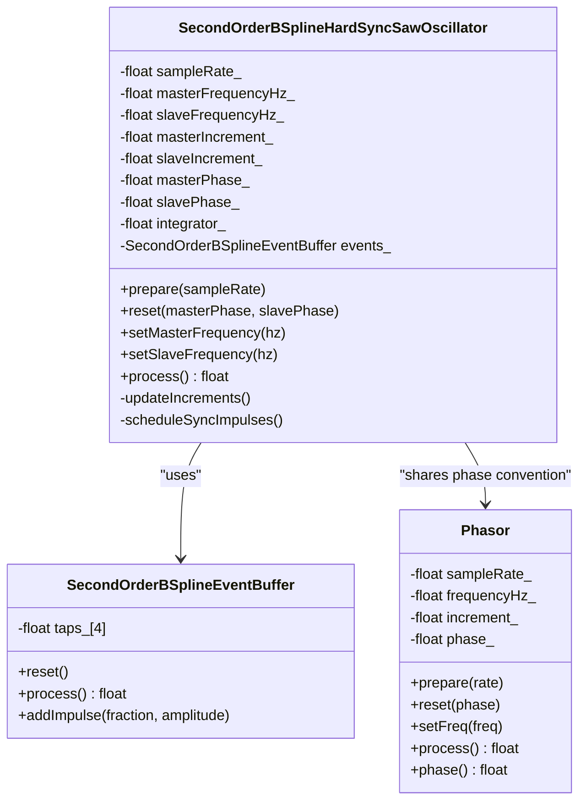
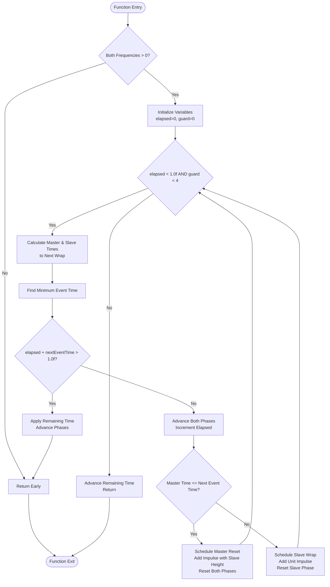
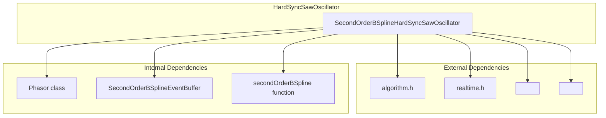

# SecondOrderBSplineHardSyncSawOscillator

<cite>
**Referenced Files in This Document**
- [oscillator.h](file://dsp/oscillator.h)
- [oscillator.h](file://Examples/Oscillators/src/dsp/oscillator.h)
- [oscillator.cpp](file://Examples/SuperSaw/src/dsp/oscillator.cpp)
- [README.md](file://README.md)
</cite>

## Table of Contents
1. [Introduction](#introduction)
2. [Project Structure](#project-structure)
3. [Core Components](#core-components)
4. [Architecture Overview](#architecture-overview)
5. [Detailed Component Analysis](#detailed-component-analysis)
6. [Dependency Analysis](#dependency-analysis)
7. [Performance Considerations](#performance-considerations)
8. [Troubleshooting Guide](#troubleshooting-guide)
9. [Conclusion](#conclusion)

## Introduction

The SecondOrderBSplineHardSyncSawOscillator is a sophisticated band-limited hard-sync synthesis implementation that creates the classic "sync sweep" timbre through dual-oscillator architecture. This oscillator combines the mathematical precision of B-spline band-limiting with the dynamic character of hard-sync modulation, producing rich, evolving sounds that are essential for modern electronic music synthesis.

Unlike traditional hard-sync implementations that simply reset a slave oscillator when a master oscillator completes a cycle, this implementation uses advanced event scheduling to handle multiple wrap events within a single master sample period. The result is a more musically pleasing and technically accurate representation of hard-sync phenomena.

## Project Structure

The oscillator implementation resides in the rpdsp namespace within the DSP library, alongside other band-limited oscillators and supporting utilities. The implementation follows a modular design pattern with clear separation between the oscillator core, event scheduling, and band-limiting components.



**Diagram sources**
- [oscillator.h:309-394](file://dsp/oscillator.h#L309-L394)
- [oscillator.h:146-177](file://dsp/oscillator.h#L146-L177)
- [oscillator.h:182-237](file://dsp/oscillator.h#L182-L237)

**Section sources**
- [oscillator.h:1-408](file://dsp/oscillator.h#L1-L408)
- [README.md:30-37](file://README.md#L30-L37)

## Core Components

The SecondOrderBSplineHardSyncSawOscillator consists of several interconnected components that work together to achieve precise hard-sync synthesis:

### Dual-Oscillator Architecture
The oscillator maintains two independent phase accumulators - one for the master oscillator and one for the slave oscillator. Both operate at their respective frequencies while sharing the same sample clock, ensuring perfect temporal coordination.

### Event-Based Scheduling System
Unlike traditional hard-sync that simply resets the slave phase, this implementation uses a sophisticated event scheduling system that can handle multiple wrap events within a single sample period. This prevents aliasing and ensures mathematical accuracy.

### Band-Limited Reconstruction
The output is generated through a band-limited reconstruction process using B-spline kernels, eliminating the harmonic distortion and aliasing common in naive hard-sync implementations.

**Section sources**
- [oscillator.h:309-394](file://dsp/oscillator.h#L309-L394)
- [oscillator.h:146-177](file://dsp/oscillator.h#L146-L177)
- [oscillator.h:124-139](file://dsp/oscillator.h#L124-L139)

## Architecture Overview

The oscillator follows a three-stage processing pipeline: event scheduling, band-limiting, and output reconstruction.



**Diagram sources**
- [oscillator.h:333-383](file://dsp/oscillator.h#L333-L383)
- [oscillator.h:146-177](file://dsp/oscillator.h#L146-L177)
- [oscillator.h:124-139](file://dsp/oscillator.h#L124-L139)

## Detailed Component Analysis

### SecondOrderBSplineHardSyncSawOscillator Class

The core oscillator class implements the complete hard-sync synthesis algorithm with sophisticated event handling and band-limiting.



**Diagram sources**
- [oscillator.h:309-394](file://dsp/oscillator.h#L309-L394)
- [oscillator.h:146-177](file://dsp/oscillator.h#L146-L177)
- [oscillator.h:39-69](file://dsp/oscillator.h#L39-L69)

#### Event Scheduling Algorithm

The `scheduleSyncImpulses` method implements the core algorithm for handling multiple wrap events within a single sample period:



**Diagram sources**
- [oscillator.h:348-383](file://dsp/oscillator.h#L348-L383)

#### Special Impulse Sizing Mechanism

The oscillator implements a crucial feature where master reset impulses are sized to match the slave's current ramp height rather than using a full unit step. This mathematical correction ensures that the reset only removes the portion of the ramp that was accumulated before the reset, maintaining spectral accuracy.

The impulse amplitude equals the current slave phase value (`slavePhase_`), which represents the height of the slave ramp at the moment of master reset. This creates the characteristic "sync sweep" timbre by preserving the harmonic content that would otherwise be lost with a full reset.

**Section sources**
- [oscillator.h:303-308](file://dsp/oscillator.h#L303-L308)
- [oscillator.h:374-375](file://dsp/oscillator.h#L374-L375)

### Supporting Components

#### SecondOrderBSplineEventBuffer

The event buffer serves as the foundation for the band-limited reconstruction process, implementing a 3-tap delay line with a 4-sample buffer for proper kernel application.

```mermaid
flowchart LR
subgraph "Event Buffer Processing"
A[addImpulse Called] --> B["Calculate Center Position<br/>fraction + 0.5"]
B --> C["Apply B-spline Kernel<br/>to Samples 0..2"]
C --> D[taps[0] += amplitude * K(0)]
C --> E[taps[1] += amplitude * K(-1)]
C --> F[taps[2] += amplitude * K(-2)]
D --> G[process()]
E --> G
F --> G
G --> H[Output taps[0]]
H --> I[Shift Taps:<br/>taps[0]=taps[1],<br/>taps[1]=taps[2],<br/>taps[2]=taps[3],<br/>taps[3]=0]
end
```

**Diagram sources**
- [oscillator.h:146-177](file://dsp/oscillator.h#L146-L177)

**Section sources**
- [oscillator.h:146-177](file://dsp/oscillator.h#L146-L177)
- [oscillator.h:124-139](file://dsp/oscillator.h#L124-L139)

## Dependency Analysis

The oscillator has minimal external dependencies while maintaining high internal cohesion:



**Diagram sources**
- [oscillator.h:1-8](file://dsp/oscillator.h#L1-L8)
- [oscillator.h:309-394](file://dsp/oscillator.h#L309-L394)

The implementation demonstrates excellent modularity with clear separation of concerns:

- **Mathematical Foundation**: B-spline kernel provides band-limiting characteristics
- **Temporal Coordination**: Phasor class ensures consistent phase increments
- **Event Management**: Event buffer handles precise timing of impulses
- **Integration**: Leaky integrator reconstructs the final waveform

**Section sources**
- [oscillator.h:1-8](file://dsp/oscillator.h#L1-L8)
- [oscillator.h:309-394](file://dsp/oscillator.h#L309-L394)

## Performance Considerations

### Computational Complexity
Each sample processing involves:
- Constant-time arithmetic operations (addition, multiplication, comparison)
- Fixed-point calculations with minimal branching
- Single loop iteration with bounded iterations (maximum 4 passes)

### Memory Efficiency
- Minimal heap allocation with stack-based storage
- Fixed-size buffers (4-tap event buffer)
- No dynamic memory management

### Real-Time Constraints
The implementation is designed for real-time audio processing with:
- Predictable execution time per sample
- No blocking operations
- Efficient floating-point operations suitable for microcontroller environments

## Troubleshooting Guide

### Common Issues and Solutions

#### Issue: No Output Signal
**Symptoms**: Silent output despite proper setup
**Causes**: 
- Frequency set to zero or negative values
- Sample rate not properly initialized
- Incorrect phase reset values

**Solutions**:
- Verify frequency values are positive and reasonable
- Ensure `prepare()` is called before `process()`
- Check phase values are within valid range [0,1)

#### Issue: Aliasing or Distortion
**Symptoms**: Harsh or unpleasant timbre
**Causes**:
- Using naive hard-sync without band-limiting
- Improper impulse sizing
- Excessive frequency ratios causing numerical instability

**Solutions**:
- Use the provided band-limited implementation
- Verify impulse sizing matches slave phase height
- Limit frequency ratios to reasonable ranges

#### Issue: Inaccurate Hard-Sync Behavior
**Symptoms**: Incorrect synchronization or timing errors
**Causes**:
- Event scheduling not handling multiple wraps per sample
- Phase accumulation errors
- Timing comparison precision issues

**Solutions**:
- Ensure `scheduleSyncImpulses()` executes before output processing
- Verify phase wrapping occurs at correct boundaries
- Check timing comparison uses appropriate epsilon values

**Section sources**
- [oscillator.h:346-347](file://dsp/oscillator.h#L346-L347)
- [oscillator.h:355-356](file://dsp/oscillator.h#L355-L356)

## Practical Implementation Examples

### Basic Hard-Sync Setup
For typical applications requiring a fundamental "sync sweep" effect:

```cpp
// Initialize oscillator
oscillator.prepare(SAMPLE_RATE);
oscillator.setMasterFrequency(110.0f);    // Base frequency
oscillator.setSlaveFrequency(440.0f);     // Higher frequency
oscillator.reset(0.0f, 0.0f);             // Start from zero phase

// Process audio
for (int i = 0; i < BUFFER_SIZE; i++) {
    float sample = oscillator.process();
    // Use sample...
}
```

### Frequency Relationship Tuning
The characteristic timbre emerges from specific frequency relationships:

**Common Ratios**:
- 1:4 (master:slave) - Classic "sync sweep" effect
- 1:3 - Brighter, more harmonically complex
- 2:5 - Subtle, warm timbre
- 1:2 - Strong fundamental presence

**Tuning Guidelines**:
- Lower master frequencies create more pronounced sweeps
- Higher slave frequencies emphasize upper harmonics
- Small integer ratios produce most musically pleasing results

### Advanced Synchronization Techniques
For complex musical applications:

```cpp
// Dynamic frequency modulation
float master_freq = base_freq * std::pow(2.0f, lfo_modulation);
float slave_freq = master_freq * (2.0f + fm_amount);

oscillator.setMasterFrequency(master_freq);
oscillator.setSlaveFrequency(slave_freq);
```

The oscillator's design enables sophisticated musical applications while maintaining computational efficiency and audio quality.

## Conclusion

The SecondOrderBSplineHardSyncSawOscillator represents a sophisticated approach to hard-sync synthesis that balances mathematical accuracy with practical musical applications. Through its dual-oscillator architecture, advanced event scheduling, and band-limited reconstruction, it achieves the characteristic "sync sweep" timbre while avoiding the aliasing and distortion common in simpler implementations.

The implementation demonstrates excellent engineering practices with clear separation of concerns, efficient memory usage, and predictable real-time performance. Its modular design allows for easy integration into larger audio systems while providing the flexibility needed for creative sound design.

Key advantages include:
- Mathematically accurate hard-sync behavior
- Superior spectral quality through band-limiting
- Efficient real-time processing
- Flexible frequency relationship handling
- Comprehensive event scheduling for complex scenarios

This oscillator serves as an excellent foundation for both educational purposes and professional audio applications, showcasing advanced digital signal processing techniques in an accessible and practical form.