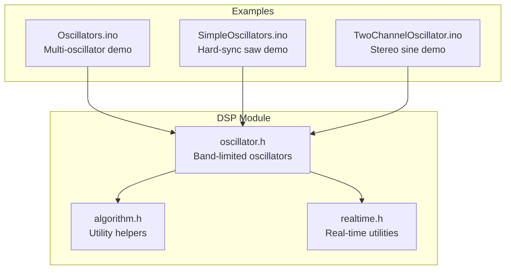
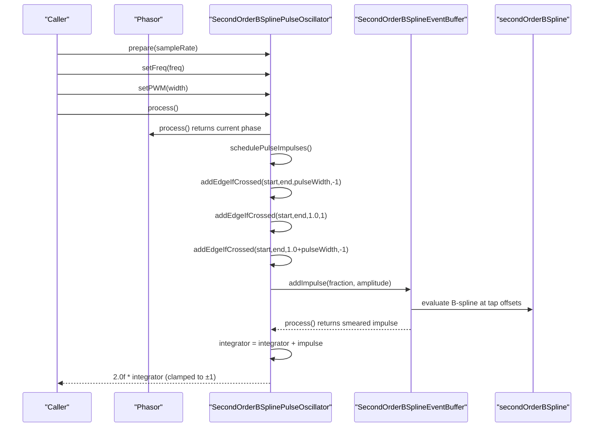
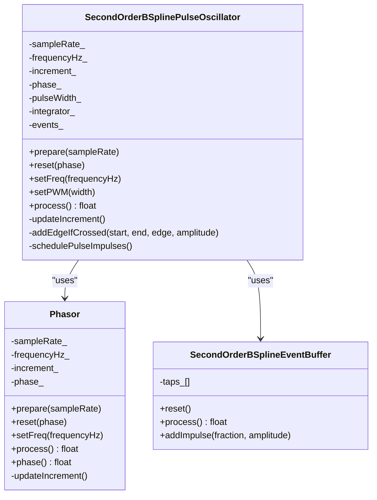
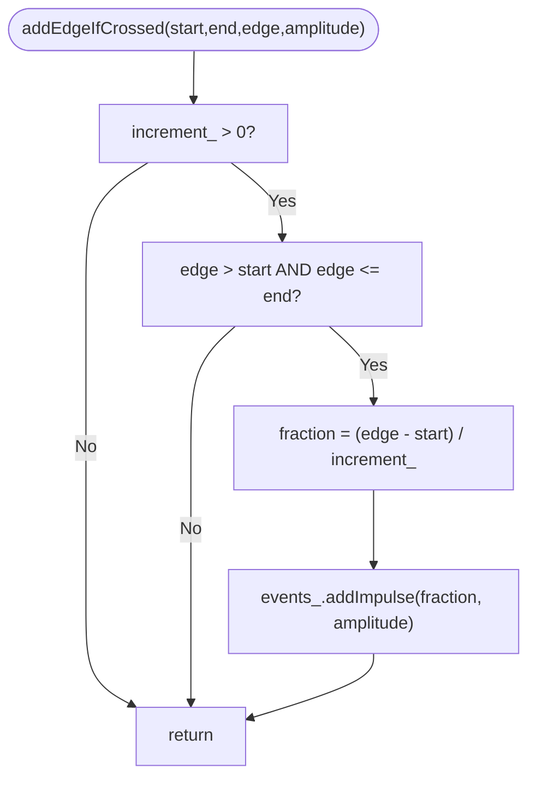
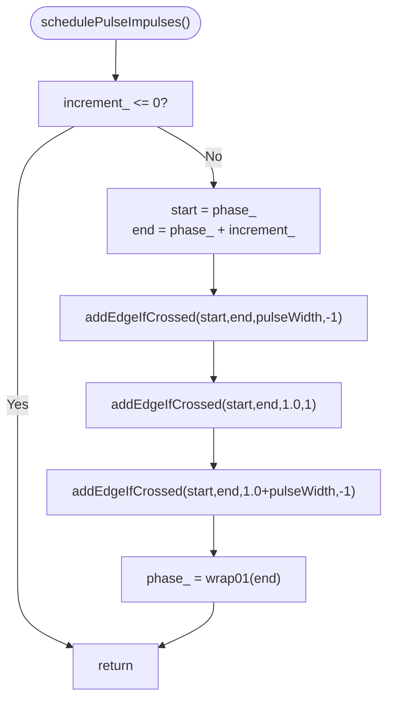
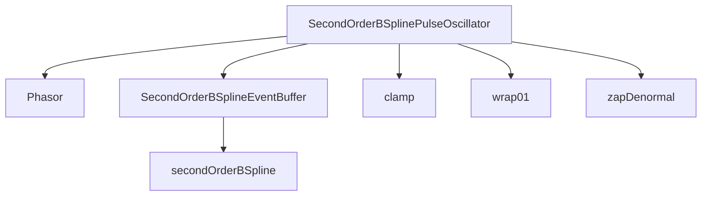

# SecondOrderBSplinePulseOscillator

<cite>
**Referenced Files in This Document**
- [oscillator.h](file://dsp/oscillator.h)
- [oscillator.h](file://Examples/Oscillators/src/dsp/oscillator.h)
- [oscillator.h](file://Examples/SimpleOscillators/src/dsp/oscillator.h)
- [oscillator.h](file://Examples/TwoChannelOscillator/src/dsp/oscillator.h)
- [realtime.h](file://dsp/realtime.h)
- [algorithm.h](file://dsp/algorithm.h)
- [Oscillators.ino](file://Examples/Oscillators/Oscillators.ino)
- [SimpleOscillators.ino](file://Examples/SimpleOscillators/SimpleOscillators.ino)
- [TwoChannelOscillator.ino](file://Examples/TwoChannelOscillator/TwoChannelOscillator.ino)
</cite>

## Table of Contents
1. [Introduction](#introduction)
2. [Project Structure](#project-structure)
3. [Core Components](#core-components)
4. [Architecture Overview](#architecture-overview)
5. [Detailed Component Analysis](#detailed-component-analysis)
6. [Dependency Analysis](#dependency-analysis)
7. [Performance Considerations](#performance-considerations)
8. [Troubleshooting Guide](#troubleshooting-guide)
9. [Conclusion](#conclusion)

## Introduction
This document provides comprehensive technical documentation for the SecondOrderBSplinePulseOscillator, a band-limited square/pulse waveform generator. The oscillator uses an integral-based approach where discontinuities are modeled as alternating edge impulses at rising and falling edges, combined with a two-integrator system to produce clean, alias-free square outputs. The implementation leverages second-order B-spline kernels for smoothing impulses across samples, ensuring superior spectral rolloff compared to naive waveform synthesis.

Key capabilities include:
- Band-limited square/pulse generation via impulse integration
- Phase-based PWM control through precise edge detection
- Two-integrator system for positive and negative half-cycles
- Accurate phase wrapping and fractional timing for minimal aliasing
- Practical examples for frequency setting, PWM modulation, and harmonic content relationships

## Project Structure
The oscillator resides in the DSP module alongside other oscillators and real-time utilities. Example projects demonstrate usage patterns and real-time audio integration.

**Diagram sources**
- [oscillator.h:1-408](file://dsp/oscillator.h#L1-L408)
- [algorithm.h:1-85](file://dsp/algorithm.h#L1-L85)
- [realtime.h:1-38](file://dsp/realtime.h#L1-L38)
- [Oscillators.ino:1-168](file://Examples/Oscillators/Oscillators.ino#L1-L168)
- [SimpleOscillators.ino:1-216](file://Examples/SimpleOscillators/SimpleOscillators.ino#L1-L216)
- [TwoChannelOscillator.ino:1-167](file://Examples/TwoChannelOscillator/TwoChannelOscillator.ino#L1-L167)

**Section sources**
- [oscillator.h:1-408](file://dsp/oscillator.h#L1-L408)
- [Oscillators.ino:1-168](file://Examples/Oscillators/Oscillators.ino#L1-L168)
- [SimpleOscillators.ino:1-216](file://Examples/SimpleOscillators/SimpleOscillators.ino#L1-L216)
- [TwoChannelOscillator.ino:1-167](file://Examples/TwoChannelOscillator/TwoChannelOscillator.ino#L1-L167)

## Core Components
The SecondOrderBSplinePulseOscillator is built from reusable building blocks:
- Phasor: Maintains normalized phase with configurable frequency and wraps at 1.0
- SecondOrderBSplineEventBuffer: Smears impulses across 3 samples using a quadratic B-spline kernel
- SecondOrderBSplinePulseOscillator: Integrates impulses to produce band-limited square/pulse outputs

Key behaviors:
- Frequency control sets phase increment per sample, clamped to below Nyquist
- PWM control adjusts the falling edge position relative to the wrap
- Edge detection checks for crossings within the current phase interval
- Impulses are scheduled at sub-sample timing for precise placement
- Integration accumulates impulses to form the final square waveform

**Section sources**
- [oscillator.h:39-69](file://dsp/oscillator.h#L39-L69)
- [oscillator.h:146-177](file://dsp/oscillator.h#L146-L177)
- [oscillator.h:242-300](file://dsp/oscillator.h#L242-L300)

## Architecture Overview
The oscillator pipeline follows a consistent pattern: compute phase increments, detect edges within the current interval, schedule impulses at fractional sample positions, smear impulses across samples, and integrate to produce the output.

**Diagram sources**
- [oscillator.h:242-300](file://dsp/oscillator.h#L242-L300)
- [oscillator.h:146-177](file://dsp/oscillator.h#L146-L177)
- [oscillator.h:124-139](file://dsp/oscillator.h#L124-L139)

## Detailed Component Analysis

### SecondOrderBSplinePulseOscillator
The core class implements a two-integrator system:
- Integrator tracks the accumulated impulse response
- Positive and negative half-cycles are produced by alternating impulses at rising and falling edges
- Reset initializes integrator based on current phase relative to PWM width

Processing steps:
1. Compute next phase using frequency increment
2. Detect edges crossing within [start, end):
   - Falling edge at phase == pulseWidth (negative impulse)
   - Rising edge at phase wrap (positive impulse)
   - Additional wrap edge at 1.0 + pulseWidth for next cycle
3. Schedule impulses with fractional timing for sub-sample precision
4. Process event buffer to smear impulses across 3 samples
5. Integrate impulses and scale to ±1 output

**Diagram sources**
- [oscillator.h:39-69](file://dsp/oscillator.h#L39-L69)
- [oscillator.h:146-177](file://dsp/oscillator.h#L146-L177)
- [oscillator.h:242-300](file://dsp/oscillator.h#L242-L300)

**Section sources**
- [oscillator.h:242-300](file://dsp/oscillator.h#L242-L300)

### addEdgeIfCrossed Method
Purpose:
- Detects whether a given edge crosses within the current phase interval [start, end]
- Computes fractional position of the crossing relative to the sample period
- Schedules an impulse with appropriate amplitude (+1 or -1)

Behavior:
- Validates increment > 0 and edge lies within (start, end]
- Calculates fraction = (edge - start) / increment
- Calls EventBuffer.addImpulse with fraction and amplitude

**Diagram sources**
- [oscillator.h:273-277](file://dsp/oscillator.h#L273-L277)

**Section sources**
- [oscillator.h:273-277](file://dsp/oscillator.h#L273-L277)

### schedulePulseImpulses Algorithm
Purpose:
- Identifies all edges that cross within the current phase interval
- Handles both wrap and PWM edges consistently
- Ensures wrap can expose next-cycle PWM edges

Algorithm:
1. Compute start = phase_ and end = phase_ + increment_
2. Check falling PWM edge at pulseWidth with amplitude -1
3. Check wrap edge at 1.0 with amplitude +1
4. Check next-cycle wrap edge at 1.0 + pulseWidth with amplitude -1
5. Advance phase to wrap01(end)

**Diagram sources**
- [oscillator.h:279-291](file://dsp/oscillator.h#L279-L291)

**Section sources**
- [oscillator.h:279-291](file://dsp/oscillator.h#L279-L291)

### Integration and Output Generation
Processing:
- After scheduling impulses, process the event buffer to obtain the smeared impulse
- Integrate by adding the impulse to the integrator state
- Scale integrator by 2.0 to achieve ±1 output range
- Apply zapDenormal to prevent denormal floating-point artifacts

Reset behavior:
- Integrator starts at +0.5 if current phase < pulseWidth, otherwise -0.5
- Ensures correct polarity for the first half-cycle

**Section sources**
- [oscillator.h:263-268](file://dsp/oscillator.h#L263-L268)
- [oscillator.h:249-254](file://dsp/oscillator.h#L249-L254)
- [realtime.h:8-11](file://dsp/realtime.h#L8-L11)

### B-spline Smearing and Event Buffer
The EventBuffer performs the "smear" operation:
- Stores 4 taps for 3-sample support plus one spare
- Centers the B-spline kernel at fractional sample time
- Distributes impulse energy across taps 0..2 according to kernel values
- Shifts taps each sample to move smeared energy to the correct time

Kernel characteristics:
- Quadratic B-spline with 3-sample support
- Smooth (C1) transitions reduce aliasing
- Faster spectral rolloff than linear interpolation

**Section sources**
- [oscillator.h:146-177](file://dsp/oscillator.h#L146-L177)
- [oscillator.h:124-139](file://dsp/oscillator.h#L124-L139)

## Dependency Analysis
The oscillator depends on shared utilities for numerical stability and real-time safety.

**Diagram sources**
- [oscillator.h:242-300](file://dsp/oscillator.h#L242-L300)
- [oscillator.h:146-177](file://dsp/oscillator.h#L146-L177)
- [oscillator.h:124-139](file://dsp/oscillator.h#L124-L139)
- [algorithm.h:14-32](file://dsp/algorithm.h#L14-L32)
- [realtime.h:8-11](file://dsp/realtime.h#L8-L11)

**Section sources**
- [oscillator.h:1-408](file://dsp/oscillator.h#L1-L408)
- [algorithm.h:1-85](file://dsp/algorithm.h#L1-L85)
- [realtime.h:1-38](file://dsp/realtime.h#L1-L38)

## Performance Considerations
- Frequency clamping: Increment is clamped to below 0.49 × sampleRate to remain safely under Nyquist
- Denormal prevention: zapDenormal ensures numerical stability during long sustained integrations
- Event scheduling: Sub-sample timing minimizes aliasing by precisely placing discontinuities
- Memory locality: EventBuffer uses a small fixed-size ring of taps for cache-friendly access
- Complexity: Each sample performs constant-time operations with negligible overhead

## Troubleshooting Guide
Common issues and resolutions:
- Distorted or noisy output
  - Verify sample rate is valid and passed to prepare()
  - Ensure frequency is within audible range and not zero
  - Check that PWM width remains within [0.01, 0.99]
- Clicks or pops at transients
  - Confirm reset() is called when changing parameters that affect phase continuity
  - Ensure integrator is initialized appropriately for the new phase
- Incorrect duty cycle
  - Verify setPWM() is called before process() begins producing output
  - Remember that duty cycle is measured relative to the wrap boundary
- Slow parameter changes
  - Use parameter smoothing utilities from algorithm.h for gradual transitions

**Section sources**
- [oscillator.h:256-261](file://dsp/oscillator.h#L256-L261)
- [oscillator.h:249-254](file://dsp/oscillator.h#L249-L254)
- [algorithm.h:14-21](file://dsp/algorithm.h#L14-L21)

## Practical Usage Examples

### Setting Frequency and PWM
Typical initialization and runtime usage:
- Call prepare(sampleRate) once at startup
- Set frequency with setFreq(frequencyHz)
- Adjust duty cycle with setPWM(width) where width ∈ [0.01, 0.99]
- Process samples in the audio callback and scale output as needed

Example patterns:
- Fixed frequency square wave: setFreq(440.0f), setPWM(0.5f)
- Modulated PWM: vary setPWM() in real-time for dynamic timbre
- Sweep frequency: gradually change setFreq() for gliding tones

### Relationship Between Pulse Width and Harmonic Content
- Narrow pulses (low width) emphasize higher harmonics, producing a brighter timbre
- Wider pulses (high width) suppress higher harmonics, yielding a mellower sound
- 50% duty cycle approximates a classic square wave with strong odd harmonics
- Asymmetric duty cycles introduce additional harmonic content and phase distortion

### Integration with Real-Time Audio
The oscillator integrates cleanly into real-time audio loops:
- Prepare and configure oscillators in setup()
- In the audio callback, call setFreq()/setPWM() if parameters changed
- Process samples and mix with other voices
- Convert floating-point output to int16 for I2S playback

**Section sources**
- [Oscillators.ino:31-48](file://Examples/Oscillators/Oscillators.ino#L31-L48)
- [SimpleOscillators.ino:73-83](file://Examples/SimpleOscillators/SimpleOscillators.ino#L73-L83)
- [TwoChannelOscillator.ino:69-82](file://Examples/TwoChannelOscillator/TwoChannelOscillator.ino#L69-L82)

## Conclusion
The SecondOrderBSplinePulseOscillator delivers high-quality, band-limited square and pulse waveforms through a carefully designed impulse-based synthesis pipeline. Its use of sub-sample edge detection, B-spline smearing, and two-integrator integration ensures minimal aliasing and excellent transient response. The PWM control mechanism provides intuitive timbral shaping, while the robust architecture supports real-time parameter modulation and seamless integration into larger audio systems.