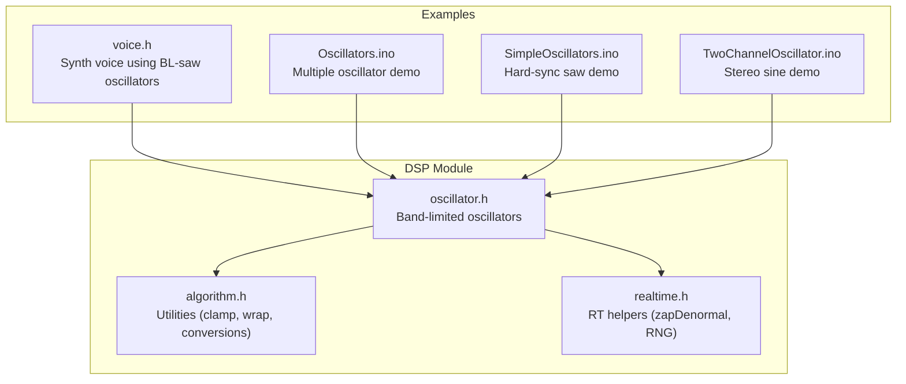
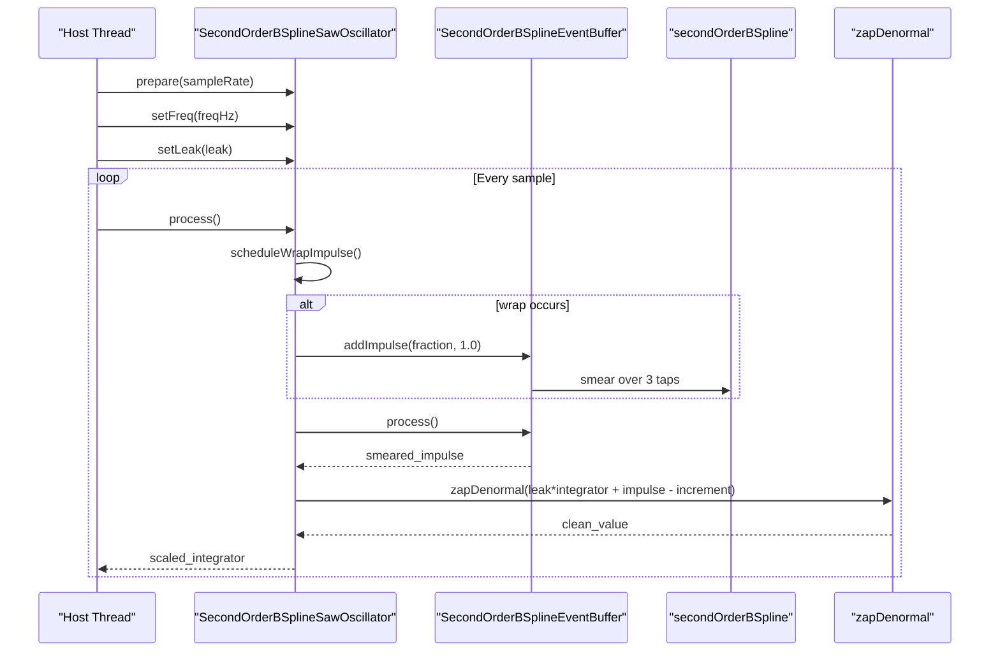
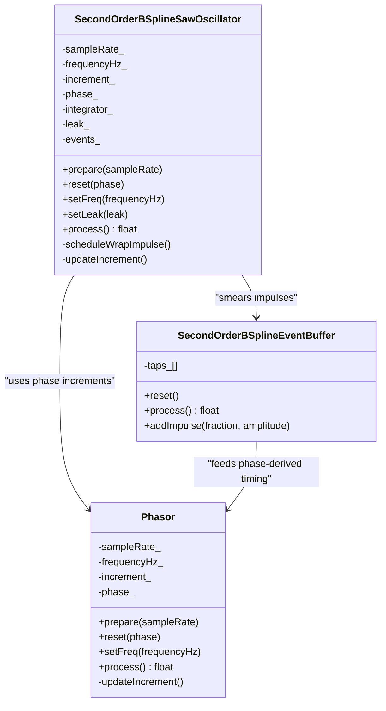
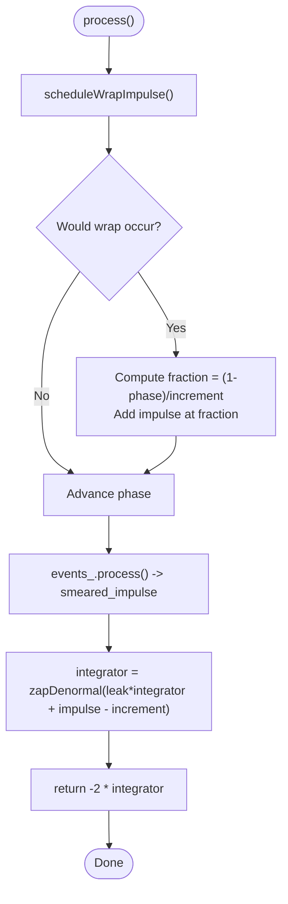
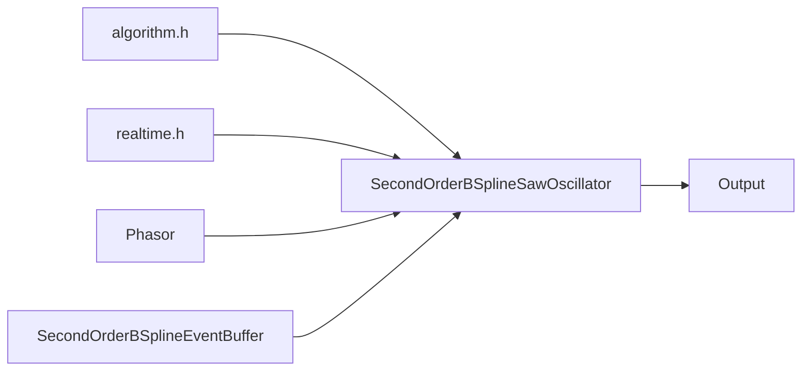

# SecondOrderBSplineSawOscillator

<cite>
**Referenced Files in This Document**
- [oscillator.h](file://dsp/oscillator.h)
- [algorithm.h](file://dsp/algorithm.h)
- [realtime.h](file://dsp/realtime.h)
- [voice.h](file://Examples/Oscillators/src/dsp/voice.h)
- [Oscillators.ino](file://Examples/Oscillators/Oscillators.ino)
- [SimpleOscillators.ino](file://Examples/SimpleOscillators/SimpleOscillators.ino)
- [TwoChannelOscillator.ino](file://Examples/TwoChannelOscillator/TwoChannelOscillator.ino)
</cite>

## Table of Contents
1. [Introduction](#introduction)
2. [Project Structure](#project-structure)
3. [Core Components](#core-components)
4. [Architecture Overview](#architecture-overview)
5. [Detailed Component Analysis](#detailed-component-analysis)
6. [Dependency Analysis](#dependency-analysis)
7. [Performance Considerations](#performance-considerations)
8. [Troubleshooting Guide](#troubleshooting-guide)
9. [Conclusion](#conclusion)
10. [Appendices](#appendices)

## Introduction
This document explains the SecondOrderBSplineSawOscillator implementation as the foundational band-limited sawtooth generator. It covers the mathematical reconstruction of a saw waveform as the integral of wrap impulses combined with a constant negative slope, the role of the leaky integrator in preventing DC drift, and the sub-sample wrap impulse placement algorithm. It documents the process method’s integration of impulse smearing with slope integration, the setLeak parameter for DC correction, and the relationship between frequency limits and stability. Practical examples demonstrate setup, parameter tuning, and integration with other DSP components.

## Project Structure
The oscillator family resides in the DSP module and is used across example projects. The core implementation is in the oscillator header, with supporting utilities in algorithm and realtime headers. Example applications show how to instantiate and use the oscillator in real-time audio contexts.

**Diagram sources**
- [oscillator.h:182-237](file://dsp/oscillator.h#L182-L237)
- [algorithm.h:1-85](file://dsp/algorithm.h#L1-L85)
- [realtime.h:1-38](file://dsp/realtime.h#L1-L38)
- [voice.h:222-223](file://Examples/Oscillators/src/dsp/voice.h#L222-L223)
- [Oscillators.ino:18-48](file://Examples/Oscillators/Oscillators.ino#L18-L48)
- [SimpleOscillators.ino:35-83](file://Examples/SimpleOscillators/SimpleOscillators.ino#L35-L83)
- [TwoChannelOscillator.ino:32-33](file://Examples/TwoChannelOscillator/TwoChannelOscillator.ino#L32-L33)

**Section sources**
- [oscillator.h:182-237](file://dsp/oscillator.h#L182-L237)
- [algorithm.h:1-85](file://dsp/algorithm.h#L1-L85)
- [realtime.h:1-38](file://dsp/realtime.h#L1-L38)
- [voice.h:222-223](file://Examples/Oscillators/src/dsp/voice.h#L222-L223)
- [Oscillators.ino:18-48](file://Examples/Oscillators/Oscillators.ino#L18-L48)
- [SimpleOscillators.ino:35-83](file://Examples/SimpleOscillators/SimpleOscillators.ino#L35-L83)
- [TwoChannelOscillator.ino:32-33](file://Examples/TwoChannelOscillator/TwoChannelOscillator.ino#L32-L33)

## Core Components
- SecondOrderBSplineSawOscillator: Implements a band-limited sawtooth by placing impulses at sub-sample wrap times, smearing them with a quadratic B-spline kernel, integrating with a constant negative slope, and applying a leaky integrator to prevent DC drift.
- SecondOrderBSplineEventBuffer: A 3-tap delay line that smears sub-sample impulses across 3 samples using the B-spline kernel and shifts samples forward each frame.
- secondOrderBSpline: The quadratic B-spline kernel used for impulse smearing.
- Supporting utilities: clamp, wrap01, safeSampleRate, zapDenormal, and softClip are used throughout for parameter safety, phase wrapping, sample-rate handling, denormal suppression, and soft limiting.

Key responsibilities:
- Impulse scheduling at exact sub-sample wrap positions to minimize aliasing.
- Smearing impulses with a smooth kernel to achieve band-limiting.
- Integrating impulses against a constant negative slope to reconstruct the saw shape.
- Applying a leaky integrator to gradually remove DC drift over time.

**Section sources**
- [oscillator.h:124-139](file://dsp/oscillator.h#L124-L139)
- [oscillator.h:146-177](file://dsp/oscillator.h#L146-L177)
- [oscillator.h:182-237](file://dsp/oscillator.h#L182-L237)
- [algorithm.h:14-32](file://dsp/algorithm.h#L14-L32)
- [realtime.h:8-11](file://dsp/realtime.h#L8-L11)

## Architecture Overview
The oscillator pipeline integrates four stages: phase accumulation, sub-sample wrap detection, impulse smearing, and integrator-based reconstruction.

**Diagram sources**
- [oscillator.h:182-237](file://dsp/oscillator.h#L182-L237)
- [oscillator.h:146-177](file://dsp/oscillator.h#L146-L177)
- [oscillator.h:124-139](file://dsp/oscillator.h#L124-L139)
- [realtime.h:8-11](file://dsp/realtime.h#L8-L11)

## Detailed Component Analysis

### Mathematical Reconstruction of the Saw Waveform
- The sawtooth is modeled as the integral of periodic wrap impulses minus a constant negative slope. Each wrap adds a unit impulse at the sub-sample position, and the integrator accumulates these impulses while subtracting a steady negative slope to form the falling ramp.
- Sub-sample placement ensures the discontinuity occurs precisely where the phase crosses 1.0, reducing spectral energy at aliased frequencies.
- The B-spline smearing replaces instantaneous impulses with a smooth distribution across 3 samples, making the spectrum roll off faster than linear interpolation and thus reducing aliasing.

Practical implications:
- Higher-quality reconstruction compared to naive phasor sawtooth.
- Stable operation up to approximately half the sample rate (Nyquist), with internal clamping to 0.49×Fs to ensure stability margins.

**Section sources**
- [oscillator.h:182-182](file://dsp/oscillator.h#L182-L182)
- [oscillator.h:203-211](file://dsp/oscillator.h#L203-L211)
- [oscillator.h:216-228](file://dsp/oscillator.h#L216-L228)
- [oscillator.h:214](file://dsp/oscillator.h#L214)

### Sub-Sample Wrap Impulse Placement Algorithm
- At each step, the oscillator computes the next phase and checks if it would exceed 1.0.
- If a wrap is pending, the exact sub-sample fraction is computed as (1.0 − current_phase) / increment_.
- This fraction determines where along the current sample the impulse occurs, and is passed to the event buffer to smear the impulse across taps 0..2.

Benefits:
- Precise placement minimizes aliasing by aligning discontinuities with the underlying sampling grid.
- Ensures continuity of the reconstructed waveform across samples.

**Section sources**
- [oscillator.h:216-228](file://dsp/oscillator.h#L216-L228)

### Impulse Smearing with the B-Spline Kernel
- The event buffer receives the impulse fraction and amplitude and spreads the impulse across 3 taps using the secondOrderBSpline kernel.
- The kernel is centered around the current sample index, distributing energy smoothly to neighboring samples.

Performance characteristics:
- 3-sample support window provides efficient smearing with minimal computational overhead.
- The quadratic nature of the kernel yields faster spectral rolloff than linear interpolation.

**Section sources**
- [oscillator.h:146-177](file://dsp/oscillator.h#L146-L177)
- [oscillator.h:124-139](file://dsp/oscillator.h#L124-L139)

### Integrator-Based Reconstruction and DC Correction
- The integrator accumulates the smeared impulse and subtracts the constant negative slope (increment_).
- A leaky integrator multiplies the previous integrator state by a factor slightly less than 1.0 (controlled by setLeak) to gradually bleed off DC drift over time.
- The output is scaled to ±1 range by multiplying the integrator by -2.

Stability and tuning:
- The leak factor is clamped to [0.9, 1.0]; higher values reduce DC correction but increase drift risk.
- Increment_ is clamped to [0, 0.49] to remain safely below half the sample rate.

**Section sources**
- [oscillator.h:201](file://dsp/oscillator.h#L201)
- [oscillator.h:203-211](file://dsp/oscillator.h#L203-L211)
- [oscillator.h:214](file://dsp/oscillator.h#L214)

### Class Relationships and Data Flow

**Diagram sources**
- [oscillator.h:39-69](file://dsp/oscillator.h#L39-L69)
- [oscillator.h:146-177](file://dsp/oscillator.h#L146-L177)
- [oscillator.h:182-237](file://dsp/oscillator.h#L182-L237)

### Process Method Flow

**Diagram sources**
- [oscillator.h:203-228](file://dsp/oscillator.h#L203-L228)
- [oscillator.h:146-177](file://dsp/oscillator.h#L146-L177)
- [realtime.h:8-11](file://dsp/realtime.h#L8-L11)

### Practical Setup and Parameter Tuning
- Initialization:
  - Call prepare(sampleRate) once during setup.
  - Optionally call reset(phase) to set initial phase.
  - Call setFreq(freqHz) to set frequency; internally clamped to [0, 0.49×Fs].
  - Call setLeak(leak) to adjust DC correction; clamped to [0.9, 1.0].
- Runtime:
  - Call process() each sample to render output.
  - Adjust freq and leak dynamically; the oscillator handles internal clamping and stability.
- Integration tips:
  - Combine multiple oscillators for richer timbres (detuned and phase-offset).
  - Apply soft limiting to prevent clipping when mixing multiple voices.
  - Use envelopes and filters downstream to shape the sound.

Example usage locations:
- Multiple oscillators demo initializes arrays and sets frequencies.
- Hard-sync saw demo demonstrates dynamic frequency updates and soft limiting.
- Stereo oscillator demo shows independent left/right oscillators.

**Section sources**
- [Oscillators.ino:31-48](file://Examples/Oscillators/Oscillators.ino#L31-L48)
- [SimpleOscillators.ino:73-83](file://Examples/SimpleOscillators/SimpleOscillators.ino#L73-L83)
- [TwoChannelOscillator.ino:69-82](file://Examples/TwoChannelOscillator/TwoChannelOscillator.ino#L69-L82)

### Integration with Other DSP Components
- Synth voice integration:
  - A voice class composes multiple oscillators, applies envelopes, and routes through a filter. The saw oscillator contributes to the source signal, which is then filtered and enveloped.
- Real-time constraints:
  - Utilities like zapDenormal help avoid denormal slowdowns.
  - clamp and wrap01 ensure numerical robustness and phase continuity.

**Section sources**
- [voice.h:176-198](file://Examples/Oscillators/src/dsp/voice.h#L176-L198)
- [realtime.h:8-11](file://dsp/realtime.h#L8-L11)
- [algorithm.h:14-32](file://dsp/algorithm.h#L14-L32)

## Dependency Analysis
The oscillator depends on:
- algorithm.h for parameter clamping, phase wrapping, safe sample-rate handling, and soft limiting.
- realtime.h for denormal suppression and a simple PRNG (used elsewhere in the library).
- The Phasor class for phase increments and wrap logic.
- The EventBuffer class for impulse smearing.

**Diagram sources**
- [oscillator.h:182-237](file://dsp/oscillator.h#L182-L237)
- [oscillator.h:39-69](file://dsp/oscillator.h#L39-L69)
- [oscillator.h:146-177](file://dsp/oscillator.h#L146-L177)
- [algorithm.h:14-32](file://dsp/algorithm.h#L14-L32)
- [realtime.h:8-11](file://dsp/realtime.h#L8-L11)

**Section sources**
- [oscillator.h:182-237](file://dsp/oscillator.h#L182-L237)
- [oscillator.h:39-69](file://dsp/oscillator.h#L39-L69)
- [oscillator.h:146-177](file://dsp/oscillator.h#L146-L177)
- [algorithm.h:14-32](file://dsp/algorithm.h#L14-L32)
- [realtime.h:8-11](file://dsp/realtime.h#L8-L11)

## Performance Considerations
- Computational cost:
  - Each sample performs a small amount of arithmetic and a fixed-size loop over 3 taps for smearing.
  - The algorithm avoids expensive transcendental operations in the hot path.
- Stability:
  - Internal clamping of increment_ to 0.49×Fs prevents instability near Nyquist.
  - setLeak controls DC correction; values near 1.0 reduce correction but may accumulate DC over long runs.
- Numerical robustness:
  - zapDenormal prevents denormal slowdowns.
  - wrap01 ensures phase remains in [0, 1) without drift accumulation.

[No sources needed since this section provides general guidance]

## Troubleshooting Guide
- No output or very quiet signal:
  - Verify setFreq was called after prepare and that frequency is nonzero.
  - Ensure process() is called each sample.
- Clicks or pops at wrap:
  - Confirm sub-sample wrap placement is active (nonzero increment_).
  - Check that setLeak is not too low, which can cause DC drift and audible offset.
- Aliasing or harsh high-frequency content:
  - Reduce frequency to stay well below 0.49×Fs.
  - Ensure the oscillator is used instead of a naive sawtooth variant.
- Clipping:
  - Apply soft limiting or reduce gain before mixing multiple voices.

**Section sources**
- [oscillator.h:201-211](file://dsp/oscillator.h#L201-L211)
- [oscillator.h:214](file://dsp/oscillator.h#L214)
- [realtime.h:8-11](file://dsp/realtime.h#L8-L11)

## Conclusion
The SecondOrderBSplineSawOscillator provides a numerically robust, band-limited sawtooth generator by reconstructing the waveform as the integral of sub-sample wrap impulses, smoothed with a quadratic B-spline kernel, and integrated against a constant negative slope. A leaky integrator prevents DC drift, while careful frequency clamping maintains stability. The implementation is efficient, easy to integrate, and suitable for real-time synthesis and audio applications.

[No sources needed since this section summarizes without analyzing specific files]

## Appendices

### API Summary
- prepare(sampleRate): Initialize with a valid sample rate.
- reset(phase): Reset phase and integrator state.
- setFreq(freqHz): Set frequency; internally clamped to [0, 0.49×Fs].
- setLeak(leak): Set DC correction factor; clamped to [0.9, 1.0].
- process(): Render one sample; returns ±1-range output.

**Section sources**
- [oscillator.h:184-211](file://dsp/oscillator.h#L184-L211)

### Example Projects Using the Oscillator
- Multiple oscillators demo: Initializes arrays and mixes multiple oscillators.
- Hard-sync saw demo: Uses a hard-sync variant and applies soft limiting.
- Stereo oscillator demo: Runs independent oscillators per channel.

**Section sources**
- [Oscillators.ino:31-48](file://Examples/Oscillators/Oscillators.ino#L31-L48)
- [SimpleOscillators.ino:73-83](file://Examples/SimpleOscillators/SimpleOscillators.ino#L73-L83)
- [TwoChannelOscillator.ino:69-82](file://Examples/TwoChannelOscillator/TwoChannelOscillator.ino#L69-L82)