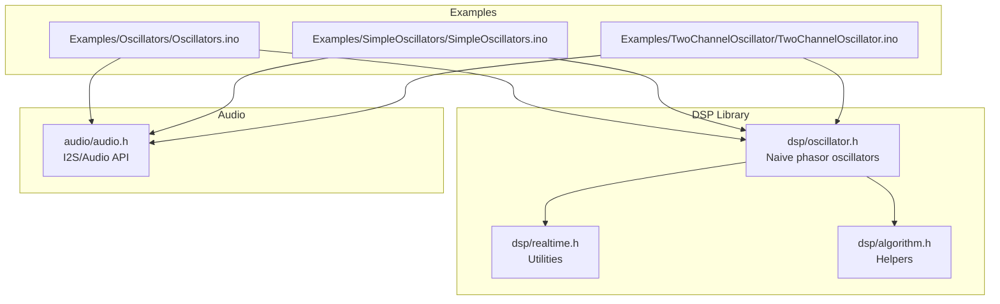
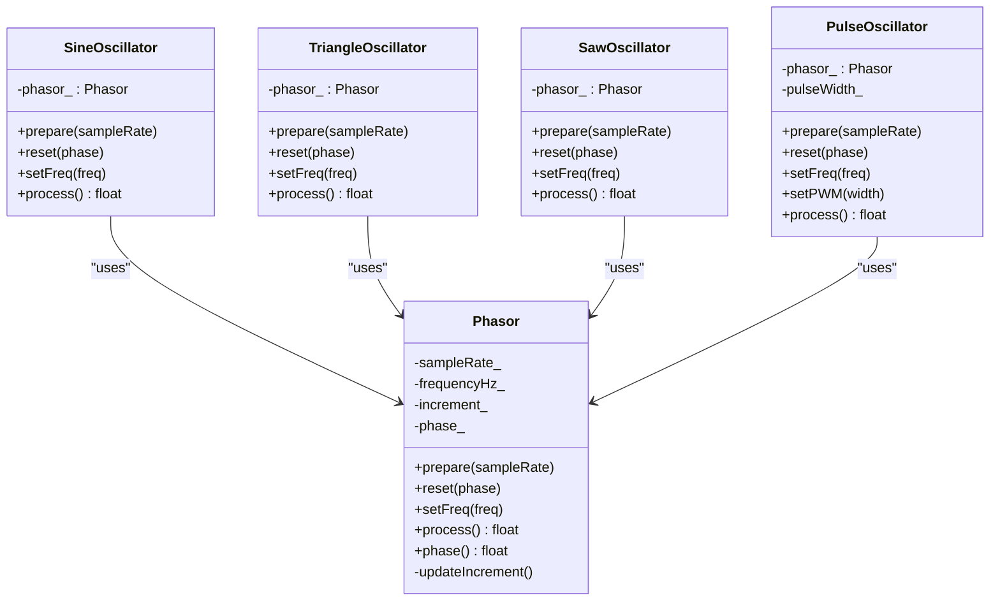
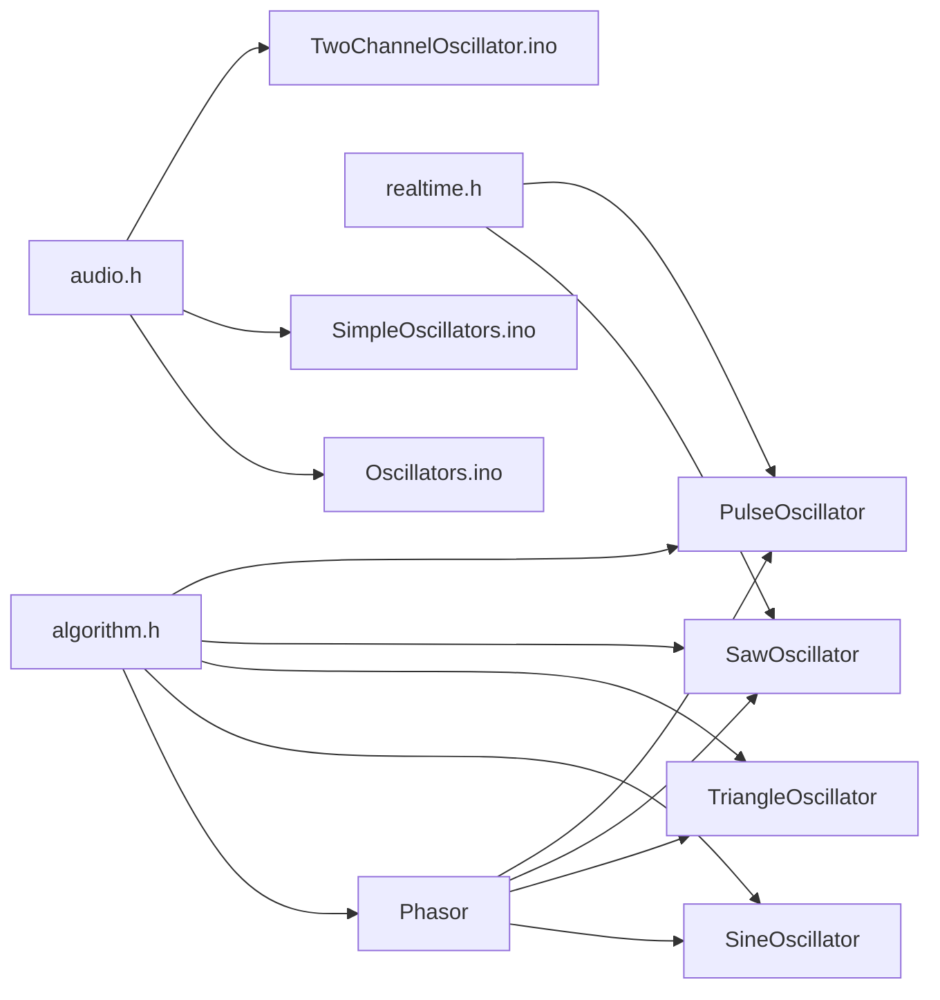

# Naive Phasor Oscillators

<cite>
**Referenced Files in This Document**
- [oscillator.h](file://dsp/oscillator.h)
- [oscillator.h](file://Examples/Oscillators/src/dsp/oscillator.h)
- [oscillator.h](file://Examples/SimpleOscillators/src/dsp/oscillator.h)
- [Oscillators.ino](file://Examples/Oscillators/Oscillators.ino)
- [SimpleOscillators.ino](file://Examples/SimpleOscillators/SimpleOscillators.ino)
- [TwoChannelOscillator.ino](file://Examples/TwoChannelOscillator/TwoChannelOscillator.ino)
- [realtime.h](file://dsp/realtime.h)
- [algorithm.h](file://dsp/algorithm.h)
- [audio.h](file://audio/audio.h)
</cite>

## Table of Contents
1. [Introduction](#introduction)
2. [Project Structure](#project-structure)
3. [Core Components](#core-components)
4. [Architecture Overview](#architecture-overview)
5. [Detailed Component Analysis](#detailed-component-analysis)
6. [Dependency Analysis](#dependency-analysis)
7. [Performance Considerations](#performance-considerations)
8. [Troubleshooting Guide](#troubleshooting-guide)
9. [Conclusion](#conclusion)

## Introduction
This document explains the four naive phasor oscillator implementations: SineOscillator, TriangleOscillator, SawOscillator, and PulseOscillator. These are direct mappings from a normalized phase accumulator to waveforms using mathematical functions:
- Sine: sin(2πφ)
- Triangle: 1 − 4|φ − 0.5|
- Saw: 2φ − 1
- Square/Pulse: ±1 depending on whether φ < duty

They are “naive” because they sample the phase directly without band-limiting, introducing aliasing for discontinuous waveforms (saw, square, pulse). Despite this, they remain widely used due to their simplicity, minimal memory footprint, and computational efficiency.

## Project Structure
The oscillators are defined in a single header file and demonstrated across multiple examples that show real-time usage patterns, parameter updates, and I2S audio output.

**Diagram sources**
- [oscillator.h:39-122](file://dsp/oscillator.h#L39-L122)
- [realtime.h:8-11](file://dsp/realtime.h#L8-L11)
- [algorithm.h:14-32](file://dsp/algorithm.h#L14-L32)
- [Oscillators.ino:1-168](file://Examples/Oscillators/Oscillators.ino#L1-L168)
- [SimpleOscillators.ino:1-216](file://Examples/SimpleOscillators/SimpleOscillators.ino#L1-L216)
- [TwoChannelOscillator.ino:1-167](file://Examples/TwoChannelOscillator/TwoChannelOscillator.ino#L1-L167)
- [audio.h:42-72](file://audio/audio.h#L42-L72)

**Section sources**
- [oscillator.h:1-408](file://dsp/oscillator.h#L1-L408)
- [Oscillators.ino:1-168](file://Examples/Oscillators/Oscillators.ino#L1-L168)
- [SimpleOscillators.ino:1-216](file://Examples/SimpleOscillators/SimpleOscillators.ino#L1-L216)
- [TwoChannelOscillator.ino:1-167](file://Examples/TwoChannelOscillator/TwoChannelOscillator.ino#L1-L167)
- [audio.h:42-72](file://audio/audio.h#L42-L72)

## Core Components
- Phasor: A normalized phase accumulator that advances by a per-sample increment and wraps to [0, 1). It exposes the current phase before advancing to maintain consistent phase sharing across oscillators.
- SineOscillator: Uses sin(2πφ) on the shared Phasor output.
- TriangleOscillator: Maps φ to a triangle via 1 − 4|φ − 0.5|.
- SawOscillator: Maps φ to a saw via 2φ − 1.
- PulseOscillator: Outputs ±1 depending on whether φ < duty, with a clamp on duty in [0.01, 0.99].

Key behaviors:
- Frequency control sets a per-sample increment; reset sets the phase to a normalized value.
- All oscillators delegate to a shared Phasor instance to ensure coherent phase relationships.

**Section sources**
- [oscillator.h:39-122](file://dsp/oscillator.h#L39-L122)

## Architecture Overview
The naive oscillators form a small, header-only DSP library. They rely on shared helper utilities for clamping, wrapping, and safe sample-rate handling. Examples demonstrate real-time usage with I2S audio output and dynamic parameter changes.

**Diagram sources**
- [oscillator.h:39-122](file://dsp/oscillator.h#L39-L122)

## Detailed Component Analysis

### SineOscillator
- Implementation: Generates sin(2πφ) using the shared Phasor’s current phase.
- Complexity: O(1) per sample; one trigonometric evaluation.
- Memory: Minimal; stores only the Phasor instance.
- Aliasing: Continuous waveform; no discontinuities; minimal aliasing risk.

Practical usage patterns:
- Set frequency once during initialization or dynamically during playback.
- Reset phase for synchronization across voices.

**Section sources**
- [oscillator.h:71-81](file://dsp/oscillator.h#L71-L81)

### TriangleOscillator
- Implementation: Maps φ to a triangle via 1 − 4|φ − 0.5|.
- Complexity: O(1) per sample; one fabs and two multiplications.
- Memory: Minimal; stores only the Phasor instance.
- Aliasing: Continuous waveform; no discontinuities; minimal aliasing risk.

**Section sources**
- [oscillator.h:83-96](file://dsp/oscillator.h#L83-L96)

### SawOscillator
- Implementation: Maps φ to a saw via 2φ − 1.
- Complexity: O(1) per sample; one multiply and subtract.
- Memory: Minimal; stores only the Phasor instance.
- Aliasing: Discontinuous waveform; introduces aliasing. The library comments explicitly note that saw/square/pulse alias due to discontinuities.

Audible impact:
- Aliasing manifests as harsh high-frequency content, especially noticeable above 8–10 kHz.
- Can cause aliasing foldover into audible bands when the fundamental approaches half the sample rate.

Mitigation:
- Use anti-aliased alternatives (e.g., B-spline-based oscillators) when aliasing is undesirable.

**Section sources**
- [oscillator.h:98-108](file://dsp/oscillator.h#L98-L108)

### PulseOscillator
- Implementation: Outputs ±1 depending on whether φ < duty.
- Additional capability: setPWM(width) clamps duty to [0.01, 0.99].
- Complexity: O(1) per sample; one comparison and branch.
- Memory: Minimal; stores Phasor and a duty float.
- Aliasing: Discontinuous waveform; introduces aliasing similar to saw.

Real-time parameter changes:
- Duty can be updated dynamically; typical examples show runtime updates in audio callbacks.

**Section sources**
- [oscillator.h:110-122](file://dsp/oscillator.h#L110-L122)

### Phasor (Shared Phase Accumulator)
- Role: Centralized phase generator with per-sample increment derived from frequency and sample rate.
- Behavior: Returns current phase before advancing to ensure consistent phase sharing across oscillators.
- Utilities: Wraps phase to [0, 1) without drift accumulation.

**Section sources**
- [oscillator.h:39-69](file://dsp/oscillator.h#L39-L69)

### Practical Usage Patterns from Examples
- Frequency setting:
  - Initialize with prepare(sampleRate), then setFreq(frequencyHz).
  - Examples demonstrate per-buffer updates for real-time parameter changes.
- Phase reset:
  - reset(phase) allows precise phase alignment for synchronization.
- Real-time parameter changes:
  - Dynamic frequency and duty adjustments occur inside the audio callback to avoid clicks or phase tears.

Example references:
- Multi-oscillator example initializes arrays of SineOscillator and applies LFO modulation in the audio callback.
- Two-channel example updates left/right frequencies from Core 1 state in the audio callback.
- Hard-sync saw example demonstrates dynamic slave/master frequency changes driven by an LFO.

**Section sources**
- [Oscillators.ino:31-48](file://Examples/Oscillators/Oscillators.ino#L31-L48)
- [Oscillators.ino:60-95](file://Examples/Oscillators/Oscillators.ino#L60-L95)
- [TwoChannelOscillator.ino:68-82](file://Examples/TwoChannelOscillator/TwoChannelOscillator.ino#L68-L82)
- [SimpleOscillators.ino:88-111](file://Examples/SimpleOscillators/SimpleOscillators.ino#L88-L111)

## Dependency Analysis
- Internal dependencies:
  - All naive oscillators depend on Phasor for phase generation.
  - Helper utilities from algorithm.h (clamp, wrap01, midiNoteToHz) and realtime.h (zapDenormal) are used across the library.
- External dependencies:
  - Examples depend on the audio subsystem for I2S output and buffer management.

**Diagram sources**
- [oscillator.h:39-122](file://dsp/oscillator.h#L39-L122)
- [algorithm.h:14-32](file://dsp/algorithm.h#L14-L32)
- [realtime.h:8-11](file://dsp/realtime.h#L8-L11)
- [audio.h:42-72](file://audio/audio.h#L42-L72)
- [Oscillators.ino:1-168](file://Examples/Oscillators/Oscillators.ino#L1-L168)
- [SimpleOscillators.ino:1-216](file://Examples/SimpleOscillators/SimpleOscillators.ino#L1-L216)
- [TwoChannelOscillator.ino:1-167](file://Examples/TwoChannelOscillator/TwoChannelOscillator.ino#L1-L167)

**Section sources**
- [oscillator.h:39-122](file://dsp/oscillator.h#L39-L122)
- [algorithm.h:14-32](file://dsp/algorithm.h#L14-L32)
- [realtime.h:8-11](file://dsp/realtime.h#L8-L11)
- [audio.h:42-72](file://audio/audio.h#L42-L72)

## Performance Considerations
- Computational cost:
  - All naive oscillators are O(1) per sample.
  - Sine requires a transcendental function; triangle/saw/pulse require simple arithmetic.
- Memory usage:
  - Minimal per oscillator: one Phasor instance plus optional duty for PulseOscillator.
- Aliasing:
  - Discontinuous waveforms (saw, square, pulse) introduce aliasing; consider anti-aliased alternatives for high-fidelity applications.
- Real-time safety:
  - Examples show dynamic parameter updates inside the audio callback; ensure updates are bounded and avoid heavy operations.

[No sources needed since this section provides general guidance]

## Troubleshooting Guide
- Clicks or pops on parameter changes:
  - Ensure parameter updates occur at sample boundaries or are smoothed to avoid discontinuities.
- Excessive aliasing:
  - Replace saw/square/pulse with anti-aliased alternatives (e.g., B-spline-based oscillators) when aliasing is audible.
- Incorrect phase alignment:
  - Use reset(phase) to synchronize oscillators precisely.
- Denormal floating-point artifacts:
  - The library includes zapDenormal to mitigate denormal handling overhead in feedback paths.

**Section sources**
- [oscillator.h:214-228](file://dsp/oscillator.h#L214-L228)
- [realtime.h:8-11](file://dsp/realtime.h#L8-L11)

## Conclusion
The naive phasor oscillators offer a lightweight, efficient foundation for audio synthesis. Their direct mapping from phase to waveform enables fast, predictable performance and broad compatibility. However, discontinuous waveforms introduce aliasing that can degrade perceived quality. For applications requiring high fidelity or aggressive modulation, consider anti-aliased alternatives. The examples demonstrate robust real-time usage patterns, including dynamic frequency and duty updates, making these oscillators practical building blocks for embedded audio systems.