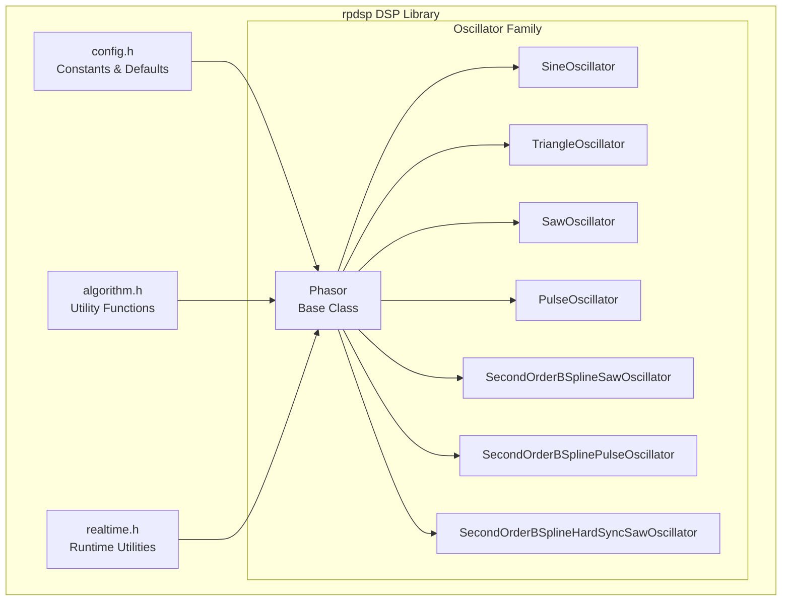
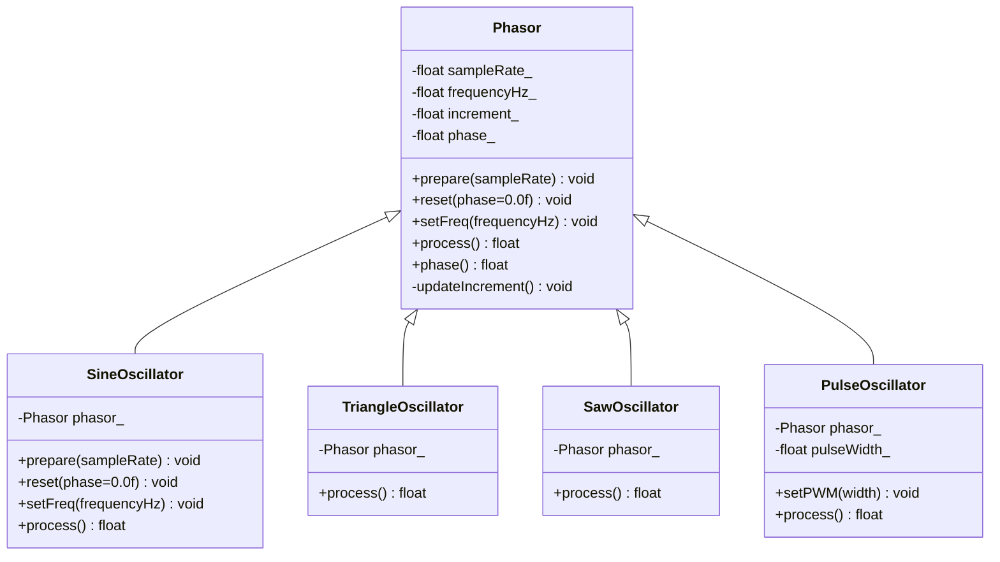
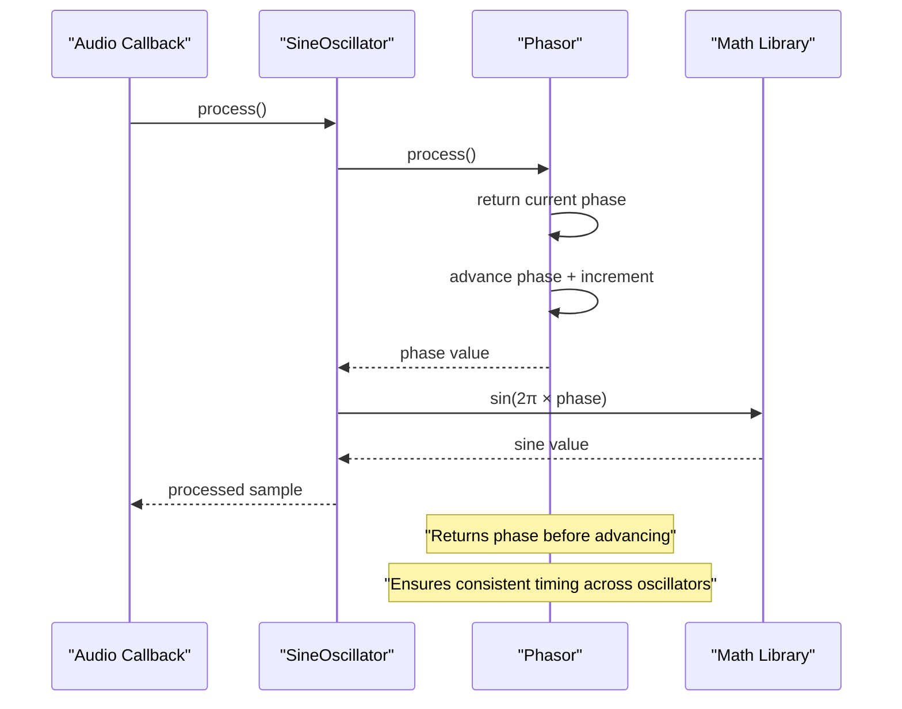
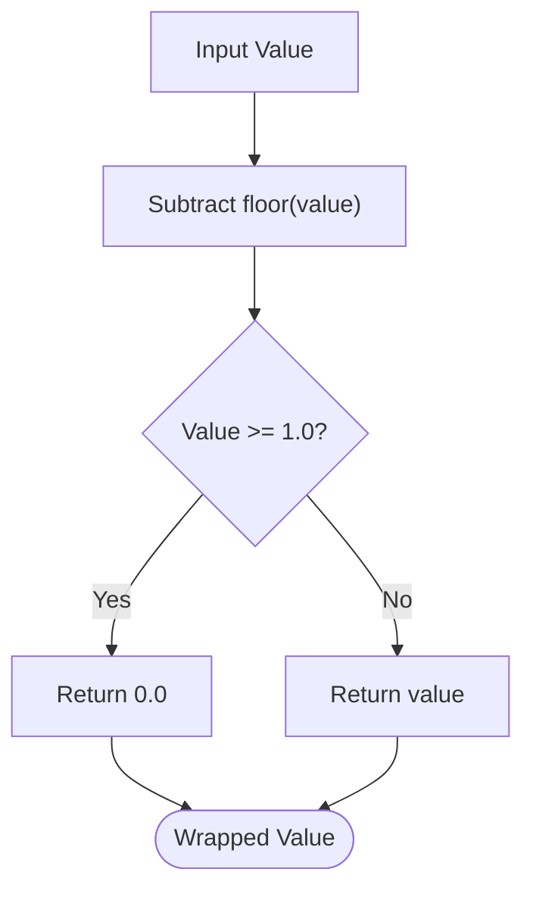
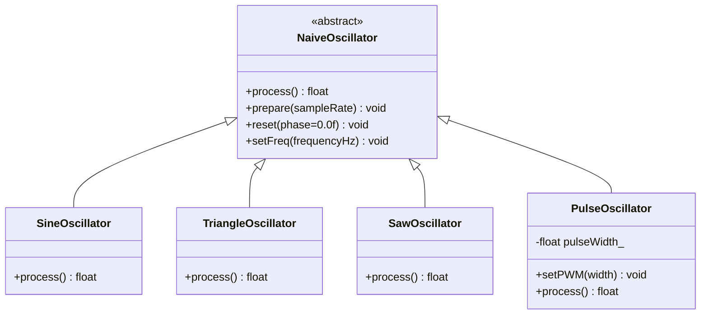
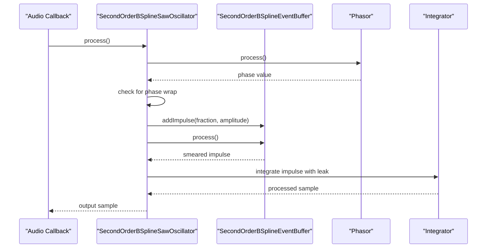
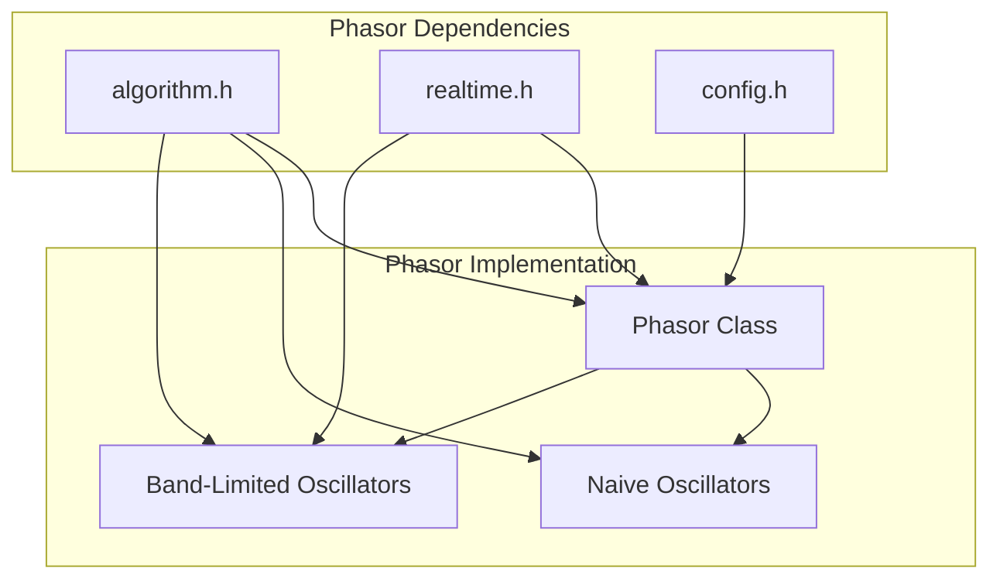
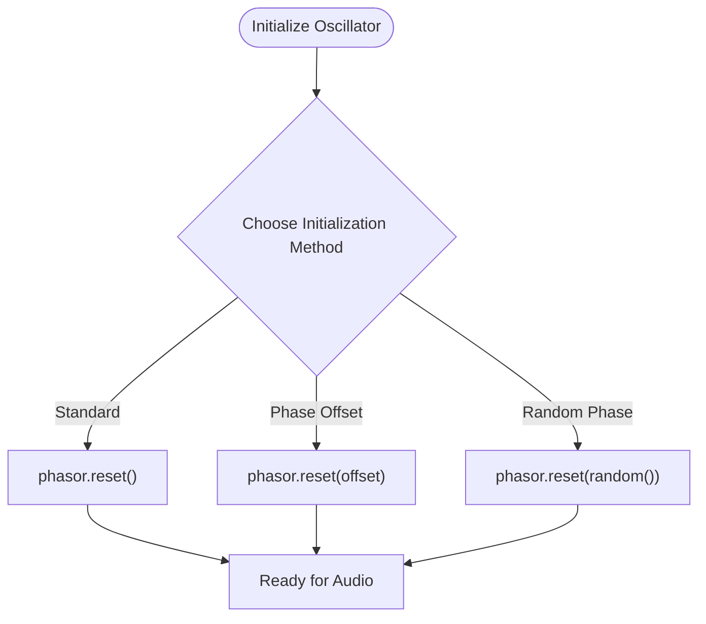
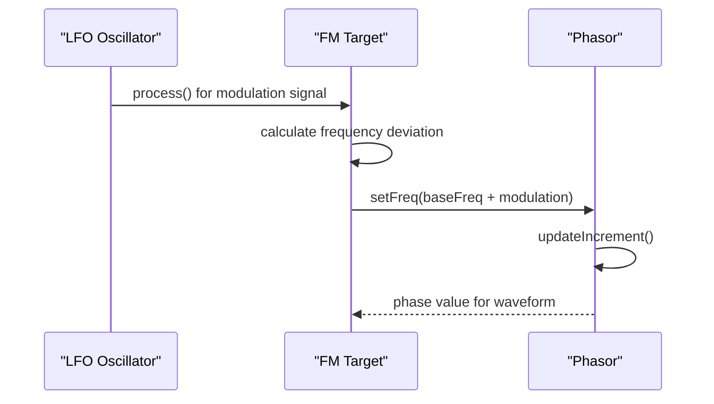

# Phasor Base Class

<cite>
**Referenced Files in This Document**
- [oscillator.h](file://dsp/oscillator.h)
- [algorithm.h](file://dsp/algorithm.h)
- [config.h](file://dsp/config.h)
- [realtime.h](file://dsp/realtime.h)
- [README.md](file://README.md)
</cite>

## Table of Contents
1. [Introduction](#introduction)
2. [Project Structure](#project-structure)
3. [Core Components](#core-components)
4. [Architecture Overview](#architecture-overview)
5. [Detailed Component Analysis](#detailed-component-analysis)
6. [Dependency Analysis](#dependency-analysis)
7. [Performance Considerations](#performance-considerations)
8. [Troubleshooting Guide](#troubleshooting-guide)
9. [Conclusion](#conclusion)

## Introduction
This document provides comprehensive documentation for the Phasor base class, which establishes the fundamental phase convention used by all oscillators in the rpdsp DSP library. The Phasor class implements a phase accumulator mechanism that drives sine, triangle, saw, and pulse oscillators, as well as advanced band-limited oscillators. It defines the mathematical foundation for phase accumulation, frequency calculation, and phase wrapping logic that ensures consistent oscillator behavior across the entire oscillator family.

The Phasor class serves as the foundation for both naive oscillators (direct phase-to-waveform mapping) and sophisticated band-limited oscillators that use impulse-based synthesis with B-spline kernels. Understanding the Phasor's phase convention is essential for implementing frequency modulation, phase offset techniques, and maintaining numerical stability in real-time audio synthesis.

## Project Structure
The rpdsp DSP library is organized into modular header-only components that provide a cohesive audio synthesis framework. The oscillator subsystem resides in the dsp/ directory and includes the Phasor base class alongside specialized oscillator implementations.



**Diagram sources**
- [oscillator.h:39-122](file://dsp/oscillator.h#L39-L122)
- [config.h:11-15](file://dsp/config.h#L11-L15)
- [algorithm.h:28-32](file://dsp/algorithm.h#L28-L32)
- [realtime.h:8-11](file://dsp/realtime.h#L8-L11)

**Section sources**
- [README.md:30-37](file://README.md#L30-L37)
- [oscillator.h:9-37](file://dsp/oscillator.h#L9-L37)

## Core Components
The Phasor class implements a minimal yet powerful phase accumulator that forms the foundation for all oscillator types in the rpdsp library. Its design emphasizes simplicity, numerical stability, and consistency across different oscillator implementations.

### Phase Accumulator Mechanism
The core phase accumulator operates on a normalized 0.0 to 1.0 scale where 1.0 represents one complete cycle. The accumulator advances by a phase increment calculated from the desired frequency and sample rate.

Key characteristics:
- **Normalized Phase Scale**: Phase values remain in the range [0.0, 1.0)
- **Linear Phase Increment**: Each sample adds `frequencyHz / sampleRate` to the accumulator
- **Consistent Sampling**: The current phase is sampled before advancement to maintain timing consistency

### Mathematical Foundation
The phase accumulation follows the fundamental equation:
```
phase += frequency / sampleRate
```

This mathematical relationship ensures that:
- At the Nyquist frequency (sampleRate/2), the phase increment equals 0.5
- For lower frequencies, the increment scales proportionally
- The phase wraps at exactly 1.0 to maintain periodicity

### Shared Interface Methods
The Phasor class provides four essential methods that define the oscillator interface:



**Diagram sources**
- [oscillator.h:39-122](file://dsp/oscillator.h#L39-L122)

**Section sources**
- [oscillator.h:39-69](file://dsp/oscillator.h#L39-L69)

## Architecture Overview
The Phasor-based oscillator architecture demonstrates composition over inheritance, where specialized oscillator classes delegate phase generation to a shared Phasor instance. This design ensures consistent phase behavior across all oscillator types while allowing individual oscillators to apply their specific waveform transformations.



**Diagram sources**
- [oscillator.h:71-81](file://dsp/oscillator.h#L71-L81)
- [oscillator.h:53-58](file://dsp/oscillator.h#L53-L58)

The architecture ensures that all oscillators share the same phase convention, which is critical for coherent multi-oscillator patches and phase-coherent effects like ring modulation and hard sync.

**Section sources**
- [oscillator.h:9-16](file://dsp/oscillator.h#L9-L16)
- [oscillator.h:53-58](file://dsp/oscillator.h#L53-L58)

## Detailed Component Analysis

### Phasor Class Implementation
The Phasor class implements a clean, efficient phase accumulator with careful attention to numerical stability and performance optimization.

#### Phase Accumulation Logic
The phase accumulation process follows a carefully designed sequence that ensures timing consistency:

```mermaid
flowchart TD
Start([process() called]) --> GetPhase["Get Current Phase"]
GetPhase --> AdvancePhase["Advance Phase by Increment"]
AdvancePhase --> WrapPhase["Wrap to [0,1) Range"]
WrapPhase --> ReturnPhase["Return Original Phase"]
ReturnPhase --> End([process() Complete])
AdvancePhase --> CheckWrap{"Phase >= 1.0?"}
CheckWrap --> |Yes| WrapValue["Wrap to 0.0"]
CheckWrap --> |No| KeepValue["Keep Phase Value"]
WrapValue --> WrapPhase
KeepValue --> WrapPhase
```

**Diagram sources**
- [oscillator.h:53-58](file://dsp/oscillator.h#L53-L58)
- [algorithm.h:28-32](file://dsp/algorithm.h#L28-L32)

#### Frequency Calculation and Update Mechanism
Frequency updates are handled through a two-stage process that maintains numerical stability:

1. **Frequency Validation**: Input frequencies are clamped to non-negative values
2. **Increment Recalculation**: The phase increment is recomputed as `frequencyHz / sampleRate`

The update mechanism ensures that frequency changes are applied consistently across all dependent oscillators.

#### Numerical Stability Features
The Phasor implementation incorporates several numerical stability measures:

- **Safe Sample Rate Handling**: Uses `safeSampleRate()` to handle invalid or missing sample rate values
- **Clamped Increments**: Band-limited oscillators use `clamp(increment, 0.0f, 0.49f)` to prevent aliasing
- **Denormal Prevention**: Uses `zapDenormal()` to eliminate problematic denormal floating-point values

**Section sources**
- [oscillator.h:41-51](file://dsp/oscillator.h#L41-L51)
- [oscillator.h:62-63](file://dsp/oscillator.h#L62-L63)
- [algorithm.h:50-53](file://dsp/algorithm.h#L50-L53)
- [realtime.h:8-11](file://dsp/realtime.h#L8-L11)

### Utility Functions and Supporting Infrastructure

#### wrap01() Function
The `wrap01()` utility function provides numerically stable phase wrapping without accumulating drift:



**Diagram sources**
- [algorithm.h:28-32](file://dsp/algorithm.h#L28-L32)

#### safeSampleRate() Function
The `safeSampleRate()` function ensures robust operation across different host environments:

- **Fallback Behavior**: Returns `kDefaultSampleRate` when input is invalid (< 1.0)
- **Validation Point**: Centralized sample rate validation in the `prepare()` method
- **Consistency**: Ensures all oscillators operate with the same validated sample rate

**Section sources**
- [algorithm.h:28-32](file://dsp/algorithm.h#L28-L32)
- [algorithm.h:50-53](file://dsp/algorithm.h#L50-L53)
- [config.h:11-15](file://dsp/config.h#L11-L15)

### Specialized Oscillator Implementations

#### Naive Oscillator Family
The naive oscillator family (Sine, Triangle, Saw, Pulse) demonstrates the direct application of the Phasor's phase output:



**Diagram sources**
- [oscillator.h:71-122](file://dsp/oscillator.h#L71-L122)

Each naive oscillator applies a simple mathematical transformation to the Phasor's normalized phase output, converting the linear phase progression into the desired waveform shape.

#### Band-Limited Oscillator Family
The band-limited oscillators (SecondOrderBSpline*) represent advanced implementations that address aliasing concerns through impulse-based synthesis:



**Diagram sources**
- [oscillator.h:182-237](file://dsp/oscillator.h#L182-L237)
- [oscillator.h:146-177](file://dsp/oscillator.h#L146-L177)

These oscillators use the Phasor for timing coordination while implementing sophisticated anti-aliasing techniques through impulse scheduling and B-spline kernel convolution.

**Section sources**
- [oscillator.h:182-237](file://dsp/oscillator.h#L182-L237)
- [oscillator.h:146-177](file://dsp/oscillator.h#L146-L177)

## Dependency Analysis
The Phasor class maintains minimal dependencies while leveraging essential utility functions for robust operation.



**Diagram sources**
- [oscillator.h:3-7](file://dsp/oscillator.h#L3-L7)
- [config.h:11-15](file://dsp/config.h#L11-L15)
- [algorithm.h:28-32](file://dsp/algorithm.h#L28-L32)
- [realtime.h:8-11](file://dsp/realtime.h#L8-L11)

The dependency graph reveals a clean separation of concerns:
- **Utility Functions**: Provided by algorithm.h and realtime.h
- **Configuration**: Managed through config.h constants
- **Implementation**: Focused on phase accumulation logic

**Section sources**
- [oscillator.h:3-7](file://dsp/oscillator.h#L3-L7)
- [config.h:11-15](file://dsp/config.h#L11-L15)

## Performance Considerations
The Phasor implementation prioritizes real-time performance through several optimization strategies:

### Computational Efficiency
- **Minimal Operations**: Each sample requires only basic arithmetic operations
- **Single Memory Access**: Phase, increment, and frequency values are stored in registers
- **Branchless Design**: The phase wrapping uses conditional assignment rather than branches

### Numerical Precision
- **Floating-Point Arithmetic**: Uses standard IEEE 754 floats for optimal performance
- **Denormal Prevention**: `zapDenormal()` eliminates slow denormal operations
- **Clamping Strategy**: Prevents numerical overflow and maintains stability

### Memory Management
- **Stack-Based**: No heap allocation required
- **Small Footprint**: Minimal memory overhead per oscillator instance
- **Cache Friendly**: Sequential memory access patterns

## Troubleshooting Guide

### Common Phase Issues
**Problem**: Oscillators producing incorrect pitch
**Solution**: Verify sample rate preparation and frequency updates
- Ensure `prepare()` is called with the correct sample rate
- Check that `setFreq()` is called after `prepare()`
- Verify frequency values are positive and reasonable

**Problem**: Phase drift or timing inconsistencies
**Solution**: Confirm proper phase wrapping implementation
- Ensure `wrap01()` is used for phase normalization
- Verify phase is returned before advancement in `process()`

### Numerical Stability Issues
**Problem**: Clicks or pops in output
**Solution**: Check for denormal numbers and extreme frequency values
- Use `zapDenormal()` on accumulator values
- Clamp frequencies to prevent excessive increments
- Verify sample rate validation is functioning

**Problem**: Aliasing in naive oscillators
**Solution**: Consider switching to band-limited alternatives
- Use SecondOrderBSpline* oscillators for higher quality
- Implement proper frequency clamping (≤ 0.49 × sampleRate/2)

### Practical Implementation Examples

#### Phase Initialization Techniques
The Phasor supports flexible phase initialization for various use cases:



#### Frequency Modulation Implementation
Frequency modulation can be implemented by updating the Phasor's frequency parameter:



#### Phase Offset Applications
Phase offsets enable creative synthesis techniques:

- **Stereo Widening**: Apply opposite phase offsets to stereo channels
- **Phase Distortion**: Use controlled phase offsets for timbral modification
- **Harmonic Generation**: Implement phase modulation for complex harmonic content

**Section sources**
- [oscillator.h:46](file://dsp/oscillator.h#L46)
- [oscillator.h:48-51](file://dsp/oscillator.h#L48-L51)
- [oscillator.h:53-58](file://dsp/oscillator.h#L53-L58)

## Conclusion
The Phasor base class represents a masterfully crafted foundation for audio oscillator design, balancing simplicity with mathematical rigor. Its implementation of phase accumulation, frequency calculation, and phase wrapping establishes a consistent timing convention that enables coherent multi-oscillator synthesis while maintaining excellent numerical stability.

The class's design philosophy—returning the current phase before advancing—ensures that all oscillators share identical timing semantics, which is fundamental for phase-coherent effects and multi-oscillator patches. The supporting utility functions (`wrap01()`, `safeSampleRate()`, `zapDenormal()`) provide the robustness necessary for real-time audio applications.

The transition from naive oscillators to band-limited implementations demonstrates how the Phasor's clean interface enables sophisticated anti-aliasing techniques without compromising the established phase convention. This architectural choice allows developers to start with simple, computationally efficient oscillators and progressively adopt more advanced techniques as needed.

The rpdsp library's comprehensive oscillator family, built upon the Phasor foundation, provides a solid platform for both educational exploration and professional audio synthesis applications. Understanding the Phasor's mathematical underpinnings and implementation details is essential for anyone working with the rpdsp DSP library or extending its oscillator capabilities.