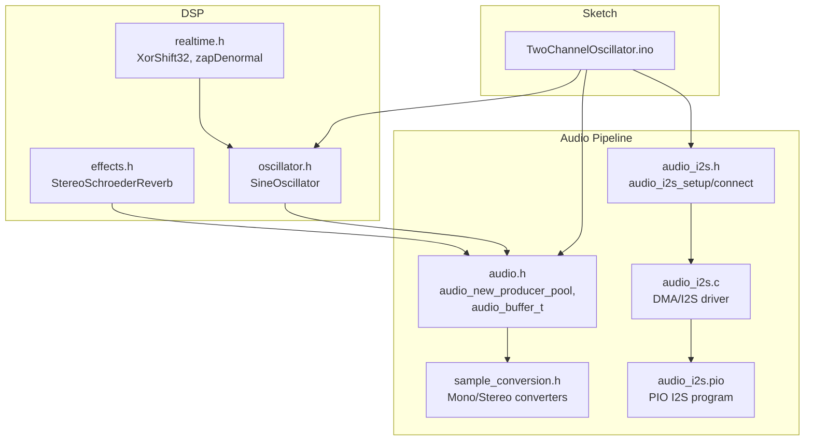
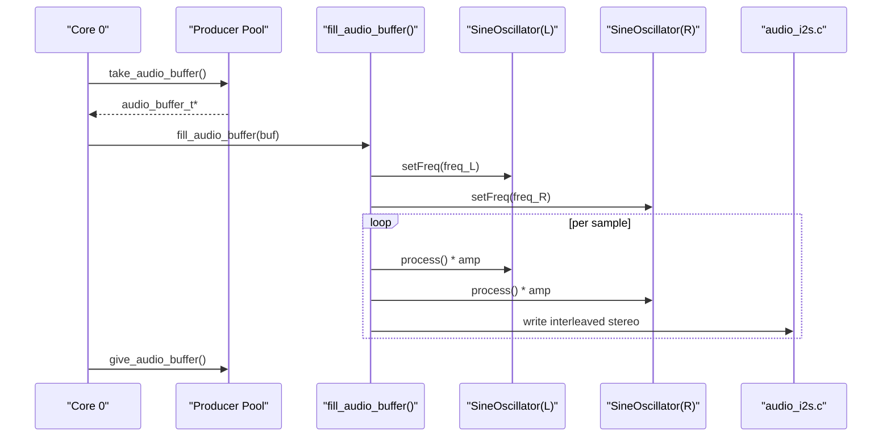
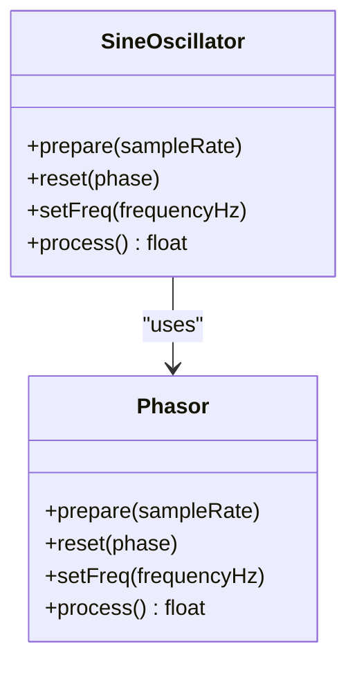
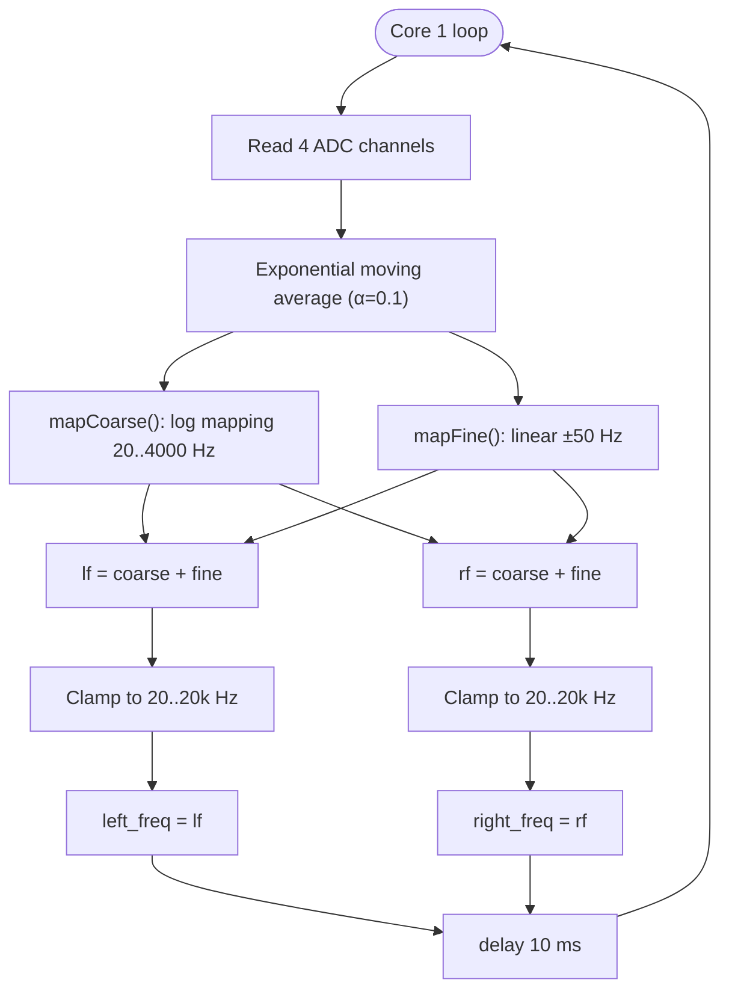
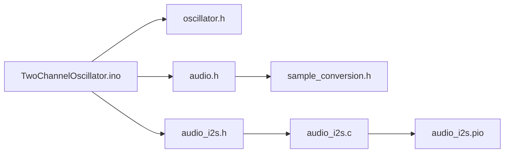

# Two Channel Oscillator

<cite>
**Referenced Files in This Document**
- [TwoChannelOscillator.ino](file://Examples/TwoChannelOscillator/TwoChannelOscillator.ino)
- [oscillator.h](file://Examples/TwoChannelOscillator/src/dsp/oscillator.h)
- [audio.h](file://Examples/TwoChannelOscillator/src/audio/audio.h)
- [audio_i2s.h](file://Examples/TwoChannelOscillator/src/audio/audio_i2s.h)
- [audio_i2s.c](file://Examples/TwoChannelOscillator/src/audio/audio_i2s.c)
- [audio_i2s.pio](file://Examples/TwoChannelOscillator/src/audio/audio_i2s.pio)
- [audio.cpp](file://Examples/TwoChannelOscillator/src/audio/audio.cpp)
- [sample_conversion.h](file://Examples/TwoChannelOscillator/src/audio/sample_conversion.h)
- [effects.h](file://Examples/TwoChannelOscillator/src/dsp/effects.h)
- [realtime.h](file://Examples/TwoChannelOscillator/src/dsp/realtime.h)
</cite>

## Table of Contents
1. [Introduction](#introduction)
2. [Project Structure](#project-structure)
3. [Core Components](#core-components)
4. [Architecture Overview](#architecture-overview)
5. [Detailed Component Analysis](#detailed-component-analysis)
6. [Dependency Analysis](#dependency-analysis)
7. [Performance Considerations](#performance-considerations)
8. [Troubleshooting Guide](#troubleshooting-guide)
9. [Conclusion](#conclusion)
10. [Appendices](#appendices)

## Introduction
This document explains the two-channel oscillator example that generates independent left/right sine waves, processes them into interleaved stereo audio, and streams them via I2S to a DAC. It covers:
- Dual-channel oscillator setup with independent frequency control per channel
- Stereo panning and phase relationship management
- Interleaved stereo buffer processing and I2S configuration
- Real-time parameter updates and smoothing
- Practical stereo DSP examples such as stereo widening and independent per-channel modulation

## Project Structure
The example is organized into:
- Example sketch: initializes oscillators, ADC sliders, audio buffers, and I2S
- DSP: oscillators, effects, and real-time utilities
- Audio pipeline: buffer pools, sample conversion, and I2S driver with PIO

**Diagram sources**
- [TwoChannelOscillator.ino:101-129](file://Examples/TwoChannelOscillator/TwoChannelOscillator.ino#L101-L129)
- [oscillator.h:71-81](file://Examples/TwoChannelOscillator/src/dsp/oscillator.h#L71-L81)
- [audio.h:106-126](file://Examples/TwoChannelOscillator/src/audio/audio.h#L106-L126)
- [sample_conversion.h:44-48](file://Examples/TwoChannelOscillator/src/audio/sample_conversion.h#L44-L48)
- [audio_i2s.h:114-119](file://Examples/TwoChannelOscillator/src/audio/audio_i2s.h#L114-L119)
- [audio_i2s.c:49-100](file://Examples/TwoChannelOscillator/src/audio/audio_i2s.c#L49-L100)
- [audio_i2s.pio:28-62](file://Examples/TwoChannelOscillator/src/audio/audio_i2s.pio#L28-L62)

**Section sources**
- [TwoChannelOscillator.ino:101-129](file://Examples/TwoChannelOscillator/TwoChannelOscillator.ino#L101-L129)
- [audio.h:106-126](file://Examples/TwoChannelOscillator/src/audio/audio.h#L106-L126)

## Core Components
- Dual-channel oscillators: independent SineOscillator instances for left/right channels
- Frequency mapping: logarithmic coarse and linear fine control from ADC sliders
- Buffering: producer pool of interleaved stereo buffers
- I2S: PIO-based stereo I2S output with DMA
- Real-time smoothing: exponential averaging on ADC inputs

Key implementation references:
- Oscillators and phase convention: [oscillator.h:39-81](file://Examples/TwoChannelOscillator/src/dsp/oscillator.h#L39-L81)
- Buffer format and producer pool: [audio.h:49-72](file://Examples/TwoChannelOscillator/src/audio/audio.h#L49-L72), [audio.cpp:156-174](file://Examples/TwoChannelOscillator/src/audio/audio.cpp#L156-L174)
- I2S setup and connect: [audio_i2s.h:127-147](file://Examples/TwoChannelOscillator/src/audio/audio_i2s.h#L127-L147), [audio_i2s.c:49-100](file://Examples/TwoChannelOscillator/src/audio/audio_i2s.c#L49-L100)
- Interleaved stereo callback: [TwoChannelOscillator.ino:69-82](file://Examples/TwoChannelOscillator/TwoChannelOscillator.ino#L69-L82)
- ADC smoothing and mapping: [TwoChannelOscillator.ino:148-166](file://Examples/TwoChannelOscillator/TwoChannelOscillator/TwoChannelOscillator.ino#L148-L166)

**Section sources**
- [oscillator.h:71-81](file://Examples/TwoChannelOscillator/src/dsp/oscillator.h#L71-L81)
- [audio.h:49-72](file://Examples/TwoChannelOscillator/src/audio/audio.h#L49-L72)
- [audio.cpp:156-174](file://Examples/TwoChannelOscillator/src/audio/audio.cpp#L156-L174)
- [audio_i2s.h:127-147](file://Examples/TwoChannelOscillator/src/audio/audio_i2s.h#L127-L147)
- [audio_i2s.c:49-100](file://Examples/TwoChannelOscillator/src/audio/audio_i2s.c#L49-L100)
- [TwoChannelOscillator.ino:69-82](file://Examples/TwoChannelOscillator/TwoChannelOscillator.ino#L69-L82)
- [TwoChannelOscillator.ino:148-166](file://Examples/TwoChannelOscillator/TwoChannelOscillator.ino#L148-L166)

## Architecture Overview
The system runs on two cores:
- Core 0: audio generation and I2S streaming
- Core 1: ADC polling and frequency updates

**Diagram sources**
- [TwoChannelOscillator.ino:69-82](file://Examples/TwoChannelOscillator/TwoChannelOscillator.ino#L69-L82)
- [audio.cpp:222-228](file://Examples/TwoChannelOscillator/src/audio/audio.cpp#L222-L228)
- [oscillator.h:71-81](file://Examples/TwoChannelOscillator/src/dsp/oscillator.h#L71-L81)
- [audio_i2s.c:314-346](file://Examples/TwoChannelOscillator/src/audio/audio_i2s.c#L314-L346)

## Detailed Component Analysis

### Dual-Channel Oscillator Setup
- Two SineOscillator instances are prepared with the same sample rate and initial frequency
- Each oscillator’s frequency is independently controlled via shared volatile variables
- The audio callback snapshots the shared frequencies once per buffer to prevent tearing

Implementation references:
- Instance creation and prepare: [TwoChannelOscillator.ino:105-109](file://Examples/TwoChannelOscillator/TwoChannelOscillator.ino#L105-L109)
- Shared frequency variables: [TwoChannelOscillator.ino:36-37](file://Examples/TwoChannelOscillator/TwoChannelOscillator.ino#L36-L37)
- Callback snapshot and per-sample interleaving: [TwoChannelOscillator.ino:74-80](file://Examples/TwoChannelOscillator/TwoChannelOscillator.ino#L74-L80)

**Diagram sources**
- [oscillator.h:39-81](file://Examples/TwoChannelOscillator/src/dsp/oscillator.h#L39-L81)

**Section sources**
- [TwoChannelOscillator.ino:105-109](file://Examples/TwoChannelOscillator/TwoChannelOscillator.ino#L105-L109)
- [TwoChannelOscillator.ino:74-80](file://Examples/TwoChannelOscillator/TwoChannelOscillator.ino#L74-L80)
- [oscillator.h:71-81](file://Examples/TwoChannelOscillator/src/dsp/oscillator.h#L71-L81)

### Independent Frequency Control Per Channel
- Coarse control uses logarithmic mapping across octaves
- Fine control uses linear mapping centered at slider midpoint
- Core 1 polls ADCs, applies exponential smoothing, computes final frequencies, and clamps to audible range

**Diagram sources**
- [TwoChannelOscillator.ino:148-166](file://Examples/TwoChannelOscillator/TwoChannelOscillator.ino#L148-L166)
- [TwoChannelOscillator.ino:51-59](file://Examples/TwoChannelOscillator/TwoChannelOscillator.ino#L51-L59)

**Section sources**
- [TwoChannelOscillator.ino:148-166](file://Examples/TwoChannelOscillator/TwoChannelOscillator.ino#L148-L166)
- [TwoChannelOscillator.ino:51-59](file://Examples/TwoChannelOscillator/TwoChannelOscillator.ino#L51-L59)

### Stereo Panning Techniques
- The example outputs raw left/right channels without explicit pan law; amplitudes are scaled by 0.8 to prevent clipping
- For true stereo panning, multiply each channel by a function of pan position (e.g., left *= cos(θ), right *= sin(θ))
- Phase relationship: sine oscillators are in-phase by default; introducing a phase offset per channel creates lateral movement

Implementation references:
- Amplitude scaling in callback: [TwoChannelOscillator.ino:78-79](file://Examples/TwoChannelOscillator/TwoChannelOscillator.ino#L78-L79)

**Section sources**
- [TwoChannelOscillator.ino:78-79](file://Examples/TwoChannelOscillator/TwoChannelOscillator.ino#L78-L79)

### Phase Relationship Management
- Both oscillators use the same underlying Phasor with identical increments
- To create phase differences (e.g., stereo widening), introduce independent phase offsets or detuned frequencies per channel
- Detuning produces Lissajous-like motion in stereo imaging

Implementation references:
- Phasor and oscillator internals: [oscillator.h:39-81](file://Examples/TwoChannelOscillator/src/dsp/oscillator.h#L39-L81)

**Section sources**
- [oscillator.h:39-81](file://Examples/TwoChannelOscillator/src/dsp/oscillator.h#L39-L81)

### Stereo Audio Buffer Processing
- Producer pool allocates interleaved stereo buffers (S16, 2 channels)
- The callback writes pairs of samples as L,R,L,R
- Sample stride is 4 bytes per frame (2 channels × 2 bytes)

Implementation references:
- Producer pool and format: [TwoChannelOscillator.ino:111-120](file://Examples/TwoChannelOscillator/TwoChannelOscillator.ino#L111-L120)
- Interleaved write loop: [TwoChannelOscillator.ino:77-80](file://Examples/TwoChannelOscillator/TwoChannelOscillator.ino#L77-L80)
- Buffer format constants: [audio.h:42-46](file://Examples/TwoChannelOscillator/src/audio/audio.h#L42-L46)

**Section sources**
- [TwoChannelOscillator.ino:111-120](file://Examples/TwoChannelOscillator/TwoChannelOscillator.ino#L111-L120)
- [TwoChannelOscillator.ino:77-80](file://Examples/TwoChannelOscillator/TwoChannelOscillator.ino#L77-L80)
- [audio.h:42-46](file://Examples/TwoChannelOscillator/src/audio/audio.h#L42-L46)

### Individual Channel Parameter Control
- Current example: independent frequency control via shared variables
- Extension ideas:
  - Independent amplitude envelopes per channel
  - Distortion/waveshaping per channel
  - Separate LFOs for tremolo or stereo widening per channel

Implementation references:
- Shared frequency writes: [TwoChannelOscillator.ino:161-163](file://Examples/TwoChannelOscillator/TwoChannelOscillator.ino#L161-L163)

**Section sources**
- [TwoChannelOscillator.ino:161-163](file://Examples/TwoChannelOscillator/TwoChannelOscillator.ino#L161-L163)

### Real-Time Stereo Effects Implementation
- StereoSchroederReverb demonstrates mid/side processing and crossfeed for width control
- Use-case examples:
  - Stereo widening: increase width parameter while preserving mid
  - Independent modulation: apply different LFO rates/gains per channel before reverb

Implementation references:
- Stereo reverb class: [effects.h:192-247](file://Examples/TwoChannelOscillator/src/dsp/effects.h#L192-L247)

**Section sources**
- [effects.h:192-247](file://Examples/TwoChannelOscillator/src/dsp/effects.h#L192-L247)

### Audio Callback and Interleaved Stereo Samples
- The callback receives a buffer, sets both oscillator frequencies once, then writes interleaved samples
- Ensures consistent frequency during the buffer duration and avoids tearing

Implementation references:
- Callback signature and buffer fields: [audio.h:64-72](file://Examples/TwoChannelOscillator/src/audio/audio.h#L64-L72)
- Fill routine: [TwoChannelOscillator.ino:69-82](file://Examples/TwoChannelOscillator/TwoChannelOscillator.ino#L69-L82)

**Section sources**
- [audio.h:64-72](file://Examples/TwoChannelOscillator/src/audio/audio.h#L64-L72)
- [TwoChannelOscillator.ino:69-82](file://Examples/TwoChannelOscillator/TwoChannelOscillator.ino#L69-L82)

### I2S Configuration for Stereo Audio
- PIO program outputs stereo I2S frames (32-bit words for left/right)
- DMA transfers buffer bytes directly to PIO FIFO
- Clock pins configured as side-set; LRCK/BCLK order selectable

Implementation references:
- I2S config structure: [audio_i2s.h:114-119](file://Examples/TwoChannelOscillator/src/audio/audio_i2s.h#L114-L119)
- PIO program and side-set: [audio_i2s.pio:28-62](file://Examples/TwoChannelOscillator/src/audio/audio_i2s.pio#L28-L62)
- DMA transfer and IRQ handling: [audio_i2s.c:314-368](file://Examples/TwoChannelOscillator/src/audio/audio_i2s.c#L314-L368)

**Section sources**
- [audio_i2s.h:114-119](file://Examples/TwoChannelOscillator/src/audio/audio_i2s.h#L114-L119)
- [audio_i2s.pio:28-62](file://Examples/TwoChannelOscillator/src/audio/audio_i2s.pio#L28-L62)
- [audio_i2s.c:314-368](file://Examples/TwoChannelOscillator/src/audio/audio_i2s.c#L314-L368)

## Dependency Analysis
The example composes a clean separation of concerns:
- Core 0 depends on DSP oscillators and the audio buffer pool
- Core 1 depends on ADC and shared frequency variables
- I2S driver depends on PIO programs and DMA

**Diagram sources**
- [TwoChannelOscillator.ino:14-16](file://Examples/TwoChannelOscillator/TwoChannelOscillator.ino#L14-L16)
- [oscillator.h:1-10](file://Examples/TwoChannelOscillator/src/dsp/oscillator.h#L1-L10)
- [audio.h:1-25](file://Examples/TwoChannelOscillator/src/audio/audio.h#L1-L25)
- [audio_i2s.h:1-22](file://Examples/TwoChannelOscillator/src/audio/audio_i2s.h#L1-L22)
- [audio_i2s.c:1-20](file://Examples/TwoChannelOscillator/src/audio/audio_i2s.c#L1-L20)
- [audio_i2s.pio:1-20](file://Examples/TwoChannelOscillator/src/audio/audio_i2s.pio#L1-L20)

**Section sources**
- [TwoChannelOscillator.ino:14-16](file://Examples/TwoChannelOscillator/TwoChannelOscillator.ino#L14-L16)
- [audio.h:1-25](file://Examples/TwoChannelOscillator/src/audio/audio.h#L1-L25)
- [audio_i2s.h:1-22](file://Examples/TwoChannelOscillator/src/audio/audio_i2s.h#L1-L22)
- [audio_i2s.c:1-20](file://Examples/TwoChannelOscillator/src/audio/audio_i2s.c#L1-L20)
- [audio_i2s.pio:1-20](file://Examples/TwoChannelOscillator/src/audio/audio_i2s.pio#L1-L20)

## Performance Considerations
- Buffer sizing: 256 samples per buffer at 44.1 kHz yields ~5.8 ms latency; adjust for lower latency or power constraints
- ADC smoothing: EMA α=0.1 reduces noise without significant lag; tune for responsiveness vs. stability
- Frequency updates: writing shared floats is atomic for 32-bit; ensure minimal contention by updating infrequently relative to audio rate
- I2S DMA: ensure uninterrupted buffer supply; missing buffers cause underruns

[No sources needed since this section provides general guidance]

## Troubleshooting Guide
- No sound:
  - Verify I2S pins and PIO initialization: [audio_i2s.c:49-100](file://Examples/TwoChannelOscillator/src/audio/audio_i2s.c#L49-L100)
  - Confirm I2S enabled: [audio_i2s.c:372-397](file://Examples/TwoChannelOscillator/src/audio/audio_i2s.c#L372-L397)
- Clicks or pops:
  - Ensure buffers are consistently filled; check buffer counts and sample stride: [audio.h:49-72](file://Examples/TwoChannelOscillator/src/audio/audio.h#L49-L72)
  - Avoid frequency jumps; keep updates below audio rate: [TwoChannelOscillator.ino:161-163](file://Examples/TwoChannelOscillator/TwoChannelOscillator.ino#L161-L163)
- Clipping:
  - Reduce channel amplitudes or normalize outputs: [TwoChannelOscillator.ino:78-79](file://Examples/TwoChannelOscillator/TwoChannelOscillator.ino#L78-L79)

**Section sources**
- [audio_i2s.c:49-100](file://Examples/TwoChannelOscillator/src/audio/audio_i2s.c#L49-L100)
- [audio_i2s.c:372-397](file://Examples/TwoChannelOscillator/src/audio/audio_i2s.c#L372-L397)
- [audio.h:49-72](file://Examples/TwoChannelOscillator/src/audio/audio.h#L49-L72)
- [TwoChannelOscillator.ino:161-163](file://Examples/TwoChannelOscillator/TwoChannelOscillator.ino#L161-L163)
- [TwoChannelOscillator.ino:78-79](file://Examples/TwoChannelOscillator/TwoChannelOscillator.ino#L78-L79)

## Conclusion
The two-channel oscillator example cleanly separates real-time audio generation from I2S output, enabling independent control per channel and straightforward extension to stereo effects. By leveraging the producer/consumer buffer model and PIO-based I2S, it achieves low-latency, deterministic stereo playback suitable for interactive control surfaces.

[No sources needed since this section summarizes without analyzing specific files]

## Appendices

### Practical Stereo DSP Recipes
- Stereo widening:
  - Increase width parameter in StereoSchroederReverb while keeping mid unchanged
  - Apply independent LFOs to left/right channels before reverb
- Independent per-channel modulation:
  - Add separate SineOscillator LFOs feeding amplitude or phase modulators
  - Use mid/side processing to widen only the stereo component

**Section sources**
- [effects.h:192-247](file://Examples/TwoChannelOscillator/src/dsp/effects.h#L192-L247)